<!-- convertido de DECRETO51803.pdf pelo converter.py (SSEG) -->

<!-- pág 1 -->

DECRETO Nº 51.803, DE 10 DE SETEMBRO DE 2014.

(publicado no DOE nº 175, de 11 de setembro de 2014 (atualizado até o Decreto nº 57.967, de 27 de dezembro de 2024)

Regulamenta a Lei Complementar nº 14.376, de 26 de dezembro de 2013, e alterações, que estabelece normas sobre segurança, prevenção e proteção contra incêndio nas edificações e áreas de risco de incêndio no Estado do Rio Grande do Sul.

O GOVERNADOR DO ESTADO DO RIO GRANDE DO SUL, no uso de atribuição que lhe confere o art. 82, inciso V, da Constituição do Estado, e tendo em vista o disposto na Lei Complementar nº 14.376, de 26 de dezembro de 2013, alterada pela Lei Complementar n.º 14.924, de 22 de setembro de 2016, DECRETA:

CAPÍTULO I DAS DISPOSIÇÕES GERAIS

Art. 1º Este Decreto regulamenta os requisitos e os procedimentos técnicos indispensáveis à prevenção e proteção contra incêndio das edificações e áreas de risco de incêndio dos Municípios do Estado do Rio Grande do Sul, considerando a proteção à vida e ao patrimônio, observada a Lei Complementar nº 14.376, de 26 de dezembro de 2013 e alterações.

Art. 2º Para os fins do disposto neste Decreto aplicam-se os conceitos dispostos no art. 6º da Lei Complementar nº 14.376/2013 e alterações.

Art. 3º A classificação das edificações e das áreas de risco de incêndio quanto à ocupação/uso, à área construída, à altura, ao grau de risco de incêndio e à capacidade de lotação, bem como às medidas de segurança a serem limitadas devendo observar o disposto nas tabelas dos Anexos A (Classificação) e B (Exigência) deste Decreto. (Redação do caput dada pelo Decreto nº 53.280, de 01 de novembro de 2016).

§ 1º São obrigatórias as medidas de segurança assinaladas com "X" nas tabelas do Anexo B (Exigências) devendo ser observadas as ressalvas, em notas transcritas logo abaixo das referidas tabelas.

§ 2º Cada medida de segurança contra incêndio constante das tabelas 4, 5, 6 (6A a 6M) e 7 deverá obedecer aos parâmetros estabelecidos nas respectivas Resoluções Técnicas do Corpo de Bombeiros Militar do Estado do Rio Grande do Sul - RTCBMRS.

§ 3º Os riscos específicos deverão atender às RTCBMRS. (Redação do parágrafo dada pelo Decreto nº 57.103, de 07 de julho de 2023)

Art. 4º Caberá ao Corpo de Bombeiros Militar do Estado do Rio Grande do Sul - CBMRS, pesquisar, estudar, analisar, propor, elaborar, aprovar e expedir as Resoluções Técnicas que irão disciplinar as medidas de segurança contra incêndio e os procedimentos administrativos, observada a Lei Complementar nº 14.376/2013. (Redação do artigo dada pelo Decreto nº 57.103, de 07 de julho de 2023)

Art. 5º O CBMRS poderá fazer o emprego de outros atos administrativos para regulamentar o rito procedimental, bem como as medidas de segurança contra incêndio exigidas pela Lei Complementar nº 14.376/2013 e alterações.

Art. 6º Na ausência da legislação estadual, Nacional, Normas Brasileiras - NBR, e Normas Regulamentares - NR, poderão ser aplicadas as normas Internacionais tecnicamente reconhecidas.

<!-- pág 2 -->

Parágrafo único. O CBMRS expedirá RTCBMRS regulamentando o uso das normas técnicas nacionais e internacionais não contempladas na legislação estadual de segurança contra incêndio.

<!-- texto na figura: CAPÍTULO II DOS PRAZOS -->

Art. 7º As edificações e as áreas de risco de incêndio existentes, definidas no art. 6º, inciso XVII, da Lei Complementar nº 14.376/2013, obedecerão ao disposto a seguir: (Redação do artigo dada pelo Decreto nº 57.393, de 26 de dezembro de 2023)

I - os procedimentos administrativos e as medidas de segurança contra incêndio serão definidos por RTCBMRS; e

II - a inviabilidade técnica comprovada para a instalação das medidas de segurança contra incêndio exigidas por meio de laudo elaborado por profissional legalmente habilitado permitirá a apresentação de proposta alternativa com as medidas compensatórias de segurança contra incêndio, para a apreciação e aprovação do CBMRS, excetuando-se as edificações e as áreas de risco de incêndio pertencentes à divisão F-6.

§ 1º As edificações e as áreas de risco de incêndio existentes e não licenciadas pelo CBMRS não incorrerão na infração prevista no art. 18, inciso II, alínea "d", deste Decreto, bem como nas penalidades decorrentes, desde que, cumulativamente:

I - sejam dotadas, independentemente de protocolo de PPCI, de sistemas de extintores de incêndio, de sinalização de emergência, de brigada de incêndio e de plano de emergência quando exigido, conforme RTCBMRS em vigor, e mantidas em plenas condições de funcionamento;

II - protocolem o PPCI, conforme Lei Complementar nº 14.376/2013, para a análise do CBMRS até a data de 27 de dezembro de 2025; e (Redação do inciso dada pelo Decreto nº 57.967, de 27 de dezembro de 2024)

III - após a emissão do Certificado de Aprovação, instalem todas as medidas de segurança contra incêndio aprovadas no PPCI e obtenham o APPCI total, conforme Lei Complementar nº 14.376/2013, até a data de 27 de dezembro de 2027. (Redação do inciso dada pelo Decreto nº 57.967, de 27 de dezembro de 2024)

§ 2º As edificações e as áreas de risco de incêndio existentes não licenciadas pelo CBMRS e detentoras de Certificado de Aprovação, conforme Lei Complementar nº 14.376/2013, que instalarem em toda a edificação e manterem em plenas condições de funcionamento as medidas de segurança previstas no inciso I do § 1º deste artigo, acrescidas de iluminação de emergência e isolamento de riscos, quando estas estiverem previstas no PPCI, poderão solicitar vistoria para a emissão ou renovação do APPCI parcial com mesmo efeito jurídico do APPCI total e cuja validade não poderá ultrapassar a data de 27 de dezembro de 2027. (Redação do parágrafo dada pelo Decreto nº 57.967, de 27 de dezembro de 2024)

§ 3º Excetuam-se do disposto nos §§ 1º e 2º deste artigo, as edificações e as áreas de risco de incêndio existentes enquadradas como PSPCI e as enquadradas nas divisões F-6, devendo ser licenciadas pelo CBMRS de acordo com a Lei Complementar nº 14.376/2013 e sua regulamentação.

§ 4º A previsão contida no § 1º deste artigo, de não incidência da infração e das penalidades nas edificações e áreas de risco de incêndio existentes, não importa em regularidade <!-- pág 3 --> de licenciamento pelo CBMRS, não afasta a vedação do art. 5º da Lei Complementar nº 14.376/2013, bem como não exclui a possibilidade de interdição do art. 17, inciso I, deste Decreto.

§ 5º As infrações e as penalidades indicadas nos autos de infração lavrados até a data de 27 de dezembro de 2023, em decorrência do descumprimento dos prazos de adequação serão revisadas, no âmbito do processo administrativo sancionatório, em face dos prazos de adaptação concedidos neste Decreto.

|||||||||||||
|---|---|---|---|---|---|---|---|---|---|---|---|
|||||||CAPÍTULO III||||||
|||||DAS PENALIDADES E SUA APLICAÇÃO||||||||
|||||||||||||
||||||||Seção I|||||
||||||Das Disposições Gerais e das Penalidades|||||||
|||||||||||||
|||Art. 8º As infrações às normas de segurança, à prevenção e à proteção contra incêndio||||||||||
|estabelecidas na Lei Complementar nº 14.376/2013 e alterações, são regidas pelas disposições deste||||||||||||
|Decreto.||||||||||||
|||||||||||||
|Art. 9º Os procedimentos administrativos para aplicação das penalidades serão regulados||||||||||||
|por RTCBMRS.(Redação do artigo dada pelo Decreto nº 57.103, de 07 de julho de 2023)||||||||||||
|||||||||||||
|Art. 10. As infrações às normas de segurança contra incêndio, inclusive daquelas normas||||||||||||
|referentes às edificações e áreas de risco de incêndio de baixo risco dispensadas de Alvará, de que trata||||||||||||
|o § 2º do art. 4º da Lei Complementar nº 14.376/2013, serão punidas com as seguintes penalidades no||||||||||||
|âmbito estadual, sem prejuízo das sanções penais, cíveis e administrativas:(Redação do artigo dada pelo||||||||||||
|Decreto nº 57.103, de 07 de julho de 2023)||||||||||||
|||||||||||||
|I - advertência;||||||||||||
|||||||||||||
|II - multa e multa diária; e||||||||||||
|||||||||||||
|III - interdição.||||||||||||
|||||||||||||
|Parágrafo único. Ocorrendo, simultaneamente, duas ou mais infrações, a penalidade será||||||||||||
|cumulativa.||||||||||||
|||||||||||||
|||Art. 11. São circunstâncias agravantes o cometimento de infrações em ocupações||||||||||
|predominantes das divisões F-6, F-7, I-3, J-4, M-2 e do grupo L e a reincidência no cometimento de||||||||||||
|infrações de qualquer natureza no período de cinco anos, ensejando a aplicação da pena de multa com o||||||||||||
|dobro do valor.|||(Redação do artigo dada pelo Decreto nº 57.103, de 07 de julho de 2023)|||||||||
|||||||||||||
|Art. 12. É circunstância atenuante a condição de microempreendedor individual,||||||||||||
|microempresa ou empresa de pequeno porte, ensejando a redução da pena de multa em cinquenta por||||||||||||
|cento.(Redação do artigo dada pelo Decreto nº 57.103, de 07 de julho de 2023)||||||||||||
|||||||||||||
|Parágrafo único. Compete ao microempreendedor individual e ao proprietário ou||||||||||||
|responsável pelo uso de microempresa ou empresa de pequeno porte requerer a redução do valor antes||||||||||||
|de efetuar o pagamento da multa, por meio da comprovação de sua condição.||||||||||||
|||||||||||||
|Art. 13. A penalidade de advertência será aplicada:(Redação do artigo dada pelo Decreto nº 57.103,||||||||||||
|de 07 de julho de 2023)||||||||||||
|||||||||||||
|I - às infrações de natureza leve; e||||||||||||
|||||||||||||
|II - em substituição à penalidade de multa, quando esta decorrer do primeiro ato de||||||||||||
|fiscalização, somente às edificações e áreas enquadradas como de baixo risco, nos termos do art. 4º, §||||||||||||
|2º, da Lei Complementar nº 14.376/2013.||||||||||||

<!-- pág 4 -->

Parágrafo único. Ao aplicar a pena de advertência, a autoridade competente concederá prazo de trinta dias consecutivos para que seja sanada a irregularidade constatada.

Art. 14. A multa será aplicada às infrações de natureza média e grave, da seguinte forma: (Redação do artigo dada pelo Decreto nº 57.103, de 07 de julho de 2023)

I - infrações de natureza média: multa simples de 110 UPF-RS; e

II - infrações de natureza grave: multa simples de 140 UPF-RS.

§ 1º A multa diária será aplicada, se o cometimento da infração se prolongar no tempo, no valor de um décimo do valor da multa simples aplicada, começando a contar após trinta dias consecutivos da ciência do auto de imposição de penalidade da multa simples até a constatação de que a irregularidade foi sanada, no limite máximo de noventa dias.

§ 2º O auto de imposição de penalidade da multa diária será lavrado após a verificação da sua consolidação, com a indicação do tempo em que o cometimento da infração se prolongou.

Art. 15. As multas terão os seus valores reajustados pela Unidade Padrão Fiscal - UPF-RS, vigente à data do pagamento, ficando sujeitas à aplicação de juros de mora de um por cento ao mês, devendo os juros de mora incidirem a partir da data da ciência do auto de imposição de penalidade, para a multa simples, e a partir da data da sua consolidação, para a multa diária. (Redação do artigo dada pelo Decreto nº 57.103, de 07 de julho de 2023)

Art. 16. A interdição sanção será aplicada quando persistir a irregularidade por prazo superior a cento e vinte dias após a ciência do auto de imposição da pena de multa, exceto nas ocupações predominantes dos grupos A e H, e divisões predominantes E-1, E-5, E-6, M-1, M-3 e M-6. (Redação do artigo dada pelo Decreto nº 57.103, de 07 de julho de 2023)

Parágrafo único. O proprietário, responsável pelo uso da edificação ou área de risco de incêndio será comunicado através do auto de interdição para cumprir as exigências apresentadas, sendo de sua responsabilidade garantir o impedimento do funcionamento, bem como o ônus da desocupação do local, que permanecerá interditado até a emissão do APPCI.

Art. 17. A interdição prévia será aplicada quando: (Redação do artigo dada pelo Decreto nº 57.103, de 07 de julho de 2023)

I - a situação justificar, pela iminência de risco à vida, à integridade física de pessoas ou ao funcionamento da edificação, área de risco de incêndio, construção provisória, evento temporário ou espetáculo pirotécnico, conforme RTCBMRS;

II - houver ausência ou inoperância, total ou parcial, de uma ou mais medidas mínimas de segurança contra incêndio nas edificações, nas áreas de risco de incêndio e nas construções provisórias da divisão F-6 e nos eventos temporários e espetáculos pirotécnicos, conforme RTCBMRS; ou

III - não for obtido o APPCI para o evento temporário ou espetáculo pirotécnico no prazo de doze horas antes do início evento.

§ 1º O CBMRS, no âmbito de suas competências, deverá proceder à interdição prévia, total ou parcial, da edificação, da área de risco de incêndio, da construção provisória, do evento temporário ou do espetáculo pirotécnico nos casos previstos nos incisos I, II e III deste artigo.

§ 2º O proprietário, responsável pelo uso da edificação, da área de risco de incêndio ou da construção provisória ou o responsável pelo evento temporário ou espetáculo pirotécnico será comunicado através do auto de interdição para cumprir as exigências apresentadas, sendo de sua responsabilidade garantir o impedimento do funcionamento, bem como o ônus da desocupação e a retirada dos produtos e materiais perigosos do local, que permanecerá interditado até a emissão do APPCI e o cumprimento das exigências do auto de interdição.

<!-- pág 5 -->

§ 3º O CBMRS poderá solicitar ao proprietário, responsável pelo uso da edificação, área de risco de incêndio ou construção provisória ou ao responsável pelo evento temporário ou espetáculo pirotécnico testes dos equipamentos de prevenção, bem como exigir laudos técnicos e demais documentos relacionados à segurança contra incêndio durante a realização da fiscalização.

Art. 17-A. A desinterdição de edificação ou de área de risco de incêndio, construção provisória, evento temporário ou espetáculo pirotécnico fica condicionada à emissão do APPCI e ao cumprimento das exigências constantes no auto de interdição. (Artigo acrescentado pelo Decreto nº 57.103, de 07 de julho de 2023)

§ 1º Para as edificações e áreas de risco de incêndio existentes que estejam no gozo dos prazos de adaptação à Lei Complementar nº 14.376/2013 de que trata o art. 7º deste Decreto, a desinterdição fica condicionada ao cumprimento das exigências constantes no auto de interdição e à verificação da correta instalação das medidas de segurança contra incêndio, conforme RTCBMRS. (Redação do parágrafo dada pelo Decreto nº 57.393, de 26 de dezembro de 2023)

§ 2º Para as edificações e áreas de risco de incêndio dispensadas de Alvará, por serem classificadas como de baixo risco, nos termos do art. 4º, § 2º, da Lei Complementar nº 14.376/2013, a desinterdição fica condicionada ao atendimento das exigências constantes do auto de interdição.

§ 3º Terão prioridade na tramitação para obtenção do APPCI e desinterdição as edificações, áreas de risco de incêndio e construções provisórias que possuíam APPCI em vigor, as ocupações predominantes dos grupos A e H e as divisões predominantes E-1, E-5, E-6, M-1, M-3 e M-6, as de interesse da administração pública, os eventos temporários e espetáculos pirotécnicos.

Seção II Das Infrações em Espécie

Art. 18. Constituem infrações às normas sobre segurança contra incêndio, passíveis de penalização, sem prejuízo de outras sanções de natureza administrativa, cível ou criminal: (Redação do artigo dada pelo Decreto nº 57.103, de 07 de julho de 2023)

I - infrações leves:

a) deixar de cumprir os prazos assinalados na notificação de correção de análise ou comunicação de inconformidade na análise;

b) deixar de cumprir os prazos assinalados na notificação de correção de vistoria ou comunicação de inconformidade na vistoria;

II - infrações médias:

a) deixar de cumprir os prazos regulamentares para a solicitação de renovação do licenciamento em segurança contra incêndio ou atualização do processo, quando exigido, de edificação, de área de risco de incêndio, de construção provisória, de evento temporário ou de espetáculo pirotécnico;

b) deixar de protocolar processo para licenciamento em segurança contra incêndio de edificação, área de risco de incêndio ou de construção provisória, antes do início de sua construção;

c) deixar de protocolar processo para novo licenciamento em segurança contra incêndio de edificação, de área de risco de incêndio ou de construção provisória, quando houver alteração que implique na apresentação de novo processo conforme o art. 7º da Lei Complementar nº 14.376/2013 e RTCBMRS;

d) deixar de protocolar processo para licenciamento em segurança contra incêndio de edificação, de área de risco de incêndio ou de construção provisória, quando obrigatória a adaptação de edificação existente pela Lei Complementar nº 14.376/2013;

e) deixar de manter na edificação, na área de risco de incêndio, na construção provisória, no evento temporário ou no espetáculo pirotécnico a documentação exigida pela legislação e pela regulamentação em segurança contra incêndio;

f) deixar de afixar em local visível ao público o APPCI e/ou a placa com a lotação máxima junto à porta principal do acesso ou dos recintos regulamentados e/ou deixar de instalar ou instalar de forma incorreta ou inoperante um ou mais dos dispositivos eletrônicos para a contagem da população <!-- pág 6 --> junto aos acessos de público da edificação, da área de risco de incêndio, da construção provisória, do evento temporário ou do espetáculo pirotécnico, quando exigidos;

g) manter em funcionamento a edificação, a área de risco de incêndio, a construção provisória, o evento temporário ou o espetáculo pirotécnico, com uma ou mais das medidas de segurança contra incêndio aprovadas no licenciamento em segurança contra incêndio inoperantes, com acesso dificultado ou obstruído, total ou parcialmente;

h) manter em funcionamento a edificação, a área de risco de incêndio ou a construção provisória enquadrada no art. 4º, § 2º, da Lei Complementar nº 14.376/2013 com uma ou mais medidas de segurança contra incêndio obrigatórias instaladas de forma deficiente ou inoperante;

i) manter em funcionamento a edificação, a área de risco de incêndio ou a construção provisória com uma ou mais das medidas de segurança obrigatórias instaladas de forma deficiente, após a concessão de licença/autorização precária ou provisória válida de que trata o art. 5º, § 2º, da Lei Complementar nº 14.376/2013; e

j) manter em funcionamento a edificação, a área de risco de incêndio ou a construção provisória, com APPCI vencido;

III - infrações graves:

a) manter em funcionamento a edificação, a área de risco de incêndio ou a construção provisória, sem APPCI ou fora do enquadramento de dispensa de licenciamento em segurança contra incêndio, exceto quando esteja gozando de prazos de adaptação à Lei Complementar nº 14.376/2013 ou funcionando com licença precária/provisória válida emitida de acordo com o art. 5º, § 2º, da Lei Complementar nº 14.376/2013;

b) manter em funcionamento a edificação, a área de risco de incêndio ou a construção provisória enquadrada no art. 4º, § 2º, da Lei Complementar nº 14.376/2013 sem que as medidas de segurança contra incêndio obrigatórias tenham sido instaladas;

c) manter em funcionamento a edificação, a área de risco de incêndio ou a construção provisória sem que as medidas de segurança obrigatórias tenham sido instaladas, após a concessão de licença/autorização precária ou provisória válida de que trata o art. 5º, § 2º, da Lei Complementar nº 14.376/2013;

d) manter em funcionamento a edificação, a área de risco de incêndio, a construção provisória, o evento temporário ou o espetáculo pirotécnico, sem uma ou mais das medidas de segurança aprovadas no licenciamento em segurança contra incêndio;

e) alterar uma ou mais das medidas de segurança contra incêndio aprovadas no licenciamento em segurança contra incêndio da edificação, da área de risco de incêndio, da construção provisória, do evento temporário ou espetáculo pirotécnico;

f) manter em funcionamento a edificação, a área de risco de incêndio, a construção provisória, o evento temporário ou espetáculo pirotécnico com a instalação de barreira, cadeado ou qualquer dispositivo que impeça ou dificulte a utilização das saídas de emergência;

g) utilizar materiais, equipamentos e sistemas construtivos divergentes dos constantes no PrPCI;

h) permitir a entrada de pessoas em número superior à capacidade de lotação aprovada no licenciamento em segurança contra incêndio;

i) realizar evento temporário e/ou espetáculo pirotécnico sem licenciamento válido;

j) prestar informação falsa ou omitir informação para a obtenção indevida do licenciamento em segurança contra incêndio;

k) descumprir os prazos ou as exigências constantes no auto de imposição da penalidade de advertência;

l) descumprir o auto de interdição;

m) omitir uma ou mais medidas de segurança contra incêndio no PrPCI;

n) fazer constar no PrPCI uma ou mais medidas de segurança contra incêndio projetadas de forma divergente do PPCI aprovado;

o) deixar de instalar ou de manter em perfeitas condições de funcionamento o desfibrilador automático, conforme art. 32 deste Decreto;

p) manter em funcionamento edificação ou área de risco de incêndio sem que as medidas de segurança contra incêndio obrigatórias, previstas no art. 7º, § 1º, inciso I, deste Decreto, tenham sido instaladas ou a instalação tenha sido realizada de forma deficiente ou inoperante; e (Alínea acrescentada pelo Decreto nº 57.393, de 26 de dezembro de 2023)

<!-- pág 7 -->

q) manter em funcionamento edificação ou área de risco de incêndio sem que as medidas de segurança contra incêndio obrigatórias, previstas no inciso II do art. 35-D deste Decreto, tenham sido instaladas ou a instalação tenha sido realizada de forma deficiente ou inoperante. (Alínea acrescentada pelo Decreto nº 57.393, de 26 de dezembro de 2023)

§ 1º Não comete as infrações previstas nas alíneas "a" e "b" do inciso I do "caput" deste artigo, o proprietário ou o responsável pelo uso da edificação, da área de risco de incêndio ou da construção provisória, cujo PPCI (com notificação de correção de análise/comunicação de inconformidade na análise ou com notificação de correção de vistoria/comunicação de inconformidade na vistoria) tiver solicitação de nova análise ou nova vistoria protocolada espontaneamente, antes da lavratura do auto de infração pelo CBMRS.

§ 2º Não comete as infrações previstas nas alíneas "a", "b", "c" e "d" do inciso II do "caput" deste artigo, o proprietário ou o responsável pelo uso da edificação ou da área de risco de incêndio e da construção provisória para a qual for protocolado espontaneamente o PPCI/PSPCI ou a solicitação de renovação do APPCI, antes da lavratura do auto de infração pelo CBMRS.

Seção III Do Procedimento para Aplicação das Penalidades

Art. 19. Constatada a ocorrência de infração às normas previstas no art. 18 deste Decreto, será expedido o auto de infração ao proprietário, responsável pela edificação, pela área de risco de incêndio ou pela construção provisória, ou ao responsável pelo evento temporário ou espetáculo pirotécnico. (Redação do artigo dada pelo Decreto nº 57.103, de 07 de julho de 2023)

§ 1º O auto de infração deverá ser lavrado em formulário próprio, físico ou digital, conforme modelo a ser definido em RTCBMRS.

§ 2º Lavrado o auto de infração, o autuado será notificado pessoalmente, por seu representante legal, por funcionário ou responsável na edificação, por remessa postal ou por qualquer outro meio tecnológico hábil para a ciência da autuação.

§ 3º Caso o auto de infração seja lavrado por registro eletrônico de processamento de dados, a ciência será dada pela leitura digital do documento pelo infrator ou seu preposto, ou quando transcorridos trinta dias consecutivos de sua emissão eletrônica, nos casos em que houver representante legal cadastrado no respectivo sistema eletrônico.

§ 4º A constatação do cometimento da infração poderá ocorrer por ocasião das vistorias extraordinárias pelo CBMRS ou por qualquer outro meio de prova que comprove a conduta infracional.

Art. 20. O prazo para apresentação de defesa administrativa em 1ª instância será de trinta dias úteis, contados da ciência da autuação. (Redação do artigo dada pelo Decreto nº 57.103, de 07 de julho de 2023)

Parágrafo único. A defesa administrativa apresentada terá efeito suspensivo até a lavratura do auto de imposição de penalidade.

Art. 21. Oferecida a defesa administrativa, a autoridade julgadora, no prazo de até trinta dias úteis, julgará o auto de infração, aplicando a penalidade ou determinando o seu arquivamento. (Redação do artigo dada pelo Decreto nº 57.103, de 07 de julho de 2023)

Art. 22. Da ciência da decisão proferida pela autoridade julgadora de 1ª instância caberá recurso em 2ª instância, no prazo de quinze dias úteis, conforme RTCBMRS. (Redação do artigo dada pelo Decreto nº 57.103, de 07 de julho de 2023)

Art. 23. A cassação do APPCI ocorrerá nos casos de: (Redação do artigo dada pelo Decreto nº 57.103, de 07 de julho de 2023)

<!-- pág 8 -->

I - interdição prévia total de edificações, áreas de risco de incêndio, construções provisórias, eventos temporários e espetáculos pirotécnicos; ou

II - cometimento de infração de natureza grave.

§ 1º A cassação do APPCI ocorrerá com a manutenção da interdição após o esgotamento da via administrativa, no caso do inciso I, e após transcorridos 120 dias da ciência do auto de imposição de penalidade sem que a irregularidade seja sanada, no caso do inciso II.

§ 2º A cassação implica a extinção do processo de licenciamento da edificação ou área de risco de incêndio, devendo ser protocolado novo processo administrativo de licenciamento junto ao CBMRS.

§ 3º O procedimento para a cassação do APPCI será regulado por RTCBMRS.

Art. 24. Todos os documentos relativos ao processo administrativo de aplicação de penalidades, de sanções e de medidas cautelares poderão ser confeccionados por registro eletrônico de processamento de dados. (Redação do artigo dada pelo Decreto nº 57.103, de 07 de julho de 2023)

CAPÍTULO IV DISPOSIÇÕES FINAIS

Art. 25. A emissão do APPCI está condicionada à quitação de todas as taxas e multas devidas vinculadas à edificação ou à área de risco de incêndio. (Redação do artigo dada pelo Decreto nº 57.103, de 07 de julho de 2023)

Art. 26. Os materiais e os equipamentos de segurança contra incêndio utilizados nas edificações e áreas de risco de incêndio deverão ser certificados por órgãos acreditados, nos termos da legislação vigente.

§ 1º Na impossibilidade, devidamente justificada, de certificação específica do material, do equipamento ou do sistema por órgãos acreditados, poderão ser aceitos laudos ou relatórios técnicos emitidos por órgão com credibilidade técnica e/ou científica, ou outros métodos tecnicamente reconhecidos. (Redação do parágrafo dada pelo Decreto nº 53.280, de 01 de novembro de 2016).

§ 2º As edificações e as áreas de risco de incêndio que possuam APPCI emitido pelo CBMRS até 26 de dezembro de 2013 poderão permanecer com os sistemas e os equipamentos instalados à época da sua emissão e, na medida em que os sistemas e os equipamentos de prevenção de incêndio necessitarem substituição, deverão ser repostos por aqueles certificados nos termos deste artigo. (Redação do parágrafo dada pelo Decreto nº 53.280, de 01 de novembro de 2016).

Art. 27. Para as ocupações do grupo "F", com grau de risco de incêndio médio e alto, deverá constar no PPCI/PSPCI o memorial descritivo da capacidade de lotação, discriminando a população máxima a ser registrada no APPCI. (Redação do artigo dada pelo Decreto nº 53.280, de 01 de novembro de 2016).

Art. 28. Deverá ser afixado em local visível, nos acessos da edificação/área de risco de incêndio da divisão F-2, F-3, F-5, F-6, F- 7, F-8, F-11 e F-12 do grupo "F" da Tabela I do Anexo A deste Decreto, placa(s) de material(is) resistente(s) conforme RTCBMRS, informando a lotação máxima do local.

Art. 28-A. As edificações ou as áreas de risco de incêndio da divisão F-6 e eventos temporários enquadrados como F-6, com capacidade de lotação superior a duzentas pessoas, deverão possuir dispositivos eletrônicos para a contagem da população, instalados em todos os acessos de público, dotados de painel indicador de lotação. (Artigo acrescentado pelo Decreto nº 57.103, de 07 de julho de 2023)

Art. 29. O cálculo de capacidade de lotação deverá ser realizado conforme RTCBMRS.

<!-- pág 9 -->

||Parágrafo único. Em caso de inviabilidade técnica para a adequação das saídas de|||||||||||
|---|---|---|---|---|---|---|---|---|---|---|---|
|emergência conforme RTCBMRS, poderá o CBMRS limitar a capacidade de lotação em função das||||||||||||
|unidades de passagem nas retas de saída.||||||||||||
|||||||||||||
||Art. 30. O CBMRS definirá por meio de RTCBMRS as medidas de segurança contra|||||||||||
|incêndio que terão a sua funcionalidade e eficiência comprovadas por meio de laudo técnico elaborado||||||||||||
|por profissional legalmente habilitado, com a emissão da respectiva ART/RRT, ficando sob||||||||||||
|responsabilidade do responsável técnico a instalação de materiais, equipamentos e sistemas certificados||||||||||||
|nos termos do art. 26 deste Decreto, e do proprietário ou do responsável pelo uso da edificação a||||||||||||
|manutenção destes nas mesmas condições.||||||(Redação do artigo dada pelo Decreto nº 53.280, de 01 de novembro de||||||
|2016).||||||||||||
|||||||||||||
||Parágrafo único. Os documentos que fundamentam os laudos técnicos deverão fazer parte|||||||||||
|do Projeto de Prevenção e Proteção Contra Incêndio - PrPCI.||||||||||||
|||||||||||||
||Art. 31. Todos os laudos que instruem o PPCI deverão ser conclusivos, atestando que as|||||||||||
|medidas de segurança contra incêndio cumprem as normas técnicas específicas e não oferecem risco||||||||||||
|aos(as) usuários(as) em caso de incêndio.||||||||||||
|||||||||||||
||Art. 32. A medida de segurança "Brigada de Incêndio" de que trata o Anexo B (Exigências)|||||||||||
|da Lei Complementar 14.376/2013, será regulamentada por RTCBMRS.|||||||||(Redação do artigo dada pelo Decreto|||
|nº 53.280, de 01 de novembro de 2016).||||||||||||
|||||||||||||
||§ 1º Os locais de eventos ou de reuniões de público com mais de quatrocentas pessoas|||||||||||
|ficam obrigados a dispor da presença de bombeiro civil ou brigadistas de incêndio.||||||||||||
|||||||||||||
||§ 2º Nas edificações e áreas de risco de incêndio que possuírem capacidade de lotação|||||||||||
|superior a cinco mil pessoas, será obrigatória a presença de bombeiros civis, conforme Lei Federal nº||||||||||||
|11.901, de 12 de janeiro de 2009, e RTCBMRS.||||||||||||
|||||||||||||
||§ 3º Nas edificações e nas áreas de risco de incêndio que possuírem capacidade de lotação|||||||||||
|superior a cinco mil pessoas, deverão dispor de um desfibrilador automático para cada grupo de cinco||||||||||||
|mil pessoas, limitados ao máximo de cinco equipamentos, a serem instalados em locais estratégicos da||||||||||||
|edificação/área de risco de incêndio, conforme Lei nº 13.109, de 23 de dezembro de 2008.||||||||||||
|||||||||||||
|Art. 33.|||Os eventos temporários e espetáculos pirotécnicos deverão ter o PPCI protocolado|||||||||
|em até cinco dias úteis antes do início das atividades, sob pena de aumento progressivo da taxa de||||||||||||
|licenciamento, conforme RTCBMRS.||||(Redação do artigo dada pelo Decreto nº 57.103, de 07 de julho de 2023)||||||||
|||||||||||||
|Art. 34.(Artigo revogado pelo Decreto nº 57.103, de 07 de julho de 2023)||||||||||||
|||||||||||||
|Art. 34-A. As taxas de (re)análise, de (re)vistoria, de consultas técnicas, de expedição de||||||||||||
|documentos e de licenças, entre outros serviços não emergenciais prestados pelo CBMRS, serão||||||||||||
|expedidas considerando o valor do homem/hora, convertido em Unidade Padrão Fiscal - UPF, conforme||||||||||||
|Lei nº 8.109, de 19 de dezembro de 1985, e alterações.(Artigo acrescentado pelo Decreto nº 53.280, de 01 de||||||||||||
|novembro de 2016).||||||||||||
|||||||||||||
|Parágrafo único. O CBMRS expedirá Resolução Técnica estabelecendo o quantitativo||||||||||||
|homem /hora para a adequada prestação dos serviços não emergenciais.||||||||||||
|||||||||||||
||Art. 35. Os documentos que compõem o PPCI e sua tramitação serão disciplinados por|||||||||||
|RTCBMRS.||||||||||||
|||||||||||||
||Art. 35-A. Os PPCI/PSPCI de edificações ou de áreas de risco de incêndio a construir,|||||||||||
|protocolados a partir de 27 de dezembro de 2013, obedecerão à legislação e à regulamentação vigentes||||||||||||
|à época do protocolo para a primeira análise no CBMRS ou constante na sua aprovação, caso já tenha||||||||||||
|sido emitida.||(Redação do artigo dada pelo Decreto nº 57.103, de 07 de julho de 2023)||||||||||
|||||||||||||

<!-- pág 10 -->

||Art. 35-B. O CBMRS definirá por meio de RTCBMRS os procedimentos para análise,|||
|---|---|---|---|
|vistoria ordinária e vistoria extraordinária, sendo de inteira responsabilidade do(s) responsável(is)||||
|técnico(s) o cumprimento dos requisitos normativos de projeto e a correta instalação e funcionalidade||||
|das medidas de segurança contra incêndio previstos, e do proprietário ou do responsável pelo uso da||||
|edificação providenciar a sua manutenção e a sua utilização devida.|||(Artigo acrescentado pelo Decreto nº 53.280,|
|de 01 de novembro de 2016).||||
|||||
||Parágrafo único. O CBMRS, durante a realização das vistorias, poderá solicitar testes das|||
|medidas de segurança contra incêndio, bem como exigir quaisquer documentos comprobatórios||||
|relacionados à segurança, à prevenção e à proteção contra incêndio das edificações e das áreas de risco||||
|de incêndio.||||
|||||
|Art. 35-C. Para o licenciamento das edificações ou das áreas de risco de incêndio pelo||||
|CBMRS, por meio dos Planos de Prevenção e Proteção contra Incêndios na forma completa, ficam||||
|estabelecidos os seguintes prazos máximos:||(Artigo acrescentado pelo Decreto nº 53.822, de 05 de dezembro 2017):||
|||||
|I - noventa dias para a emissão do Certificado de Aprovação, contados a partir do protocolo||||
|do processo para a primeira análise do CBMRS; e||||
|||||
|II - quarenta e cinco dias para a emissão do APPCI, contados a partir do protocolo do||||
|processo para a primeira vistoria do CBMRS.||||
|||||
|§ 1º Os prazos serão suspensos a cada notificação, decisão ou despacho emitidos pelo||||
|CBMRS, sendo retomada a contagem com o novo protocolo pelo proprietário, responsável pelo uso da||||
|edificação ou da área de risco de incêndio e/ou responsável técnico.||||
|||||
|§ 2º A emissão do Certificado de Aprovação e do Alvará de Prevenção e Proteção contra||||
|Incêndio estão condicionados ao cumprimento das exigências constantes na Lei Complementar nº||||
|14.376, de 26 de dezembro de 2013, na sua regulamentação e respectivas RTCBMRS,||||
|independentemente dos prazos estabelecidos nos incisos I e II do "caput" deste artigo.||||
|||||
|§ 3º Serão automaticamente suspensos os PPCI não movimentados durante o período de||||
|seis meses a partir da emissão da notificação de correção de análise ou comunicação de inconformidade||||
|na análise, bem como os PPCI não movimentados durante o período de dois anos a partir da emissão do||||
|certificado de aprovação, da notificação de correção de vistoria ou comunicação de inconformidade na||||
|vistoria.(Parágrafo acrescentado pelo Decreto nº 57.103, de 07 de julho de 2023)||||
|||||
|§ 4º Decorridos quatro anos após a suspensão do processo de licenciamento, este será||||
|extinto automaticamente, devendo ser apresentado novo processo conforme a legislação atualizada.||||
|(Redação do parágrafo dada pelo Decreto nº 57.393, de 26 de dezembro de 2023)||||
|||||
|§ 5º O disposto no §4º deste artigo não se aplica às edificações afetas à administração||||
|pública direta da União, do Estado e dos municípios, desde que haja manifestação formal fundamentada||||
|de prosseguimento ao CBMRS, conforme RTCBMRS.(Redação do parágrafo dada pelo Decreto nº 57.393, de 26||||
|de dezembro de 2023)||||
|||||

Art. 35-D. Exceto para a ocupação da divisão F-6, não incorrerá na infração prevista na alínea “b” do inciso II do art. 18, o proprietário ou o responsável pelo uso da edificação ou área de risco de incêndio permanente, que: (Artigo acrescentado pelo Decreto nº 57.393, de 26 de dezembro de 2023)

I - protocolar o PPCI/PSPCI, conforme Lei Complementar nº 14.376/2013, para a análise do CBMRS até a data de 27 de dezembro de 2025; e (Redação do inciso dada pelo Decreto nº 57.967, de 27 de dezembro de 2024)

II - instalar e manter em plenas condições de funcionamento, conforme RTCBMRS em vigor, as medidas de segurança contra incêndio de extintores de incêndio, sinalização de <!-- pág 11 --> emergência e brigada de incêndio, acrescidas de iluminação de emergência, plano de emergência e isolamento de riscos quando estas forem exigidas pela legislação vigente;

§ 1º O disposto no “caput” deste artigo não se aplica às edificações se áreas de risco de incêndio enquadradas como existentes, as quais deverão cumprir o art. 7º deste Decreto.

§ 2º Para a obtenção do APPCI, todas as medidas de segurança contra incêndio aprovadas no PPCI/PSPCI deverão estar instaladas e em plenas condições de funcionamento.

§ 3º A previsão contida neste artigo, de não incidência da infração prevista na alínea "b" do inciso II do art. 18, não importa em regularidade de licenciamento pelo CBMRS, não afasta a vedação do art. 5º da Lei Complementar nº 14.376/2013, bem como não exclui a possibilidade de interdição do art. 17, inciso I, deste Decreto.

Art. 35-E. Os processos administrativos em andamento com autos de infração lavrados em data anterior a 7 de julho de 2023 deverão ser saneados pelo CBMRS no âmbito do processo administrativo sancionatório. (Artigo acrescentado pelo Decreto nº 57.393, de 26 de dezembro de 2023)

§ 1º Após a lavratura do auto de imposição de penalidade, deverão ser observadas as disposições previstas nos arts. 14, 15 e 16 deste Decreto para fins de aplicação da multa diária e interdição sanção.

§ 2º Não se aplica o disposto no § 1º deste artigo às multas diárias consolidadas antes de 7 de julho de 2023, conforme RTCBMRS.

Art. 36. Este Decreto entra em vigor na data de sua publicação, revogando-se os Decretos nº 37.380, de 28 de abril de 1997 e nº 38.273, de 9 de março de 1998.

PALÁCIO PIRATINI, em Porto Alegre, 10 de setembro de 2014.

TARSO GENRO, Governador do Estado.

Decreto compilado pelo Corpo de Bombeiros Militar do Estado do Rio Grande do Sul.

Este Decreto é destinado ao uso estritamente informativo e não prescinde da busca aos documentos originais ou publicados na imprensa oficial para fins de prova da existência de direito.

<!-- pág 12 -->

ANEXO ÚNICO

TABELAS DE CLASSIFICAÇÃO

TABELA 1 CLASSIFICAÇÃO DAS EDIFICAÇÕES E ÁREAS DE RISCO DE INCÊNDIO

QUANTO À OCUPAÇÃO

|Grupo|Ocupação/Uso|Divisão|Descrição|Exemplos|
|---|---|---|---|---|
|A|Residencial|A-1|Habitação unifamiliar|Casas térreas ou assobradadas (isoladas e não isoladas) e condomínios horizontais|
|||A-2|Habitação multifamiliar|Edifícios de apartamento em geral|
|||A-3|Habitação coletiva|Pensionatos, internatos, alojamentos, vestiários, mosteiros, conventos, residências geriátricas. Capacidade máxima de 16 leitos|
|B|Serviço de Hospedagem|B-1|Hotel e assemelhado|Hotéis, motéis, pensões, hospedarias, pousadas, albergues, casas de cômodos, divisão A-3 com mais de 16 leitos|
|||B-2|Hotel residencial|Hotéis e assemelhados com cozinha própria nos apartamentos (incluem-se apart-hotéis, flats, hotéis residenciais)|
|C|Comercial|C-1|Comércio com baixa carga de incêndio|Artigos de metal, louças, artigos hospitalares e outros|
|||C-2|Comércio com média e alta carga de incêndio|Edifícios de lojas de departamentos, magazines, armarinhos, galerias comerciais, supermercados em geral, mercados e outros|
|||C-3|Shopping centers|Centro de compras em geral (shopping centers)|
|D|Serviços profissionais, pessoais e técnicos|D-1|Local para prestação de serviço profissional ou condução de negócios|Escritórios administrativos ou técnicos, instituições financeiras (que não estejam incluídas em D-2), repartições públicas, cabeleireiros, centros profissionais e assemelhados|
|||D-2|Agência bancária|Agências bancárias e assemelhados|
|||D-3|Serviço de reparação (exceto os classificados em G-4)|Lavanderias, assistência técnica, reparação e manutenção de aparelhos eletrodomésticos, chaveiros, pintura de letreiros e outros|
|||D-4|Laboratório|Laboratórios de análises clínicas sem internação, laboratórios químicos, fotográficos e assemelhados|
|||D-5|Teleatendimento em geral|“Call-center”; televendas e assemelhados|
|E|Educacional e cultura física|E-1|Escola em geral|Escolas de primeiro, segundo e terceiro graus, cursos supletivos e pré-universitário e assemelhados|
|||E-2|Escola especial|Escolas de artes e artesanato, de línguas, de cultura geral, de cultura estrangeira, escolas religiosas e assemelhados|
|||E-3|Espaço para cultura física|Locais de ensino e/ou práticas de artes marciais, natação, ginástica (artística, dança, musculação e outros) esportes coletivos (tênis, futebol e outros que não estejam incluídos em F-3), sauna, casas de fisioterapia e assemelhados. Sem arquibancadas|
|||E-4|Centro de treinamento profissional|Escolas profissionais em geral|
|||E-5|Pré-escola|Creches, escolas maternais, jardins de infância|

<!-- pág 13 -->

|||E-6|Escola para portadores de deficiências|Escolas para excepcionais, deficientes visuais e auditivos e assemelhados|
|---|---|---|---|---|
|F|Locais de reunião de público|F-1|Local onde há objeto de valor inestimável|Museus, centro de documentos históricos, galerias de arte, bibliotecas e assemelhados|
|||F-2|Local religioso e velório|Igrejas, capelas, sinagogas, mesquitas, templos, cemitérios, crematórios, necrotérios, salas de funerais e assemelhados|
|||F-3|Centro esportivo e de exibição|Arenas em geral, estádios, ginásios, piscinas, rodeios, autódromos, sambódromos, pista de patinação e assemelhados. Todos com arquibancadas|
|||F-4|Estação e terminal de passageiro|Estações rodoferroviárias e marítimas, portos, metrô, aeroportos, heliponto, estações de transbordo em geral e assemelhados|
|||F-5|Arte cênica e auditório|Teatros em geral, cinemas, óperas, auditórios de estúdios de rádio e televisão, auditórios em geral e assemelhados|
|||F-6|Casas noturnas|Boates, casas de show, casas noturnas e salões de bailes, restaurantes dançantes|
|||F-7|Construção provisória e evento temporário|Eventos temporários, circos e assemelhados|
|||F-8|Local para refeição|Restaurantes, lanchonetes, bares, cafés, refeitórios, cantinas e assemelhados|
|||F-9|Recreação pública|Jardim zoológico, parques recreativos e assemelhados|
|||F-10|Exposição de objetos ou animais|Centros, salões e salas para feiras e exposições de objetos ou animais. Edificações permanentes|
|||F-11|Edificações de Caráter Regional|Centros de Tradições Gaúchas – CTG’s|
|||F-12|Clubes sociais, comunitários e de diversão|Clubes comunitários e de diversão, Salões Paroquiais, Salões Comunitários, Clubes de Sócios, Clubes e salões exclusivos para festas de caráter familiar (casamentos, aniversários, festas infantis e similares), Sedes de entidades de classe. Clubes de bilhares, tiro ao alvo, boliche e assemelhados|
|G|Serviços automotivos e assemelhados|G-1|Garagem e estacionamento sem acesso de público e sem abastecimento|Garagens e estacionamentos automáticos, garagens e estacionamentos com manobristas|
|||G-2|Garagem e estacionamento com acesso de público e sem abastecimento|Garagens e estacionamentos coletivos sem automação e sem abastecimento (exceto veículos de carga e coletivos)|
|||G-3|Local dotado de abastecimento de combustível|Postos de abastecimento e serviço, garagens e estacionamentos (exceto veículos de carga e coletivos)|
|||G-4|Serviço de conservação, manutenção e reparos|Oficinas de conserto de veículos, borracharia (sem recauchutagem). Oficinas, garagens e estacionamentos de veículos de carga e coletivos, máquinas agrícolas e rodoviárias, retificadoras de motores|
|||G-5|Hangares|Abrigos para aeronaves com ou sem abastecimento|
|||G-6|Marinas, garagens e estacionamentos náuticos|Marinas, garagem e estacionamentos de barcos e assemelhados|
|H|Serviços de saúde e institucionais|H-1|Hospital veterinário e assemelhados|Hospitais, clínicas e consultórios veterinários e assemelhados (inclui-se alojamento com ou sem adestramento)|

<!-- pág 14 -->

|||H-2|Local onde pessoas requerem cuidados especiais por limitações físicas ou mentais|Asilos, orfanatos, abrigos geriátricos, hospitais psiquiátricos, reformatórios, tratamento de dependentes de drogas, álcool. E assemelhados. Todos sem celas|
|---|---|---|---|---|
|||H-3|Hospital e assemelhado|Hospitais, casa de saúde, prontos-socorros, clínicas com internação, ambulatórios e postos de atendimento de urgência, postos de saúde e puericultura e assemelhados com internação|
|||H-4|Edificações das forças armadas e de segurança pública|Quartéis, delegacias e assemelhados|
|||H-5|Local onde a liberdade das pessoas sofre restrições|Hospitais psiquiátricos, manicômios, reformatórios, prisões em geral (casa de detenção, penitenciárias, presídios) e instituições assemelhadas. Todos com celas|
|||H-6|Clínica e consultório médico e odontológico|Clínicas médicas, consultórios em geral, unidades de hemodiálise, ambulatórios e assemelhados. Todos sem internação|
|I|Industrial|I-1|Locais onde as atividades exercidas e os materiais utilizados apresentam baixo potencial de incêndio. Locais com carga de incêndio de até 300MJ/m²|Atividades que utilizam pequenas quantidades de materiais combustíveis. Aço, aparelhos de rádio e som, armas, artigos de metal, gesso, esculturas de pedra, ferramentas, jóias, relógios, sabão, serralheria, suco de frutas, louças, máquinas|
|||I-2|Locais onde as atividades exercidas e os materiais utilizados apresentam médio potencial de incêndio. Locais com carga de incêndio acima de 300 até 1.200MJ/m²|Artigos de vidro, automóveis, bebidas destiladas, instrumentos musicais, móveis, alimentos, marcenarias, fábricas de caixas|
|||I-3|Locais onde há alto risco de incêndio. Locais com carga de incêndio acima de 1.200MJ/m²|Atividades industriais que envolvam inflamáveis, materiais oxidantes, ceras, espuma sintética, beneficiamento de grãos, tintas, borracha, processamento de lixo|
|J|Depósito|J-1|Depósitos de material incombustível|Edificações sem processo industrial que armazenam tijolos, pedras, areias, cal, cimentos, metais não pirofóricos e outros materiais incombustíveis. Todos sem embalagem|
|||J-2|Todo tipo de Depósito|Depósitos com carga de incêndio até 300MJ/m²|
|||J-3|Todo tipo de Depósito|Depósitos com carga de incêndio acima de 300 até 1.200MJ/m²|
|||J-4|Todo tipo de Depósito|Depósitos onde a carga de incêndio acima de 1.200MJ/m²|
|L|Explosivo|L-1|Comércio|Comércio em geral de fogos de artifício e assemelhados|
|||L-2|Indústria|Indústria de material explosivo|
|||L-3|Depósito|Depósito de material explosivo|
|M|Especial|M-1|Túnel|Túnel rodoferroviário e marítimo, destinados a transporte de passageiros ou cargas diversas|
|||M-2|Líquido ou gás inflamáveis ou combustíveis|Edificação destinada a produção, manipulação, armazenamento e distribuição de líquidos ou gases inflamáveis ou combustíveis|
|||M-3|Central de comunicação|Central telefônica, centros e estações de comunicação e assemelhados|
|||M-4|Propriedade em transformação|Locais em construção, demolição, canteiros de obras e assemelhados|

<!-- pág 15 -->

|||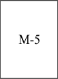|Unidades de armazenamento e processamento de produtos agrícolas e insumos|Armazéns de grãos, silos e assemelhados, sem beneficiamento|
|---|---|---|---|---|
||||Central de energia|Geração, transmissão e distribuição de energia e assemelhados|
||||Pátio de contêineres|Área aberta destinada a armazenamento de contêineres|

(Redação dada pelo Decreto nº 53.280, de 01 de novembro de 2016)

TABELA 2 CLASSIFICAÇÃO DAS EDIFICAÇÕES E ÁREAS DE RISCO DE INCÊNDIO QUANTO

À ALTURA

|Tipo|Altura|
|---|---|
|I|Térrea|
|II|H ≤ 6,00 m|
|III|6,00 m < H ≤ 12,00 m|
|IV|12,00 m < H ≤ 23,00 m|
|V|23,00 m < H ≤ 30,00 m|
|VI|Acima de 30,00 m|

(Redação dada pelo Decreto nº 53.280, de 01 de novembro de 2016)

TABELA 3 CLASSIFICAÇÃO DAS EDIFICAÇÕES E ÁREAS DE RISCO DE

INCÊNDIO QUANTO AO GRAU DE RISCO DE INCÊNDIO

|GRAU DE RISCO DE INCÊNDIO|CARGA DE INCÊNDIO MJ/m²|
|---|---|
|Baixo|Até 300 MJ/m²|
|Médio|Acima de 300 até 1.200 MJ/m²|
|Alto|Acima de 1.200 MJ/m²|
|NOTAS GERAIS: a – As edificações e áreas de risco de incêndio terão as suas cargas de incêndio específicas determinadas conforme Tabela 3.1; b – O Grupo J terá a sua carga de incêndio específica determinada conforme Tabela 3.2; c – As atividades econômicas que não constarem na Tabela 3.1 terão a sua carga de incêndio específica determinada por similaridade; d - As edificações destinadas aos Grupos L e M que não constarem na Tabela 3.1 terão a carga incêndio específica determinada através do levantamento da carga incêndio, conforme RTCBMRS; e - As edificações destinadas ao Grupo J que não constarem na Tabela 3.2 ou que possuírem diferentes materiais depositados terão as cargas de incêndio específicas determinadas através do método determinístico, conforme RTCBMRS. f – O CBMRS poderá determinar a carga de incêndio probabilística de novos Códigos Nacionais de Atividades Econômicas, através de RTCBMRS ou outros atos administrativos.||

(Redação dada pelo Decreto nº 53.280, de 01 de novembro de 2016)

<!-- pág 16 -->

TABELA 3.1 CLASSIFICAÇÃO DAS EDIFICAÇÕES E ÁREAS DE RISCO DE INCÊNDIO

QUANTO À CARGA DE INCÊNDIO ESPECÍFICA POR CLASSIFICAÇÃO NACIONAL DE ATIVIDADES ECONÔMICAS - CNAE

|Grupo|Ocupação/Uso|Descrição|CNAE|Divisão|Carga de Incêndio em MJ/m²|
|---|---|---|---|---|---|
|A|Residencial|Casas térreas ou sobrados|-|A-1|300|
|||Condomínios prediais|8112-5/00|A-2|300|
|||Pensões (alojamento)|5590-6/03|A-3|300|
|||Outros alojamentos não especificados anteriormente|5590-6/99|A-3|300|
|B|Serviços de hospedagem|Hotéis|5510-8/01|B-1|500|
|||Motéis|5510-8/03|B-1|500|
|||Albergues, exceto assistenciais|5590-6/01|B-1|500|
|||Campings|5590-6/02|B-1|300|
|||Albergues assistenciais|8730-1/02|B-1|500|
|||Apart-hotéis|5510-8/02|B-2|500|
|C|Comercial|Floricultura|0122-9/00|C-1|80|
|||Comércio por atacado de peças e acessórios novos para veículos automotores|4530-7/01|C-1|200|
|||Comércio a varejo de peças e acessórios novos para veículos automotores|4530-7/03|C-1|200|
|||Comércio a varejo de peças e acessórios usados para veículos automotores|4530-7/04|C-1|200|
|||Comércio por atacado de peças e acessórios para motocicletas e motonetas|4541-2/02|C-1|200|
|||Comércio a varejo de peças e acessórios para motocicletas e motonetas|4541-2/05|C-1|200|
|||Comércio atacadista de sementes, flores, plantas e gramas|4623-1/06|C-1|80|
|||Comércio atacadista de leite e laticínios|4631-1/00|C-1|200|
|||Comércio atacadista de frutas, verduras, raízes, tubérculos, hortaliças e legumes frescos|4633-8/01|C-1|200|
|||Comércio atacadista de água mineral|4635-4/01|C-1|200|
|||Comércio atacadista de bebidas não especificadas anteriormente – Vinhos|4635-4/99|C-1|300|
|||Comércio atacadista de próteses e artigos de ortopedia|4645-1/02|C-1|300|
|||Comércio atacadista de produtos odontológicos|4645-1/03|C-1|300|
|||Comércio atacadista de equipamentos elétricos de uso pessoal e doméstico - Eletrodomésticos exceto geladeira|4649-4/01|C-1|300|

<!-- pág 17 -->

|Grupo|Ocupação/Uso|Descrição|CNAE|Divisão|Carga de Incêndio em MJ/m²|
|---|---|---|---|---|---|
|C|Comercial|Comércio atacadista de lustres, luminárias e abajures|4649-4/06|C-1|300|
|||Comércio atacadista de ferragens e ferramentas|4672-9/00|C-1|300|
|||Comércio atacadista de cimento|4674-5/00|C-1|300|
|||Comércio atacadista de mármores e granitos|4679-6/02|C-1|300|
|||Comércio atacadista de vidros, espelhos e vitrais|4679-6/03|C-1|300|
|||Comércio atacadista de defensivos agrícolas, adubos, fertilizantes e corretivos do solo|4683-4/00|C-1|200|
|||Comércio atacadista de produtos siderúrgicos e metalúrgicos, exceto para construção|4685-1/00|C-1|300|
|||Comércio atacadista de resíduos e sucatas metálicos|4687-7/03|C-1|300|
|||Comércio atacadista de produtos da extração mineral, exceto combustíveis|4689-3/01|C-1|300|
|||Comércio varejista de carnes - açougues|4722-9/01|C-1|40|
|||Comércio varejista de hortifrutigranjeiros|4724-5/00|C-1|200|
|||Peixaria|4722-9/02|C-1|40|
|||Comércio varejista de bebidas – não alcoolicas|4723-7/00|C-1|200|
|||Comércio varejista de bebidas – Vinhos|4723-7/00|C-1|300|
|||Tabacaria|4729-6/01|C-1|200|
|||Comércio varejista de vidros|4743-1/00|C-1|300|
|||Comércio varejista de ferragens e ferramentas|4744-0/01|C-1|300|
|||Comércio varejista de cal, areia, pedra britada, tijolos e telhas - Artigos de argila, cerâmica ou porcelana, pedras e areia|4744-0/04|C-1|200|
|||Comércio varejista de pedras para revestimento|4744-0/06|C-1|40|
|||Comércio varejista especializado de equipamentos e suprimentos de informática|4751-2/01|C-1|300|
|||Comércio varejista especializado de instrumentos musicais e acessórios|4756-3/00|C-1|300|
|||Comércio varejista de artigos de óptica|4774-1/00|C-1|300|
|||Comércio varejista de artigos de joalheria|4783-1/01|C-1|300|
|||Comércio varejista de suvenires, bijuterias e artesanatos|4789-0/01|C-1|300|
|||Comércio varejista de plantas e flores naturais|4789-0/02|C-1|80|
|||Comércio varejista de objetos de arte|4789-0/03|C-1|200|
|||Comércio varejista de artigos fotográficos e para filmagem|4789-0/08|C-1|300|

<!-- pág 18 -->

|Grupo|Ocupação/Uso|Descrição|CNAE|Divisão|Carga de Incêndio em MJ/m²|
|---|---|---|---|---|---|
|C|Comercial|Locação de automóveis sem condutor|7711-0/00|C-1|200|
|||Locação de embarcações sem tripulação, exceto para fins recreativos|7719-5/01|C-1|200|
|||Locação de outros meios de transporte não especificados anteriormente, sem condutor|7719-5/99|C-1|200|
|||Aluguel de material médico|7729-2/03|C-1|300|
|||Aluguel de máquinas e equipamentos agrícolas sem operador|7731-4/00|C-1|300|
|||Aluguel de andaimes|7732-2/02|C-1|300|
|||Aluguel de máquinas e equipamentos para escritórios|7733-1/00|C-1|300|
|||Aluguel de equipamentos científicos, médicos e hospitalares, sem operador|7739-0/02|C-1|300|
|||Comércio atacadista de equipamentos elétricos de uso pessoal e doméstico – geladeiras|4649-4/01|C-1|300|
|||Lojas de variedades, exceto lojas de departamentos ou magazines|4713-0/02|C-1|300|
|||Comércio varejista de laticínios e frios|4721-1/03|C-1|300|
|||Comércio varejista de doces, balas, bombons e semelhantes|4721-1/04|C-1|300|
|||Comércio varejista de produtos alimentícios em geral ou especializado em produtos alimentícios não especificados anteriormente|4729-6/99|C-1|300|
|||Comércio varejista de cal, areia, pedra britada, tijolos e telhas|4744-0/04|C-1|200|
|||Comércio varejista de mercadorias em geral, com predominância de produtos alimentícios - minimercados, mercearias e armazéns|4712-1/00|C-1|300|
|||Comércio varejista especializado de peças e acessórios para aparelhos eletroeletrônicos para uso doméstico, exceto informática e comunicação|4757-1/00|C-1|300|
|||Comércio varejista de armas e munições|4789-0/09|C-2|800|
|||Comércio varejista de equipamentos para escritório|4789-0/07|C-2|700|
|||Comércio atacadista de carnes bovinas e suínas e derivados|4634-6/01|C-2|400|
|||Comércio atacadista de aves abatidas e derivados|4634-6/02|C-2|400|
|||Comércio atacadista de pescados e frutos do mar|4634-6/03|C-2|400|
|||Comércio atacadista de carnes e derivados de outros animais|4634-6/99|C-2|400|
|||Alojamento, higiene e embelezamento de animais|9609-2/03|C-2|600|
|||Comércio a varejo de automóveis, camionetas e utilitários novos|4511-1/01|C-2|700|

<!-- pág 19 -->

|Grupo|Ocupação/Uso|Descrição|CNAE|Divisão|Carga de Incêndio em MJ/m²|
|---|---|---|---|---|---|
|C|Comercial|Comércio a varejo de automóveis, camionetas e utilitários usados|4511-1/02|C-2|700|
|||Comércio por atacado de automóveis, camionetas e utilitários novos e usados|4511-1/03|C-2|700|
|||Comércio por atacado de caminhões novos e usados|4511-1/04|C-2|700|
|||Comércio por atacado de reboques e semireboques novos e usados|4511-1/05|C-2|700|
|||Comércio por atacado de ônibus e microônibus novos e usados|4511-1/06|C-2|700|
|||Comércio sob consignação de veículos automotores|4512-9/02|C-2|700|
|||Comércio por atacado de motocicletas e motonetas|4541-2/01|C-2|700|
|||Comércio a varejo de motocicletas e motonetas novas|4541-2/03|C-2|700|
|||Comércio a varejo de motocicletas e motonetas usadas|4541-2/04|C-2|700|
|||Comércio sob consignação de motocicletas e motonetas|4542-1/02|C-2|700|
|||Comércio atacadista de animais vivos|4623-1/01|C-2|600|
|||Comércio atacadista de fumo em folha não beneficiado|4623-1/04|C-2|400|
|||Comércio atacadista de matérias-primas agrícolas com atividade de fracionamento e acondicionamento associada|4623-1/08|C-2|400|
|||Comércio atacadista de aves vivas e ovos|4633-8/02|C-2|400|
|||Comércio atacadista de coelhos e outros pequenos animais vivos para alimentação|4633-8/03|C-2|400|
|||Comércio atacadista de cerveja, chope e refrigerante|4635-4/02|C-2|700|
|||Comércio atacadista de bebidas com atividade de fracionamento e acondicionamento associada - Bebidas não alcoólicas, Cervejaria e Vinhos.|4635-4/03|C-2|700|
|||Comércio atacadista de bebidas não especificadas anteriormente - Bebidas não alcoólicas|4635-4/99|C-2|700|
|||Comércio atacadista de fumo beneficiado|4636-2/01|C-2|400|
|||Comércio atacadista de sorvetes|4637-1/06|C-2|400|
|||Comércio atacadista de instrumentos e materiais para uso médico, cirúrgico, hospitalar e de laboratórios|4645-1/01|C-2|400|
|||Comércio atacadista de produtos de higiene pessoal|4646-0/02|C-2|400|
|||Comércio atacadista de aparelhos eletrônicos de uso pessoal e doméstico|4649-4/02|C-2|400|
|||Comércio atacadista de bicicletas, triciclos e outros veículos recreativos|4649-4/03|C-2|500|

<!-- pág 20 -->

|Grupo|Ocupação/Uso|Descrição|CNAE|Divisão|Carga de Incêndio em MJ/m²|
|---|---|---|---|---|---|
|C|Comercial|Comércio atacadista de jóias, relógios e bijuterias, inclusive pedras preciosas e semipreciosas lapidadas - Jóias, bijuterias, e outros exceto relógios|4649-4/10|C-2|500|
|||Comércio atacadista de jóias, relógios e bijuterias, inclusive pedras preciosas e semipreciosas lapidadas – Relógios|4649-4/10|C-2|500|
|||Comércio atacadista de outros equipamentos e artigos de uso pessoal e doméstico não especificados anteriormente - Artigos de ótica|4649-4/99|C-2|400|
|||Comércio atacadista de outros equipamentos e artigos de uso pessoal e doméstico não especificados anteriormente - Artigos de tabaco|4649-4/99|C-2|400|
|||Comércio atacadista de equipamentos de informática|4651-6/01|C-2|400|
|||Comércio atacadista de suprimentos para informática|4651-6/02|C-2|400|
|||Comércio atacadista de componentes eletrônicos e equipamentos de telefonia e comunicação|4652-4/00|C-2|400|
|||Comércio atacadista de máquinas, aparelhos e equipamentos para uso agropecuário; partes e peças|4661-3/00|C-2|400|
|||Comércio atacadista de máquinas, equipamentos para terraplenagem, mineração e construção; partes e peças|4662-1/00|C-2|400|
|||Comércio atacadista de máquinas e equipamentos para uso industrial; partes e peças|4663-0/00|C-2|400|
|||Comércio atacadista de máquinas, aparelhos e equipamentos para uso odonto-médicohospitalar; partes e peças|4664-8/00|C-2|400|
|||Comércio atacadista de máquinas e equipamentos para uso comercial; partes e peças|4665-6/00|C-2|400|
|||Comércio atacadista de bombas e compressores; partes e peças|4669-9/01|C-2|400|
|||Comércio atacadista de outras máquinas e equipamentos não especificados anteriormente; partes e peças|4669-9/99|C-2|400|
|||Comércio atacadista de material elétrico|4673-7/00|C-2|800|
|||Comércio atacadista de materiais de construção em geral - Artigos de argila, cerâmica ou porcelana, Artigos de gesso, Cimento, Pedras|4679-6/99|C-2|800|
|||Comércio atacadista de outros produtos químicos e petroquímicos não especificados anteriormente - Produtos com soda|4684-2/99|C-2|1000|

<!-- pág 21 -->

|Grupo|Ocupação/Uso|Descrição|CNAE|Divisão|Carga de Incêndio em MJ/m²|
|---|---|---|---|---|---|
|C|Comercial|Comércio atacadista especializado em outros produtos intermediários não especificados anteriormente - Antenas, mat. elétricos, eletrônicos e peças p/eletrodomésticos|4689-3/99|C-2|600|
|||Comércio atacadista especializado em outros produtos intermediários não especificados anteriormente - Flores ornamentais|4689-3/99|C-2|600|
|||Comércio varejista de bebidas – Cervejaria|4723-7/00|C-2|700|
|||Comércio varejista de material elétrico|4742-3/00|C-2|800|
|||Comércio varejista de madeira e artefatos - Chapas de aglomerado ou compensado|4744-0/02|C-2|800|
|||Comércio varejista de materiais hidráulicos|4744-0/03|C-2|800|
|||Comércio varejista especializado de equipamentos de telefonia e comunicação|4752-1/00|C-2|400|
|||Comércio varejista de discos, CDs, DVDs e fitas|4762-8/00|C-2|700|
|||Comércio varejista de bicicletas e triciclos; peças e acessórios|4763-6/03|C-2|500|
|||Comércio varejista de embarcações e outros veículos recreativos; peças e acessórios|4763-6/05|C-2|500|
|||Comércio varejista de artigos de relojoaria|4783-1/02|C-2|500|
|||Comércio varejista de animais vivos e de artigos e alimentos para animais de estimação - Animais vivos para criação doméstica|4789-0/04|C-2|600|
|||Aluguel de objetos do vestuário, jóias e acessórios|7723-3/00|C-2|600|
|||Aluguel de máquinas e equipamentos para construção sem operador, exceto andaimes|7732-2/01|C-2|400|
|||Aluguel de máquinas e equipamentos para extração de minérios e petróleo, sem operador|7739-0/01|C-2|400|
|||Comércio por atacado de pneumáticos e câmaras-de-ar|4530-7/02|C-2|800|
|||Comércio a varejo de pneumáticos e câmaras de ar|4530-7/05|C-2|800|
|||Comércio atacadista de café em grão|4621-4/00|C-2|400|
|||Comércio atacadista de soja|4622-2/00|C-2|1700|
|||Comércio atacadista de couros, lãs, peles e outros subprodutos não-comestíveis de origem animal - Artigos de couro, peles e outros|4623-1/02|C-2|800|

<!-- pág 22 -->

|Grupo|Ocupação/Uso|Descrição|CNAE|Divisão|Carga de Incêndio em MJ/m²|
|---|---|---|---|---|---|
|C|Comercial|Comércio atacadista de algodão|4623-1/03|C-2|600|
|||Comércio atacadista de cacau|4623-1/05|C-2|400|
|||Comércio atacadista de sisal|4623-1/07|C-2|600|
|||Comércio atacadista de alimentos para animais|4623-1/09|C-2|2000|
|||Comércio atacadista de matérias-primas agrícolas não especificadas anteriormente|4623-1/99|C-2|1700|
|||Comércio atacadista de cereais e leguminosas beneficiados|4632-0/01|C-2|1700|
|||Comércio atacadista de farinhas, amidos e féculas|4632-0/02|C-2|2000|
|||Comércio atacadista de cereais e leguminosas beneficiados, farinhas, amidos e féculas, com atividade de fracionamento e acondicionamento associada – Cereais, farinhas e produtos com amido e outros|4632-0/03|C-2|2000|
|||Comércio atacadista de bebidas com atividade de fracionamento e acondicionamento associada - Bebidas destiladas e outros|4635-4/03|C-2|500|
|||Comércio atacadista de bebidas não especificadas anteriormente - Bebidas destiladas e outros|4635-4/99|C-2|500|
|||Comércio atacadista de cigarros, cigarrilhas e charutos|4636-2/02|C-2|800|
|||Comércio atacadista de café torrado, moído e solúvel|4637-1/01|C-2|400|
|||Comércio atacadista de açúcar|4637-1/02|C-2|1000|
|||Comércio atacadista de óleos e gorduras|4637-1/03|C-2|1000|
|||Comércio atacadista de pães, bolos, biscoitos e similares|4637-1/04|C-2|1000|
|||Comércio atacadista de massas alimentícias|4637-1/05|C-2|1000|
|||Comércio atacadista de chocolates, confeitos, balas, bombons e semelhantes|4637-1/07|C-2|400|
|||Comércio atacadista especializado em outros produtos alimentícios não especificados anteriormente|4637-1/99|C-2|1000|
|||Comércio atacadista de produtos alimentícios em geral|4639-7/01|C-2|1000|
|||Comércio atacadista de produtos alimentícios em geral, com atividade de fracionamento e acondicionamento associada|4639-7/02|C-2|1000|
|||Comércio atacadista de tecidos|4641-9/01|C-2|700|
|||Comércio atacadista de artigos de cama, mesa e banho|4641-9/02|C-2|700|

<!-- pág 23 -->

|Grupo|Ocupação/Uso|Descrição|CNAE|Divisão|Carga de Incêndio em MJ/m²|
|---|---|---|---|---|---|
|C|Comercial|Comércio atacadista de artigos de armarinho|4641-9/03|C-2|700|
|||Comércio atacadista de artigos do vestuário e acessórios, exceto profissionais e de segurança|4642-7/01|C-2|600|
|||Comércio atacadista de roupas e acessórios para uso profissional e de segurança do trabalho|4642-7/02|C-2|600|
|||Comércio atacadista de calçados|4643-5/01|C-2|600|
|||Comércio atacadista de bolsas, malas e artigos de viagem|4643-5/02|C-2|600|
|||Comércio atacadista de medicamentos e drogas de uso humano|4644-3/01|C-2|1000|
|||Comércio atacadista de medicamentos e drogas de uso veterinário|4644-3/02|C-2|1000|
|||Comércio atacadista de artigos de escritório e de papelaria|4647-8/01|C-2|700|
|||Comércio atacadista de livros, jornais e outras publicações|4647-8/02|C-2|1000|
|||Comércio atacadista de móveis e artigos de colchoaria|4649-4/04|C-2|600|
|||Comércio atacadista de artigos de tapeçaria; persianas e cortinas|4649-4/05|C-2|600|
|||Comércio atacadista de filmes, CDs, DVDs, fitas e discos|4649-4/07|C-2|700|
|||Comércio atacadista de produtos de higiene, limpeza e conservação domiciliar|4649-4/08|C-2|400|
|||Comércio atacadista de produtos de higiene, limpeza e conservação domiciliar, com atividade de fracionamento e acondicionamento associada|4649-4/09|C-2|400|
|||Comércio atacadista de outros equipamentos e artigos de uso pessoal e doméstico não especificados anteriormente - Artigos borracha, cortiça, couro, feltro, espuma , artigos esportivos , artigos de plástico, artigos de vidro, brinquedos, instrumentos musicais, vassouras ou escovas e outros|4649-4/99|C-2|800|
|||Comércio atacadista de madeira e produtos derivados|4671-1/00|C-2|800|
|||Comércio atacadista de tintas, vernizes e similares|4679-6/01|C-2|1300|
|||Comércio atacadista especializado de materiais de construção não especificados anteriormente|4679-6/04|C-2|800|
|||Comércio atacadista de materiais de construção em geral - Artigos de vidro, janelas e portas de madeira e outros|4679-6/99|C-2|800|

<!-- pág 24 -->

|Grupo|Ocupação/Uso|Descrição|CNAE|Divisão|Carga de Incêndio em MJ/m²|
|---|---|---|---|---|---|
|C|Comercial|Comércio atacadista de resinas e elastômeros|4684-2/01|C-2|3000|
|||Comércio atacadista de solventes|4684-2/02|C-2|4000|
|||Comércio atacadista de outros produtos químicos e petroquímicos não especificados anteriormente - Artigos pirotécnicos|4684-2/99|C-2|4000|
|||Comércio atacadista de outros produtos químicos e petroquímicos não especificados anteriormente - Fósforos de segurança|4684-2/99|C-2|4000|
|||Comércio atacadista de outros produtos químicos e petroquímicos não especificados anteriormente - Produtos adesivos e produtos de limpeza|4684-2/99|C-2|1000|
|||Comércio atacadista de outros produtos químicos e petroquímicos não especificados anteriormente - Produtos petroquímicos e outros|4684-2/99|C-2|4000|
|||Comércio atacadista de papel e papelão em bruto|4686-9/01|C-2|1000|
|||Comércio atacadista de embalagens|4686-9/02|C-2|800|
|||Comércio atacadista de resíduos de papel e papelão|4687-7/01|C-2|1000|
|||Comércio atacadista de resíduos e sucatas nãometálicos, exceto de papel e papelão - Artigos borracha, cortiça, couro, feltro, espuma, artigos de plásticos em geral, artigos de vidro, têxteis em geral e outros|4687-7/02|C-2|800|
|||Comércio atacadista de fios e fibras beneficiados|4689-3/02|C-2|600|
|||Comércio atacadista especializado em outros produtos intermediários não especificados anteriormente - Artigos borracha, cortiça, couro, feltro, espuma, artigos de plástico, baterias e pilhas, ceras, peles, sacarias e outros|4689-3/99|C-2|600|
|||Comércio atacadista de mercadorias em geral, com predominância de produtos alimentícios|4691-5/00|C-2|1000|
|||Comércio atacadista de mercadorias em geral, com predominância de insumos agropecuários|4692-3/00|C-2|400|
|||Comércio atacadista de mercadorias em geral, sem predominância de alimentos ou de insumos agropecuários|4693-1/00|C-2|400|
|||Comércio varejista de mercadorias em geral, com predominância de produtos alimentícios - hipermercados|4711-3/01|C-2|400|
|||Comércio varejista de mercadorias em geral, com predominância de produtos alimentícios - supermercados|4711-3/02|C-2|400|

<!-- pág 25 -->

|Grupo|Ocupação/Uso|Descrição|CNAE|Divisão|Carga de Incêndio em MJ/m²|
|---|---|---|---|---|---|
|C|Comercial|Lojas duty free de aeroportos internacionais|4713-0/03|C-2|600|
|||Padaria e confeitaria com predominância de revenda|4721-1/02|C-2|400|
|||Comércio varejista de bebidas - Bebidas destiladas e outros|4723-7/00|C-2|700|
|||Comércio varejista de mercadorias em lojas de conveniência|4729-6/02|C-2|400|
|||Comércio varejista de lubrificantes|4732-6/00|C-2|1000|
|||Comércio varejista de tintas e materiais para pintura|4741-5/00|C-2|1000|
|||Comércio varejista de madeira e artefatos - Chapas de aglomerado ou compensado, tratamento de madeira e outros|4744-0/02|C-2|800|
|||Comércio varejista de materiais de construção não especificados anteriormente|4744-0/05|C-2|800|
|||Comércio varejista de materiais de construção em geral|4744-0/99|C-2|800|
|||Recarga de cartuchos para equipamentos de informática|4751-2/02|C-2|500|
|||Comércio varejista especializado de eletrodomésticos e equipamentos de áudio e vídeo|4753-9/00|C-2|500|
|||Comércio varejista de móveis|4754-7/01|C-2|500|
|||Comércio varejista de artigos de colchoaria|4754-7/02|C-2|500|
|||Comércio varejista de artigos de iluminação|4754-7/03|C-2|500|
|||Comércio varejista de tecidos|4755-5/01|C-2|600|
|||Comercio varejista de artigos de armarinho|4755-5/02|C-2|600|
|||Comercio varejista de artigos de cama, mesa e banho|4755-5/03|C-2|600|
|||Comércio varejista de artigos de tapeçaria, cortinas e persianas|4759-8/01|C-2|800|
|||Comércio varejista de outros artigos de uso doméstico não especificados anteriormente|4759-8/99|C-2|600|
|||Comércio varejista de livros|4761-0/01|C-2|1000|
|||Comércio varejista de jornais e revistas|4761-0/02|C-2|1000|
|||Comércio varejista de artigos de papelaria|4761-0/03|C-2|700|
|||Comércio varejista de brinquedos e artigos recreativos|4763-6/01|C-2|500|
|||Comércio varejista de artigos esportivos|4763-6/02|C-2|800|
|||Comércio varejista de artigos de caça, pesca e camping|4763-6/04|C-2|800|

<!-- pág 26 -->

|Grupo|Ocupação/Uso|Descrição|CNAE|Divisão|Carga de Incêndio em MJ/m²|
|---|---|---|---|---|---|
|C|Comercial|Comércio varejista de produtos farmacêuticos, sem manipulação de fórmulas|4771-7/01|C-2|1000|
|||Comércio varejista de produtos farmacêuticos, com manipulação de fórmulas|4771-7/02|C-2|1000|
|||Comércio varejista de produtos farmacêuticos homeopáticos|4771-7/03|C-2|1000|
|||Comércio varejista de medicamentos veterinários|4771-7/04|C-2|1000|
|||Comércio varejista de cosméticos, produtos de perfumaria e de higiene pessoal|4772-5/00|C-2|400|
|||Comércio varejista de artigos médicos e ortopédicos|4773-3/00|C-2|1000|
|||Comércio varejista de artigos do vestuário e acessórios|4781-4/00|C-2|600|
|||Comércio varejista de calçados|4782-2/01|C-2|500|
|||Comércio varejista de artigos de viagem|4782-2/02|C-2|800|
|||Comércio varejista de antigüidades|4785-7/01|C-2|700|
|||Comércio varejista de outros artigos usados - Aparelhos domésticos, calçados, livros, revistas, móveis roupas e outros artigos têxteis, coleções de moedas, selos, etc e outros|4785-7/99|C-2|700|
|||Comércio varejista de animais vivos e de artigos e alimentos para animais de estimação - Artigos para animais e rações|4789-0/04|C-2|600|
|||Comércio varejista de produtos saneantes domissanitários - Produtos de limpeza, Produtos p/piscina, inseticidas, repelentes, etc|4789-0/05|C-2|400|
|||Comércio varejista de outros produtos não especificados anteriormente - Artigos de couro ou borracha e artigos de plástico|4789-0/99|C-2|800|
|||Comércio varejista de outros produtos não especificados anteriormente – Carvão, lenha e Velas|4789-0/99|C-2|2100|
|||Comércio varejista de outros produtos não especificados anteriormente – Papel de parede e similares, urnas e caixões e outros|4789-0/99|C-2|500|
|||Comércio atacadista de cosméticos e produtos de perfumaria|4646-0/01|C-2|400|
|||Aluguel de equipamentos recreativos e esportivos|7721-7/00|C-2|800|
|||Aluguel de fitas de vídeo, DVDs e similares|7722-5/00|C-2|700|

<!-- pág 27 -->

|Grupo|Ocupação/Uso|Descrição|CNAE|Divisão|Carga de Incêndio em MJ/m²|
|---|---|---|---|---|---|
|C|Comercial|Aluguel de objetos do vestuário, jóias e acessórios – Calçados, produtos têxteis e outros|7723-3/00|C-2|600|
|||Aluguel de aparelhos de jogos eletrônicos|7729-2/01|C-2|500|
|||Aluguel de móveis, utensílios e aparelhos de uso doméstico e pessoal; instrumentos musicais, móveis e outros|7729-2/02|C-2|400|
|||Aluguel de outros objetos pessoais e domésticos não especificados anteriormente - Estruturas de madeira, livros, materiais para festas, toldos e outros|7729-2/99|C-2|1000|
|||Aluguel de palcos, coberturas e outras estruturas de uso temporário, exceto andaimes|7739-0/03|C-2|400|
|||Aluguel de outras máquinas e equipamentos comerciais e industriais não especificados anteriormente, sem operador|7739-0/99|C-2|400|
|||Lojas de departamentos ou magazines|4713-0/01|C-2|800|
|||Centro de compras em geral (shopping centers)|4713-0/01|C-3|800|
|D|Serviços profissionais, pessoais e técnicos|Edição de livros|5811-5/00|D-1|700|
|||Edição de jornais|5812-3/00|D-1|700|
|||Edição de revistas|5813-1/00|D-1|700|
|||Edição de cadastros, listas e outros produtos gráficos|5819-1/00|D-1|700|
|||Edição integrada à impressão de livros|5821-2/00|D-1|700|
|||Edição integrada à impressão de jornais|5822-1/00|D-1|700|
|||Edição integrada à impressão de revistas|5823-9/00|D-1|700|
|||Edição integrada à impressão de cadastros, listas e de outros produtos gráficos|5829-8/00|D-1|700|
|||Defesa civil|8425-6/00|D-1|450|
|||Atividades de apoio à educação, exceto caixas escolares|8550-3/02|D-1|700|
|||Captação, tratamento e distribuição de água|3600-6/01|D-1|300|
|||Gestão de redes de esgoto|3701-1/00|D-1|700|
|||Atividades relacionadas a esgoto, exceto a gestão de redes|3702-9/00|D-1|500|
|||Incorporação de empreendimentos imobiliários|4110-7/00|D-1|700|
|||Administração de obras|4399-1/01|D-1|700|
|||Representantes comerciais e agentes do comércio de veículos automotores|4512-9/01|D-1|700|
|||Representantes comerciais e agentes do comércio de peças e acessórios novos e usados para veículos automotores|4530-7/06|D-1|700|

<!-- pág 28 -->

|Grupo|Ocupação/Uso|Descrição|CNAE|Divisão|Carga de Incêndio em MJ/m²|
|---|---|---|---|---|---|
|D|Serviços profissionais, pessoais e técnicos|Representantes comerciais e agentes do comércio de motocicletas e motonetas, peças e acessórios|4542-1/01|D-1|700|
|||Representantes comerciais e agentes do comércio de matérias-primas agrícolas e animais vivos|4611-7/00|D-1|700|
|||Representantes comerciais e agentes do comércio de combustíveis, minerais, produtos siderúrgicos e químicos|4612-5/00|D-1|700|
|||Representantes comerciais e agentes do comércio de madeira, material de construção e ferragens|4613-3/00|D-1|700|
|||Representantes comerciais e agentes do comércio de máquinas, equipamentos, embarcações e aeronaves|4614-1/00|D-1|700|
|||Representantes comerciais e agentes do comércio de eletrodomésticos, móveis e artigos de uso doméstico|4615-0/00|D-1|700|
|||Representantes comerciais e agentes do comércio de têxteis, vestuário, calçados e artigos de viagem|4616-8/00|D-1|700|
|||Representantes comerciais e agentes do comércio de produtos alimentícios, bebidas e fumo|4617-6/00|D-1|700|
|||Representantes comerciais e agentes do comércio de medicamentos, cosméticos e produtos de perfumaria|4618-4/01|D-1|700|
|||Representantes comerciais e agentes do comércio de instrumentos e materiais odonto-médico-hospitalares|4618-4/02|D-1|700|
|||Representantes comerciais e agentes do comércio de jornais, revistas e outras publicações|4618-4/03|D-1|700|
|||Outros representantes comerciais e agentes do comércio especializado em produtos não especificados anteriormente|4618-4/99|D-1|700|
|||Representantes comerciais e agentes do comércio de mercadorias em geral não especializado|4619-2/00|D-1|700|
|||Concessionárias de rodovias, pontes, túneis e serviços relacionados|5221-4/00|D-1|700|
|||Administração da infra-estrutura portuária|5231-1/01|D-1|700|
|||Operações de terminais|5231-1/02|D-1|700|
|||Atividades de agenciamento marítimo|5232-0/00|D-1|700|
|||Atividades auxiliares dos transportes aquaviários não especificadas anteriormente|5239-7/00|D-1|700|
|||Operação dos aeroportos e campos de aterrissagem|5240-1/01|D-1|700|

<!-- pág 29 -->

|Grupo|Ocupação/Uso|Descrição|CNAE|Divisão|Carga de Incêndio em MJ/m²|
|---|---|---|---|---|---|
|D|Serviços profissionais, pessoais e técnicos|Atividades auxiliares dos transportes aéreos, exceto operação dos aeroportos e campos de aterrissagem|5240-1/99|D-1|700|
|||Comissária de despachos|5250-8/01|D-1|700|
|||Atividades de despachantes aduaneiros|5250-8/02|D-1|700|
|||Agenciamento de cargas, exceto para o transporte marítimo|5250-8/03|D-1|700|
|||Organização logística do transporte de carga|5250-8/04|D-1|700|
|||Operador de transporte multimodal - OTM|5250-8/05|D-1|700|
|||Atividades do Correio Nacional|5310-5/01|D-1|400|
|||Atividades de franqueadas do Correio Nacional|5310-5/02|D-1|400|
|||Serviços de malote não realizados pelo Correio Nacional|5320-2/01|D-1|400|
|||Serviços de entrega rápida|5320-2/02|D-1|400|
|||Estúdios cinematográficos|5911-1/01|D-1|300|
|||Produção de filmes para publicidade|5911-1/02|D-1|300|
|||Atividades de produção cinematográfica, de vídeos e de programas de televisão não especificadas anteriormente|5911-1/99|D-1|300|
|||Serviços de dublagem|5912-0/01|D-1|300|
|||Serviços de mixagem sonora em produção audiovisual|5912-0/02|D-1|300|
|||Atividades de pós-produção cinematográfica, de vídeos e de programas de televisão não especificadas anteriormente|5912-0/99|D-1|300|
|||Distribuição cinematográfica, de vídeo e de programas de televisão|5913-8/00|D-1|300|
|||Atividades de gravação de som e de edição de música|5920-1/00|D-1|300|
|||Atividades de rádio|6010-1/00|D-1|300|
|||Atividades de televisão aberta|6021-7/00|D-1|300|
|||Programadoras|6022-5/01|D-1|300|
|||Atividades relacionadas à televisão por assinatura, exceto programadoras|6022-5/02|D-1|300|
|||Telecomunicações por satélite|6130-2/00|D-1|300|
|||Operadoras de televisão por assinatura por cabo|6141-8/00|D-1|400|
|||Operadoras de televisão por assinatura por microondas|6142-6/00|D-1|400|
|||Operadoras de Televisão por assinatura por satélite|6143-4/00|D-1|400|
|||Outras atividades de telecomunicações não especificadas anteriormente|6190-6/99|D-1|400|
|||Desenvolvimento de programas de computador sob encomenda|6201-5/00|D-1|700|

<!-- pág 30 -->

|Grupo|Ocupação/Uso|Descrição|CNAE|Divisão|Carga de Incêndio em MJ/m²|
|---|---|---|---|---|---|
|D|Serviços profissionais, pessoais e técnicos|Desenvolvimento e licenciamento de programas de computador customizáveis|6202-3/00|D-1|700|
|||Desenvolvimento e licenciamento de programas de computador não-customizáveis|6203-1/00|D-1|700|
|||Consultoria em tecnologia da informação|6204-0/00|D-1|700|
|||Suporte técnico, manutenção e outros serviços em tecnologia da informação|6209-1/00|D-1|400|
|||Tratamento de dados, provedores de serviços de aplicação e serviços de hospedagem na internet|6311-9/00|D-1|400|
|||Portais, provedores de conteúdo e outros serviços de informação na internet|6319-4/00|D-1|400|
|||Agências de notícias|6391-7/00|D-1|400|
|||Outras atividades de prestação de serviços de informação não especificadas anteriormente|6399-2/00|D-1|700|
|||Seguros de vida|6511-1/01|D-1|700|
|||Planos de auxílio-funeral|6511-1/02|D-1|700|
|||Seguros não-vida|6512-0/00|D-1|700|
|||Seguros-saúde|6520-1/00|D-1|700|
|||Resseguros|6530-8/00|D-1|700|
|||Previdência complementar fechada|6541-3/00|D-1|700|
|||Previdência complementar aberta|6542-1/00|D-1|700|
|||Planos de saúde|6550-2/00|D-1|700|
|||Peritos e avaliadores de seguros|6621-5/01|D-1|700|
|||Auditoria e consultoria atuarial|6621-5/02|D-1|700|
|||Corretores e agentes de seguros, de planos de previdência complementar e de saúde|6622-3/00|D-1|700|
|||Atividades auxiliares dos seguros, da previdência complementar e dos planos de saúde não especificadas anteriormente|6629-1/00|D-1|700|
|||Aluguel de imóveis próprios|6810-2/02|D-1|700|
|||Compra e venda de imóveis próprios|6810-2/01|D-1|700|
|||Loteamento de imóveis próprios|6810-2/03|D-1|700|
|||Corretagem na compra e venda e avaliação de imóveis|6821-8/01|D-1|700|
|||Corretagem no aluguel de imóveis|6821-8/02|D-1|700|
|||Gestão e administração da propriedade imobiliária|6822-6/00|D-1|700|
|||Serviços advocatícios|6911-7/01|D-1|700|
|||Atividades auxiliares da justiça|6911-7/02|D-1|700|
|||Agente de propriedade industrial|6911-7/03|D-1|700|
|||Cartórios|6912-5/00|D-1|700|
|||Atividades de contabilidade|6920-6/01|D-1|700|

<!-- pág 31 -->

|Grupo|Ocupação/Uso|Descrição|CNAE|Divisão|Carga de Incêndio em MJ/m²|
|---|---|---|---|---|---|
|D|Serviços profissionais, pessoais e técnicos|Atividades de consultoria e auditoria contábil e tributária|6920-6/02|D-1|700|
|||Atividades de consultoria em gestão empresarial, exceto consultoria técnica específica|7020-4/00|D-1|700|
|||Serviços de arquitetura|7111-1/00|D-1|700|
|||Serviços de engenharia|7112-0/00|D-1|700|
|||Serviços de cartografia, topografia e geodésia|7119-7/01|D-1|700|
|||Atividades de estudos geológicos|7119-7/02|D-1|700|
|||Serviços de desenho técnico relacionados à arquitetura e engenharia|7119-7/03|D-1|700|
|||Serviços de perícia técnica relacionados à segurança do trabalho|7119-7/04|D-1|700|
|||Atividades técnicas relacionadas à engenharia e arquitetura não especificadas anteriormente|7119-7/99|D-1|700|
|||Agências de publicidade|7311-4/00|D-1|700|
|||Serviços de pintura de edifícios em geral|4330-4/04|D-1|500|
|||Agenciamento de espaços para publicidade, exceto em veículos de comunicação|7312-2/00|D-1|700|
|||Criação de estandes para feiras e exposições|7319-0/01|D-1|700|
|||Promoção de vendas|7319-0/02|D-1|700|
|||Marketing direto|7319-0/03|D-1|700|
|||Consultoria em publicidade|7319-0/04|D-1|700|
|||Outras atividades de publicidade não especificadas anteriormente|7319-0/99|D-1|700|
|||Pesquisas de mercado e de opinião pública|7320-3/00|D-1|700|
|||Design|7410-2/01|D-1|700|
|||Decoração de interiores|7410-2/02|D-1|700|
|||Atividades de produção de fotografias, exceto aérea e submarina|7420-0/01|D-1|300|
|||Atividades de produção de fotografias aéreas e submarinas|7420-0/02|D-1|300|
|||Filmagem de festas e eventos|7420-0/04|D-1|300|
|||Serviços de microfilmagem|7420-0/05|D-1|300|
|||Serviços de tradução, interpretação e similares|7490-1/01|D-1|700|
|||Escafandria e Mergulho|7490-1/02|D-1|700|
|||Serviços de agronomia e de consultoria às atividades agrícolas e pecuárias|7490-1/03|D-1|700|
|||Atividades de intermediação e agenciamento de serviços e negócios em geral, exceto imobiliários|7490-1/04|D-1|700|

<!-- pág 32 -->

|Grupo|Ocupação/Uso|Descrição|CNAE|Divisão|Carga de Incêndio em MJ/m²|
|---|---|---|---|---|---|
|D|Serviços profissionais, pessoais e técnicos|Agenciamento de profissionais para atividades esportivas, culturais e artísticas|7490-1/05|D-1|700|
|||Outras atividades profissionais, científicas e técnicas não especificadas anteriormente|7490-1/99|D-1|700|
|||Gestão de ativos intangíveis não-financeiros|7740-3/00|D-1|700|
|||Seleção e agenciamento de mão-de-obra|7810-8/00|D-1|700|
|||Locação de mão-de-obra temporária|7820-5/00|D-1|700|
|||Fornecimento e gestão de recursos humanos para terceiros|7830-2/00|D-1|700|
|||Agências de viagens|7911-2/00|D-1|700|
|||Operadores turísticos|7912-1/00|D-1|700|
|||Serviços de reservas e outros serviços de turismo não especificados anteriormente|7990-2/00|D-1|700|
|||Atividades de vigilância e segurança privada|8011-1/01|D-1|700|
|||Serviços de adestramento de cães de guarda|8011-1/02|D-1|700|
|||Atividades de transporte de valores|8012-9/00|D-1|700|
|||Atividades de monitoramento de sistemas de segurança|8020-0/00|D-1|700|
|||Atividades de investigação particular|8030-7/00|D-1|700|
|||Serviços combinados para apoio a edifícios, exceto condomínios prediais|8111-7/00|D-1|700|
|||Limpeza em prédios e em domicílios|8121-4/00|D-1|700|
|||Imunização e controle de pragas urbanas|8122-2/00|D-1|700|
|||Atividades de limpeza não especificadas anteriormente|8129-0/00|D-1|700|
|||Atividades paisagísticas|8130-3/00|D-1|700|
|||Serviços combinados de escritório e apoio administrativo|8211-3/00|D-1|700|
|||Fotocópias|8219-9/01|D-1|400|
|||Preparação de documentos e serviços especializados de apoio administrativo não especificados anteriormente|8219-9/99|D-1|700|
|||Serviços de organização de feiras, congressos, exposições e festas|8230-0/01|D-1|700|
|||Atividades de cobranças e informações cadastrais|8291-1/00|D-1|700|
|||Medição de consumo de energia elétrica, gás e água|8299-7/01|D-1|700|
|||Emissão de vales-alimentação, valestransporte e similares|8299-7/02|D-1|700|
|||Serviços de gravação de carimbos, exceto confecção|8299-7/03|D-1|700|
|||Leiloeiros independentes|8299-7/04|D-1|700|

<!-- pág 33 -->

|Grupo|Ocupação/Uso|Descrição|CNAE|Divisão|Carga de Incêndio em MJ/m²|
|---|---|---|---|---|---|
|D|Serviços profissionais, pessoais e técnicos|Serviços de levantamento de fundos sob contrato|8299-7/05|D-1|700|
|||Salas de acesso à internet|8299-7/07|D-1|450|
|||Outras atividades de serviços prestados principalmente às empresas não especificadas anteriormente - Serviços de computação, serviços de correio, serviços de escritório, serviços de publicidade/propaganda, Outros serviços|8299-7/99|D-1|700|
|||Administração pública em geral|8411-6/00|D-1|700|
|||Regulação das atividades de saúde, educação, serviços culturais e outros serviços sociais|8412-4/00|D-1|700|
|||Regulação das atividades econômicas|8413-2/00|D-1|700|
|||Relações exteriores|8421-3/00|D-1|700|
|||Seguridade social obrigatória|8430-2/00|D-1|700|
|||Atividades de sonorização e de iluminação|9001-9/06|D-1|700|
|||Atividades de artistas plásticos, jornalistas independentes e escritores|9002-7/01|D-1|700|
|||Atividades de organizações associativas patronais e empresariais|9411-1/00|D-1|700|
|||Atividades de organizações associativas profissionais|9412-0/00|D-1|700|
|||Atividades de organizações sindicais|9420-1/00|D-1|700|
|||Atividades de associações de defesa de direitos sociais|9430-8/00|D-1|700|
|||Atividades de organizações políticas|9492-8/00|D-1|700|
|||Atividades de organizações associativas ligadas à cultura e à arte|9493-6/00|D-1|700|
|||Atividades associativas não especificadas anteriormente|9499-5/00|D-1|700|
|||Cabeleireiros|9602-5/01|D-1|200|
|||Atividades de estética e outros serviços de cuidados com a beleza|9602-5/02|D-1|200|
|||Gestão e manutenção de cemitérios|9603-3/01|D-1|400|
|||Serviços de cremação|9603-3/02|D-1|400|
|||Serviços de sepultamento|9603-3/03|D-1|400|
|||Serviços de funerárias|9603-3/04|D-1|400|
|||Serviços de somatoconservação|9603-3/05|D-1|400|
|||Atividades funerárias e serviços relacionados não especificados anteriormente|9603-3/99|D-1|400|
|||Agências matrimoniais|9609-2/02|D-1|700|
|||Exploração de máquinas de serviços pessoais acionadas por moeda|9609-2/04|D-1|400|
|||Atividades de sauna e banhos|9609-2/05|D-1|400|

<!-- pág 34 -->

|Grupo|Ocupação/Uso|Descrição|CNAE|Divisão|Carga de Incêndio em MJ/m²|
|---|---|---|---|---|---|
|D|Serviços profissionais, pessoais e técnicos|Serviços de tatuagem e colocação de piercing|9609-2/06|D-1|300|
|||Outras atividades de serviços pessoais não especificadas anteriormente|9609-2/99|D-1|400|
|||Serviços domésticos|9700-5/00|D-1|700|
|||Organismos internacionais e outras instituições extraterritoriais|9900-8/00|D-1|700|
|||Sociedades de crédito imobiliário|6435-2/01|D-1|700|
|||Associações de poupança e empréstimo|6435-2/02|D-1|700|
|||Companhias hipotecárias|6435-2/03|D-1|700|
|||Sociedades de crédito, financiamento e investimento - financeiras|6436-1/00|D-1|700|
|||Sociedades de crédito ao microempreendedor|6437-9/00|D-1|700|
|||Outras instituições de intermediação nãomonetária não especificadas anteriormente|6438-7/99|D-1|700|
|||Arrendamento mercantil|6440-9/00|D-1|700|
|||Sociedades de capitalização|6450-6/00|D-1|700|
|||Holdings de instituições financeiras|6461-1/00|D-1|700|
|||Holdings de instituições nãofinanceiras|6462-0/00|D-1|700|
|||Outras sociedades de participação, exceto holdings|6463-8/00|D-1|700|
|||Fundos de investimento, exceto previdenciários e imobiliários|6470-1/01|D-1|700|
|||Fundos de investimento previdenciários|6470-1/02|D-1|700|
|||Fundos de investimento imobiliários|6470-1/03|D-1|700|
|||Sociedades de fomento mercantil -factoring|6491-3/00|D-1|700|
|||Securitização de créditos|6492-1/00|D-1|700|
|||Administração de consórcios para aquisição de bens e direitos|6493-0/00|D-1|700|
|||Clubes de investimento|6499-9/01|D-1|700|
|||Sociedades de investimento|6499-9/02|D-1|700|
|||Fundo garantidor de crédito|6499-9/03|D-1|700|
|||Concessão de crédito pelas OSCIP|6499-9/05|D-1|700|
|||Bolsa de valores|6611-8/01|D-1|700|
|||Bolsa de mercadorias|6611-8/02|D-1|300|
|||Administração de mercados de balcão organizados|6611-8/04|D-1|700|
|||Corretoras de títulos e valores mobiliários|6612-6/01|D-1|700|
|||Distribuidoras de títulos e valores mobiliários|6612-6/02|D-1|700|
|||Corretoras de câmbio|6612-6/03|D-1|700|
|||Corretoras de contratos de mercadorias|6612-6/04|D-1|700|

<!-- pág 35 -->

|Grupo|Ocupação/Uso|Descrição|CNAE|Divisão|Carga de Incêndio em MJ/m²|
|---|---|---|---|---|---|
|D|Serviços profissionais, pessoais e técnicos|Agentes de investimentos em aplicações financeiras|6612-6/05|D-1|700|
|||Administração de cartões de crédito|6613-4/00|D-1|700|
|||Serviços de liquidação e custódia|6619-3/01|D-1|700|
|||Correspondentes de instituições financeiras|6619-3/02|D-1|700|
|||Operadoras de cartões de débito|6619-3/05|D-1|700|
|||Outras atividades auxiliares dos serviços financeiros não especificadas anteriormente|6619-3/99|D-1|700|
|||Atividades de administração de fundos por contrato ou comissão|6630-4/00|D-1|700|
|||Comércio atacadista de energia elétrica|3513-1/00|D-1|200|
|||Casas lotéricas|8299-7/06|D-2|300|
|||Banco Central|6410-7/00|D-2|300|
|||Bancos comerciais|6421-2/00|D-2|300|
|||Bancos múltiplos, com carteira comercial|6422-1/00|D-2|300|
|||Caixas econômicas|6423-9/00|D-2|300|
|||Bancos cooperativos|6424-7/01|D-2|300|
|||Cooperativas centrais de crédito|6424-7/02|D-2|300|
|||Cooperativas de crédito mútuo|6424-7/03|D-2|300|
|||Cooperativas de crédito rural|6424-7/04|D-2|300|
|||Bancos múltiplos, sem carteira comercial|6431-0/00|D-2|300|
|||Bancos de investimento|6432-8/00|D-2|300|
|||Bancos de desenvolvimento|6433-6/00|D-2|300|
|||Agências de fomento|6434-4/00|D-2|300|
|||Caixas de financiamento de corporações|6499-9/04|D-2|300|
|||Outras atividades de serviços financeiros não especificadas anteriormente|6499-9/99|D-2|300|
|||Bolsa de mercadorias e futuros|6611-8/03|D-2|300|
|||Representações de bancos estrangeiros|6619-3/03|D-2|300|
|||Caixas eletrônicos|6619-3/04|D-2|300|
|||Bancos de câmbio|6438-7/01|D-2|300|
|||Restauração de obras-de-arte|9002-7/02|D-3|300|
|||Manutenção e reparação de tanques, reservatórios metálicos e caldeiras, exceto para veículos|3311-2/00|D-3|500|
|||Manutenção e reparação de aparelhos e instrumentos de medida, teste e controle|3312-1/02|D-3|200|
|||Manutenção e reparação de aparelhos eletromédicos e eletroterapêuticos e equipamentos de irradiação|3312-1/03|D-3|600|
|||Manutenção e reparação de equipamentos e instrumentos ópticos|3312-1/04|D-3|200|

<!-- pág 36 -->

|Grupo|Ocupação/Uso|Descrição|CNAE|Divisão|Carga de Incêndio em MJ/m²|
|---|---|---|---|---|---|
|D|Serviços profissionais, pessoais e técnicos|Manutenção e reparação de geradores, transformadores e motores elétricos|3313-9/01|D-3|600|
|||Manutenção e reparação de baterias e acumuladores elétricos, exceto para veículos|3313-9/02|D-3|600|
|||Manutenção e reparação de máquinas, aparelhos e materiais elétricos não especificados anteriormente|3313-9/99|D-3|600|
|||Manutenção e reparação de máquinas motrizes não-elétricas|3314-7/01|D-3|200|
|||Manutenção e reparação de equipamentos hidráulicos e pneumáticos, exceto válvulas|3314-7/02|D-3|200|
|||Manutenção e reparação de válvulas industriais|3314-7/03|D-3|600|
|||Manutenção e reparação de compressores|3314-7/04|D-3|600|
|||Manutenção e reparação de equipamentos de transmissão para fins industriais|3314-7/05|D-3|600|
|||Manutenção e reparação de máquinas, aparelhos e equipamentos para instalações térmicas|3314-7/06|D-3|600|
|||Manutenção e reparação de máquinas e aparelhos de refrigeração e ventilação para uso industrial e comercial|3314-7/07|D-3|600|
|||Manutenção e reparação de máquinas, equipamentos e aparelhos para transporte e elevação de cargas|3314-7/08|D-3|600|
|||Manutenção e reparação de máquinas de escrever, calcular e de outros equipamentos não-eletrônicos para escritório|3314-7/09|D-3|600|
|||Manutenção e reparação de máquinas e equipamentos para as indústrias de alimentos, bebidas e fumo|3314-7/19|D-3|600|
|||Manutenção e reparação de máquinas e equipamentos para a indústria têxtil, do vestuário, do couro e calçados|3314-7/20|D-3|600|
|||Manutenção e reparação de máquinas e aparelhos para a indústria de celulose, papel e papelão e artefatos|3314-7/21|D-3|600|
|||Manutenção e reparação de máquinas e aparelhos para a indústria do plástico|3314-7/22|D-3|600|
|||Manutenção e reparação de outras máquinas e equipamentos para usos industriais não especificados anteriormente|3314-7/99|D-3|600|
|||Manutenção e reparação de equipamentos e produtos não especificados anteriormente|3319-8/00|D-3|600|
|||Instalação de máquinas e equipamentos industriais|3321-0/00|D-3|600|

<!-- pág 37 -->

|Grupo|Ocupação/Uso|Descrição|CNAE|Divisão|Carga de Incêndio em MJ/m²|
|---|---|---|---|---|---|
|D|Serviços profissionais, pessoais e técnicos|Serviços de montagem de móveis de qualquer material|3329-5/01|D-3|200|
|||Instalação de outros equipamentos não especificados anteriormente|3329-5/99|D-3|600|
|||Outras atividades de serviços prestados principalmente às empresas não especificadas anteriormente - Serviços de pintura|8299-7/99|D-3|600|
|||Reparação e manutenção de computadores e de equipamentos periféricos|9511-8/00|D-3|600|
|||Reparação e manutenção de equipamentos de comunicação|9512-6/00|D-3|600|
|||Reparação e manutenção de equipamentos eletroeletrônicos de uso pessoal e doméstico|9521-5/00|D-3|600|
|||Reparação de calçados, de bolsas e artigos de viagem|9529-1/01|D-3|600|
|||Chaveiros|9529-1/02|D-3|300|
|||Reparação de relógios|9529-1/03|D-3|300|
|||Reparação de artigos do mobiliário|9529-1/05|D-3|500|
|||Reparação de jóias|9529-1/06|D-3|300|
|||Reparação de bicicletas, triciclos e outros veículos não-motorizados|9529-1/04|D-3|200|
|||Reparação e manutenção de outros objetos e equipamentos pessoais e domésticos não especificados anteriormente - Aparelhos eletroeletrônicos, fotográficos, ópticos, artigos borracha, cortiça, couro, feltro, espuma, artigos têxteis, brinquedos, instrumentos musicais e outros|9529-1/99|D-3|600|
|||Lavanderias|9601-7/01|D-3|300|
|||Tinturarias|9601-7/02|D-3|300|
|||Toalheiros|9601-7/03|D-3|300|
|||Testes e análises técnicas|7120-1/00|D-4|300|
|||Pesquisa e desenvolvimento experimental em ciências físicas e naturais|7210-0/00|D-4|300|
|||Pesquisa e desenvolvimento experimental em ciências sociais e humanas|7220-7/00|D-4|300|
|||Laboratórios fotográficos|7420-0/03|D-4|300|
|||Laboratórios de anatomia patológica e citológica|8640-2/01|D-4|300|
|||Laboratórios clínicos|8640-2/02|D-4|300|
|||Serviços de diálise e nefrologia|8640-2/03|D-4|300|
|||Serviços de tomografia|8640-2/04|D-4|300|

<!-- pág 38 -->

|Grupo|Ocupação/Uso|Descrição|CNAE|Divisão|Carga de Incêndio em MJ/m²|
|---|---|---|---|---|---|
|D|Serviços profissionais, pessoais e técnicos|Serviços de diagnóstico por imagem com uso de radiação ionizante, exceto tomografia|8640-2/05|D-4|300|
|||Serviços de ressonância magnética|8640-2/06|D-4|300|
|||Serviços de diagnóstico por imagem sem uso de radiação ionizante, exceto ressonância magnética|8640-2/07|D-4|300|
|||Serviços de diagnóstico por registro gráfico - ECG, EEG e outros exames análogos|8640-2/08|D-4|300|
|||Serviços de diagnóstico por métodos ópticos - endoscopia e outros exames análogos|8640-2/09|D-4|300|
|||Serviços de quimioterapia|8640-2/10|D-4|300|
|||Serviços de radioterapia|8640-2/11|D-4|300|
|||Serviços de hemoterapia|8640-2/12|D-4|300|
|||Serviços de litotripsia|8640-2/13|D-4|300|
|||Serviços de bancos de células e tecidos humanos|8640-2/14|D-4|300|
|||Atividades de serviços de complementação diagnóstica e terapêutica não especificadas anteriormente|8640-2/99|D-4|300|
|||Atividades de teleatendimento|8220-2/00|D-5|700|
|E|Educacional e cultura física|Ensino fundamental|8513-9/00|E-1|450|
|||Ensino médio|8520-1/00|E-1|300|
|||Educação superior - graduação|8531-7/00|E-1|300|
|||Educação superior - graduação e pós-graduação|8532-5/00|E-1|300|
|||Educação superior - pós-graduação e extensão|8533-3/00|E-1|300|
|||Administração de caixas escolares|8550-3/01|E-1|300|
|||Cursos preparatórios para concursos|8599-6/05|E-1|300|
|||Ensino de artes cênicas, exceto dança|8592-9/02|E-2|300|
|||Ensino de música|8592-9/03|E-2|300|
|||Ensino de arte e cultura não especificado anteriormente|8592-9/99|E-2|300|
|||Ensino de idiomas|8593-7/00|E-2|300|
|||Ensino de esportes|8591-1/00|E-3|300|
|||Ensino de dança|8592-9/01|E-3|300|
|||Atividades de condicionamento físico|9313-1/00|E-3|300|
|||Formação de condutores|8599-6/01|E-4|300|
|||Cursos de pilotagem|8599-6/02|E-4|300|
|||Treinamento em informática|8599-6/03|E-4|300|
|||Educação profissional de nível técnico|8541-4/00|E-4|300|
|||Educação profissional de nível tecnológico|8542-2/00|E-4|300|

<!-- pág 39 -->

|Grupo|Ocupação/Uso|Descrição|CNAE|Divisão|Carga de Incêndio em MJ/m²|
|---|---|---|---|---|---|
|E|Educacional e cultura física|Treinamento em desenvolvimento profissional e gerencial|8599-6/04|E-4|300|
|||Educação infantil - creche|8511-2/00|E-5|450|
|||Educação infantil - Pré-escola|8512-1/00|E-5|450|
|||Outras atividades de ensino não especificadas anteriormente|8599-6/99|E-6|450|
|F|Locais de reunião de público|Atividades de bibliotecas e arquivos|9101-5/00|F-1|2000|
|||Atividades de museus e de exploração de lugares e prédios históricos e atrações similares|9102-3/01|F-1|450|
|||Atividades de organizações religiosas|9491-0/00|F-2|300|
|||Gestão de instalações de esportes|9311-5/00|F-3|300|
|||Produção e promoção de eventos esportivos|9319-1/01|F-3|300|
|||Outras atividades esportivas não especificadas anteriormente|9319-1/99|F-3|300|
|||Produção de espetáculos de rodeios, vaquejadas e similares|9001-9/05|F-3|500|
|||Exploração de apostas em corridas de cavalos|9200-3/02|F-3|150|
|||Terminais rodoviários e ferroviários|5222-2/00|F-4|200|
|||Atividades de exibição cinematográfica|5914-6/00|F-5|600|
|||Produção teatral|9001-9/01|F-5|600|
|||Produção musical|9001-9/02|F-5|600|
|||Produção de espetáculos de dança|9001-9/03|F-5|600|
|||Artes cênicas, espetáculos e atividades complementares não especificadas anteriormente|9001-9/99|F-5|600|
|||Gestão de espaços para artes cênicas, espetáculos e outras atividades artísticas|9003-5/00|F-5|600|
|||Casas de festas e eventos|8230-0/02|F-6|600|
|||Discotecas, danceterias, salões de dança e similares|9329-8/01|F-6|600|
|||Exploração de boliches|9329-8/02|F-6|600|
|||Exploração de jogos de sinuca, bilhar e similares|9329-8/03|F-6|600|
|||Exploração de jogos eletrônicos recreativos|9329-8/04|F-6|450|
|||Produção de espetáculos circenses, de marionetes e similares|9001-9/04|F-7|500|
|||Restaurantes e similares|5611-2/01|F-8|450|
|||Bares e outros estabelecimentos|5611-2/02|F-8|450|
|||Lanchonetes, casas de chá, de sucos e similares|5611-2/03|F-8|450|
|||Fornecimento de alimentos preparados preponderantemente para empresas|5620-1/01|F-8|450|
|||Serviços de alimentação para eventos e recepções - bufê|5620-1/02|F-8|450|

<!-- pág 40 -->

|Grupo|Ocupação/Uso|Descrição|CNAE|Divisão|Carga de Incêndio em MJ/m²|
|---|---|---|---|---|---|
|F|Locais de reunião de público|Cantinas - serviços de alimentação privativos|5620-1/03|F-8|450|
|||Fornecimento de alimentos preparados preponderantemente para consumo domiciliar|5620-1/04|F-8|450|
|||Atividades de jardins botânicos, zoológicos, parques nacionais, reservas ecológicas e áreas de proteção ambiental|9103-1/00|F-9|300|
|||Parques de diversão e parques temáticos|9321-2/00|F-9|500|
|||Outras atividades de recreação e lazer não especificadas anteriormente|9329-8/99|F-9|600|
|||Centros, salões e salas para feiras e exposições de objetos ou animais|8230-0/01|F-10|800|
|||Edificações de caráter regional – Centro de Tradições Gaúchas - CTG's|9493-6/00|F-11|600|
|||Clubes comunitários e de diversão, Salões Paroquiais, Salões Comunitários, Clubes de Sócios, Clubes e salões exclusivos para festas de caráter familiar (casamentos, aniversários, festas infantis e similares), Sedes de entidades de classe. Clubes de bilhares, tiro ao alvo, boliche e assemelhados|9312-3/00|F-12|600|
|||Clubes sociais, esportivos e similares|9312-3/00|F-12|600|
|G|Serviços automotivos e assemelhados|Estacionamento de veículos com automação e sem abastecimento - Garagem automática|5223-1/00|G-1|200|
|||Estacionamento de veículos sem automação e sem abastecimento - Garagem sem automação|5223-1/00|G-2|200|
|||Posto de abastecimento (tanque de superficie)|4731-8/00|G-3|1000|
|||Posto de abastecimento (tanque enterrado)|4731-8/00|G-3|300|
|||Manutenção e reparação de tratores agrícolas|3314-7/12|G-4|300|
|||Manutenção e reparação de tratores, exceto agrícolas|3314-7/16|G-4|300|
|||Manutenção e reparação de veículos ferroviários|3315-5/00|G-4|300|
|||Manutenção de aeronaves na pista|3316-3/02|G-4|300|
|||Manutenção e reparação de embarcações e estruturas flutuantes|3317-1/01|G-4|300|
|||Manutenção e reparação de embarcações para esporte e lazer|3317-1/02|G-4|300|
|||Serviços de manutenção e reparação mecânica de veículos automotores|4520-0/01|G-4|300|
|||Serviços de lavagem, lubrificação e polimento de veículos automotores|4520-0/05|G-4|300|
|||Serviços de borracharia para veículos automotores|4520-0/06|G-4|300|
|||Serviços de instalação, manutenção e reparação de acessórios para veículos automotores|4520-0/07|G-4|300|
|||Serviço de capotaria|4520-0/08|G-4|300|

<!-- pág 41 -->

|Grupo|Ocupação/Uso|Descrição|CNAE|Divisão|Carga de Incêndio em MJ/m²|
|---|---|---|---|---|---|
|G|Serviços automotivos e assemelhados|Distribuição de água por caminhões|3600-6/02|G-4|300|
|||Serviços de lanternagem ou funilaria e pintura de veículos automotores|4520-0/02|G-4|300|
|||Serviços de manutenção e reparação elétrica de veículos automotores|4520-0/03|G-4|300|
|||Serviços de alinhamento e balanceamento de veículos automotores|4520-0/04|G-4|300|
|||Manutenção e reparação de máquinas e equipamentos para uso geral não especificados anteriormente|3314-7/10|G-4|300|
|||Manutenção e reparação de máquinas e equipamentos para agricultura e pecuária|3314-7/11|G-4|300|
|||Manutenção e reparação de máquinasferramenta|3314-7/13|G-4|300|
|||Manutenção e reparação de máquinas e equipamentos para a prospecção e extração de petróleo|3314-7/14|G-4|300|
|||Manutenção e reparação de máquinas e equipamentos para uso na extração mineral, exceto na extração de petróleo|3314-7/15|G-4|300|
|||Manutenção e reparação de máquinas e equipamentos de terraplenagem, pavimentação e construção, exceto tratores|3314-7/17|G-4|300|
|||Manutenção e reparação de máquinas para a indústria metalúrgica, exceto máquinasferramenta|3314-7/18|G-4|300|
|||Manutenção e reparação de motocicletas e motonetas|4543-9/00|G-4|300|
|||Manutenção, reparação e abrigo de aeronaves, exceto a manutenção na pista|3316-3/01|G-5|200|
|||Locação de aeronaves sem tripulação|7719-5/02|G-5|200|
|||Gestão de Portos e Terminais Aquaviários - Gestão de Portos e Terminais Aquaviários com ou sem abastecimento|5231-1|G-6|400|
|||Atividades de Agenciamento Marítimo - Atividades de Agenciamento Marítimo|5232-0|G-6|400|
|||Atividades auxiliares dos transportes aquaviários não especificadas anteriormente - Atividades auxiliares dos transportes aquaviários não especificadas anteriormente|5239-7|G-6|400|
|H|Serviços de saúde e institucionais|Atividades veterinárias|7500-1/00|H-1|300|
|||Clínicas e residências geriátricas|8711-5/01|H-2|350|
|||Instituições de longa permanência para idosos|8711-5/02|H-2|350|
|||Atividades de assistência a deficientes físicos, imunodeprimidos e convalescentes|8711-5/03|H-2|350|
|||Centros de apoio a pacientes com câncer e com AIDS|8711-5/04|H-2|350|

<!-- pág 42 -->

|Grupo|Ocupação/Uso|Descrição|CNAE|Divisão|Carga de Incêndio em MJ/m²|
|---|---|---|---|---|---|
|H|Serviços de saúde e institucionais|Condomínios residenciais para idosos|8711-5/05|H-2|350|
|||Atividades de fornecimento de infra-estrutura de apoio e assistência a paciente no domicílio|8712-3/00|H-2|350|
|||Atividades de centros de assistência psicossocial|8720-4/01|H-2|350|
|||Atividades de assistência psicossocial e à saúde a portadores de distúrbios psíquicos, deficiência mental e dependência química não especificadas anteriormente|8720-4/99|H-2|350|
|||Orfanatos|8730-1/01|H-2|350|
|||Atividades de assistência social prestadas em residências coletivas e particulares não especificadas anteriormente|8730-1/99|H-2|350|
|||Serviços de assistência social sem alojamento|8800-6/00|H-2|350|
|||Atividades de atendimento hospitalar, exceto pronto-socorro e unidades para atendimento a urgências|8610-1/01|H-3|450|
|||Atividades de atendimento em pronto-socorro e unidades hospitalares para atendimento a urgências|8610-1/02|H-3|450|
|||Defesa|8422-1/00|H-4|450|
|||Segurança e ordem pública|8424-8/00|H-4|450|
|||Local com restrição de liberdade - Hospitais psiquiátricos, manicômios, reformatórios, prisões em geral (casa de detenção, penitenciárias, presídios) e instituições assemelhadas. Todos com celas|8423-0/00|H-5|750|
|||Atividade médica ambulatorial com recursos para realização de procedimentos cirúrgicos|8630-5/01|H-6|300|
|||Atividade médica ambulatorial com recursos para realização de exames complementares|8630-5/02|H-6|300|
|||Atividade médica ambulatorial restrita a consultas|8630-5/03|H-6|300|
|||Atividade odontológica|8630-5/04|H-6|300|
|||Serviços de vacinação e imunização humana|8630-5/06|H-6|300|
|||Atividades de reprodução humana assistida|8630-5/07|H-6|300|
|||Atividades de atenção ambulatorial não especificadas anteriormente|8630-5/99|H-6|300|
|||Atividades de enfermagem|8650-0/01|H-6|300|
|||Atividades de profissionais da nutrição|8650-0/02|H-6|300|
|||Atividades de psicologia e psicanálise|8650-0/03|H-6|300|
|||Atividades de fisioterapia|8650-0/04|H-6|300|

<!-- pág 43 -->

|Grupo|Ocupação/Uso|Descrição|CNAE|Divisão|Carga de Incêndio em MJ/m²|
|---|---|---|---|---|---|
|H|Serviços de saúde e institucionais|Atividades de terapia ocupacional|8650-0/05|H-6|300|
|||Atividades de fonoaudiologia|8650-0/06|H-6|300|
|||Atividades de terapia de nutrição enteral e parenteral|8650-0/07|H-6|300|
|||Atividades de profissionais da área de saúde não especificadas anteriormente|8650-0/99|H-6|300|
|||Atividades de apoio à gestão de saúde|8660-7/00|H-6|300|
|||Atividades de práticas integrativas e complementares em saúde humana|8690-9/01|H-6|300|
|||Atividades de acupuntura|8690-9/03|H-6|300|
|||Atividades de banco de leite humano|8690-9/02|H-6|300|
|||Atividades de podologia|8690-9/04|H-6|300|
|||Outras atividades de atenção à saúde humana não especificadas anteriormente|8690-9/99|H-6|300|
|I|Industrial|Matadouro - abate de reses sob contrato - exceto abate de suínos|1011-2/05|I-1|40|
|||Abate de aves|1012-1/01|I-1|40|
|||Abate de pequenos animais|1012-1/02|I-1|40|
|||Matadouro - abate de suínos sob contrato|1012-1/04|I-1|40|
|||Fabricação de conservas de frutas|1031-7/00|I-1|40|
|||Fabricação de conservas de palmito|1032-5/01|I-1|40|
|||Fabricação de conservas de legumes e outros vegetais, exceto palmito|1032-5/99|I-1|40|
|||Fabricação de sucos concentrados de frutas, hortaliças e legumes|1033-3/01|I-1|200|
|||Fabricação de sucos de frutas, hortaliças e legumes, exceto concentrados|1033-3/02|I-1|200|
|||Preparação do leite|1051-1/00|I-1|200|
|||Fabricação de laticínios|1052-0/00|I-1|200|
|||Fabricação de sorvetes e outros gelados comestíveis|1053-8/00|I-1|80|
|||Fabricação de especiarias, molhos, temperos e condimentos|1095-3/00|I-1|40|
|||Fabricação de vinagres|1099-6/01|I-1|80|
|||Fabricação de gelo comum|1099-6/04|I-1|80|
|||Fabricação de vinho|1112-7/00|I-1|200|
|||Fabricação de águas envasadas|1121-6/00|I-1|80|
|||Fabricação de refrigerantes|1122-4/01|I-1|80|
|||Fabricação de chá mate e outros chás prontos para consumo|1122-4/02|I-1|80|
|||Fabricação de refrescos, xaropes e pós para refrescos, exceto refrescos de frutas|1122-4/03|I-1|80|
|||Fabricação de bebidas isotônicas|1122-4/04|I-1|80|
|||Fabricação de outras bebidas não-alcoólicas não especificadas anteriormente|1122-4/99|I-1|80|
|||Processamento industrial do fumo|1210-7/00|I-1|200|

<!-- pág 44 -->

|Grupo|Ocupação/Uso|Descrição|CNAE|Divisão|Carga de Incêndio em MJ/m²|
|---|---|---|---|---|---|
|I|Industrial|Fabricação de celulose e outras pastas para a fabricação de papel|1710-9/00|I-1|80|
|||Fabricação de intermediários para fertilizantes|2012-6/00|I-1|200|
|||Fabricação de adubos e fertilizantes|2013-4/00|I-1|200|
|||Fabricação de defensivos agrícolas|2051-7/00|I-1|200|
|||Fabricação de sabões e detergentes sintéticos|2061-4/00|I-1|300|
|||Fabricação de medicamentos alopáticos para uso humano|2121-1/01|I-1|300|
|||Fabricação de medicamentos homeopáticos para uso humano|2121-1/02|I-1|300|
|||Fabricação de medicamentos fitoterápicos para uso humano|2121-1/03|I-1|300|
|||Fabricação de preparações farmacêuticas|2123-8/00|I-1|300|
|||Fabricação de vidro plano e de segurança|2311-7/00|I-1|200|
|||Fabricação de cimento|2320-6/00|I-1|40|
|||Fabricação de estruturas pré-moldadas de concreto armado, em série e sob encomenda|2330-3/01|I-1|40|
|||Fabricação de artefatos de cimento para uso na construção|2330-3/02|I-1|40|
|||Fabricação de artefatos de fibrocimento para uso na construção|2330-3/03|I-1|40|
|||Fabricação de casas pré-moldadas de concreto|2330-3/04|I-1|40|
|||Preparação de massa de concreto e argamassa para construção|2330-3/05|I-1|40|
|||Fabricação de outros artefatos e produtos de concreto, cimento, fibrocimento, gesso e materiais semelhantes|2330-3/99|I-1|40|
|||Fabricação de produtos cerâmicos refratários|2341-9/00|I-1|200|
|||Fabricação de azulejos e pisos|2342-7/01|I-1|200|
|||Fabricação de artefatos de cerâmica e barro cozido para uso na construção, exceto azulejos e pisos|2342-7/02|I-1|200|
|||Fabricação de material sanitário de cerâmica|2349-4/01|I-1|200|
|||Fabricação de produtos cerâmicos nãorefratários não especificados anteriormente|2349-4/99|I-1|200|
|||Britamento de pedras, exceto associado à extração|2391-5/01|I-1|40|
|||Aparelhamento de pedras para construção, exceto associado à extração|2391-5/02|I-1|40|
|||Aparelhamento de placas e execução de trabalhos em mármore, granito, ardósia e outras pedras|2391-5/03|I-1|40|
|||Fabricação de cal e gesso|2392-3/00|I-1|80|

<!-- pág 45 -->

|Grupo|Ocupação/Uso|Descrição|CNAE|Divisão|Carga de Incêndio em MJ/m²|
|---|---|---|---|---|---|
|I|Industrial|Decoração, lapidação, gravação, vitrificação e outros trabalhos em cerâmica, louça, vidro e cristal|2399-1/01|I-1|200|
|||Fabricação de abrasivos|2399-1/02|I-1|200|
|||Fabricação de outros produtos de minerais nãometálicos não especificados anteriormente|2399-1/99|I-1|40|
|||Produção de ferro-gusa|2411-3/00|I-1|200|
|||Produção de ferroligas|2412-1/00|I-1|200|
|||Produção de semi-acabados de aço|2421-1/00|I-1|200|
|||Produção de laminados planos de aço ao carbono, revestidos ou não|2422-9/01|I-1|200|
|||Produção de laminados planos de aços especiais|2422-9/02|I-1|200|
|||Produção de tubos de aço sem costura|2423-7/01|I-1|200|
|||Produção de laminados longos de aço, exceto tubos|2423-7/02|I-1|200|
|||Produção de arames de aço|2424-5/01|I-1|200|
|||Produção de relaminados, trefilados e perfilados de aço, exceto arames|2424-5/02|I-1|200|
|||Produção de tubos de aço com costura|2431-8/00|I-1|200|
|||Produção de outros tubos de ferro e aço|2439-3/00|I-1|200|
|||Produção de alumínio e suas ligas em formas primárias|2441-5/01|I-1|200|
|||Produção de laminados de alumínio|2441-5/02|I-1|200|
|||Metalurgia dos metais preciosos|2442-3/00|I-1|200|
|||Metalurgia do cobre|2443-1/00|I-1|200|
|||Produção de zinco em formas primárias|2449-1/01|I-1|200|
|||Produção de laminados de zinco|2449-1/02|I-1|200|
|||Produção de soldas e ânodos para galvanoplastia|2449-1/03|I-1|200|
|||Metalurgia de outros metais não-ferrosos e suas ligas não especificados anteriormente|2449-1/99|I-1|200|
|||Fundição de ferro e aço|2451-2/00|I-1|200|
|||Fundição de metais não-ferrosos e suas ligas|2452-1/00|I-1|200|
|||Fabricação de estruturas metálicas|2511-0/00|I-1|200|
|||Fabricação de esquadrias de metal|2512-8/00|I-1|200|
|||Fabricação de obras de caldeiraria pesada|2513-6/00|I-1|200|
|||Fabricação de tanques, reservatórios metálicos e caldeiras para aquecimento central|2521-7/00|I-1|200|
|||Fabricação de caldeiras geradoras de vapor, exceto para aquecimento central e para veículos|2522-5/00|I-1|200|
|||Produção de forjados de aço|2531-4/01|I-1|200|

<!-- pág 46 -->

|Grupo|Ocupação/Uso|Descrição|CNAE|Divisão|Carga de Incêndio em MJ/m²|
|---|---|---|---|---|---|
|I|Industrial|Produção de forjados de metais não-ferrosos e suas ligas|2531-4/02|I-1|200|
|||Produção de artefatos estampados de metal|2532-2/01|I-1|200|
|||Metalurgia do pó|2532-2/02|I-1|200|
|||Serviços de usinagem, tornearia e solda|2539-0/01|I-1|200|
|||Serviços de tratamento e revestimento em metais|2539-0/02|I-1|200|
|||Fabricação de artigos de cutelaria|2541-1/00|I-1|200|
|||Fabricação de artigos de serralheria, exceto esquadrias|2542-0/00|I-1|200|
|||Fabricação de ferramentas|2543-8/00|I-1|200|
|||Fabricação de embalagens metálicas|2591-8/00|I-1|200|
|||Fabricação de produtos de trefilados de metal padronizados|2592-6/01|I-1|200|
|||Fabricação de produtos de trefilados de metal, exceto padronizados|2592-6/02|I-1|200|
|||Fabricação de artigos de metal para uso doméstico e pessoal|2593-4/00|I-1|200|
|||Serviços de confecção de armações metálicas para a construção|2599-3/01|I-1|200|
|||Serviços de corte e dobra de metais|2599-3/02|I-1|200|
|||Fabricação de outros produtos de metal não especificados anteriormente|2599-3/99|I-1|200|
|||Fabricação de geradores de corrente contínua e alternada, peças e acessórios|2710-4/01|I-1|300|
|||Fabricação de transformadores, indutores, conversores, sincronizadores e semelhantes, peças e acessórios|2710-4/02|I-1|200|
|||Fabricação de motores elétricos, peças e acessórios|2710-4/03|I-1|300|
|||Fabricação de aparelhos e equipamentos para distribuição e controle de energia elétrica|2731-7/00|I-1|200|
|||Fabricação de material elétrico para instalações em circuito de consumo|2732-5/00|I-1|200|
|||Fabricação de fios, cabos e condutores elétricos isolados|2733-3/00|I-1|300|
|||Fabricação de lâmpadas|2740-6/01|I-1|40|
|||Fabricação de luminárias e outros equipamentos de iluminação|2740-6/02|I-1|40|
|||Fabricação de fogões, refrigeradores e máquinas de lavar e secar para uso doméstico, peças e acessórios - Fabricação de eletrodomésticos exceto geladeira|2751-1/00|I-1|300|
|||Fabricação de aparelhos elétricos de uso pessoal, peças e acessórios|2759-7/01|I-1|300|

<!-- pág 47 -->

|Grupo|Ocupação/Uso|Descrição|CNAE|Divisão|Carga de Incêndio em MJ/m²|
|---|---|---|---|---|---|
|I|Industrial|Fabricação de eletrodos, contatos e outros artigos de carvão e grafita para uso elétrico, eletroímãs e isoladores|2790-2/01|I-1|300|
|||Fabricação de equipamentos para sinalização e alarme|2790-2/02|I-1|300|
|||Fabricação de outros equipamentos e aparelhos elétricos não especificados anteriormente|2790-2/99|I-1|300|
|||Fabricação de motores e turbinas, peças e acessórios, exceto para aviões e veículos rodoviários|2811-9/00|I-1|200|
|||Fabricação de equipamentos hidráulicos e pneumáticos, peças e acessórios, exceto válvulas|2812-7/00|I-1|200|
|||Fabricação de válvulas, registros e dispositivos semelhantes, peças e acessórios|2813-5/00|I-1|200|
|||Fabricação de compressores para uso industrial, peças e acessórios|2814-3/01|I-1|200|
|||Fabricação de compressores para uso não-industrial, peças e acessórios|2814-3/02|I-1|200|
|||Fabricação de rolamentos para fins industriais|2815-1/01|I-1|200|
|||Fabricação de equipamentos de transmissão para fins industriais, exceto rolamentos|2815-1/02|I-1|200|
|||Fabricação de fornos industriais, aparelhos e equipamentos não-elétricos para instalações térmicas, peças e acessórios|2821-6/01|I-1|200|
|||Fabricação de estufas e fornos elétricos para fins industriais, peças e acessórios|2821-6/02|I-1|200|
|||Fabricação de máquinas, equipamentos e aparelhos para transporte e elevação de pessoas, peças e acessórios|2822-4/01|I-1|200|
|||Fabricação de máquinas, equipamentos e aparelhos para transporte e elevação de cargas, peças e acessórios|2822-4/02|I-1|200|
|||Fabricação de máquinas e equipamentos para saneamento básico e ambiental, peças e acessórios|2825-9/00|I-1|200|
|||Fabricação de máquinas de escrever, calcular e outros equipamentos não-eletrônicos para escritório, peças e acessórios|2829-1/01|I-1|300|
|||Fabricação de outras máquinas e equipamentos de uso geral não especificados anteriormente, peças e acessórios|2829-1/99|I-1|200|
|||Fabricação de tratores agrícolas, peças e acessórios|2831-3/00|I-1|300|
|||Fabricação de equipamentos para irrigação agrícola, peças e acessórios|2832-1/00|I-1|300|

<!-- pág 48 -->

|Grupo|Ocupação/Uso|Descrição|CNAE|Divisão|Carga de Incêndio em MJ/m²|
|---|---|---|---|---|---|
|I|Industrial|Fabricação de máquinas e equipamentos para a agricultura e pecuária, peças e acessórios, exceto para irrigação|2833-0/00|I-1|300|
|||Fabricação de máquinas-ferramenta, peças e acessórios|2840-2/00|I-1|200|
|||Fabricação de máquinas e equipamentos para a prospecção e extração de petróleo, peças e acessórios|2851-8/00|I-1|200|
|||Fabricação de outras máquinas e equipamentos para uso na extração mineral, peças e acessórios, exceto na extração de petróleo|2852-6/00|I-1|300|
|||Fabricação de tratores, peças e acessórios, exceto agrícolas|2853-4/00|I-1|300|
|||Fabricação de máquinas e equipamentos para terraplenagem, pavimentação e construção, peças e acessórios, exceto tratores|2854-2/00|I-1|300|
|||Fabricação de máquinas para a indústria metalúrgica, peças e acessórios, exceto máquinas-ferramenta|2861-5/00|I-1|200|
|||Fabricação de máquinas e equipamentos para as indústrias de alimentos, bebidas e fumo, peças e acessórios|2862-3/00|I-1|200|
|||Fabricação de máquinas e equipamentos para a indústria têxtil, peças e acessórios|2863-1/00|I-1|200|
|||Fabricação de máquinas e equipamentos para as indústrias do vestuário, do couro e de calçados, peças e acessórios|2864-0/00|I-1|200|
|||Fabricação de máquinas e equipamentos para as indústrias de celulose, papel e papelão e artefatos, peças e acessórios|2865-8/00|I-1|200|
|||Fabricação de máquinas e equipamentos para a indústria do plástico, peças e acessórios|2866-6/00|I-1|200|
|||Fabricação de máquinas e equipamentos para uso industrial específico não especificados anteriormente, peças e acessórios|2869-1/00|I-1|200|
|||Fabricação de motores para automóveis, camionetas e utilitários|2910-7/03|I-1|300|
|||Fabricação de motores para caminhões e ônibus|2920-4/02|I-1|300|
|||Fabricação de peças e acessórios para o sistema motor de veículos automotores|2941-7/00|I-1|300|
|||Fabricação de peças e acessórios para os sistemas de marcha e transmissão de veículos automotores|2942-5/00|I-1|300|
|||Fabricação de peças e acessórios para o sistema de freios de veículos automotores|2943-3/00|I-1|300|
|||Fabricação de peças e acessórios para o sistema de direção e suspensão de veículos automotores|2944-1/00|I-1|300|

<!-- pág 49 -->

|Grupo|Ocupação/Uso|Descrição|CNAE|Divisão|Carga de Incêndio em MJ/m²|
|---|---|---|---|---|---|
|I|Industrial|Fabricação de material elétrico e eletrônico para veículos automotores, exceto baterias|2945-0/00|I-1|300|
|||Fabricação de outras peças e acessórios para veículos automotores não especificadas anteriormente|2949-2/99|I-1|300|
|||Recondicionamento e recuperação de motores para veículos automotores|2950-6/00|I-1|300|
|||Construção de embarcações para uso comercial e para usos especiais, exceto de grande porte|3011-3/02|I-1|300|
|||Construção de embarcações para esporte e lazer|3012-1/00|I-1|300|
|||Fabricação de locomotivas, vagões e outros materiais rodantes|3031-8/00|I-1|200|
|||Fabricação de peças e acessórios para veículos ferroviários|3032-6/00|I-1|200|
|||Fabricação de veículos militares de combate|3050-4/00|I-1|300|
|||Fabricação de motocicletas|3091-1/01|I-1|300|
|||Fabricação de peças e acessórios para motocicletas|3091-1/02|I-1|300|
|||Fabricação de bicicletas e triciclos não-motorizados, peças e acessórios|3092-0/00|I-1|200|
|||Fabricação de equipamentos de transporte não especificados anteriormente|3099-7/00|I-1|300|
|||Lapidação de gemas|3211-6/01|I-1|200|
|||Fabricação de artefatos de joalheria e ourivesaria|3211-6/02|I-1|200|
|||Fabricação de guarda-chuvas e similares|3299-0/01|I-1|300|
|||Fabricação de cronômetros e relógios|2652-3/00|I-1|300|
|||Cunhagem de moedas e medalhas|3211-6/03|I-1|200|
|||Fabricação de bijuterias e artefatos semelhantes|3212-4/00|I-1|200|
|||Fabricação de instrumentos não-eletrônicos e utensílios para uso médico, cirúrgico, odontológico e de laboratório|3250-7/01|I-1|300|
|||Fabricação de materiais para medicina e odontologia|3250-7/05|I-1|300|
|||Serviços de prótese dentária|3250-7/06|I-1|200|
|||Fabricação de artigos ópticos|3250-7/07|I-1|300|
|||Serviço de laboratório óptico|3250-7/09|I-1|300|
|||Produção e distribuição de vapor, água quente e ar condicionado|3530-1/00|I-1|200|
|||Fabricação de embalagens de vidro|2312-5/00|I-1|200|
|||Fabricação de artigos de vidro|2319-2/00|I-1|200|
|||Fabricação de cigarros|1220-4/01|I-2|800|
|||Fabricação de cigarrilhas e charutos|1220-4/02|I-2|800|

<!-- pág 50 -->

|Grupo|Ocupação/Uso|Descrição|CNAE|Divisão|Carga de Incêndio em MJ/m²|
|---|---|---|---|---|---|
|I|Industrial|Fabricação de filtros para cigarros|1220-4/03|I-2|800|
|||Fabricação de outros produtos do fumo, exceto cigarros, cigarrilhas e charutos|1220-4/99|I-2|800|
|||Fabricação de malte, inclusive malte uísque|1113-5/01|I-2|500|
|||Fabricação de cervejas e chopes|1113-5/02|I-2|500|
|||Fiação de fibras artificiais e sintéticas|1313-8/00|I-2|700|
|||Tecelagem de fios de fibras artificiais e sintéticas|1323-5/00|I-2|700|
|||Fabricação de tecidos de malha|1330-8/00|I-2|700|
|||Fabricação de madeira laminada e de chapas de madeira compensada, prensada e aglomerada|1621-8/00|I-2|800|
|||Fabricação de fibras artificiais e sintéticas|2040-1/00|I-2|500|
|||Fabricação de cosméticos, produtos de perfumaria e de higiene pessoal|2063-1/00|I-2|450|
|||Fabricação de produtos farmoquímicos|2110-6/00|I-2|450|
|||Fabricação de componentes eletrônicos|2610-8/00|I-2|400|
|||Fabricação de equipamentos de informática|2621-3/00|I-2|400|
|||Fabricação de periféricos para equipamentos de informática|2622-1/00|I-2|400|
|||Fabricação de equipamentos transmissores de comunicação, peças e acessórios|2631-1/00|I-2|400|
|||Fabricação de aparelhos telefônicos e de outros equipamentos de comunicação, peças e acessórios|2632-9/00|I-2|400|
|||Fabricação de aparelhos de recepção, reprodução, gravação e amplificação de áudio e vídeo|2640-0/00|I-2|400|
|||Fabricação de aparelhos e equipamentos de medida, teste e controle|2651-5/00|I-2|400|
|||Fabricação de aparelhos eletromédicos e eletroterapêuticos e equipamentos de irradiação|2660-4/00|I-2|400|
|||Fabricação de equipamentos e instrumentos ópticos, peças e acessórios|2670-1/01|I-2|400|
|||Fabricação de aparelhos fotográficos e cinematográficos, peças e acessórios|2670-1/02|I-2|400|
|||Fabricação de outros aparelhos eletrodomésticos não especificados anteriormente, peças e acessórios|2759-7/99|I-2|400|
|||Fabricação de automóveis, camionetas e utilitários|2910-7/01|I-2|500|
|||Fabricação de chassis com motor para automóveis, camionetas e utilitários|2910-7/02|I-2|500|
|||Fabricação de caminhões e ônibus|2920-4/01|I-2|500|
|||Fabricação de cabines, carrocerias e reboques para caminhões|2930-1/01|I-2|500|

<!-- pág 51 -->

|Grupo|Ocupação/Uso|Descrição|CNAE|Divisão|Carga de Incêndio em MJ/m²|
|---|---|---|---|---|---|
|I|Industrial|Fabricação de carrocerias para ônibus|2930-1/02|I-2|500|
|||Fabricação de cabines, carrocerias e reboques para outros veículos automotores, exceto caminhões e ônibus|2930-1/03|I-2|500|
|||Construção de embarcações de grande porte|3011-3/01|I-2|700|
|||Fabricação de jogos eletrônicos|3240-0/01|I-2|400|
|||Fabricação de produtos diversos não especificados anteriormente - Flores artificiais|3299-0/99|I-2|400|
|||Fabricação de produtos de carne|1013-9/01|I-2|500|
|||Preparação de subprodutos do abate|1013-9/02|I-2|500|
|||Preservação de peixes, crustáceos e moluscos|1020-1/01|I-2|500|
|||Fabricação de conservas de peixes, crustáceos e moluscos|1020-1/02|I-2|500|
|||Fabricação de óleos vegetais em bruto, exceto óleo de milho|1041-4/00|I-2|1000|
|||Fabricação de óleos vegetais refinados, exceto óleo de milho|1042-2/00|I-2|1000|
|||Fabricação de medicamentos para uso veterinário|2122-0/00|I-2|450|
|||Fabricação de margarina e outras gorduras vegetais e de óleos não-comestíveis de animais|1043-1/00|I-2|1000|
|||Fabricação de óleo de milho em bruto|1065-1/02|I-2|1000|
|||Fabricação de óleo de milho refinado|1065-1/03|I-2|1000|
|||Fabricação de açúcar em bruto|1071-6/00|I-2|800|
|||Fabricação de açúcar de cana refinado|1072-4/01|I-2|800|
|||Fabricação de açúcar de cereais (dextrose) e de beterraba|1072-4/02|I-2|800|
|||Beneficiamento de café|1081-3/01|I-2|400|
|||Torrefação e moagem de café|1081-3/02|I-2|400|
|||Fabricação de produtos à base de café|1082-1/00|I-2|400|
|||Fabricação de produtos de panificação industrial|1091-1/01|I-2|1000|
|||Fabricação de produtos de padaria e confeitaria com predominância de produção própria|1091-1/02|I-2|1000|
|||Fabricação de biscoitos e bolachas|1092-9/00|I-2|400|
|||Fabricação de produtos derivados do cacau e de chocolates|1093-7/01|I-2|400|
|||Fabricação de frutas cristalizadas, balas e semelhantes|1093-7/02|I-2|400|
|||Fabricação de massas alimentícias|1094-5/00|I-2|1000|
|||Fabricação de alimentos e pratos prontos|1096-1/00|I-2|800|
|||Fabricação de pós alimentícios|1099-6/02|I-2|800|

<!-- pág 52 -->

|Grupo|Ocupação/Uso|Descrição|CNAE|Divisão|Carga de Incêndio em MJ/m²|
|---|---|---|---|---|---|
|I|Industrial|Fabricação de fermentos e leveduras|1099-6/03|I-2|800|
|||Fabricação de produtos para infusão (chá, mate, etc.)|1099-6/05|I-2|1000|
|||Fabricação de adoçantes naturais e artificiais|1099-6/06|I-2|1000|
|||Fabricação de alimentos dietéticos e complementos alimentares|1099-6/07|I-2|1000|
|||Fabricação de outros produtos alimentícios não especificados anteriormente|1099-6/99|I-2|1000|
|||Fabricação de aguardente de cana-de-açúcar|1111-9/01|I-2|500|
|||Fabricação de outras aguardentes e bebidas destiladas|1111-9/02|I-2|500|
|||Preparação e fiação de fibras de algodão|1311-1/00|I-2|700|
|||Preparação e fiação de fibras têxteis naturais, exceto algodão|1312-0/00|I-2|700|
|||Fabricação de linhas para costurar e bordar|1314-6/00|I-2|600|
|||Tecelagem de fios de algodão|1321-9/00|I-2|600|
|||Tecelagem de fios de fibras têxteis naturais, exceto algodão|1322-7/00|I-2|600|
|||Estamparia e texturização em fios, tecidos, artefatos têxteis e peças do vestuário|1340-5/01|I-2|700|
|||Alvejamento, tingimento e torção em fios, tecidos, artefatos têxteis e peças do vestuário|1340-5/02|I-2|700|
|||Outros serviços de acabamento em fios, tecidos, artefatos têxteis e peças do vestuário|1340-5/99|I-2|700|
|||Fabricação de artefatos têxteis para uso doméstico|1351-1/00|I-2|700|
|||Fabricação de artefatos de tapeçaria|1352-9/00|I-2|700|
|||Fabricação de artefatos de cordoaria|1353-7/00|I-2|700|
|||Fabricação de tecidos especiais, inclusive artefatos|1354-5/00|I-2|700|
|||Fabricação de outros produtos têxteis não especificados anteriormente|1359-6/00|I-2|700|
|||Confecção de roupas íntimas|1411-8/01|I-2|500|
|||Facção de roupas íntimas|1411-8/02|I-2|500|
|||Confecção de peças do vestuário, exceto roupas íntimas e as confeccionadas sob medida|1412-6/01|I-2|500|
|||Confecção, sob medida, de peças do vestuário, exceto roupas íntimas|1412-6/02|I-2|500|
|||Facção de peças do vestuário, exceto roupas íntimas|1412-6/03|I-2|500|
|||Confecção de roupas profissionais, exceto sob medida|1413-4/01|I-2|500|

<!-- pág 53 -->

|Grupo|Ocupação/Uso|Descrição|CNAE|Divisão|Carga de Incêndio em MJ/m²|
|---|---|---|---|---|---|
|I|Industrial|Confecção, sob medida, de roupas profissionais|1413-4/02|I-2|500|
|||Facção de roupas profissionais|1413-4/03|I-2|500|
|||Fabricação de acessórios do vestuário, exceto para segurança e proteção|1414-2/00|I-2|500|
|||Fabricação de meias|1421-5/00|I-2|500|
|||Fabricação de artigos do vestuário, produzidos em malharias e tricotagens, exceto meias|1422-3/00|I-2|500|
|||Curtimento e outras preparações de couro|1510-6/00|I-2|600|
|||Fabricação de artigos para viagem, bolsas e semelhantes de qualquer material|1521-1/00|I-2|600|
|||Fabricação de artefatos de couro não especificados anteriormente|1529-7/00|I-2|600|
|||Fabricação de calçados de couro|1531-9/01|I-2|600|
|||Acabamento de calçados de couro sob contrato|1531-9/02|I-2|600|
|||Fabricação de tênis de qualquer material|1532-7/00|I-2|600|
|||Fabricação de calçados de material sintético|1533-5/00|I-2|600|
|||Fabricação de calçados de materiais não especificados anteriormente|1539-4/00|I-2|600|
|||Fabricação de partes para calçados, de qualquer material|1540-8/00|I-2|600|
|||Serrarias com desdobramento de madeira|1610-2/01|I-2|800|
|||Serrarias sem desdobramento de madeira|1610-2/02|I-2|800|
|||Fabricação de casas de madeira pré-fabricadas|1622-6/01|I-2|800|
|||Fabricação de esquadrias de madeira e de peças de madeira para instalações industriais e comerciais|1622-6/02|I-2|800|
|||Fabricação de outros artigos de carpintaria para construção|1622-6/99|I-2|800|
|||Fabricação de artefatos de tanoaria e de embalagens de madeira|1623-4/00|I-2|800|
|||Fabricação de artefatos diversos de madeira, exceto móveis|1629-3/01|I-2|800|
|||Fabricação de artefatos diversos de cortiça, bambu, palha, vime e outros materiais trançados, exceto móveis|1629-3/02|I-2|800|
|||Fabricação de papel|1721-4/00|I-2|800|
|||Fabricação de cartolina e papel-cartão|1722-2/00|I-2|800|
|||Fabricação de embalagens de papel|1731-1/00|I-2|800|
|||Fabricação de embalagens de cartolina e papelcartão|1732-0/00|I-2|800|
|||Fabricação de chapas e de embalagens de papelão ondulado|1733-8/00|I-2|800|
|||Fabricação de formulários contínuos|1741-9/01|I-2|500|

<!-- pág 54 -->

|Grupo|Ocupação/Uso|Descrição|CNAE|Divisão|Carga de Incêndio em MJ/m²|
|---|---|---|---|---|---|
|I|Industrial|Fabricação de produtos de papel, cartolina, papel cartão e papelão ondulado para uso comercial e de escritório|1741-9/02|I-2|800|
|||Fabricação de fraldas descartáveis|1742-7/01|I-2|1000|
|||Fabricação de absorventes higiênicos|1742-7/02|I-2|1000|
|||Fabricação de produtos de papel para uso doméstico e higiênico-sanitário não especificados anteriormente|1742-7/99|I-2|500|
|||Fabricação de produtos de pastas celulósicas, papel, cartolina, papel-cartão e papelão ondulado não especificados anteriormente|1749-4/00|I-2|500|
|||Impressão de jornais|1811-3/01|I-2|700|
|||Impressão de livros, revistas e outras publicações periódicas|1811-3/02|I-2|700|
|||Impressão de material de segurança|1812-1/00|I-2|700|
|||Impressão de material para uso publicitário|1813-0/01|I-2|700|
|||Impressão de material para outros usos|1813-0/99|I-2|700|
|||Serviços de pré-impressão|1821-1/00|I-2|700|
|||Serviços de encadernação e plastificação|1822-9/01|I-2|700|
|||Serviços de acabamentos gráficos, exceto encadernação e plastifcação|1822-9/99|I-2|700|
|||Reprodução de som em qualquer suporte|1830-0/01|I-2|400|
|||Reprodução de vídeo em qualquer suporte|1830-0/02|I-2|400|
|||Reprodução de software em qualquer suporte|1830-0/03|I-2|400|
|||Fabricação de gases industriais|2014-2/00|I-2|700|
|||Fabricação de outros produtos químicos inorgânicos não especificados anteriormente|2019-3/99|I-2|500|
|||Fabricação de produtos químicos orgânicos não especificados anteriormente - Produtos com alcatrão, Produtos graxos e Outros|2029-1/00|I-2|800|
|||Fabricação de desinfestantes domissanitários|2052-5/00|I-2|500|
|||Fabricação de adesivos e selantes|2091-6/00|I-2|1000|
|||Fabricação de aditivos de uso industrial|2093-2/00|I-2|500|
|||Fabricação de catalisadores|2094-1/00|I-2|500|
|||Fabricação de chapas, filmes, papéis e outros materiais e produtos químicos para fotografia|2099-1/01|I-2|500|
|||Fabricação de outros produtos químicos não especificados anteriormente|2099-1/99|I-2|500|
|||Fabricação de laminados planos e tubulares de material plástico|2221-8/00|I-2|1000|

<!-- pág 55 -->

|Grupo|Ocupação/Uso|Descrição|CNAE|Divisão|Carga de Incêndio em MJ/m²|
|---|---|---|---|---|---|
|I|Industrial|Fabricação de embalagens de material plástico|2222-6/00|I-2|1000|
|||Fabricação de tubos e acessórios de material plástico para uso na construção|2223-4/00|I-2|1000|
|||Fabricação de artefatos de material plástico para uso pessoal e doméstico|2229-3/01|I-2|1000|
|||Fabricação de artefatos de material plástico para usos industriais|2229-3/02|I-2|1000|
|||Fabricação de artefatos de material plástico para uso na construção, exceto tubos e acessórios|2229-3/03|I-2|1000|
|||Fabricação de artefatos de material plástico para outros usos não especificados anteriormente|2229-3/99|I-2|1000|
|||Fabricação de mídias virgens, magnéticas e ópticas|2680-9/00|I-2|600|
|||Fabricação de pilhas, baterias e acumuladores elétricos, exceto para veículos automotores|2721-0/00|I-2|800|
|||Fabricação de baterias e acumuladores para veículos automotores|2722-8/01|I-2|800|
|||Recondicionamento de baterias e acumuladores para veículos automotores|2722-8/02|I-2|800|
|||Fabricação de fogões, refrigeradores e máquinas de lavar e secar para uso doméstico, peças e acessórios, fabricação de geladeiras|2751-1/00|I-2|1000|
|||Fabricação de máquinas e aparelhos de refrigeração e ventilação para uso industrial e comercial, peças e acessórios|2823-2/00|I-2|1000|
|||Fabricação de aparelhos e equipamentos de ar condicionado para uso industrial|2824-1/01|I-2|1000|
|||Fabricação de aparelhos e equipamentos de ar condicionado para uso não-industrial|2824-1/02|I-2|1000|
|||Fabricação de aeronaves|3041-5/00|I-2|600|
|||Fabricação de turbinas, motores e outros componentes e peças para aeronaves|3042-3/00|I-2|600|
|||Fabricação de móveis com predominância de madeira|3101-2/00|I-2|600|
|||Fabricação de móveis com predominância de metal|3102-1/00|I-2|600|
|||Fabricação de móveis de outros materiais, exceto madeira e metal|3103-9/00|I-2|600|
|||Fabricação de instrumentos musicais, peças e acessórios|3220-5/00|I-2|600|
|||Fabricação de artefatos para pesca e esporte|3230-2/00|I-2|800|
|||Fabricação de mesas de bilhar, de sinuca e acessórios não associada à locação|3240-0/02|I-2|600|

<!-- pág 56 -->

|Grupo|Ocupação/Uso|Descrição|CNAE|Divisão|Carga de Incêndio em MJ/m²|
|---|---|---|---|---|---|
|I|Industrial|Fabricação de mesas de bilhar, de sinuca e acessórios associada à locação|3240-0/03|I-2|600|
|||Fabricação de outros brinquedos e jogos recreativos não especificados anteriormente|3240-0/99|I-2|500|
|||Fabricação de mobiliário para uso médico, cirúrgico, odontológico e de laboratório|3250-7/02|I-2|600|
|||Fabricação de aparelhos e utensílios para correção de defeitos físicos e aparelhos ortopédicos em geral sob encomenda|3250-7/03|I-2|500|
|||Fabricação de aparelhos e utensílios para correção de defeitos físicos e aparelhos ortopédicos em geral, exceto sob encomenda|3250-7/04|I-2|500|
|||Fabricação de escovas, pincéis e vassouras|3291-4/00|I-2|700|
|||Fabricação de roupas de proteção e segurança e resistentes a fogo|3292-2/01|I-2|500|
|||Fabricação de equipamentos e acessórios para segurança pessoal e profissional|3292-2/02|I-2|600|
|||Fabricação de canetas, lápis e outros artigos para escritório|3299-0/02|I-2|600|
|||Fabricação de letras, letreiros e placas de qualquer material, exceto luminosos|3299-0/03|I-2|500|
|||Fabricação de painéis e letreiros luminosos|3299-0/04|I-2|600|
|||Fabricação de aviamentos para costura|3299-0/05|I-2|700|
|||Fabricação de produtos diversos não especificados anteriormente - Artigos de cera|3299-0/99|I-2|1000|
|||Fabricação de produtos diversos não especificados anteriormente - Artigos de vidro|3299-0/99|I-2|700|
|||Fabricação de produtos diversos não especificados anteriormente – Outros|3299-0/99|I-2|500|
|||Envasamento e empacotamento sob contrato - Produtos não inflamáveis|8292-0/00|I-2|700|
|||Fabricação de pneumáticos e de câmaras-de-ar|2211-1/00|I-3|1300|
|||Reforma de pneumáticos usados|2212-9/00|I-3|1300|
|||Fabricação de artefatos de borracha não especificados anteriormente|2219-6/00|I-3|1300|
|||Fabricação de bancos e estofados para veículos automotores|2949-2/01|I-3|3000|
|||Frigorífico - abate de bovinos|1011-2/01|I-3|2000|
|||Frigorífico - abate de eqüinos|1011-2/02|I-3|2000|
|||Frigorífico - abate de ovinos e caprinos|1011-2/03|I-3|2000|
|||Frigorífico - abate de bufalinos|1011-2/04|I-3|2000|
|||Frigorífico - abate de suínos|1012-1/03|I-3|2000|
|||Beneficiamento de arroz|1061-9/01|I-3|1700|

<!-- pág 57 -->

|Grupo|Ocupação/Uso|Descrição|CNAE|Divisão|Carga de Incêndio em MJ/m²|
|---|---|---|---|---|---|
|I|Industrial|Fabricação de produtos do arroz|1061-9/02|I-3|1700|
|||Moagem de trigo e fabricação de derivados|1062-7/00|I-3|2000|
|||Fabricação de farinha de mandioca e derivados|1063-5/00|I-3|2000|
|||Fabricação de farinha de milho e derivados, exceto óleos de milho|1064-3/00|I-3|2000|
|||Fabricação de amidos e féculas de vegetais|1065-1/01|I-3|2000|
|||Fabricação de alimentos para animais|1066-0/00|I-3|2000|
|||Moagem e fabricação de produtos de origem vegetal não especificados anteriormente|1069-4/00|I-3|2000|
|||Coquerias|1910-1/00|I-3|4000|
|||Fabricação de produtos do refino de petróleo|1921-7/00|I-3|4000|
|||Formulação de combustíveis|1922-5/01|I-3|4000|
|||Rerrefino de óleos lubrificantes|1922-5/02|I-3|4000|
|||Fabricação de outros produtos derivados do petróleo, exceto produtos do refino|1922-5/99|I-3|4000|
|||Fabricação de álcool|1931-4/00|I-3|4000|
|||Fabricação de biocombustíveis, exceto álcool|1932-2/00|I-3|4000|
|||Fabricação de cloro e álcalis|2011-8/00|I-3|2000|
|||Elaboração de combustíveis nucleares|2019-3/01|I-3|4000|
|||Fabricação de produtos petroquímicos básicos|2021-5/00|I-3|4000|
|||Fabricação de intermediários para plastificantes, resinas e fibras|2022-3/00|I-3|3000|
|||Fabricação de produtos químicos orgânicos não especificados anteriormente – Plastificantes , solventes|2029-1/00|I-3|3000|
|||Fabricação de resinas termoplásticas|2031-2/00|I-3|3000|
|||Fabricação de resinas termofixas|2032-1/00|I-3|3000|
|||Fabricação de elastômeros|2033-9/00|I-3|3000|
|||Fabricação de produtos de limpeza e polimento|2062-2/00|I-3|2000|
|||Fabricação de tintas, vernizes, esmaltes e lacas|2071-1/00|I-3|4000|
|||Fabricação de tintas de impressão|2072-0/00|I-3|4000|
|||Fabricação de impermeabilizantes, solventes e produtos afins|2073-8/00|I-3|4000|
|||Envasamento e empacotamento sob contrato - Produtos inflamáveis|8292-0/00|I-3|4000|
|||Fabricação de colchões|3104-7/00|I-3|3000|
|||Fabricação de velas, inclusive decorativa|3299-0/06|I-3|1300|

<!-- pág 58 -->

|Grupo|Ocupação/Uso|Descrição|CNAE|Divisão|Carga de Incêndio em MJ/m²|
|---|---|---|---|---|---|
|I|Industrial|Extração de calcário e dolomita e beneficiamento associado|0810-0/04|I-3|2000|
|J|Depósitos|Armazéns gerais - emissão de warrant|5211-7/01|J-1 a J-4|Tabela 3.2|
|||Depósitos de mercadorias para terceiros, exceto armazéns gerais e guarda-móveis|5211-7/99|J-1 a J-4|Tabela 3.2|
|||Guarda-móveis|5211-7/02|J-4|2000|
|L|Explosivos|Comércio varejista de fogos de artifício e artigos pirotécnicos|4789-0/06|L-1|4000|
|||Fabricação de pólvoras, explosivos e detonantes|2092-4/01|L-2|4000|
|||Fabricação de artigos pirotécnicos|2092-4/02|L-2|4000|
|||Fabricação de fósforos de segurança|2092-4/02|L-2|4000|
|||Fabricação de equipamento bélico pesado, exceto veículos militares de combate|2550-1/01|L-2|4000|
|||Fabricação de armas de fogo, outras armas e munições|2550-1/01|L-2|4000|
|||Depósito de pólvora, explosivos e detonantes|-|L-3|4000|
|M|Especial|Túnel|-|M-1|500|
|||Produção de gás; processamento de gás natural|3520-4/01|M-2|4000|
|||Distribuição de combustíveis gasosos por redes urbanas|3520-4/02|M-2|4000|
|||Comércio atacadista de álcool carburante, biodiesel, gasolina e demais derivados de petróleo, exceto lubrificantes, não realizado por transportador retalhista (TRR)|4681-8/01|M-2|2100|
|||Comércio atacadista de combustíveis realizado por transportador retalhista (TRR)|4681-8/02|M-2|2100|
|||Comércio atacadista de combustíveis de origem vegetal, exceto álcool carburante|4681-8/03|M-2|2100|
|||Comércio atacadista de combustíveis de origem mineral em bruto|4681-8/04|M-2|2100|
|||Instalações de gás|4322-3/01|M-2|4000|
|||Comércio atacadista de lubrificantes|4681-8/05|M-2|2100|
|||Comércio atacadista de gás liqüefeito de petróleo (GLP)|4682-6/00|M-2|2100|
|||Comércio varejista de gás liquefeito de petróleo (GLP) – até 521 kg|4784-9/00|M-2|800|
|||Comércio varejista de gás liquefeito de petróleo (GLP)|4784-9/00|M-2|2100|
|||Atividades de coordenação e controle da operação da geração e transmissão de energia elétrica|3511-5/02|M-3|600|
|||Manutenção de estações e redes de telecomunicações|4221-9/05|M-3|200|

<!-- pág 59 -->

|Grupo|Ocupação/Uso|Descrição|CNAE|Divisão|Carga de Incêndio em MJ/m²|
|---|---|---|---|---|---|
|M|Especial|Serviços de apoio ao transporte por táxi, inclusive centrais de chamada|5229-0/01|M-3|100|
|||Serviços de telefonia fixa comutada - STFC|6110-8/01|M-3|100|
|||Serviços de redes de transportes de telecomunicações - SRTT|6110-8/02|M-3|100|
|||Serviços de comunicação multimídia - SCM|6110-8/03|M-3|100|
|||Serviços de telecomunicações por fio não especificados anteriormente|6110-8/99|M-3|100|
|||Serviço móvel especializado - SME|6120-5/02|M-3|100|
|||Serviços de telecomunicações sem fio não especificados anteriormente|6120-5/99|M-3|100|
|||Provedores de acesso às redes de comunicações|6190-6/01|M-3|100|
|||Provedores de voz sobre protocolo internet - VOIP|6190-6/02|M-3|100|
|||Outras atividades de serviços prestados principalmente às empresas não especificadas anteriormente - Serviços telefônicos|8299-7/99|M-3|100|
|||Construção de edifícios|4120-4/00|M-4|300|
|||Construção de rodovias e ferrovias|4211-1/01|M-4|300|
|||Pintura para sinalização em pistas rodoviárias e aeroportos|4211-1/02|M-4|500|
|||Construção de obras de arte especiais|4212-0/00|M-4|300|
|||Obras de urbanização - ruas, praças e calçadas|4213-8/00|M-4|400|
|||Construção de estações e redes de telecomunicações|4221-9/04|M-4|300|
|||Construção de redes de abastecimento de água, coleta de esgoto e construções correlatas, exceto obras de irrigação|4222-7/01|M-4|300|
|||Obras de irrigação|4222-7/02|M-4|300|
|||Construção de redes de transportes por dutos, exceto para água e esgoto|4223-5/00|M-4|300|
|||Obras portuárias, marítimas e fluviais|4291-0/00|M-4|300|
|||Montagem de estruturas metálicas|4292-8/01|M-4|200|
|||Obras de montagem industrial|4292-8/02|M-4|200|
|||Construção de instalações esportivas e recreativas|4299-5/01|M-4|300|
|||Outras obras de engenharia civil não especificadas anteriormente (exceto distribuição de energia)|4299-5/99|M-4|300|
|||Demolição de edifícios e outras estruturas|4311-8/01|M-4|300|
|||Preparação de canteiro e limpeza de terreno|4311-8/02|M-4|300|
|||Perfurações e sondagens|4312-6/00|M-4|300|
|||Obras de terraplenagem|4313-4/00|M-4|300|

<!-- pág 60 -->

|Grupo|Ocupação/Uso|Descrição|CNAE|Divisão|Carga de Incêndio em MJ/m²|
|---|---|---|---|---|---|
|M|Especial|Serviços de preparação do terreno não especificados anteriormente|4319-3/00|M-4|300|
|||Instalação e manutenção elétrica|4321-5/00|M-4|600|
|||Instalações hidráulicas e sanitárias|4322-3/01|M-4|200|
|||Instalação e manutenção de sistemas centrais de ar condicionado, de ventilação e refrigeração|4322-3/02|M-4|600|
|||Instalações de sistema de prevenção contra incêndio|4322-3/03|M-4|40|
|||Instalação de painéis publicitários – Elétrica|4329-1/01|M-4|600|
|||Instalação de painéis publicitários - Não elétrica|4329-1/01|M-4|500|
|||Instalação de equipamentos para orientação à navegação marítima, fluvial e lacustre|4329-1/02|M-4|400|
|||Instalação, manutenção e reparação de elevadores, escadas e esteiras rolantes|4329-1/03|M-4|600|
|||Montagem e instalação de sistemas e equipamentos de iluminação e sinalização em vias públicas, portos e aeroportos|4329-1/04|M-4|400|
|||Tratamentos térmicos, acústicos ou de vibração|4329-1/05|M-4|200|
|||Outras obras de instalações em construções não especificadas anteriormente|4329-1/99|M-4|400|
|||Impermeabilização em obras de engenharia civil|4330-4/01|M-4|3000|
|||Instalação de portas, janelas, tetos, divisórias e armários embutidos de qualquer material - Janelas e portas de madeira|4330-4/02|M-4|800|
|||Instalação de portas, janelas, tetos, divisórias e armários embutidos de qualquer material - Produtos de metais|4330-4/02|M-4|200|
|||Instalação de portas, janelas, tetos, divisórias e armários embutidos de qualquer material - Produtos refratários|4330-4/02|M-4|200|
|||Instalação de portas, janelas, tetos, divisórias e armários embutidos de qualquer material - com chapas de madeira|4330-4/02|M-4|300|
|||Instalação de portas, janelas, tetos, divisórias e armários embutidos de qualquer material – Outros|4330-4/02|M-4|500|
|||Obras de acabamento em gesso e estuque|4330-4/03|M-4|80|
|||Aplicação de revestimentos e de resinas em interiores e exteriores|4330-4/05|M-4|3000|
|||Outras obras de acabamento da construção - Colocação de vidros, cristais e espelhos|4330-4/99|M-4|200|

<!-- pág 61 -->

|Grupo|Ocupação/Uso|Descrição|CNAE|Divisão|Carga de Incêndio em MJ/m²|
|---|---|---|---|---|---|
|M|Especial|Outras obras de acabamento da construção - Instalação de toldos e persianas|4330-4/99|M-4|600|
|||Outras obras de acabamento da construção – Outros|4330-4/99|M-4|500|
|||Obras de fundações|4391-6/00|M-4|300|
|||Montagem e desmontagem de andaimes e outras estruturas temporárias|4399-1/02|M-4|200|
|||Obras de alvenaria|4399-1/03|M-4|40|
|||Serviços de operação e fornecimento de equipamentos para transporte e elevação de cargas e pessoas para uso em obras|4399-1/04|M-4|300|
|||Perfuração e construção de poços de água|4399-1/05|M-4|300|
|||Serviços especializados para construção não especificados anteriormente|4399-1/99|M-4|300|
|||Restauração e conservação de lugares e prédios históricos|9102-3/02|M-4|300|
|||Silos|5211-7/99|M-5|1000|
|||Geração de energia elétrica|3511-5/01|M-6|600|
|||Transmissão de energia elétrica|3512-3/00|M-6|450|
|||Distribuição de energia elétrica|3514-0/00|M-6|450|
|||Manutenção de redes de distribuição de energia elétrica|4221-9/03|M-6|450|
|||Construção de barragens e represas para geração de energia elétrica|4221-9/01|M-6|450|
|||Construção de estações e redes de distribuição de energia elétrica|4221-9/02|M-6|450|
|||Pátio de containers|7739-0/99|M-7|2000|

(Redação dada pelo Decreto nº 53.280, de 01 de novembro de 2016)

<!-- pág 62 -->

TABELA 3.2 CLASSIFICAÇÃO DAS EDIFICAÇÕES E ÁREAS DE RISCO DE INCÊNDIO QUANTO À CARGA DE INCÊNDIO RELATIVA À ALTURA DE ARMAZENAMENTO

|Tipo de material|Carga de incêndio em MJ/m²||||||
|---|---|---|---|---|---|---|
||Altura de armazenamento (em metros)||||||
|||||||10|
|Açúcar|3780|7560|15120|22680|30240|37800|
|Açúcar, produtos de|360|720|1440|2160|2880|3600|
|Acumuladores/baterias|360|720|1440|2160|2880|3600|
|Adubos químicos|90|180|360|540|720|900|
|Alcatrão|1530|3060|6120|9180|12240|15300|
|Algodão|585|1170|2340|3510|4680|5850|
|Alimentação (alimentos industrializados)|1530|3060|6120|9180|12240|15300|
|Aparelhos eletroeletrônicos|180|360|720|1080|1440|1800|
|Aparelhos fotográficos|270|540|1080|1620|2160|2700|
|Bebidas alcoólicas|360|720|1440|2160|2880|3600|
|Borracha|12870|25740|51480|77220|10296 0|128700|
|Artigos de borracha|2250|4500|9000|13500|18000|22500|
|Brinquedos|360|720|1440|2160|2880|3600|
|Cabos elétricos|270|540|1080|1620|2160|2700|
|Cacau, produtos de|2610|5220|10440|15660|20880|26100|
|Café cru|1305|2610|5220|7830|10440|13050|
|Caixas de madeira|270|540|1080|1620|2160|2700|
|Calçado|180|360|720|1080|1440|1800|
|Celuloide|1530|3060|6120|9180|12240|15300|
|Cera|1530|3060|6120|9180|12240|15300|
|Cera, artigos de|945|1890|3780|5670|7560|9450|
|Cerâmica e pisos cerâmicos com embalagem|90|180|360|540|720|900|
|Chocolate|1530|3060|6120|9180|12240|15300|
|Colas combustíveis|1530|3060|6120|9180|12240|15300|
|Colchões não sintéticos|2250|4500|9000|13500|18000|22500|
|Cosméticos|248|495|990|1485|1980|2475|
|Couro|765|1530|3060|4590|6120|7650|
|Couro, artigos de|270|540|1080|1620|2160|2700|
|Couro sintético|765|1530|3060|4590|6120|7650|
|Couro sintético, artigos de|360|720|1440|2160|2880|3600|
|Depósitos de mercadorias incombustíveis em pilhas de caixas de madeira, plástico ou de papelão ou em estantes de madeira|90|180|360|540|720|900|
|Depósitos de mercadorias incombustíveis com ou sem estantes metálicas e sem embalagem|Incombustível||||||
|Depósitos de paletes de madeira|1530|3060|6120|9180|12240|15300|
|Espumas sintéticas|1125|2250|4500|6750|9000|11250|
|Espumas sintéticas, artigos de|360|720|1440|2160|2880|3600|
|Farinha em sacos|3780|7560|15120|22680|30240|37800|
|Feltro|360|720|1440|2160|2880|3600|
|Feno, fardos de|450|900|1800|2700|3600|4500|

<!-- pág 63 -->

|Tipo de material|Carga de incêndio em MJ/m²||||||
|---|---|---|---|---|---|---|
||Altura de armazenamento (em metros)||||||
|||||||10|
|Fiação, produtos de fio|765|1530|3060|4590|6120|7650|
|Fiação, produtos de lã|855|1710|3420|5130|6840|8550|
|Fósforos|360|720|1440|2160|2880|3600|
|Gorduras|8100|16200|32400|48600|64800|81000|
|Gorduras comestíveis|8505|17010|34020|51030|68040|85050|
|Grãos, sementes|360|720|1440|2160|2880|3600|
|Instrumentos de ótica|90|180|360|540|720|900|
|Legumes, verduras, hortifrutigranjeiros|158|315|630|945|1260|1575|
|Leite em pó|4050|8100|16200|24300|32400|40500|
|Lenha|1125|2250|4500|6750|9000|11250|
|Madeira em troncos|2835|5670|11340|17010|22680|28350|
|Madeira, aparas|945|1890|3780|5670|7560|9450|
|Madeira, restos de|1350|2700|5400|8100|10800|13500|
|Madeira, vigas e tábuas|1890|3780|7560|11340|15120|18900|
|Malte|6030|12060|24120|36180|48240|60300|
|Massas Alimentícias|765|1530|3060|4590|6120|7650|
|Materiais de construção|360|720|1440|2160|2880|3600|
|Materiais sintéticos|2655|5310|10620|15930|21240|26550|
|Material de escritório|585|1170|2340|3510|4680|5850|
|Medicamentos, embalagem|360|720|1440|2160|2880|3600|
|Móveis de madeira|360|720|1440|2160|2880|3600|
|Móveis, estofados sem espuma sintética|180|360|720|1080|1440|1800|
|Painel de madeira aglomerada|3015|6030|12060|18090|24120|30150|
|Papel|3780|7560|15120|22680|30240|37800|
|Papel prensado|945|1890|3780|5670|7560|9450|
|Papelaria, estoque|495|990|1980|2970|3960|4950|
|Produtos farmacêuticos, estoque|360|720|1440|2160|2880|3600|
|Peças automotivas|360|720|1440|2160|2880|3600|
|Perfumaria, artigos de|225|450|900|1350|1800|2250|
|Pneus|810|1620|3240|4860|6480|8100|
|Portas de madeira|810|1620|3240|4860|6480|8100|
|Produtos químicos combustíveis|450|900|1800|2700|3600|4500|
|Queijos|1125|2250|4500|6750|9000|11250|
|Resinas sintéticas|1890|3780|7560|11340|15120|18900|
|Resinas sintéticas, placas de|1530|3060|6120|9180|12240|15300|
|Sabão|1890|3780|7560|11340|15120|18900|
|Sacos de papel|5670|11340|22680|34020|45360|56700|
|Sacos de plástico|11340|22680|45360|68040|90720|113400|
|Tabaco em bruto|765|1530|3060|4590|6120|7650|
|Tabaco, artigos de|945|1890|3780|5670|7560|9450|
|Tapeçarias|765|1530|3060|4590|6120|7650|
|Tecidos em geral|900|1800|3600|5400|7200|9000|
|Tecidos sintéticos|585|1170|2340|3510|4680|5850|
|Tecidos, fardos de algodão|585|1170|2340|3510|4680|5850|
|Tecidos, seda artificial|450|900|1800|2700|3600|4500|
|Toldos ou lonas|450|900|1800|2700|3600|4500|

<!-- pág 64 -->

|Velas de cera|10080|20160|40320|60480|80640|100800|
|---|---|---|---|---|---|---|
|Vernizes|1125|2250|4500|6750|9000|11250|
|Vernizes de cera|2250|4500|9000|13500|18000|22500|

(Redação dada pelo Decreto nº 53.280, de 01 de novembro de 2016)

TABELA 3.3 CLASSIFICAÇÃO DAS EDIFICAÇÕES E ÁREAS DE RISCO QUANTO À CARGA DE

INCÊNDIO MÉTODO PARA LEVANTAMENTO DA CARGA DE INCÊNDIO ESPECÍFICA

**1** Os valores da carga de incêndio específica para as edificações destinadas a depósitos, explosivos e ocupações especiais podem ser determinados pela seguinte expressão:

= Σ

Onde:

qfi - valor da carga de incêndio específica, em megajoule por metro quadrado de área de piso;

Mi - massa total de cada componente (i) do material combustível, em quilograma. Esse valor não pode ser excedido durante a vida útil da edificação exceto quando houver alteração de ocupação, ocasião em que (Mi) deve ser reavaliado;

Hi - potencial calorífico específico de cada componente do material combustível, em megajoule por quilograma;

Af - área do piso do compartimento, em metro quadrado.

<!-- pág 65 -->

ANEXO B

TABELAS DE EXIGÊNCIAS

TABELA 4 EXIGÊNCIAS PARA EDIFICAÇÕES E ÁREAS DE RISCO DE INCÊNDIO

|PERÍODO DE EXISTÊNCIA DA EDIFICAÇÃO E ÁREA DE RISCO DE INCÊNDIO|ÁREA CONSTRUÍDA <750m² e ALTURA <12m|ÁREA CONSTRUÍDA >750m² e/ou ALTURA >12m|
|---|---|---|
|EDIFICAÇÕES A CONSTRUIR|Conforme Tabela 5|Conforme Tabelas 6|
|EDIFICAÇÕES EXISTENTES|Conforme RTCBMRS||
|NOTAS GERAIS: a – As características das edificações para exigência de central predial de gás e as respectivas medidas de proteção serão determinadas em RTCBMRS; b – As edificações existentes pertencentes à Divisão F-6 não poderão dispor de inviabilidade técnica para a instalação das medidas de segurança contra incêndio exigidas.|||

(Redação dada pelo Decreto nº 53.280, de 01 de novembro de 2016)

<!-- pág 66 -->

TABELA 5 EXIGÊNCIAS PARA EDIFICAÇÕES E ÁREAS DE RISCO DE INCÊNDIO COM ÁREA

MENOR OU IGUAL A 750m² E ALTURA INFERIOR OU IGUAL A 12m E DIVISÕES F-11 E F-12 COM ÁREA ATÉ 1.500m² E ALTURA INFERIOR OU IGUAL A 12m

|Medidas de segurança contra incêndio|A, D, E e G|B|C|F||||H|I e J|L|M|
|---|---|---|---|---|---|---|---|---|---|---|---|
||-|-|-|F1, F2, F3, F4, F8, F9 e F10|F5 e F6|F7|F11 e F12|-|-|-|M-3 e M-4|
|Controle de Materiais de Acabamento e Revestimento|-|-|-|-|X|X¹|-|-|-|X|-|
|Saídas de Emergência|X|X|X|X|X|X|X|X|X|X|X|
|Iluminação de Emergência|X|X²|X|X|X|X|X|X|X|X|X|
|Sinalização de Emergência|X|X|X|X|X|X|X|X|X|X|X|
|Extintores|X|X|X|X|X|X|X|X|X|X|X|
|Brigada de Incêndio³|X|X|X|X|X|X|X|X|X|X|X⁴|
|Plano de Emergência|-|-|-|-|X⁵|-|X⁷|-|-|X|-|
|Alarme de incêndio|-|-|-|-|X⁶|-|-|-|-|-|-|
|Detecção Automática|-|-|-|-|X⁶|-|-|-|-|-|-|
|Controle de Fumaça|-|-|-|-|X⁶|-|-|-|-|-|-|
|Hidrantes e |X⁸|-|-|-|-|-|X⁷|-|-|-|-|

<!-- pág 67 -->

1 – Exigido conforme RTCBMRS específica. 2 - Estão isentas as edificações que não possuam corredores internos de serviços. 3 – A formação, composição e aplicação da Brigada de Incêndio será definida em RTCBMRS. 4 – Para a Divisão M-3, será exigida a Brigada de Incêndio apenasquando houver a permanência de pessoas. 5 - Exigido para lotação superior a 200 pessoas. 6 – Exigido para lotação superior a 200 pessoas somente para a Divisão F-6. 7 – Exigido acima de 750m² até 1.500m² de área total construída. 8 – Somente para a Divisão G-3, podendo ser substituído por extintores de incêndio sobre rodas, conforme RTCBMRS sobre sistemas de proteção por extintores de incêndio.

NOTAS GERAIS: a - Para o Grupo M, exceto Divisões M-3 e M-4, atender as exigências das Tabelas 6M e RTCBMRS específicas, não podendo tramitar como PSPCI; b - Para a Divisão G-5, prever sistema de drenagem de líquidos nos pisos para bacias de contenção à distância. Não é permitido o armazenamento de líquidos combustíveis ou inflamáveis dentro dos hangares; c - Para as Divisões L-1, L-2 e L-3, observar, ainda, as exigências das RTCBMRS específicas; d - Observar ainda as exigências para os riscos específicos previstos em RTCBMRS; e – Para depósitos em áreas descobertas, observar as exigências das Tabelas 6J, neste caso perdendo a condição de tramitar como PSPCI/CLCB caso seja requerido sistema de hidrantes de incêndo; f - Para lotação superior a 500 pessoas, da Divisão F-6, será exigido sistema de chuveiros automáticos, podendo a reserva ser dimensionada para 20 minutos de operação; g - Para edificações classificadas no Grupo F sem ventilação natural (janelas) exige-se controle de fumaça, neste caso perdendo a condição de tramitar como PSPCI/CLCB; h – Para as Divisões F-5, F-6 e F-7 observar ainda as exigências das RTCBMRS específicas; i – Nas marinas e estacionamentos a céu aberto, as medidas de segurança contra incêndio deverão ser instaladas somente nas áreas cobertas, desconsiderando as áreas descobertas para o cálculo da área a ser protegida.

(Redação dada pelo Decreto nº 53.280, de 01 de novembro de 2016)

<!-- pág 68 -->

TABELA 6A EDIFICAÇÕES DO GRUPO A COM ÁREA SUPERIOR A 750m²

OU ALTURA SUPERIOR A 12m

|Grupo de ocupação e uso|GRUPO A – RESIDENCIAL||||||
|---|---|---|---|---|---|---|
|Divisão|A-2, A-3 e Condomínios Residenciais||||||
|Medidas de segurança contra incêndio|Classificação quanto à altura (em metros)||||||
||Térrea|H ≤ 6|6 < H ≤ 12|12 < H ≤ 23|23 < H ≤ 30|Acima de 30|
|Acesso de Viaturas na Edificação|X|X|X|X|X|X|
|Segurança Estrutural em Incêndio|-|-|-|X|X|X|
|Compartimentação Vertical|-|-|-|X¹|X¹|X¹|
|Controle de Materiais de Acabamento e Revestimento|-|-|-|X|X|X|
|Saídas de Emergência|X|X|X|X|X|X²|
|Brigada de Incêndio|X|X|X|X|X|X|
|Iluminação de Emergência|X|X|X|X|X|X|
|Alarme de Incêndio|-|-|-|X³|X|X|
|Sinalização de Emergência|X|X|X|X|X|X|
|Extintores|X|X|X|X|X|X|
|Hidrantes e Mangotinhos|-|-|-|X|X|X|
|NOTAS ESPECÍFICAS: 1 – Pode ser substituída por sistema de controle de fumaça somente nos átrios. 2 – Deve haver Elevador de Emergência para altura maior que 80 metros. 3 – Pode ser substituído pelo sistema de interfone, desde que cada apartamento possua um ramal ligado à central, que deve ficar numa portaria com vigilância humana 24 horas e tenha uma fonte autônoma, com duração mínima de 60 minutos. NOTAS GERAIS: a – Para subsolos ocupados ver Tabela 7; b – Observar ainda as exigências para os riscos específicos das respectivas RTCBMRS; c - Para condomínios e loteamentos poderá ser exigido hidrante urbano conforme RTCBMRS específica; d – O acesso de viatura para edificações com altura inferior a 12 metros poderá ser substituído por rede seca junto ao passeio público, conforme RTCBMRS.|||||||

(Redação dada pelo Decreto nº 53.280, de 01 de novembro de 2016)

<!-- pág 69 -->

TABELA 6B EDIFICAÇÕES DO GRUPO B COM ÁREA SUPERIOR A 750m²

OU ALTURA SUPERIOR A 12m

|Grupo de ocupação e uso|GRUPO B – SERVIÇOS DE HOSPEDAGEM||||||
|---|---|---|---|---|---|---|
|Divisão|B-1 e B-2||||||
|Medidas de segurança contra incêndio|Classificação quanto à altura (em metros)||||||
||Térrea|H ≤ 6|6 < H ≤ 12|12 < H ≤ 23|23 < H ≤ 30|Acima de 30|
|Acesso de Viaturas na Edificação|X|X|X|X|X|X|
|Segurança Estrutural em Incêndio|X|X|X|X|X|X|
|Compartimentação Horizontal (áreas)|-|X¹|X¹|X²|X³|X|
|Compartimentação Vertical|-|-|-|X⁴|X⁴|X⁵|
|Controle de Materiais de Acabamento e Revestimento|X|X|X|X|X|X|
|Saídas de Emergência|X|X|X|X|X|X⁶|
|Plano de Emergência|-|-|-|X|X|X|
|Brigada de Incêndio|X|X|X|X|X|X|
|Iluminação de Emergência|X⁷|X⁷|X|X|X|X|
|Detecção de Incêndio|-|X⁷,⁸|X⁸|X⁸|X⁸|X⁸|
|Alarme de Incêndio|X⁹|X⁹|X⁹|X⁹|X⁹|X⁹|
|Sinalização de Emergência|X|X|X|X|X|X|
|Extintores|X|X|X|X|X|X|
|Hidrantes e mangotinhos|X|X|X|X|X|X|
|Chuveiros Automáticos|-|-|-|-|X|X|
|Controle de Fumaça|-|-|-|-|-|X¹⁰|

<!-- pág 70 -->

(Redação dada pelo Decreto nº 53.280, de 01 de novembro de 2016)

1 – Pode ser substituída por sistema de chuveiros automáticos. 2 – Pode ser substituída por sistema de detecção de incêndio e chuveirosautomáticos. 3 – Pode ser substituído por controle de fumaça. 4 – Pode ser substituída por sistema de controle de fumaça, detecção de incêndio e chuveiros automáticos, exceto para as compartimentações das fachadas e selagens dos shafts e dutos de instalações. 5 – Pode ser substituída por sistema de controle de fumaça, detecção de incêndio e chuveiros automáticos, até 60 metros de altura, exceto para as compartimentações das fachadas e selagens dos shafts e dutos de instalações, sendo que para altura superior deve-se, adicionalmente, adotar as soluções contidas em RTCBMRS. 6 – Deve haver Elevador de Emergência para altura acima de 60 metros. 7 – Estão isentos os motéis que não possuam corredores internos de serviço. 8 – Os detectores de incêndio devem ser instalados em todos os quartos. 9 – Os acionadores manuais devem ser instalados nas áreas de circulação. 10 – Acima de 60 metros de altura.

NOTAS GERAIS: a – Para subsolos ocupados ver Tabela 7; b – Observar ainda as exigências para os riscos específicos das respectivas RTCBMRS.

<!-- pág 71 -->

TABELA 6C EDIFICAÇÕES DO GRUPO C COM ÁREA SUPERIOR A 750m²

OU ALTURA SUPERIOR A 12m

|Grupo de ocupação e uso|GRUPO C – COMERCIAL||||||
|---|---|---|---|---|---|---|
|Divisão|C-1, C-2 e C-3||||||
|Medidas de segurança contra incêndio|Classificação quanto à altura (em metros)||||||
||Térrea|H ≤ 6|6 < H ≤ 12|12 < H ≤ 23|23 < H ≤ 30|Acima de 30|
|Acesso de Viatura na Edificação|X|X|X|X|X|X|
|Segurança Estrutural em Incêndio|X|X|X|X|X|X|
|Compartimentação Horizontal (áreas)|X¹|X¹|X²|X³|X³|X⁴|
|Compartimentação Vertical|-|-|-|X⁵|X⁵|X⁶|
|Controle de Materiais de Acabamento e Revestimento|X|X|X|X|X|X|
|Saídas de Emergência|X|X|X|X|X|X⁷|
|Plano de Emergência|X⁸|X⁸|X⁸|X⁸|X|X|
|Brigada de Incêndio|X|X|X|X|X|X|
|Iluminação de Emergência|X|X|X|X|X|X|
|Detecção de Incêndio|X⁹|X⁹|X⁹|X|X|X|
|Alarme de Incêndio|X|X|X|X|X|X|
|Sinalização de Emergência|X|X|X|X|X|X|
|Extintores|X|X|X|X|X|X|
|Hidrantes e mangotinhos|X|X|X|X|X|X|
|Chuveiros Automáticos|-|-|-|X¹⁰|X|X|
|Controle de Fumaça|-|-|-|-|-|X¹¹|

<!-- pág 72 -->

(Redação dada pelo Decreto nº 53.280, de 01 de novembro de 2016)

1 – Pode ser substituído por sistema de chuveiros automáticos. 2 – Pode ser substituída por sistema de detecção de incêndio em todas as áreas e chuveiros automáticos. 3 – Poderá ser substituído por controle de fumaça somente nos átrios, áreas de uso comum e rotas de fuga. 4 - Poderá ser substituído por sistema de controle de fumaça até 60 metros de altura. 5 – Pode ser substituída por sistema de controle de fumaça somente nos átrios, áreas de uso comum e rotas de fuga, exceto para as compartimentações das fachadas e selagens dos shafts e dutos de instalações. 6 – Pode ser substituída por sistema de controle de fumaça, até 60 metros de altura, exceto para as compartimentações das fachadas e selagens dos shafts e dutos de instalações. 7 – Deve haver Elevador de Emergência para altura maior que 60 metros. 8 – Para edificações de Divisão C-3. 9 – Somente para as áreas de depósitos superiores a 750m². 10 – Exceto para as edificações comerciais com grau de risco de incêndio baixo. 11 – Acima de 60 metros de altura.

NOTAS GERAIS: a – Para subsolos ocupados ver Tabela 7; b – Observar ainda as exigências para os riscos específicos das respectivas RTCBMRS; c - Para edificações sem ventilação natural (janelas) exige-se controle de fumaça.

<!-- pág 73 -->

TABELA 6D EDIFICAÇÕES DO GRUPO D COM ÁREA SUPERIOR A 750m²

OU ALTURA SUPERIOR A 12m

|Grupo de ocupação e uso|GRUPO D – SERVIÇOS PROFISSIONAIS||||||
|---|---|---|---|---|---|---|
|Divisão|D-1, D-2, D-3, D-4 e D-5||||||
|Medidas de segurança contra incêndio|Classificação quanto à altura (em metros)||||||
||Térrea|H ≤ 6|6 < H ≤ 12|12 < H ≤ 23|23 < H ≤ 30|Acima de 30|
|Acesso de Viaturas na Edificação|X|X|X|X|X|X|
|Segurança Estrutural em Incêndio|X|X|X|X|X|X|
|Compartimentação Horizontal (áreas)|X¹|X¹|X¹|X¹|X²|X|
|Compartimentação Vertical|-|-|-|X³|X⁴|X⁵|
|Controle de Materiais de Acabamento e Revestimento|X|X|X|X|X|X|
|Saídas de Emergência|X|X|X|X|X|X⁶|
|Plano de Emergência|X⁷|X⁷|X⁷|X⁷|X⁷|X⁷,⁸|
|Brigada de Incêndio|X|X|X|X|X|X|
|Iluminação de Emergência|X|X|X|X|X|X|
|Detecção de Incêndio|-|-|-|X|X|X|
|Alarme de Incêndio|X|X|X|X|X|X|
|Sinalização de Emergência|X|X|X|X|X|X|
|Extintores|X|X|X|X|X|X|
|Hidrantes e Mangotinhos|X|X|X|X|X|X|
|Chuveiros Automáticos|-|-|-|-|X|X|
|Controle de Fumaça|-|-|-|-|-|X⁹|

<!-- pág 74 -->

(Redação dada pelo Decreto nº 53.280, de 01 de novembro de 2016)

NOTAS ESPECÍFICAS: 1 – Pode ser substituída por sistema de chuveiros automáticos. 2 – Pode ser substituído por controle de fumaça. 3 – Pode ser substituída por sistema de chuveiros automáticos, exceto para as compartimentações das fachadas e selagens dos shafts e dutos de instalações. 4 – Pode ser substituída por sistema de controle de fumaça, exceto para as compartimentações das fachadas e selagens dos shafts e dutos de instalações. 5 – Pode ser substituída por sistema de controle de fumaça, até 60 metros de altura, exceto para as compartimentações das fachadas e selagens dos shafts e dutos de instalações. 6 – Deve haver Elevador de Emergência para altura maior que 60 metros. 7 – Exigido somente para a Divisão D-5. 8 – Exigido para todas as edificações acima de 60 metros de altura.

NOTAS GERAIS: a – Para subsolos ocupados ver Tabela 7; b – Observar ainda as exigências para os riscos específicos das respectivas RTCBMRS.

<!-- pág 75 -->

TABELA 6E EDIFICAÇÕES DO GRUPO E COM ÁREA SUPERIOR A 750m²

OU ALTURA SUPERIOR A 12m

|Grupo de ocupação e uso|GRUPO E – EDUCACIONAL E CULTURAL||||||
|---|---|---|---|---|---|---|
|Divisão|E-1, E-2, E-3, E-4, E-5 e E-6||||||
|Medidas de segurança contra incêndio|Classificação quanto à altura (em metros)||||||
||Térrea|H ≤ 6|6 < H ≤ 12|12 < H ≤ 23|23 < H ≤ 30|Acima de 30|
|Acesso de Viaturas na Edificação|X|X|X|X|X|X|
|Segurança Estrutural em Incêndio|X|X|X|X|X|X|
|Compartimentação Vertical|-|-|-|X¹|X¹|X²|
|Controle de Materiais de Acabamento e Revestimento|X|X|X|X|X|X|
|Saídas de Emergência|X|X|X|X|X|X³|
|Plano de Emergência|X|X|X|X|X|X|
|Brigada de Incêndio|X|X|X|X|X|X|
|Iluminação de Emergência|X|X|X|X|X|X|
|Detecção de Incêndio|-|-|-|X⁴|X|X|
|Alarme de Incêndio|X|X|X|X|X|X|
|Sinalização de Emergência|X|X|X|X|X|X|
|Extintores|X|X|X|X|X|X|
|Hidrantes e Mangotinhos|X|X|X|X|X|X|
|Chuveiros Automáticos|-|-|-|-|-|X|
|Controle de Fumaça|-|-|-|-|-|X⁵|
|NOTAS ESPECÍFICAS: 1 – A compartimentação vertical será considerada para as fachadas e selagens dos shafts e dutos de instalações. 2 – Pode ser substituída por sistema de controle de fumaça, até 60 metros de altura, exceto para as compartimentações das fachadas e selagens dos shafts e dutos de instalações. 3 – Deve haver Elevador de Emergência para altura maior que 60 metros. 4 - Nas áreas de apoio (biblioteca, laboratórios, escritórios, reprografia, casas máquinas, refeitórios etc.). 5 – Acima de 60 metros de altura. NOTAS GERAIS: a – Para subsolos ocupados ver Tabela 7; b – Os locais destinados a laboratórios devem ter medidas de proteção adicionais específicas em função dos produtos utilizados, sendo de inteira responsabilidade do proprietário e do responsável técnico a correta definição, projeto e instalação; c – Observar ainda as exigências para os riscos específicos das respectivas RTCBMRS.|||||||

<!-- pág 76 -->

TABELA 6F.1 EDIFICAÇÕES DE DIVISÃO F-1 E F-2 COM ÁREA SUPERIOR A 750m²

OU ALTURA SUPERIOR A 12m

|Grupo de ocupação e uso|GRUPO F – LOCAIS DE REUNIÃO DE PÚBLICO||||||||||||
|---|---|---|---|---|---|---|---|---|---|---|---|---|
|Divisão|F-1||||||F-2||||||
|Medidas de segurança contra incêndio|Classificação quanto à altura (em metros)||||||Classificação quanto à altura (em metros)||||||
||Térrea|H ≤ 6|6 < H ≤ 12|12 < H ≤ 23|23 < H ≤ 30|de 30 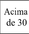|Térrea|H ≤ 6|6 < H ≤ 12|12 < H ≤ 23|23 < H ≤ 30|de 30 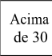|
|Acesso de Viaturas na Edificação|X|X|X|X|X|X|X|X|X|X|X|X|
|Segurança Estrutural em Incêndio|X|X|X|X|X|X|X|X|X|X|X|X|
|Vertical 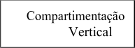|-|-|-|X¹|X¹|X²|-|-|-|X³|X¹|X²|
|Controle de Materiais de Acabamento e Revestimento|X|X|X|X|X|X|X|X|X|X|X|X|
|Saídas de Emergência|X|X|X|X|X|X|X|X|X|X|X|X⁴|
|Plano de Emergência|X|X|X|X|X|X|X|X|X|X|X|X|
|Brigada de Incêndio|X|X|X|X|X|X|X|X|X|X|X|X|
|Iluminação de Emergência|X|X|X|X|X|X|X|X|X|X|X|X|
|Alarme de Incêndio|X|X|X|X|X|X|X|X|X|X|X|X|
|Detecção de Incêndio|X|X|X|X|X|X|-|-|-|-|X|X|
|Sinalização de Emergência|X|X|X|X|X|X|X|X|X|X|X|X|
|Extintores|X|X|X|X|X|X|X|X|X|X|X|X|
|Hidrantes e 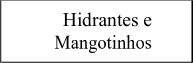|X|X|X|X|X|X|X|X|X|X|X|X|
|Chuveiros Automáticos|-|-|-|-|-|X|-|-|-|-|-|-|
|Controle de Fumaça|-|-|-|-|-|X⁵|-|-|-|-|-|X⁵|

<!-- pág 77 -->

(Redação dada pelo Decreto nº 53.280, de 01 de novembro de 2016)

1 - Pode ser substituída por sistema de chuveiros automáticos, exceto para as compartimentações das fachadas e selagens dos shafts e dutos de instalações. 2 – Pode ser substituída por sistema de controle de fumaça, até 60 metros de altura, exceto para as compartimentações das fachadas e selagens dos shafts e dutos de instalações. 3 – Pode ser substituída por sistema de detecção de incêndio e chuveiros automáticos, exceto para as compartimentações das fachadas e selagens dos shafts e dutos de instalações. 4 – Deve haver Elevador de Emergência para altura maior que 60 metros de altura. 5 – Exigido somente acima de 60 metros de altura.

NOTAS GERAIS: a – Para subsolos ocupados ver Tabela 7; b – Observar ainda as exigências para os riscos específicos das respectivas RTCBMRS.

<!-- pág 78 -->

TABELA 6F.2 EDIFICAÇÕES DE DIVISÃO F-3, F-9 E F-4 COM ÁREA SUPERIOR A 750m²

OU ALTURA SUPERIOR A 12m

|Grupo de ocupação e uso|GRUPO F – LOCAIS DE REUNIÃO DE PÚBLICO||||||||||||
|---|---|---|---|---|---|---|---|---|---|---|---|---|
|Divisão|F-3 e F-9||||||F-4||||||
|Medidas de segurança contra incêndio|Classificação quanto à altura (em metros)||||||Classificação quanto à altura (em metros)||||||
||Térrea|H ≤ 6|6 < H ≤ 12|12 < H ≤ 23|23 < H ≤ 30|de 30 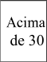|Térrea|H ≤ 6|6 < H ≤ 12|12 < H ≤ 23|23 < H ≤ 30|de 30 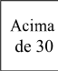|
|Acesso de Viaturas na Edificação|X|X|X|X|X|X|X|X|X|X|X|X|
|Segurança Estrutural em Incêndio|X|X|X|X|X|X|X|X|X|X|X|X|
|Vertical 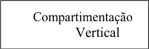|-|-|-|X¹|X¹|X|-|-|-|X¹|X²|X|
|Controle de Materiais de Acabamento e Revestimento|X|X|X|X|X|X|X|X|X|X|X|X|
|Saídas de Emergência|X|X|X|X|X|X³|X|X|X|X|X|X³|
|Plano de Emergência|X⁴|X⁴|X⁴|X|X|X|X⁵|X⁵|X⁵|X⁵|X⁵|X|
|Brigada de Incêndio|X|X|X|X|X|X|X|X|X|X|X|X|
|Iluminação de Emergência|X|X|X|X|X|X|X|X|X|X|X|X|
|Detecção de Incêndio|-|-|-|-|-|-|X⁶|X⁶|X⁶|X⁶|X⁶|X⁶|
|Alarme de Incêndio|X|X|X|X|X|X|X|X|X|X|X|X|
|Sinalização de Emergência|X|X|X|X|X|X|X|X|X|X|X|X|
|Extintores|X|X|X|X|X|X|X|X|X|X|X|X|
|Hidrantes e Mangotinhos|X|X|X|X|X|X|X|X|X|X|X|X|
|Chuveiros Automáticos|-|-|-|X⁷|X⁷|X⁷|X⁸|X⁸|X⁸|X⁸|X|X|
|Controle de Fumaça|-|-|-|-|-|X⁹|-|-|-|-|-|X⁹|

<!-- pág 79 -->

(Redação dada pelo Decreto nº 53.280, de 01 de novembro de 2016)

NOTAS ESPECÍFICAS: 1 – Será considerada somente para as fachadas e selagens dos shafts e dutos de instalações. 2 – Pode ser substituída por controle de fumaça, exceto para as compartimentações das fachadas e selagens dos shafts e dutos de instalações. 3 – Deve haver Elevador de Emergência para altura maior que 60 metros. 4 – Somente para a Divisão F-3. 5 - Somente para locais com público acima de 1.000 pessoas. 6 – Exigido nos depósitos, escritórios, cozinhas, pisos técnicos, casa de máquinas, e nos locais de reunião de público. 7 – Exigido somente para a Divisão F-3, conforme a RTCBMRS específica. Para a Divisão F-9 será exigido somente para edificações com altura superior a 12 metros. 8 – Exigido para áreas edificadas superiores a 10.000m², nos depósitos, escritórios, cozinhas, casas de máquinas e nos locais de reunião de público. 9 – Exigido acima de 60 metros de altura.

NOTAS GERAIS: a – Para subsolos ocupados ver Tabela 7; b – Os locais de comércio ou atividades distintas das Divisões F-3, F-4 e F-9 terão ainda as medidas de proteção conforme suas respectivas ocupações; c – Observar ainda as exigências para os riscos específicos das respectivas RTCBMRS.

<!-- pág 80 -->

TABELA 6F.3 EDIFICAÇÕES DE DIVISÃO F-5, F-6 E F-8 COM ÁREA SUPERIOR A 750m²

OU ALTURA SUPERIOR A 12m

|Grupo de ocupação e uso|GRUPO F – LOCAIS DE REUNIÃO DE PÚBLICO||||||||||||
|---|---|---|---|---|---|---|---|---|---|---|---|---|
|Divisão|F-5 e F-6||||||F-8||||||
|Medidas de segurança contra incêndio|Classificação quanto à altura (em metros)||||||Classificação quanto à altura (em metros)||||||
||Térrea|H ≤ 6|6 < H ≤ 12|12 < H ≤ 23|23 < H ≤ 30|de 30 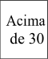|Térrea|H ≤ 6|6 < H ≤ 12|12 < H ≤ 23|23 < H ≤ 30|de 30 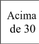|
|Acesso de Viatura na Edificação|X|X|X|X|X|X|X|X|X|X|X|X|
|Segurança Estrutural em Incêndio|X|X|X|X|X|X|X|X|X|X|X|X|
|Compartimentação Horizontal (áreas)|X¹|X¹|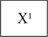|X¹|X|X|-|-|-|X¹|X|X|
|Compartimentação Vertical|-|-|-|X²|X²|X|-|-|-|X²|X²|X|
|Controle de Materiais de Acabamento|X|X|X|X|X|X|X|X|X|X|X|X|
|Saídas de Emergência|X|X|X|X|X|X³|X|X|X|X|X|X³|
|Plano de Emergência|-|-|-|X|X|X|-|-|-|X|X|X|
|Brigada de Incêndio|X|X|X|X|X|X|X|X|X|X|X|X|
|Iluminação de Emergência|X|X|X|X|X|X|X|X|X|X|X|X|
|Detecção de Incêndio|X|X|X|X|X|X|-|-|-|X|X|X|
|Alarme de Incêndio|X|X|X|X|X|X|X|X|X|X|X|X|
|Sinalização de Emergência|X|X|X|X|X|X|X|X|X|X|X|X|
|Extintores|X|X|X|X|X|X|X|X|X|X|X|X|
|Hidrantes e Mangotinhos|X|X|X|X|X|X|X|X|X|X|X|X|
|Chuveiros Automáticos|X⁴|X⁴|X⁴|X⁴|X|X|-|-|-|-|-|X|
|Controle de Fumaça|X⁵|X⁵|X⁵|X⁵|X⁵|X⁵|-|-|-|-|-|X⁶|

<!-- pág 81 -->

(Redação dada pelo Decreto nº 53.280, de 01 de novembro de 2016)

1 – Pode ser substituída por sistema de chuveiros automáticos. 2 – Pode ser substituída por sistema de controle de fumaça e chuveiros automáticos, exceto para as compartimentações das fachadas e selagens dos shafts e dutos de instalações. 3 – Deve haver Elevador de Emergência para altura maior que 60 metros. 4 – Obrigatório somente para a Divisão F-6. 5 – Exigido para a Divisão F-5 acima de 60 metros de altura. 6 – Acima de 60 metros de altura.

NOTAS GERAIS: a – Para subsolos ocupados ver Tabela 7; b – Nos locais de concentração de público, é obrigatória, antes do início de cada evento, a explanação ao público da localização das saídas de emergência, bem como dos sistemas de segurança contra incêndio existentes no local; c – É obrigatória a instalação de iluminação de balizamento nas saídas de emergência e para edificações sem ventilação natural (janelas) exige-se controle de fumaça.

<!-- pág 82 -->

TABELA 6F.4 EDIFICAÇÕES DE DIVISÃO F-7 E F-10 COM ÁREA SUPERIOR A 750m²

OU ALTURA SUPERIOR A 12m

|Grupo de ocupação e uso|GRUPO F – LOCAIS DE REUNIÃO DE PÚBLICO||||||||||||
|---|---|---|---|---|---|---|---|---|---|---|---|---|
|Divisão|F-7||||||F-10||||||
|Medidas de segurança contra incêndio|Classificação quanto à altura (em metros)||||||Classificação quanto à altura (em metros)||||||
||Térrea|H ≤ 6|6 < H ≤ 12|12 < H ≤ 23|23 < H ≤ 30|Acima de 30|Térrea|H ≤ 6|6 < H ≤ 12|12 < H ≤ 23|23 < H ≤ 30|Acima de 30|
|Acesso de Viatura na Edificação|X|X|X|X|X|X|X|X|X|X|X|X|
|Segurança Estrutural em Incêndio|-|-|-|-|-|-|X|X|X|X|X|X|
|Compartimentação Horizontal (áreas)|-|-|-|-|-|-|X¹|X¹|X¹|X¹|X|X|
|Compartimentação Vertical|-|-|-|-|-|-|-|-|-|X²|X³|X|
|Controle de Materiais de Acabamento e Revestimento|X⁴|X⁴|X⁴|X⁴|X⁴|X⁴|X|X|X|X|X|X|
|Saídas de Emergência|X|X|X|X|X|X|X|X|X|X|X|X⁵|
|Plano de Emergência|X⁶|X⁶|X⁶|X⁶|X⁶|X⁶|X⁶|X⁶|X⁶|X⁶|X⁶|X⁶|
|Brigada de Incêndio|X|X|X|X|X|X|X|X|X|X|X|X|
|Iluminação de Emergência|X|X|X|X|X|X|X|X|X|X|X|X|
|Detecção de Incêndio|-|-|-|-|-|-|-|-|X|X|X|X|
|Alarme de Incêndio|-|-|-|-|-|-|X|X|X|X|X|X|
|Sinalização de Emergência|X|X|X|X|X|X|X|X|X|X|X|X|
|Extintores|X|X|X|X|X|X|X|X|X|X|X|X|
|Hidrantes e Mangotinhos|-|-|-|-|-|-|X|X|X|X|X|X|
|Chuveiros Automáticos|-|-|-|-|-|-|-|-|-|-|X|X|
|Controle de Fumaça|-|-|-|-|-|-|-|-|-|-|-|X⁷|
|NOTAS ESPECÍFÍCAS: 1 – Pode ser substituída por sistema de chuveiros automáticos. 2 – Pode ser substituída por sistema de chuveiros automáticos, exceto para as compartimentações das fachadas e selagens dos shafts e dutos de instalações. 3 - Pode ser substituída por sistema de controle de fumaça, exceto para as compartimentações das fachadas e selagens dos shafts e dutos de instalações. 4 – Exigido conforme RTCBMRS específica. 5 – Deve haver Elevador de Emergência para altura maior que 60 metros. 6 – Somente para locais com público acima de 1.000 pessoas. 7 – Exigido acima de 60 metros de altura. NOTAS GERAIS: a – Para subsolos ocupados da Divisão F-10 ver Tabela 7; b - A Divisão F-7 deve observar as exigências complementares da RTCBMRS específica; c – Observar ainda as exigências para os riscos específicos das respectivas RTCBMRS.|||||||||||||

<!-- pág 83 -->

TABELA 6F.5 EDIFICAÇÕES DAS DIVISÕES F-11 E F-12, COM ÁREA SUPERIOR A 1.500m²

OU ALTURA SUPERIOR A 12m

|Grupo de ocupação e uso|GRUPO F – LOCAIS DE REUNIÃO DE PÚBLICO||||||||||||
|---|---|---|---|---|---|---|---|---|---|---|---|---|
|Divisão|F-11||||||F-12||||||
|Medidas de segurança contra incêndio|Classificação quanto à altura (em metros)||||||Classificação quanto à altura (em metros)||||||
||Térrea|H ≤ 6|6 < H ≤ 12|12 < H ≤ 23|23 < H ≤ 30|de 30 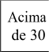|Térrea|H ≤ 6|6 < H ≤ 12|12 < H ≤ 23|23 < H ≤ 30|de 30 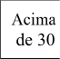|
|Acesso de Viatura na Edificação|X|X|X|X|X|X|X|X|X|X|X|X|
|Segurança Estrutural em Incêndio|-|X¹|X|X|X|X|X|X|X|X|X|X|
|Compartimentação Horizontal (Áreas)|X²-³|X²-³|X²-³|-|-|-|X²-³|X²-³|X³|-|-|-|
|Compartimentação Vertical|-|X²-³|X²-³|-|-|-|-|X²-³|X²-³|-|-|-|
|Controle de Materiais de Acabamento e Revestimento|X⁴|X|X|X|X|X|X|X|X|X|X|X|
|Saídas de Emergência|X|X|X|X|X|X|X|X|X|X|X|X|
|Plano de Emergência|X⁵|X⁵|X⁵|X|X|X|X⁵|X⁵|X⁵|X|X|X|
|Brigada de Incêndio|X|X|X|X|X|X|X|X|X|X|X|X|
|Iluminação de Emergência|X|X|X|X|X|X|X|X|X|X|X|X|
|Detecção de Incêndio|-|-|X⁶|X⁶|X⁶|X⁶|-|-|X⁶|X⁶|X⁶|X⁶|
|Alarme de Incêndio|X|X|X|X|X|X|X|X|X|X|X|X|
|Sinalização de Emergência|X|X|X|X|X|X|X|X|X|X|X|X|
|Extintores de Incêndio|X|X|X|X|X|X|X|X|X|X|X|X|
|Hidrantes e Mangotinhos|X|X|X|X|X|X|X|X|X|X|X|X|
|Chuveiros |-|-|-|X|X|X|-|-|-|X|X|X|
|Controle de Fumaça|X|X|X|X|X|X|X|X|X|X|X|X|

<!-- pág 84 -->

(Redação dada pelo Decreto nº 53.280, de 01 de novembro de 2016)

1 - Pode ser substituída por detecção de incêndio, a ser instalada nas áreas de depósitos, escritórios, cozinhas, camarins, pisos técnicos, salas de comando e casas de máquina. 2 - Exigida somente para edificações com mais de 3.000m². Cada módulo compartimentado não poderá possuir mais de 3.000m². 3 - Pode ser substituída pelo sistema de chuveiros automáticos em toda a edificação. 4 - Pode ser substituída pelo dobro da quantidade de saídas de emergência exigida. Qualquer abertura situada no pavimento térreo poderá ser considerada como saída de emergência, desde que atendidos os requisitos da RTCBMRS de Saídas de Emergência, devendo ser mantidas abertas e desobstruídas durante o horário de funcionamento da edificação e enquanto houver a permanência de pessoas em seu interior. 5 - Exigida somente para edificações com população superior a 2.500 pessoas. 6 - Exigida somente nas áreas de depósitos, escritórios, cozinhas, camarins, pisos técnicos, salas de comando e casas de máquina.

NOTAS GERAIS: a - Deve haver Elevador de Emergência para altura superior a 60 metros; b - Para subsolos ocupados, ver Tabela 7; c - Observar ainda as exigências para os riscos específicos das respectivas RTCBMRS.

<!-- pág 85 -->

TABELA 6G.1 EDIFICAÇÕES DE DIVISÃO G-1 E G-2 COM ÁREA SUPERIOR A 750m²

OU ALTURA SUPERIOR A 12m

|Grupo de ocupação e uso|GRUPO G – SERVIÇOS AUTOMOTIVOS E ASSEMELHADOS||||||
|---|---|---|---|---|---|---|
|Divisão|G-1 e G-2||||||
|Medidas de segurança contra incêndio|Classificação quanto à altura (em metros)||||||
||Térrea|H ≤ 6|6 < H ≤ 12|12 < H ≤ 23|23 < H ≤ 30|Acima de 30|
|Acesso de Viatura na Edificação|X|X|X|X|X|X|
|Segurança Estrutural em Incêndio|X|X|X|X|X|X|
|Compartimentação Vertical|-|-|-|X¹|X¹|X¹|
|Controle de Materiais de Acabamento e Revestimento|X|X|X|X|X|X|
|Saídas de Emergência|X|X|X|X|X|X²|
|Brigada de Incêndio|X|X|X|X|X|X|
|Iluminação de Emergência|X|X|X|X|X|X|
|Detecção de Incêndio|-|-|-|-|-|X|
|Alarme de Incêndio|X³|X³|X³|X³|X³|X³|
|Sinalização de Emergência|X|X|X|X|X|X|
|Extintores|X|X|X|X|X|X|
|Hidrantes e Mangotinhos|X|X|X|X|X|X|
|Chuveiros Automáticos|-|-|-|-|X|X|
|Controle de Fumaça|-|-|-|X⁴|X⁴|X⁴|
|NOTAS ESPECÍFICAS: 1 – Exigido para as compartimentações das fachadas e selagens dos shafts e dutos de instalações. 2 – Deve haver Elevador de Emergência para altura maior que 60 metros. 3 – Deve haver pelo menos um dos acionadores manuais, por pavimento, a no máximo 5 metros da saída de emergência. 4 – Dispensado caso a edificação seja aberta lateralmente. NOTAS GERAIS: a – Para subsolos ocupados ver Tabela 7; b – Observar ainda as exigências para os riscos específicos das respectivas RTCBMRS.|||||||

(Redação dada pelo Decreto nº 53.280, de 01 de novembro de 2016)

<!-- pág 86 -->

TABELA 6G.2 EDIFICAÇÕES DE DIVISÃO G-3 E G-4 COM ÁREA SUPERIOR A 750m²

OU ALTURA SUPERIOR A 12m

|Grupo de ocupação e uso|GRUPO G – SERVIÇOS AUTOMOTIVOS E ASSEMELHADOS||||||||||||
|---|---|---|---|---|---|---|---|---|---|---|---|---|
|Divisão|G-3||||||G-4||||||
|Medidas de segurança contra incêndio|Classificação quanto à altura (em metros)||||||Classificação quanto à altura (em metros)||||||
||Térrea|H ≤ 6|6 < H ≤ 12|12 < H ≤ 23|23 < H ≤ 30|de 30 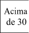|Térrea|H ≤ 6|6 < H ≤ 12|12 < H ≤ 23|23 < H ≤ 30|de 30 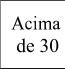|
|Acesso de Viatura na Edificação|X|X|X|X|X|X|X|X|X|X|X|X|
|Segurança Estrutural em Incêndio|X|X|X|X|X|X|X|X|X|X|X|X|
|Compartimentação Horizontal (áreas)|-|-|-|-|-|-|X¹|X¹|X¹|X¹|X¹|X|
|Compartimentação Vertical|-|-|-|X²|X²|X²|-|-|-|X²|X²|X²|
|Controle de Materiais de Acabamento e Revestimento|X|X|X|X|X|X|X|X|X|X|X|X|
|Saídas de Emergência|X|X|X|X|X|X³|X|X|X|X|X|X³|
|Brigada de Incêndio|X|X|X|X|X|X|X|X|X|X|X|X|
|Iluminação de Emergência|X|X|X|X|X|X|X|X|X|X|X|X|
|Detecção de Incêndio|-|-|-|-|-|X|-|-|-|-|-|X|
|Alarme de Incêndio|X⁴|X⁴|X⁴|X⁴|X⁴|X⁴|X⁴|X⁴|X⁴|X⁴|X⁴|X⁴|
|Sinalização de Emergência|X|X|X|X|X|X|X|X|X|X|X|X|
|Extintores|X|X|X|X|X|X|X|X|X|X|X|X|
|Hidrantes e Mangotinhos|X|X|X|X|X|X|X|X|X|X|X|X|
|Chuveiros Automáticos|-|-|-|-|X|X|-|-|-|-|X|X|
|Controle de Fumaça|-|-|-|-|-|X⁵|-|-|-|-|-|X⁵|
|NOTAS ESPECÍFICAS: 1 – Pode ser substituída por sistema de chuveiros automáticos. 2 – Exigido para as compartimentações das fachadas e selagens dos shafts e dutos de instalações. 3 – Deve haver Elevador de Emergência para altura maior que 60 metros. 4 – Deve haver pelo menos um dos acionadores manuais, por pavimento, a no máximo 5 metros da saída de emergência. 5 – Acima de 60 metros de altura. NOTAS GERAIS: a – Para subsolos ocupados ver Tabela 7; b – Observar ainda as exigências para os riscos específicos das respectivas RTCBMRS.|||||||||||||

<!-- pág 87 -->

TABELA 6G.3 EDIFICAÇÕES DE DIVISÃO G-5 COM ÁREA SUPERIOR A 750m²

OU ALTURA SUPERIOR A 12m

|Grupo de ocupação e uso|Divisão G-5 – HANGARES||||||
|---|---|---|---|---|---|---|
|Medidas de segurança contra incêndio|Classificação quanto à altura (em metros)||||||
||Térrea|H ≤ 6|6 < H ≤ 12|12 < H ≤ 23|23 < H ≤ 30|Acima de 30|
|Acesso de Viatura na Edificação|X|X|X|X|X|X|
|Segurança Estrutural em Incêndio|X|X|X|X|X|X|
|Compartimentação Vertical|-|X|X|X|X|X|
|Controle de Materiais de Acabamento e Revestimento|X|X|X|X|X|X|
|Saídas de Emergência|X|X|X|X|X|X|
|Plano de Emergência|X¹|X¹|X¹|X¹|X¹|X¹|
|Brigada de Incêndio|X|X|X|X|X|X|
|Iluminação de Emergência|X|X|X|X|X|X|
|Detecção de Incêndio|X¹|X|X|X|X|X|
|Alarme de Incêndio|X|X|X|X|X|X|
|Sinalização de Emergência|X|X|X|X|X|X|
|Extintores|X|X|X|X|X|X|
|Hidrantes e Mangotinhos|X|X|X|X|X|X|
|Sistema de Espuma|X²|X²|X²|X²|X²|X²|
|NOTAS ESPECÍFICAS: 1 – Somente para áreas superiores a 5.000m². 2 – Não exigido entre 750m² e 2.000m². Para áreas entre 2.000m² e 5.000m², o sistema de espuma pode ser manual. Para áreas superiores a 5.000m², o sistema de espuma deve ser fixo por meio de chuveiros, tipo dilúvio, podendo ser setorizado e interligado ao sistema de detecção automática de incêndio. Para o dimensionamento ver as RTCBMRS específicas. NOTAS GERAIS: a – Para subsolos ocupados ver Tabela 7; b – Deve haver sistema de drenagem de líquidos nos pisos dos hangares para bacias de contenção à distância; c – Não é permitido o armazenamento de líquidos combustíveis ou inflamáveis dentro dos hangares; d – Observar ainda as exigências para os riscos específicos das respectivas RTCBMRS.|||||||

(Redação dada pelo Decreto nº 53.280, de 01 de novembro de 2016)

<!-- pág 88 -->

TABELA 6G.6 EDIFICAÇÕES DE DIVISÃO G-6 COM ÁREA SUPERIOR A 750m²

OU ALTURA SUPERIOR A 12m

|Grupo de ocupação e uso|GRUPO G – SERVIÇOS AUTOMOTIVOS E ASSEMELHADOS||||||
|---|---|---|---|---|---|---|
|Divisão|G-6||||||
|Medidas de segurança contra incêndio|Classificação quanto à altura (em metros)||||||
||Térrea|H ≤ 6|6 < H ≤ 12|12 < H ≤ 23|23 < H ≤ 30|Acima de 30|
|Acesso de Viatura na Edificação|X|X|X|X|X|X|
|Segurança Estrutural em Incêndio|X|X|X|X|X|X|
|Compartimentação Vertical|-|-|-|X¹|X¹|X¹|
|Controle de Materiais de Acabamento e Revestimento|X|X|X|X|X|X|
|Saídas de Emergência|X|X|X|X|X|X²|
|Brigada de Incêndio|X|X|X|X|X|X|
|Iluminação de Emergência|X|X|X|X|X|X|
|Detecção de Incêndio|-|-|-|-|-|X|
|Alarme de Incêndio|-|X³|X³|X³|X³|X³|
|Sinalização de Emergência|X|X|X|X|X|X|
|Extintores|X|X|X|X|X|X|
|Hidrantes e Mangotinhos|X|X|X|X|X|X|
|Chuveiros Automáticos|-|-|-|-|X|X|
|Controle de Fumaça|-|-|-|-|X⁴|X⁴|
|NOTAS ESPECÍFICAS: 1 – Exigido para as compartimentações das fachadas e selagens dos shafts e dutos de instalações. 2 – Deve haver Elevador de Emergência para altura maior que 60 metros. 3 – Deve haver pelo menos um dos acionadores manuais, por pavimento, a no máximo 5 metros da saída de emergência. 4 – Dispensado caso a edificação seja aberta lateralmente. NOTAS GERAIS: a – Para subsolos ocupados ver Tabela 7; b – Observar ainda as exigências para os riscos específicos das respectivas RTCBMRS.|||||||

(Redação dada pelo Decreto nº 53.280, de 01 de novembro de 2016)

<!-- pág 89 -->

TABELA 6H.1 EDIFICAÇÕES DE DIVISÃO H-1 E H-2 COM ÁREA SUPERIOR A 750m²

OU ALTURA SUPERIOR A 12m

|Grupo de ocupação e uso|GRUPO H – SERVIÇOS DE SAÚDE E INSTITUCIONAL||||||||||||
|---|---|---|---|---|---|---|---|---|---|---|---|---|
|Divisão|H-1||||||H-2||||||
|Medidas de segurança contra incêndio|Classificação quanto à altura (em metros)||||||Classificação quanto à altura (em metros)||||||
||Térrea|H ≤ 6|6 < H ≤ 12|12 < H ≤ 23|23 < H ≤ 30|de 30 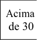|Térrea|H ≤ 6|6 < H ≤ 12|12 < H ≤ 23|23 < H ≤ 30|de 30 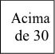|
|Acesso de Viatura na Edificação|X|X|X|X|X|X|X|X|X|X|X|X|
|Segurança Estrutural em Incêndio|X|X|X|X|X|X|X|X|X|X|X|X|
|Compartimentação Vertical|-|-|-|X¹|X²|X³|-|-|-|X¹|X²|X³|
|Controle de Materiais de Acabamento e Revestimento|X|X|X|X|X|X|X|X|X|X|X|X|
|Saídas de |X|X|X|X|X|X⁴|X|X|X|X|X|X⁴|
|Plano de Emergência|-|-|-|-|-|-|X|X|X|X|X|X|
|Brigada de Incêndio|X|X|X|X|X|X|X|X|X|X|X|X|
|Iluminação de Emergência|X|X|X|X|X|X|X|X|X|X|X|X|
|Detecção de Incêndio|-|-|-|-|-|X|X⁵|X⁵|X⁵|X⁵|X⁵|X⁵|
|Alarme de Incêndio|X⁶|X⁶|X⁶|X⁶|X⁶|X⁶|X⁶|X⁶|X⁶|X⁶|X⁶|X⁶|
|Sinalização de Emergência|X|X|X|X|X|X|X|X|X|X|X|X|
|Extintores|X|X|X|X|X|X|X|X|X|X|X|X|
|Hidrantes e |X|X|X|X|X|X|X|X|X|X|X|X|
|Chuveiros Automáticos|-|-|-|-|-|X|-|-|-|-|-|X|
|Controle de Fumaça|-|-|-|-|-|X⁷|-|-|-|-|-|X⁷|

<!-- pág 90 -->

(Redação dada pelo Decreto nº 53.280, de 01 de novembro de 2016)

1 – Pode ser substituída por sistema detecção de incêndio e chuveiros automáticos, exceto para as compartimentações das fachadas e selagens dos shafts e dutos de instalações. 2 – Pode ser substituída por sistema de controle de fumaça, detecção de incêndio e chuveiros automáticos, exceto para as compartimentações das fachadas e selagens dos shafts e dutos de instalações. 3 – Pode ser substituída por sistema de controle de fumaça até 60 metros de altura, exceto para as compartimentações das fachadas e selagens dos shafts e dutos de instalações. 4 – Deve haver Elevador de Emergência para altura maior que 60 metros. 5 – Os detectores deverão ser instalados em todos os quartos e nas áreascomuns. 6 – Acionadores manuais serão obrigatórios nos corredores. 7 – Acima de 60 metros de altura.

NOTAS GERAIS: a – Para subsolos ocupados ver Tabela 7; b – Observar ainda as exigências para os riscos específicos das respectivas RTCBMRS.

<!-- pág 91 -->

TABELA 6H.2 EDIFICAÇÕES DE DIVISÃO H-3 E H-4 COM ÁREA SUPERIOR A 750m²

OU ALTURA SUPERIOR A 12m

|Grupo de ocupação e uso|GRUPO H – SERVIÇOS DE SAÚDE E INSTITUCIONAL||||||||||||
|---|---|---|---|---|---|---|---|---|---|---|---|---|
|Divisão|H-3||||||H-4¹||||||
|Medidas de segurança contra incêndio|Classificação Quanto à altura (em metros)||||||Classificação quanto à altura (em metros)||||||
||Térrea|H ≤ 6|6 < H ≤ 12|12 < H ≤ 23|23 < H ≤ 30|de 30 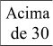|Térrea|H ≤ 6|6 < H ≤ 12|12 < H ≤ 23|23 < H ≤ 30|de 30 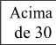|
|Acesso de Viatura na Edificação|X|X|X|X|X|X|X|X|X|X|X|X|
|Segurança Estrutural em Incêndio|X|X|X|X|X|X|X|X|X|X|X|X|
|Compartimentação Horizontal (áreas)|-|X²|X²|X²|X²|X|-|-|-|-|-|-|
|Compartimentação Vertical|-|-|X³|X⁴|X⁴|X⁵|-|-|-|X⁴|X⁴|X⁵|
|Controle de Materiais de Acabamento e Revestimento|X|X|X|X|X|X|X|X|X|X|X|X|
|Plano de Emergência|X|X|X|X|X|X|-|-|-|-|-|-|
|Saídas de Emergência|X|X|X⁶|X⁷|X⁷|X⁷|X|X|X|X|X|X⁸|
|Brigada de Incêndio|X|X|X|X|X|X|X|X|X|X|X|X|
|Iluminação de Emergência|X|X|X|X|X|X|X|X|X|X|X|X|
|Detecção de Incêndio|X⁹|X⁹|X⁹|X⁹|X⁹|X|-|-|-|-|-|-|
|Alarme de Incêndio|X¹⁰|X¹⁰|X¹⁰|X¹⁰|X¹⁰|X¹⁰|X|X|X|X|X|X|
|Sinalização de Emergência|X|X|X|X|X|X|X|X|X|X|X|X|
|Extintores|X|X|X|X|X|X|X|X|X|X|X|X|
|Hidrantes e Mangotinhos|X|X|X|X|X|X|X|X|X|X|X|X|
|Chuveiros Automáticos|-|-|-|-|-|X|-|-|-|-|-|X|
|Controle de Fumaça|-|-|-|-|-|X¹¹|-|-|-|-|-|X¹¹|

<!-- pág 92 -->

(Redação dada pelo Decreto nº 53.280, de 01 de novembro de 2016)

NOTAS ESPECÍFICAS: 1 - As áreas administrativas devem ser consideradas como da Divisão D-1 e os hotéis de trânsito devem ser enquadrados na Divisão B-1. 2 – Pode ser substituída por chuveiros automáticos. 3 – Exigido para selagens dos shafts e dutos de instalações. 4 – Pode ser substituída por sistema de controle de fumaça, detecção de incêndio e chuveiros automáticos, exceto as compartimentações das fachadas e selagens dos shafts e dutos de instalações. 5 – Pode ser substituída por sistema de controle de fumaça, detecção de incêndio e chuveiros automáticos, até 60 metros de altura, exceto para as compartimentações das fachadas e selagens dos shafts e dutos de instalações. 6 – Deve haver elevador de emergência, podendo ser substituído por rampas que conduzam ao pavimento de descarga. 7 – Deve haver Elevador de Emergência. 8 – Deve haver Elevador de Emergência para altura maior que 60 metros. 9 – Dispensado nos corredores de circulação e obrigatório em todos os quartos. 10 – Acionadores manuais serão obrigatórios nos corredores. 11 – Acima de 60 metros de altura.

NOTAS GERAIS: a – Para subsolos ocupados ver Tabela 7; b – Observar ainda as exigências para os riscos específicos das respectivas RTCBMRS.

<!-- pág 93 -->

TABELA 6H.3 EDIFICAÇÕES DE DIVISÃO H-5 E H-6 COM ÁREA SUPERIOR A 750m²

OU ALTURA SUPERIOR A 12m

|Grupo de ocupação e uso|GRUPO H – SERVIÇOS DE SAÚDE E INSTITUCIONAL||||||||||||
|---|---|---|---|---|---|---|---|---|---|---|---|---|
|Divisão|H-5||||||H-6||||||
|Medidas de segurança contra incêndio|Classificação quanto à altura (em metros)||||||Classificação Quanto à altura (em metros)||||||
||Térrea|H ≤ 6|6 < H ≤ 12|12 < H ≤ 23|23 < H ≤ 30|Acima de 30|Térrea|H ≤ 6|6 < H ≤ 12|12 < H ≤ 23|23 < H ≤ 30|Acima de 30|
|Acesso de Viatura na Edificação|X|X|X|X|X|X|X|X|X|X|X|X|
|Segurança Estrutural em Incêndio|X|X|X|X|X|X|X|X|X|X|X|X|
|Compartimentação Horizontal (áreas)|-|-|-|-|-|-|X¹|X¹|X¹|X¹|X¹|X|
|Compartimentação Vertical|-|-|-|X|X|X|-|-|-|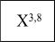|X⁴|X⁵|
|Controle de Materiais de Acabamento e Revestimento|X|X|X|X|X|X|X|X|X|X|X|X|
|Saídas de Emergência|X|X|X|X|X|X⁶|X|X|X|X|X|X⁶|
|Plano de Emergência|X|X|X|X|X|X|-|-|-|-|-|-|
|Brigada de Incêndio|X|X|X|X|X|X|X|X|X|X|X|X|
|Iluminação de Emergência|X|X|X|X|X|X|X|X|X|X|X|X|
|Detecção de Incêndio|-|X⁷|X⁷|X⁷|X⁷|X⁷|X⁸|X⁸|X⁸|X|X|X|
|Alarme de Incêndio|X|X|X|X|X|X|X|X|X|X|X|X|
|Sinalização de Emergência|X|X|X|X|X|X|X|X|X|X|X|X|
|Extintores|X|X|X|X|X|X|X|X|X|X|X|X|
|Hidrantes e |X|X|X|X|X|X|X|X|X|X|X|X|
|Chuveiros Automáticos|-|-|-|-|-|X|-|-|-|-|-|X|
|Controle de Fumaça|-|-|-|-|-|X⁹|-|-|-|-|-|X⁹|

<!-- pág 94 -->

(Redação dada pelo Decreto nº 53.280, de 01 de novembro de 2016)

1 – Pode ser substituída por sistema de chuveiros automáticos. 2 – Pode ser substituída por sistema de chuveiros automáticos, exceto para as compartimentações das fachadas e selagens dos shafts e dutos de instalações. 3 – Deverá haver controle de fumaça nos átrios. 4 – Pode ser substituída por sistema de controle de fumaça e chuveiros automáticos, exceto para as compartimentações das fachadas e selagens dos shafts e dutos de instalações. 5 – Pode ser substituída por sistema de controle de fumaça até 60 metros de altura, exceto para as compartimentações das fachadas e selagens dos shafts e dutos de instalações. 6 – Deve haver Elevador de Emergência para altura maior que 60 metros. 7 – Para a Divisão H-5, as prisões em geral (Casas de Detenção, Penitenciárias, Presídios etc.) não é necessário detecção automática de incêndio. Para os hospitais psiquiátricos e assemelhados prever detecção em todos os quartos. 8 – Somente nos quartos, se houver. 9 – Acima de 60 metros de altura.

NOTAS GERAIS: a – Para subsolos ocupados ver Tabela 7; b – Observar ainda as exigências para os riscos específicos das respectivas RTCBMRS.

<!-- pág 95 -->

TABELA 6I.1 EDIFICAÇÕES DE DIVISÃO I-1 E I-2 COM ÁREA SUPERIOR A 750m²

OU ALTURA SUPERIOR A 12m

|Grupo de ocupação e uso|GRUPO I – INDUSTRIAL||||||||||||
|---|---|---|---|---|---|---|---|---|---|---|---|---|
|Divisão|I-1 (risco baixo)||||||I-2 (risco médio)||||||
|Medidas de segurança contra incêndio|Classificação quanto à altura (em metros)||||||Classificação quanto à altura (em metros)||||||
||Térrea|H ≤ 6|6 < H ≤ 12|12 < H ≤ 23|23 < H ≤ 30|de 30 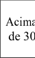|Térrea 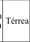|H ≤ 6|6 < H ≤ 12|12 < H ≤ 23|23 < H ≤ 30|de 30 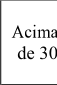|
|Acesso de Viatura na Edificação|X|X|X|X|X|X|X|X|X|X|X|X|
|Segurança Estrutural em Incêndio|-|-|X|X|X|X|X|X|X|X|X|X|
|Horizontal (áreas) |-|-|X¹|X¹|X¹|X|-|X¹|X¹|X¹|X|X|
|Compartimentação Vertical|-|-|-|X|X|X|-|-|-|X|X|X|
|Controle de Materiais de Acabamento e Revestimento|X|X|X|X|X|X|X|X|X|X|X|X|
|Saídas de Emergência|X|X|X|X|X|X²|X|X|X|X|X|X²|
|Plano de Emergência|-|-|-|-|-|-|-|-|-|X|X|X|
|Brigada de Incêndio|X|X|X|X|X|X|X|X|X|X|X|X|
|Iluminação de Emergência|X|X|X|X|X|X|X|X|X|X|X|X|
|Detecção de Incêndio|-|-|-|-|-|X|-|-|-|-|X|X|
|Alarme de Incêndio|X|X|X|X|X|X|X|X|X|X|X|X|
|Sinalização de Emergência|X|X|X|X|X|X|X|X|X|X|X|X|
|Extintores|X|X|X|X|X|X|X|X|X|X|X|X|
|Hidrantes e Mangotinhos|X|X|X|X|X|X|X|X|X|X|X|X|
|Chuveiros Automáticos|-|-|-|-|-|X|-|-|-|-|X|X|
|Controle de Fumaça|-|-|-|-|-|X³|-|-|-|-|-|X³|
|NOTAS ESPECÍFICAS: 1 – Pode ser substituída por sistema de chuveiros automáticos. 2 – Deve haver Elevador de Emergência para altura maior que 60 metros. 3 – Acima de 60 metros de altura. NOTAS GERAIS: a – Para subsolos ocupados ver Tabela 7; b – Observar ainda as exigências para os riscos específicos das respectivas RTCBMRS.|||||||||||||

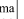

<!-- pág 96 -->

TABELA 6I.2 EDIFICAÇÕES DE DIVISÃO I-3 COM ÁREA SUPERIOR A 750m²

OU ALTURA SUPERIOR A 12m

|Grupo de ocupação e uso|GRUPO I – INDUSTRIAL||||||
|---|---|---|---|---|---|---|
|Divisão|I-3 (risco alto)||||||
|Medidas de segurança contra incêndio|Classificação quanto à altura (em metros)||||||
||Térrea|H ≤ 6|6 < H ≤ 12|12 < H ≤ 23|23 < H ≤ 30|Acima de 30|
|Acesso de Viatura na Edificação|X|X|X|X|X|X|
|Segurança Estrutural em Incêndio|X|X|X|X|X|X|
|Compartimentação Horizontal (áreas)|X¹|X¹|X¹|X¹|X|X|
|Compartimentação Vertical|-|-|-|X²|X²|X|
|Controle de Materiais de Acabamento e Revestimento|X|X|X|X|X|X|
|Saídas de Emergência|X|X|X|X|X|X³|
|Plano de Emergência|X|X|X|X|X|X|
|Brigada de Incêndio|X|X|X|X|X|X|
|Iluminação de Emergência|X|X|X|X|X|X|
|Detecção de Incêndio|-|-|-|X|X|X|
|Alarme de Incêndio|X|X|X|X|X|X|
|Sinalização de Emergência|X|X|X|X|X|X|
|Extintores|X|X|X|X|X|X|
|Hidrantes e Mangotinhos|X|X|X|X|X|X|
|Chuveiros Automáticos|-|-|-|X|X|X|
|Controle de Fumaça|-|-|-|-|-|X|
|NOTAS ESPECÍFICAS: 1 – Pode ser substituída por sistema de chuveiros automáticos. 2 – Pode ser substituída por sistema de controle de fumaça, exceto para as compartimentações das fachadas e selagens dos shafts e dutos de instalações. 3 – Deve haver Elevador de Emergência para altura maior que 60 metros. NOTAS GERAIS: a – Para subsolos ocupados ver Tabela 7; b – Observar ainda as exigências para os riscos específicos das respectivas RTCBMRS.|||||||

(Redação dada pelo Decreto nº 53.280, de 01 de novembro de 2016)

<!-- pág 97 -->

TABELA 6J.1 EDIFICAÇÕES DE DIVISÃO J-1 E J-2 COM ÁREA SUPERIOR A 750m²

OU ALTURA SUPERIOR A 12m

|Grupo de ocupação e uso|GRUPO J – DEPÓSITO||||||||||||
|---|---|---|---|---|---|---|---|---|---|---|---|---|
|Divisão|J-1 (material incombustível)||||||J-2 (risco baixo)||||||
|Medidas de segurança contra incêndio|Classificação quanto à altura (em metros)||||||Classificação quanto à altura (em metros)||||||
||Térrea|H ≤ 6|6 < H ≤ 12|12 < H ≤ 23|23 < H ≤ 30|de 30 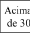|Térrea|H ≤ 6|6 < H ≤ 12|12 < H ≤ 23|23 < H ≤ 30|de 30 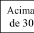|
|Acesso de Viatura na Edificação|X¹|X¹|X¹|X¹|X|X|X|X|X|X|X|X|
|Segurança Estrutural em Incêndio|-|X|X|X|X|X|-|X|X|X|X|X|
|Compartimentação Horizontal (áreas)|-|-|-|-|-|-|X²|X²|X²|X²|X²|X|
|Compartimentação Vertical|-|-|-|X³|X³|X|-|-|-|X⁴|X⁴|X|
|Controle de Materiais de Acabamento|-|X|X|X|X|X|-|X|X|X|X|X|
|Saídas de Emergência|X|X|X|X|X|X|X|X|X|X|X|X⁵|
|Brigada de Incêndio|X|X|X|X|X|X|X|X|X|X|X|X|
|Iluminação de Emergência|X|X|X|X|X|X|X|X|X|X|X|X|
|Detecção de Incêndio|-|-|-|-|-|X|-|-|-|-|X|X|
|Alarme de Incêndio|-|-|-|X|X|X|X|X|X|X|X|X|
|Sinalização de Emergência|X|X|X|X|X|X|X|X|X|X|X|X|
|Extintores|X|X|X|X|X|X|X|X|X|X|X|X|
|Hidrantes e Mangotinhos|-|-|-|X|X|X|X|X|X|X|X|X|
|Chuveiros Automáticos|-|-|-|-|-|X|-|-|-|-|-|X|
|Controle de Fumaça|-|-|-|-|-|X⁶|-|-|-|-|-|X⁶|

<!-- pág 98 -->

(Redação dada pelo Decreto nº 53.280, de 01 de novembro de 2016)

NOTAS ESPECÍFICAS: 1 – O acesso de viatura poderá ser substituído por rede seca junto ao passeio público, conforme RTCBMRS. 2 – Pode ser substituída por sistema de chuveiros automáticos. 3 – Exigido para as compartimentações das fachadas e selagens dos shafts e dutos de instalações. 4 – Pode ser substituída por sistema de detecção de incêndio e chuveiros automáticos, exceto para as compartimentações das fachadas e selagens dos shafts e dutos de instalações. 5 – Deve haver Elevador de Emergência para altura maior que 60 metros. 6 – Acima de 60 metros de altura.

NOTAS GERAIS: a – Para subsolos ocupados ver Tabela 7; b – Observar ainda as exigências para os riscos específicos das respectivas RTCBMRS; c – Em qualquer tipo de ocupação, sempre que houver depósito de materiais combustíveis (J-2, J-3 e J-4), dispostos em áreas descobertas, serão exigidos nestes locais, além de instruções específicas constantes em RTCBMRS: c.1: Proteção por sistema de hidrantes e brigada de incêndio para áreas delimitadas de depósito superiores a 2.500 m²; c.2: Proteção por extintores, podendo os mesmos ficar agrupados em abrigos nas extremidades do terreno, com percurso máximo de 60 metros; c.3: Recuos e afastamentos das divisas do lote (terreno): limite do passeio público de 3 metros; limite das divisas laterais e dos fundos de 2 metros; limite de bombas de combustíveis, equipamentos e máquinas que produzam calor e outras fontes de ignição de 3 metros; c.4: O depósito deverá estar disposto em lotes máximos de 20 metros de comprimento e largura, separados por corredores entre os lotes com largura mínima de 1,5 metros.

<!-- pág 99 -->

TABELA 6J.2 EDIFICAÇÕES DE DIVISÃO J-3 E J-4 COM ÁREA SUPERIOR A 750m²

OU ALTURA SUPERIOR A 12m

|Grupo de ocupação e uso|GRUPO J – DEPÓSITO||||||||||||
|---|---|---|---|---|---|---|---|---|---|---|---|---|
|Divisão|J-3 (risco médio)||||||J-4 (risco alto)||||||
|Medidas de segurança contra incêndio|Classificação quanto à altura (em metros)||||||Classificação quanto à altura (em metros)||||||
||Térrea|H ≤ 6|6 < H ≤ 12|12 < H ≤ 23|23 < H ≤ 30|de 30 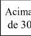|Térrea|H ≤ 6|6 < H ≤ 12|12 < H ≤ 23|23 < H ≤ 30|de 30 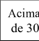|
|Acesso de Viatura na Edificação|X|X|X|X|X|X|X|X|X|X|X|X|
|Segurança Estrutural em Incêndio|X|X|X|X|X|X|X|X|X|X|X|X|
|Compartimentação Horizontal (áreas)|X¹|X¹|X¹|X¹|X¹|X|X¹|X¹|X¹|X¹|X|X|
|Compartimentação Vertical|-|-|-|X²|X²|X|-|-|-|X²|X²|X|
|Controle de Materiais de Acabamento e Revestimento|X|X|X|X|X|X|X|X|X|X|X|X|
|Saídas de Emergência|X|X|X|X|X|X³|X|X|X|X|X|X³|
|Plano de Emergência|X|X|X|X|X|X|X|X|X|X|X|X|
|Brigada de Incêndio|X|X|X|X|X|X|X|X|X|X|X|X|
|Iluminação de Emergência|X|X|X|X|X|X|X|X|X|X|X|X|
|Detecção de Incêndio|-|-|-|X|X|X|-|-|-|X|X|X|
|Alarme de Incêndio|X|X|X|X|X|X|X|X|X|X|X|X|
|Sinalização de Emergência|X|X|X|X|X|X|X|X|X|X|X|X|
|Extintores|X|X|X|X|X|X|X|X|X|X|X|X|
|Hidrantes e Mangotinhos|X|X|X|X|X|X|X|X|X|X|X|X|
|Chuveiros Automáticos|-|-|-|-|-|X|-|-|-|-|X|X|
|Controle de Fumaça|-|-|-|-|-|X|-|-|-|-|-|X|

<!-- pág 100 -->

(Redação dada pelo Decreto nº 53.280, de 01 de novembro de 2016)

1 – Pode ser substituída por sistema de chuveiros automáticos. 2 – Pode ser substituída por sistema de controle de fumaça e chuveiros automáticos, exceto para as compartimentações das fachadas e selagens dos shafts e dutos de instalações. 3 – Deve haver Elevador de Emergência para altura maior que 60 metros.

NOTAS GERAIS: a – Para subsolos ocupados ver Tabela 7; b – Observar ainda as exigências para os riscos específicos das respectivas RTCBMRS; c – Em qualquer tipo de ocupação, sempre que houver depósito de materiais combustíveis (J-2, J-3 e J-4), dispostos em áreas descobertas, serão exigidos nestes locais: c.1: Proteção por sistema de hidrantes e brigada de incêndio para áreas delimitadas de depósito superiores a 2.500m²; c.2: Proteção por extintores, podendo os mesmos ficar agrupados em abrigos nas extremidades do terreno, com percurso máximo de 60 metros; c.3: Recuos e afastamentos das divisas do lote (terreno): limite do passeio público de 3 metros; limite das divisas laterais e dos fundos de 2 metros; limite de bombas de combustíveis, equipamentos e máquinas que produzam calor e outras fontes de ignição de 3 metros; c.4: O depósito deverá estar disposto em lotes máximos de 20 metros de comprimento e largura, separados por corredores entre os lotes com largura mínima de 1,5 metros.

<!-- pág 101 -->

TABELA 6L.1 EDIFICAÇÕES E ÁREAS DE RISCO DE INCÊNDIO GRUPO L COM ÁREA SUPERIOR A

750m² OU ALTURA SUPERIOR A 12m

|Grupo de ocupação e uso|GRUPO L – EXPLOSIVOS||||||
|---|---|---|---|---|---|---|
|Divisão|L1, L2 e L3||||||
|Medidas de segurança contra incêndio|Classificação quanto à altura (em metros)||||||
||Térrea|H ≤ 6|6 <H ≤ 12|12 <H ≤ 23|23 <H ≤ 30|Acima de 30|
|Acesso de Viatura na Edificação|X¹|X|X|X|X|X|
|Controle de Materiais de Acabamento e Revestimento|X|X|X|X|X|X|
|Saídas de Emergência|X|X|X|X|X|X|
|Plano de Emergência|X²,³|X²,³|X²|X²|X²|X²|
|Brigada de Incêndio|X|X|X|X|X|X|
|Iluminação de Emergência|X²,⁴|X²,⁴|X²,⁴|X²,⁴|X²,⁴|X²,⁴|
|Sinalização de Emergência|X|X|X|X|X|X|
|Alarme de incêndio|-|-|X²,⁴|X²,⁴|X²,⁴|X²,⁴|
|Detecção de incêndio|-|-|X²,⁴|X²,⁴|X²,⁴|X²,⁴|
|Extintores|X|X|X|X|X|X|
|Hidrantes e Mangotinhos|X²|X²|X²|X²|X²|X²|
|NOTA ESPECÍFICA: 1 - Obrigatório para L-2 e L-3. Para a Divisão L-1 será exigido se a edificação estiver afastada mais do que 30 metros da via pública. 2 – Conforme exigências da RTCBMRS específica. 3 - Somente para as divisões L-2 e L-3. 4 - Deverá ser à prova de explosão. NOTAS GERAIS: a – Atender adicionalmente as medidas de segurança contra incêndio e exigências constantes em RTCBMRS específica; b - Devido às peculiaridades deste Grupo, as exigências e as possibilidades de substituição das medidas de segurança contra incêndio serão estabelecidas em RTCBMRS específica; c – Para subsolos ocupados ver Tabela 7; d – Observar ainda as exigências para os riscos específicos das respectivas RTCBMRS.|||||||

(Redação dada pelo Decreto nº 53.280, de 01 de novembro de 2016)

<!-- pág 102 -->

TABELA 6M.1 EDIFICAÇÕES E ÁREAS DE RISCO DE INCÊNDIO DE DIVISÃO M-1

|Grupo de ocupação e uso|GRUPO M – ESPECIAIS||||
|---|---|---|---|---|
|Divisão|M-1 TÚNEL||||
|Medidas de segurança contra incêndio|Extensão em metros (m)||||
||Até 200|De 200 a 500|De 500 a 1.000|Acima de 1.000|
|Segurança Estrutural em Incêndio|X|X|X|X|
|Saídas de Emergência|X|X|X|X|
|Controle de Fumaça|X|X|X|X|
|Plano de Emergência|-|X¹|X¹|X¹|
|Brigada de Incêndio|X¹|X¹|X¹|X¹|
|Iluminação de Emergência|-|X|X|X|
|Sistema de Comunicação|-|-|X|X|
|Sistema de Circuito de TV (monitoramento)|-|-|-|X|
|Sinalização de Emergência|X|X|X|X|
|Extintores|-|X|X|X|
|Hidrantes e Mangotinhos|-|X|X|X|
|NOTA ESPECÍFICA: 1 – Exigido em rodovias e ferrovias administradas por concessionárias. NOTAS GERAIS: a – Atender as exigências e condições particulares para as medidas de segurança contra incêndio de acordo com a RTCBMRS específica; b – Considerando as peculiaridades desta Divisão, o dimensionamento, execução, substituições, isenções ou acréscimo de medidas de segurança contra incêndio serão tratadas em RTCBMRS específica; c – Observar ainda as exigências para os riscos específicos das respectivas RTCBMRS.|||||

(Redação dada pelo Decreto nº 53.280, de 01 de novembro de 2016)

<!-- pág 103 -->

TABELA 6M.2 EDIFICAÇÕES E ÁREAS DE RISCO DE INCÊNDIO DE DIVISÃO M-2

|Grupo de ocupação e uso|GRUPO M – ESPECIAIS|||||
|---|---|---|---|---|---|
|Divisão|M-2 – Líquidos e gases combustíveis e inflamáveis|||||
|Medidas de segurança contra incêndio|Tanques ou cilindros e processos||Plataforma de carregamento|Produtos acondicionados||
||Líquidos até 20m³ ou gases até 10m³|Líquidos acima de 20m³ ou gases acima de 10m³|-|Líquidos até 20m³ ou gases até 24.960kg|Líquidos acima de 20m³ ou gases acima de 24.960kg|
|Acesso de Viatura na Edificação|X¹|X|X|X¹|X|
|Segurança Estrutural em Incêndio|X²|X²|-|X²|X²|
|Controle de Materiais de Acabamento|X²|X²|-|X²|X²|
|Saídas de Emergência|X|X|X|X|X|
|Plano de Emergência|-|X|X|-|X|
|Brigada de Incêndio|X|X|X|X|X|
|Iluminação de Emergência|||-||X²,³|
|Alarme de Incêndio|-|X⁴|X⁴|-|X⁴|
|Sinalização de Emergência|X|X|X|X|X|
|Extintores|X|X|X|X|X|
|Hidrantes e Mangotinhos|-|X⁵|X⁵|-|X⁵|
|Resfriamento|-|X⁵|X⁵|-|X⁶|
|Espuma|-|X⁶|X⁵|-|X⁶|
|NOTAS ESPECÍFICAS: 1 – Apenas para áreas de armazenamento e distribuição situadas a mais de 30 metros da via de circulação de veículos. 2 - Exigido apenas para instalações cobertas. 3 – Deve ser à prova de explosão. 4 – Deve ser à prova de explosão. Instalado nas edificações e áreas de armazenamento e distribuição, conforme RTCBMRS. 5 – Conforme RTCBMRS específica. 6 - Exigido para instalações de líquidos combustíveis e inflamáveis, conforme RTCBMRS específica. NOTAS GERAIS: a – Atender adicionalmente as medidas de segurança contra incêndio e exigências constantes em RTCBMRS específica; b – Devido as peculiaridades desta Divisão, o detalhamento das exigências e as possibilidades de substituição das medidas de segurança contra incêndio serão estabelecidas em RTCBMRS específica; c – Para subsolos ocupados ver Tabela 7; d – Observar ainda as exigências para os riscos específicos das respectivas RTCBMRS; e - Considera-se, para efeito de gases inflamáveis, a capacidade total do volume em água que o recipiente pode comportar, expressa em m³ (metros cúbicos); f - As bases de envasamento de Gás Liquefeito de Petróleo – GLP deverão atender os requisitos previstos em RTCBMRS específica.||||||

<!-- pág 104 -->

TABELA 6M.3 EDIFICAÇÕES DE DIVISÃO M-3 COM ÁREA SUPERIOR A 750m²

OU ALTURA SUPERIOR A 12m

|Grupo de ocupação e uso|GRUPO M – ESPECIAIS||||||
|---|---|---|---|---|---|---|
|Divisão|M-3 – Centrais de Comunicação||||||
|Medidas de segurança contra incêndio|Classificação Quanto à altura (em metros)||||||
||Térrea|H ≤ 6|6 < H ≤ 12|12 < H ≤ 23|23 < H ≤ 30|Acima de 30|
|Acesso de Viatura na Edificação|X|X|X|X|X|X|
|Segurança Estrutural em Incêndio|X|X|X|X|X|X|
|Compartimentação Horizontal (áreas)|X¹,²|X¹,²|X¹,²|X|X|X|
|Compartimentação Vertical|-|-|-|X|X|X|
|Controle de Materiais de Acabamento e Revestimento|X|X|X|X|X|X|
|Saídas de Emergência|X|X|X|X|X|X³|
|Plano de Emergência|-|-|-|X|X|X|
|Brigada de Incêndio|X|X|X|X|X|X|
|Iluminação de Emergência|X|X|X|X|X|X|
|Detecção de Incêndio|-|-|-|X|X|X|
|Alarme de Incêndio|X|X|X|X|X|X|
|Sinalização de Emergência|X|X|X|X|X|X|
|Extintores|X|X|X|X|X|X|
|Hidrantes e Mangotinhos|X|X|X|X|X|X|
|Chuveiros Automáticos|-|-|-|X²|X²|X²|
|NOTA ESPECÍFICA: 1 – Pode ser substituído por sistema de chuveiros automáticos. 2 - O sistema de chuveiros automáticos pode ser substituído por sistema de gases, através de supressão total do ambiente. 3 – Exigido elevador de emergência acima de 60 metros de altura. NOTAS GERAIS: a – Devido as peculiaridades desta Divisão, as exigências e as possibilidades de substituição das medidas de segurança contra incêndio serão estabelecidas em RTCBMRS específica; b – Para subsolos ocupados ver Tabela 7; c – Observar ainda as exigências para os riscos específicos das respectivas RTCBMRS.|||||||

<!-- pág 105 -->

TABELA 6M.4 EDIFICAÇÕES DE DIVISÃO M-4 COM ÁREA SUPERIOR A 750m²

OU ALTURA SUPERIOR A 12m E M-7

|Grupo de ocupação e uso|GRUPO M – ESPECIAIS||
|---|---|---|
|Divisão|M-4 e M-7||
|Medidas de segurança contra incêndio|||
||M-4|M-7 (térreo – áreas externas)|
|Acesso de Viatura na Edificação|X|X¹|
|Saídas de Emergência|X²|X²|
|Brigada de Incêndio|X|X|
|Sinalização de Emergência|X|X|
|Extintores|X|X|
|Iluminação de Emergência|X³|-|
|Hidrante urbano|-|X⁴|
|NOTAS ESPECÍFICAS: 1 – Exigido vias de acesso para viaturas entre as quadras de armazenamento. 2 - Para a Divisão M-4: aceitam-se as próprias saídas da edificação, podendo as escadas ser do tipo Não Enclausurada - NE, respeitando-se as larguras mínimas exigidas. Para as demais ocupações do canteiro de obras (alojamentos, refeitórios, escritórios, etc.) as distâncias máximas a percorrer deverão ser cumpridas segundo a ocupação específicas. Para a Divisão M-7: aceitam-se os arruamentos entre as quadras de armazenamento, conforme RTCBMRS específica. 3 – Exigido nos alojamentos, oficinas, escritórios e refeitórios dos canteiros de obras, bem como nas edificações em construção que tiverem atividade noturna no período entre 18h e 06h. 4 – Deverá ser instalado no máximo a 30 metros do acesso ao pátio de contêineres, conforme RTCBMRS específica. NOTAS GERAIS: a – Atender as exigências e condições particulares para as medidas de segurança contra incêndio de acordo com a RTCBMRS específica; b – As áreas a serem consideradas para a Divisão M-7 são as áreas dos terrenos abertos (lotes) onde há depósito de contêineres; c – Observar ainda as exigências para os riscos específicos das respectivas RTCBMRS.|||

(Redação dada pelo Decreto nº 53.280, de 01 de novembro de 2016)

<!-- pág 106 -->

TABELA 6M.5 EDIFICAÇÕES E ÁREAS DE RISCO DE INCÊNDIO DE DIVISÃO M-5

|Grupo de ocupação e uso|GRUPO M – ESPECIAIS|
|---|---|
|Divisão|M-5|
|Medidas de segurança contra incêndio||
|Acesso de Viatura na Edificação|X|
|Saídas de Emergência|X|
|Plano de Emergência|X|
|Brigada de Incêndio|X|
|Iluminação de Emergência|X|
|Sinalização de Emergência|X|
|Extintores|X|
|Hidrantes e Mangotinhos|X|
|NOTAS GERAIS: a – Considerando as peculiaridades desta Divisão, o dimensionamento, execução, substituições, isenções ou acréscimo de medidas de segurança contra incêndio serão tratadas em RTCBMRS específica; b – Para subsolos ocupados ver Tabela 7; c – Observar ainda as exigências para os riscos específicos das respectivas RTCBMRS.||

(Redação dada pelo Decreto nº 53.280, de 01 de novembro de 2016)

<!-- pág 107 -->

TABELA 6M.6 EDIFICAÇÕES E ÁREAS DE RISCO DE INCÊNDIO DE DIVISÃO M-6

|Grupo de ocupação e uso|GRUPO M – ESPECIAIS||||||
|---|---|---|---|---|---|---|
|Divisão|M-6 – Centrais de Energia||||||
|Medidas de segurança contra incêndio|Classificação Quanto à altura (em metros)||||||
||Térrea|H ≤ 6|6 < H ≤ 12|12 < H ≤ 23|23 < H ≤ 30|Acima de 30|
|Acesso de Viatura na Edificação|X|X|X|X|X|X|
|Segurança Estrutural em Incêndio|X|X|X|X|X|X|
|Compartimentação Horizontal (áreas)|X¹|X¹|X¹|X|X|X|
|Controle de Materiais de Acabamento e Revestimento|X|X|X|X|X|X|
|Saídas de Emergência|X|X|X|X|X|X|
|Plano de Emergência|X|X|X|X|X|X|
|Brigada de Incêndio|X|X|X|X|X|X|
|Iluminação de Emergência|X|X|X|X|X|X|
|Detecção de Incêndio|-|-|-|X|X|X|
|Alarme de Incêndio|X|X|X|X|X|X|
|Sinalização de Emergência|X|X|X|X|X|X|
|Extintores|X|X|X|X|X|X|
|Hidrantes e mangotinhos|X|X|X|X|X|X|
|Chuveiros Automáticos|-|-|-|X²|X²|X²|
|NOTA ESPECÍFICA: 1 – Pode ser substituído por sistema de chuveiros automáticos ou por sistema de gases por supressão de ambiente. 2 – O sistema de chuveiros automáticos pode ser substituído por sistema de gases, através de supressão total do ambiente, ou de resfriamento. NOTAS GERAIS: a – Considerando as peculiaridades desta Divisão, o dimensionamento, execução, substituições, isenções ou acréscimo de medidas de segurança contra incêndio serão tratadas em RTCBMRS específica; b – Para centrais de energia a céu aberto deverão ser observadas exigências constantes em RTCBMRS específica; c – Medidas de segurança contra incêndio poderão ser substituídas mediante análise a aprovação do CBMRS; d – Observar ainda as exigências para os riscos específicos das respectivas RTCBMRS.|||||||

(Redação dada pelo Decreto nº 53.280, de 01 de novembro de 2016)

<!-- pág 108 -->

TABELA 7 EXIGÊNCIAS ADICIONAIS PARA OCUPAÇÕES EM SUBSOLOS

DIFERENTES DE ESTACIONAMENTO

|Área ocupada (m²) no(s) subsolo(s)||Ocupação do subsolo|Medidas de segurança adicionais no subsolo|
|---|---|---|---|
|No primeiro ou segundo subsolo|Até 50|Todas|- Sem exigências adicionais|
||Entre 50 e 100|Depósito|- Depósitos individuais¹ com área máxima até 5m² cada, ou - Depósitos individuais¹ com área máxima até 25m² cada e detecção automática de incêndio no depósito, ou - Chuveiros automáticos² de resposta rápida no depósito, ou Controle de fumaça.|
|||Divisões F-1, F-2, F-3, F-5, F-6, F-10|- Ambientes subdividos¹ com área máxima até 50m² e detecção automática de incêndio em todo o subsolo, ou - Chuveiros automáticos³ de resposta rápida em todo subsolo, ou Controle de fumaça.|
|||Outras ocupações|- Ambientes subdividos¹ com área máxima até 50m² e detecção automática de incêndio nos ambientes ocupados, ou - Chuveiros automáticos² de resposta rápida nos ambientes ocupados, ou - Controle de fumaça.|
||Entre 100 e 250|Depósito|- Depósitos individuais¹ com área máxima até 5m² cada, ou - Ambientes subdividos¹ com área máxima até 50m², detecção automática de incêndio no depósito e exaustão⁴, ou - Chuveiros automáticos³ de resposta rápida no depósito e exaustão⁴ ou - Controle de fumaça.|
|||Divisões F-1, F-2, F-3, F-5, F-6, F-10|- Detecção automática de incêndio em todo o subsolo, exaustão⁴ e duas saídas de emergência ou - Chuveiros automáticos³ de resposta rápida em todo o subsolo e exaustão⁴, ou - Controle de fumaça.|
|||Outras ocupações|- Detecção automática de incêndio nos ambientes ocupados e exaustão⁴, ou - Chuveiros automáticos³ de resposta rápida nos ambientes ocupados e exaustão⁴, ou - Controle de fumaça.|
||Entre 250 e 750|Depósito⁵|- Depósitos individuais¹, em edificações residenciais, com área máxima até 5m² cada, ou - Detecção automática de incêndio em todo o subsolo e exaustão⁴ ou - Chuveiros automáticos³ de resposta rápida em todo o subsolo e exaustão⁴, ou - Controle de fumaça.|
|||Divisões F-1, F-2, F-3, F-5, F-6, F-10|- Detecção automática de incêndio em todo o subsolo, exaustão⁴ e duas saídas de emergência em lados opostos, ou - Chuveiros automáticos³ de resposta rápida em todo o subsolo e exaustão⁴, ou - Controle de fumaça.|
|||Outras ocupações|- Detecção automática de incêndio em todo o subsolo e exaustão⁴ ou - Chuveiros automáticos³ de resposta rápida em todo o subsolo e exaustão⁴, ou - Controle de fumaça.|

<!-- pág 109 -->

||Acima de 750|Depósito⁵|- Depósitos individuais¹, em edificações residenciais, com área máxima até 5m² cada, ou - Chuveiros automáticos³ de resposta rápida e detecção automática de incêndio, em todo o subsolo, duas saídas de emergência em lados opostos e controle de fumaça.|
|---|---|---|---|
|||Outras ocupações|- Chuveiros automáticos³ de resposta rápida e detecção automática de incêndio, em todo o subsolo, duas saídas de emergência em lados opostos e controle de fumaça.|
|Nos demais subsolos|Até 100|Depósito|- Depósitos individuais¹ com área máxima até 5m² cada, ou - Depósitos individuais¹ com área máxima até 25m² cada e detecção automática de incêndio no depósito, ou - Chuveiros automáticos² de resposta rápida no depósito, ou - Controle de fumaça.|
|||Divisões F-1, F-2, F-3, F-5, F-6, F-10|- Detecção automática de incêndio em todo o subsolo, exaustão⁴ e duas saídas de emergência ou - Chuveiros automáticos³ de resposta rápida em todo o subsolo e exaustão⁴, ou - Controle de fumaça.|
|||Outras ocupações|- Detecção automática de incêndio nos ambientes ocupados e exaustão⁴, ou - Chuveiros automáticos² de resposta rápida nos ambientes ocupados e exaustão⁴, ou - Controle de fumaça.|
||Acima de 100|Depósito⁵|- Depósitos individuais¹, em edificações residenciais, com área máxima até 5m² cada, ou - Chuveiros automáticos³ de resposta rápida e detecção automática de incêndio, em todo o subsolo, duas saídas de emergência em lados opostos e controle de fumaça.|
|||Outras ocupações|- Chuveiros automáticos³ de resposta rápida e detecção automática de incêndio, em todo o subsolo, duas saídas de emergência em lados opostos e controle de fumaça.|
|NOTAS ESPECÍFICAS: 1 – As paredes dos compartimentos devem ser construídas com material resistente ao fogo por 60 minutos, no mínimo. 2 – Pode ser interligado à rede de hidrantes pressurizada, utilizando-se da bomba e da reserva de incêndio dimensionada para o sistema de hidrantes. 3 – Pode ser interligado à rede de hidrantes pressurizada, utilizando-se da reserva de incêndio dimensionada para o sistema de hidrantes, entretanto a bomba de incêndio deve ser dimensionada considerando o funcionamento simultâneo de seis bicos e um hidrante. Havendo chuveiros automáticos instalados no edifício, não há necessidade de trocar os bicos de projeto por bicos de resposta rápida. 4 – Exaustão natural ou mecânica nos ambientes ocupados conforme estabelecido na RTCBMRS sobre controle de fumaça. 5 – Somente depósitos situados em edificações residenciais. NOTAS GERAIS: a – Ocupações permitidas nos subsolos (qualquer nível) sem necessidade de medidas adicionais: garagem de veículos, lavagem de autos, vestiários até 100m², banheiros, áreas técnicas não habitadas (elétrica, telefonia, lógica, motogerador) e assemelhados; b – Entende-se por medidas adicionais àquelas complementares às exigências prescritas ao edifício; c – Para área total ocupada de até 750m², se houver compartimentação, de acordo com a RTCBMRS pertinente, entre os ambientes, as exigências desta tabela poderão ser consideradas individualmente para cada compartimento; d – O sistema de controle de fumaça será considerado para os ambientes ocupados.||||
