<!-- convertido de IT37.pdf pelo converter.py (SSEG) -->

<!-- pág 1 -->

Atualizada pela Portaria nº CCB 003/800/25 publicada no Diário Oficial do Estado, de 20 de março de 2025

SECRETARIA DA SEGURANÇA PÚBLICA

POLÍCIA MILITAR DO ESTADO DE SÃOPAULO

Corpo de Bombeiros

INSTRUÇÃO TÉCNICA Nº 37/2025

Subestação elétrica

SUMÁRIO

**1** Objetivo

**2** Aplicação

**3** Definições

**4** Procedimentos

**5** Referências normativas e bibliográficas

ANEXO

A Modelos de subestação elétrica, figuras, conformação e afastamentos

B Dimensionamento dos sistemas

<!-- pág 2 -->

**1** OBJETIVO

**1.1** Estabelecer as medidas de segurança contra incêndio em subestações elétricas, atendendo ao Regulamento de Segurança Contra Incêndio das edificações e áreas de risco do Estado de São Paulo.

**2** APLICAÇÃO

**2.1** Esta Instrução Técnica (IT) aplica-se a todos os tipos de subestações elétricas refrigeradas a óleo e a seco.

**2.2** Adota-se a NBR 13231 – Proteção contra incêndio em subestações elétricas como texto complementar a esta Instrução Técnica (IT).

**3** DEFINIÇÕES

**3.1** Para os efeitos desta Instrução Técnica aplicam-se as definições constantes da IT 03 – Terminologia de segurança contra incêndio e no Regulamento de Segurança Contra Incêndios das edificações e áreas de risco no Estado de São Paulo.

**4** PROCEDIMENTOS

**4.1** Requisitos básicos para as edificações

**4.1.1** Os ambientes da casa de controle e das edificações de apoio operacional devem ser protegidos contra risco de incêndio de acordo com sua área, atendendo ao Regulamento de Segurança contra Incêndio do CBPMESP.

**4.1.2** Em função da análise de risco de incêndio e da importância da subestação no sistema de energia elétrica, estas podem ter sistemas de proteção contra incêndios complementares para a sua proteção, de acordo com as exigências das normas referenciadas no item 5.

**4.2** Casa de controle

**4.2.1** Os quadros de supervisão e comando dos sistemas fixos de proteção contra incêndio da subestação devem estar localizados na sala de controle ou em área de supervisão contínua. A sinalização, luminosa e sonora, de funcionamento dos quadros deve ser diferente de outras existentes no local.

**4.2.2** Quando o risco de incêndio existente na instalação orientar para a necessidade da utilização de sistema fixo de proteção por gases, este sistema deve estar dimensionado conforme a NBR 12232 ou NFPA 2001.

**4.3** Casa de compensadores síncronos

**4.3.1** Quando os compensadores síncronos forem do tipo resfriamento a hidrogênio (H2), os ambientes onde estiverem instalados os recipientes de H2 e aqueles onde existem equipamentos ou passagem de tubulações de gás devem ser providos de meios de detecção de vazamentos. As instalações devem atender aos requisitos da NFPA 50A.

**4.4** Requisitos básicos de proteção contra incêndio

**4.4.1** Extintores de incêndio

**4.4.1.1** As edificações de uma subestação devem ser protegidas, por extintores de incêndio portáteis de gás carbônico (CO2) e pó químico seco, atendendo às especificações e distanciamentos para o risco alto conforme a IT 21.

**4.4.2** Extintores de incêndio sobre rodas

**4.4.2.1** Os conjuntos transformadores e reatores de potência ou unidades individuais devem ser protegidos por extintores de pó, tipo sobre rodas, com capacidade extintora de 80-B:C.

**4.4.2.2** Os extintores devem ser instalados em locais de fácil acesso, sinalizados, abrigados contra intempéries e identificados.

**4.4.2.3** Os extintores devem ser equipados com rodas especiais para o deslocamento sobre superfícies irregulares, por exemplo, locais com brita, possuindo diâmetro e largura dimensionados para esta finalidade.

**4.4.2.4** A distribuição deve levar em consideração o risco alto conforme a IT 21.

**4.4.3** Barreiras de proteção

**4.4.3.1** As barreiras de proteção devem ser instaladas para separação de riscos de incêndio (conforme Figura A.3).

**4.4.4** Parede tipo corta-fogo

**4.4.4.1** A parede tipo corta-fogo deve possuir TRRF por 120 min e apresentar as seguintes dimensões para transformadores e reatores de potência (ver Figura A.5):

a. dimensão estendida em 0,3 m (altura) e 0,6 m (comprimento), além dos componentes do transformador, que podem ser pressurizados devido a uma falha elétrica, incluindo buchas, tanque conservador do líquido isolante, válvulas de alívio de pressão, radiadores e tanque do comutador;

b. distância livre mínima de separação física, entre a parede e o equipamento protegido, deve ser de 0,5 m.

c. que a parede sofrendo colapso estrutural e caindo, parcial ou totalmente, não atinja equipamentos, edificações ou bloquear rotas de fuga;

d. que a parede não permita a passagem de calor e chamas para locais próximos.

**4.4.4.2** A interposição de parede corta-fogo deve ser dispensada quando a distância livre de separação física atender as Tabelas 1 e 2.

Nota sobre distância de separação mínima:

Óleo mineral => distância a partir da borda interna do sistema de contenção Fluido de alto ponto de combustão (classe K) => distância a partir dos componentes do transformador que podem ser pressurizados devido a uma falha elétrica, incluindo buchas, tanque conservador do líquido isolante, válvulas de alívio de pressão, radiadores e tanque do comutador.

**4.4.4.3** As distâncias contidas nas Tabelas 1 e 2 ou a utilização de parede corta-fogo devem ser consideradas como fatores de isolamento de risco.

**4.4.5** Sistema de contenção de líquido isolante

**4.4.5.1** Quando da utilização de óleo vegetal isolante que cumprem com os critérios de biodegradabilidade e toxicidade da NBR 13231, os transformadores e/ou reatores de potência, sob a aprovação, podem utilizar sistemas de contenção através de diques, sendo dispensado o uso da bacia de contenção com sistema de drenagem interligado ao dispositivo separador de água/óleo.

**4.4.5.2** A figura A.6 exemplifica bacia coletora, bacia de contenção e dispositivo separador de água/óleo.

**4.4.5.3** Para instalações externas, os transformadores e reatores de potência imersos em óleo mineral isolante devem ser instalados sobre sistema de contenção de líquido isolante composto de bacia coletora e bacia de contenção.

a. para óleo mineral isolante, a bacia coletora e a bacia de <!-- pág 3 --> contenção devem ser separadas.

b. para fluídos de alto ponto de combustão (classe K) a bacia coletora e a bacia de contenção podem ser integradas.

**4.4.5.3.1** O fluído drenado deve ser encaminhado para sistema de contenção específico, que direcione os efluentes para dispositivo separador de água-óleo, com as seguintes características:

a. permitir fácil retirada do óleo isolante drenado;

b. permitir a drenagem da água;

c. apresentar resistência à corrosão pela água e pelo óleo isolante;

d. possuir meios com proteção que possibilitem a inspeção interna;

e. apresentar capacidade mínima correspondente ao volume do óleo vertido do equipamento sinistrado, acrescido do volume de água do sistema de proteção contra incêndio, se previsto, acrescida do volume ocupado pelo dispositivo separador de água e óleo;

f. o dispositivo separador de água e óleo deve ser previsto em área específica, separado de outras instalações e equipamentos.

**4.4.5.4** Para instalações internas, os transformadores e reatores de potência imersos em óleo mineral isolante ou fluídos de alto ponto de combustão (classe K) devem possuir sistema de contenção com as seguintes características:

a. ser constituído de materiais com TRRF de acordo com IT-

08;

b. ser constituído por diques, lombadas ou grelhas;

c. possuir dispositivo de supressão de chamas composto por pedra britada;

d. ter drenagem para o óleo ou fluido extravasado do equipamento até uma bacia de contenção situada em área externa conforme IT 25;

e. a bacia de contenção externa deve estar interligada em um dispositivo separador de água e óleo;

f. o conjunto bacia de contenção externa e dispositivo separador água-óleo deve conter o volume do (s) equipamento (s) situado (s) da mesma área juntamente com o volume do sistema de combate a incêndio. Caso exista compartimentação entre os equipamentos, o sistema poderá ser dimensionado para o maior risco.

**4.4.6** Sistema fixo automático para proteção contra incêndios

**4.4.6.1** Quando previsto sistema fixo automático para proteção de transformadores e reatores de potência, são aceitos os seguintes sistemas:

a. proteção de incêndio por chuveiros automáticos, por aspersão conforme parâmetros da IT 23 para o risco extraordinário I;

b. sistema fixo automático por água nebulizada, de acordo com os parâmetros da NFPA 15;

c. sistema fixo automático por gás pelo método de inundação total, de acordo com a NBR 12232 ou NFPA 2001;

d. sistema fixo automático por água nebulizada sob alta pressão (water mist), de acordo com a NFPA 750.

**4.4.7** Sistema manual de resfriamento

**4.4.7.1** Quando previsto sistema de resfriamento por linhas manuais, deve-se atender aos parâmetros de linhas de resfriamento da Tabela B.2.

**4.4.7.2** Somente é permitida a utilização em projeto quando houver brigada (população fixa) na edificação.

Tabela 1: Distâncias mínimas de separação entre transformadores e edificações

|Tipo do líquido isolante do transformador|Volume de líquido isolante (L)|Distância horizontal mínima|||
|---|---|---|---|---|
|||(Dimensão X ou K da Figura 4)|||
|||Edificação resistente ao fogo por 2 h (m)|Edificação incombustível (m)|Edificação|
|||||combustível|
|||||(m)|
|Óleo mineral|< 2 000|1,5|4,6|7,6|
||> 2 000 < 20 000|4,6|7,6|15,2|
||> 20 000|7,6|15,2|30,5|
|Fluido de alto ponto de combustão (classe K)|< 38 000|1,5||7,6|
||> 38 000|4,6||15,2|
|NOTA: 1) Detalhes construtivos sobre edificação resistente ao fogo ou incombustível são apresentados na IT 08.|||||

Tabela 2: Distâncias mínimas de separação entre transformadores e equipamentos adjacentes

|Tipo do líquido isolante do transformador|Volume de líquido isolante|Distância (m)|
|---|---|---|
||(L)||
|Óleo mineral|< 2 000|1,5|
||≥ 2 000 e < 20 000|7,6|
||> 20 000|15,2|
|Fluido de alto ponto de combustão (classe K)|< 38 000|1,5|

<!-- pág 4 -->

> 38 000 7,6

<!-- pág 5 -->

**4.4.8** Sistema de detecção e alarme

**4.4.8.1** Quando previsto para a proteção de edificações, deve estar em conformidade com a IT 19.

**4.4.9** Sistema de espuma fixo ou móvel

**4.4.9.1** Quando exigido para a proteção das bacias de contenção e bacia coletora, devem atender aos critérios da

Tabela B.3.

**4.4.9.2** Quando exigido para a proteção no tanque de óleo do transformador, devem ser adotados os parâmetros das tabelas B.1 e B.3.

**4.4.9.3** Para o dimensionamento dos sistemas de espuma e resfriamento deve ser efetuado o cálculo hidráulico com base nas características dos equipamentos, a fim de obter a vazão e pressão da bomba de incêndio, tal qual reservatório de incêndio.

**4.4.9.4** Somente é permitida a utilização sistemas móveis em projeto quando houver brigada (população fixa) na edificação.

**4.5** Exigências para subestação elétrica com transformadores que possuem armazenamento de óleo, onde o tanque ou o conjunto de tanques, de cada transformador, possui capacidade volumétrica de até 20 m³ de óleo mineral ou até 38 m³ de classe K.

**4.5.1** Subestação externa a. via de acesso para veículos de emergência;

b. parede corta-fogo em transformadores, reatores de potência e reguladores de tensão conforme item 4.4.4 ou afastamentos de segurança conforme as tabelas 1 e 2;

c. sistema de contenção de líquido isolante conforme item 4.4.5 ;

d. extintores portáteis e sobre rodas;

e. sinalização de emergência.

**4.5.2** Subestação abrigada ou subterrânea (instalações internas) a. vias de acesso para veículos de emergência;

b. meio de proteção contra incêndio conforme Tabela 3.

c. sistema de contenção de líquido isolante conforme item

4.4.5;

d. extintores portáteis e sobre rodas;

e. sistema fixo automático por gás pelo método de inundação total, em transformadores, reatores de potência ou reguladores de tensão, conforme item 4.4.6.1 “c”, quando tecnicamente viável;

f. iluminação de emergência;

g. sistema de alarme de incêndio;

h. saídas de emergência;

i. sinalização de emergência.

**4.6** Exigências para subestação elétrica com transformadores que possuem armazenamento de óleo, onde o tanque ou o conjunto de tanques, de cada transformador, possui capacidade volumétrica maior que 20 m³ se mineral ou maior que 38 m³ para classe K.

**4.6.1** Subestação externa a. via de acesso para veículos de emergência;

b. parede corta-fogo em transformadores, reatores de potência e reguladores de tensão conforme item 4.4.4 ou afastamentos de segurança conforme as tabelas 1 e 2 c. sistema de contenção de líquido isolante conforme item 4.4.5 ;

d. extintores portáteis e sobre rodas;

e. sinalização de emergência;

f. sistema de resfriamento conforme uma das seguintes alternativas:

1) item 4.4.7 2) item 4.4.7 g. sistema de proteção por espuma, que pode ser dimensionado para o tanque do transformador ou para a bacia de contenção, sendo calculado para o maior volume entre eles.

**4.6.2** Subestação abrigada e subterrânea (instalações internas) a. via de acesso para veículos de emergência;

b. meio de proteção contra incêndio conforme Tabela 3;

c. sistema de contenção de líquido isolante conforme item 4.4.5 ;

d. extintores portáteis e sobre rodas;

e. sinalização de emergência;

f. iluminação de emergência;

g. sistema de alarme de incêndio;

h. saídas de emergência.

**4.7** Subestação a seco a. vias de acesso para veículos de emergência;

b. parede corta-fogo em transformadores, reatores de potência e reguladores de tensão conforme item 4.4.4 ou afastamentos de segurança conforme as tabelas 1 e 2;

c. extintores portáteis e sobre rodas;

d. sinalização de incêndio.

**5** REFERÊNCIAS NORMATIVAS E BIBLIOGRÁFICAS

ASSOCIAÇÃO BRASILEIRA DE NORMAS TÉCNICAS (ABNT). NBR 10897: Sistema de proteção contra incêndio por chuveiros automáticos – Requisitos. Rio de Janeiro: ABNT;

_______.NBR 12232: Execução de sistemas fixos automáticos com gás carbônico (CO2) em transformadores e reatores de potência. Rio de Janeiro: ABNT;

_______.NBR 13231:

Proteção contra incêndio em subestações elétricas. Rio de Janeiro: ABNT;

_______.NBR 14432: Exigência de resistência ao fogo de elementos construtivos de edificações - Procedimentos. Rio de Janeiro: ABNT;

NFPA 15 – Standard for water spray fixed systems for fire protection

NFPA 50A – Standard for gaseous hydrogen systems at consumer sites

NFPA 70E – Electrical Safety Requirements for Employee Workplaces

NFPA 750 – Standard on Water Mist Fire Protection Systems

NFPA 2001 – Standard on clean agent fire extinguishing systems

<!-- pág 6 -->

Tabela 3: Proteção mínimas para transformadores em instalações internas (ver notas 1 e 2)

|Tipo de transformador ou do líquido isolante|Volume de líquido|Meios de proteção contra incêndio|
|---|---|---|
||isolante do tanque ou||
||conjunto de tanques de||
||cada transformador||
||(L)||
|Óleo mineral|até 400|Edificação resistente ao fogo por 1 h|
||> 400 até 20 000 (ver nota 3)|Transformador único: - edificação resistente ao fogo por 1 h e sistema fixo de combate ao incêndio por água ou gases conforme item 4.4.6 , ou - edificação resistente ao fogo por 3 h|
|||Transformadores múltiplos: - edificação resistente ao fogo por 3 h, subdivida conforme item 4.4.4, ou - edificação resistente ao fogo por 3 h e sistema fixo de combate ao incêndio por água ou gases, conforme item 4.4.6 .|
||> 20 000 (ver nota 3)|- edificação resistente ao fogo por 3 h e sistema fixo de combate ao incêndio conforme itens 4.4.6 ou 4.4.8 .|
|Fluido de alto ponto de combustão (classe K)||- edificação resistente ao fogo por 1 h|
||Até 38 000||
||||
|||- edificação incombustível e sistema fixo de combate ao incêndio, conforme item 4.4.6 ou 4.4.8|
||> 38 000||
||||
|Tipo seco (sem qualquer acessório imerso em óleo como: buchas, comutadores, etc.)|N/A|- edificação incombustível|
|NOTA 1) Detalhes construtivos sobre edificação resistente ao fogo ou incombustível são apresentados na IT 08. 2) Para a construção resistente ao fogo por 3 h para transformadores imersos em óleo mineral, o aço estrutural exposto também deve possuir proteção para o TRRF de 3 h.|||

<!-- pág 7 -->

ANEXO A

Modelos de subestação elétrica, figuras, conformação e afastamentos

Figura A.1: Exemplo de vedação de abertura para passagem de cabos entre ambientes compartimentados

Exemplo de vedação em canaletas de cabos

Figura A.2: Exemplo de vedação em canaletas de cabos

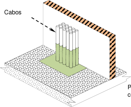
<!-- texto na figura: Cabos -->

<!-- texto na figura: Cabos -->

Sistema de vedação certificado

Piso ou parede de compartimentação

Sistema de vedação certificado

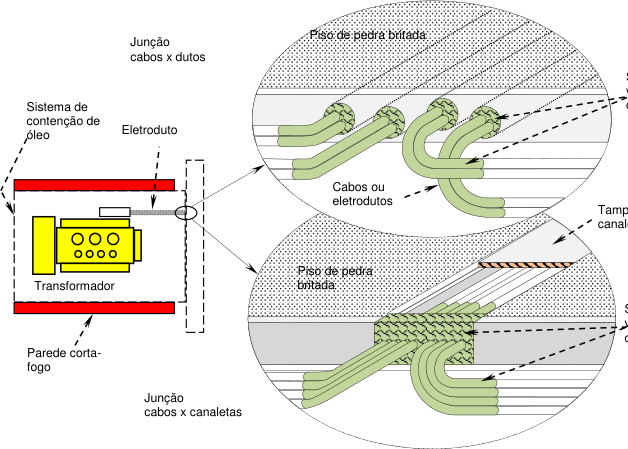
<!-- texto na figura: Transformador Eletroduto Junção cabos x dutos Junção cabos x canaletas Tampa da canaleta Piso de pedra britada Piso de pedra britada Cabos ou eletrodutos Parede corta-fogo Sistema de contenção de óleo -->

Sistema de vedação certificado

<!-- pág 8 -->

Anexo A (continuação)

Exemplo de barreira de cabos posicionados em bandejas dentro de galerias, salas ou túneis

Figura A.3: Barreira de cabos em uma galeria

Distância de separação mínima entre transformador imerso em líquido isolante instalado externamente e edificação

Figura A.4: Transformador imerso em líquido isolante instalado externamente a edificação

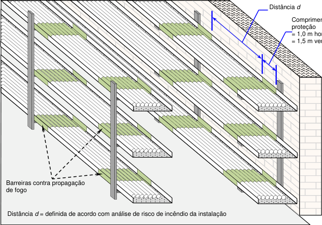
<!-- texto na figura: Barreiras contra propagação de fogo proteção = 1,0 m horizontal = 1,5 m vertical Distância d -->

Comprimento Barreira de

Distância d = definida de acordo com análise de risco de incêndio da instalação

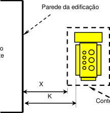
<!-- texto na figura: Parede da edificação X K -->

Edificação Importante

<!-- texto na figura: Transformador -->

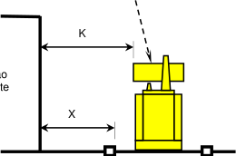
<!-- texto na figura: X K -->

Edificação importante

Contenção

Vista superior

<!-- texto na figura: Vista da elevação -->

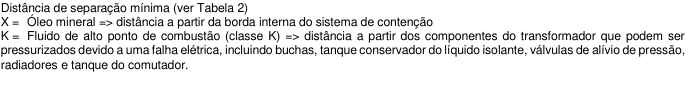
<!-- texto na figura: Distância de separação mínima (ver Tabela 2) radiadores e tanque do comutador. -->

X = Óleo mineral => distância a partir da borda interna do sistema de contenção K = Fluido de alto ponto de combustão (classe K) => distância a partir dos componentes do transformador que podem ser pressurizados devido a uma falha elétrica, incluindo buchas, tanque conservador do líquido isolante, válvulas de alívio de pressão,

<!-- pág 9 -->

Anexo A (continuação)

Parede tipo corta fogo

Figura A.5: Separação por parede tipo corta-fogo entre equipamentos e edificação

Sistema de contenção para equipamentos imersos em fluídos instalado externamente

<!-- texto na figura: Bacia coletora integrada à bacia de contenção -->

<!-- texto na figura: Bacia coletora separada da bacia de contenção -->

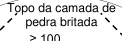
<!-- texto na figura: Topo da camada de pedra britada ≥100 -->

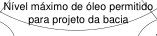
<!-- texto na figura: Nível máximo de óleo permitido para projeto da bacia -->

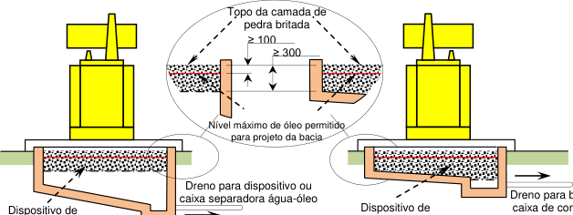
<!-- texto na figura: ≥300 -->

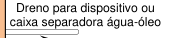
<!-- texto na figura: Dreno para dispositivo ou caixa separadora água-óleo -->

<!-- texto na figura: Dispositivo de supressão de chama -->

<!-- texto na figura: Dreno para bacia ou caixa de contenção -->

<!-- texto na figura: Dispositivo de supressão de chama -->

<!-- texto na figura: Dimensões em milímetros -->

<!-- texto na figura: Vista da elevação -->

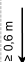
<!-- texto na figura: ≥ 0,6 m -->

<!-- texto na figura: ≥ 0,6 m -->

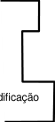
<!-- texto na figura: Edificação -->

<!-- texto na figura: Parede corta-fogo -->

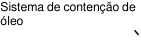
<!-- texto na figura: Sistema de contenção de óleo -->

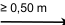
<!-- texto na figura: ≥ 0,50 m -->

<!-- texto na figura: Vista superior -->

<!-- texto na figura: ≥ 0,50 m -->

Y1 ≥ 0,3 m => Bucha em porcelana => distância a partir do topo da bucha do transformador Y2 ≥ 0,3 m => Bucha polimérica => distância a partir do conservador de óleo

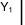
<!-- texto na figura: Y1 -->

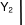
<!-- texto na figura: Y2 -->

<!-- texto na figura: Equipamento -->

<!-- texto na figura: Dimensões em metros -->

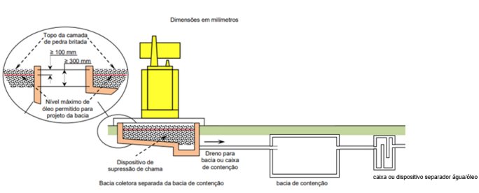

<!-- pág 10 -->

Figura A.6: Exemplo de bacia coletora de contenção e bacia de contenção

<!-- pág 11 -->

Anexo B

Dimensionamento dos sistemas

Tabela B.1: Linhas de espuma

Anexo B

Tabela B.2: Linhas de resfriamento

Tabela B.3: Taxa de aplicação e tempo de espuma para a bacia de contenção

|Tipo||||Taxa mínima de|||Tempo mínimo||
|---|---|---|---|---|---|---|---|---|
|||||aplicação (l/min/ m²)|||(mín.)||
||Câmara de espuma ou aplicadores de||4,1|||55|||
||espuma fixos na parede da bacia||||||||
|Canhões-monitores e linhas manuais|||6,5|||65|||

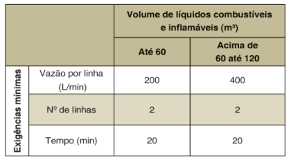

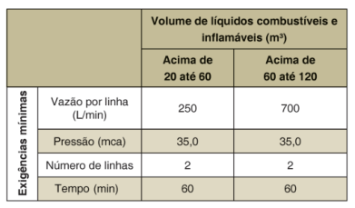
