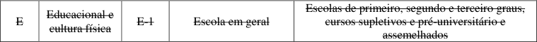
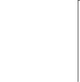

<!-- convertido de Lec nº 14.376.pdf pelo converter.py (SSEG) -->

<!-- pág 1 -->

ESTADO DO RIO GRANDE DO SUL

ASSEMBLEIA LEGISLATIVA Gabinete de Consultoria Legislativa

LEI COMPLEMENTAR Nº 14.376, DE 26 DE DEZEMBRO DE 2013.

(atualizada até a Lei Complementar n.º 16.280, de 23 de abril de 2025)

Estabelece normas sobre Segurança, Prevenção e Proteção contra Incêndios nas edificações e áreas de risco de incêndio no Estado do Rio Grande do Sul e dá outras providências.

CAPÍTULO I DOS OBJETIVOS E DAS DISPOSIÇÕES PRELIMINARES

Art. 1.º Ficam estabelecidas, através desta Lei Complementar, para as edificações e áreas de risco de incêndio no Estado do Rio Grande do Sul, as normas sobre Segurança, Prevenção e Proteção contra Incêndio, competências, atribuições, fiscalizações e sanções administrativas decorrentes do seu descumprimento.

Parágrafo único. A presente Lei Complementar baliza a atuação das administrações públicas municipais e a edição de legislações locais, dado que se trata de lei complementar na forma dos arts. 24 e 30 da Constituição Federal e art. 130 da Constituição do Estado.

Art. 2.º São objetivos desta Lei Complementar:

I - preservar e proteger a vida dos ocupantes das edificações e áreas de risco, em caso de incêndio;

II - estabelecer um conjunto de medidas eficientes de prevenção contra incêndio;

III - dificultar a propagação do incêndio, preservando a vida, reduzindo danos ao meio ambiente e ao patrimônio;

IV - proporcionar meios de controle e extinção do incêndio;

V - dar condições de acesso para as operações do Corpo de Bombeiros Militar do Estado Rio Grande do Sul  CBMRS ;

VI - proporcionar a continuidade dos serviços nas edificações e áreas de risco de incêndio;

VII - definir as responsabilidades e competências de legislar em âmbito estadual, respeitando as dos demais entes federados;

VIII - estabelecer as responsabilidades dos órgãos competentes pelo licenciamento, prevenção e fiscalização contra incêndios e sinistros deles decorrentes;

IX - definir as vistorias, os licenciamentos e as fiscalizações às edificações e áreas de risco de incêndio;

X - determinar as sanções nos casos de descumprimento desta Lei Complementar.

Art. 3.º As medidas de segurança contra incêndio nas edificações e áreas de risco de incêndio atenderão ao previsto no art. 144, § 5.º, “in fine”, da Constituição Federal e art. 130 da Constituição do Estado.

<!-- pág 2 -->

~~Art. 4.º As edificações e áreas de risco de incêndio deverão possuir Alvará de Prevenção e Proteção Contra Incêndio  APPCI , expedido pelo Corpo de Bombeiros Militar do Estado do Rio Grande do Sul  CBMRS.~~

~~Parágrafo único. Estão excluídas das exigências desta Lei Complementar:~~

~~I - edificações de uso residencial exclusivamente unifamiliares;~~

~~II - residências exclusivamente unifamiliares, localizadas no pavimento superior de ocupação mista com até dois pavimentos, e que possuam acessos independentes.~~

Art. 4.º As edificações e áreas de risco de incêndio deverão possuir Alvará de Prevenção e Proteção Contra Incêndios – APPCI –, expedido pelo CBMRS. (Redação dada pela Lei Complementar n.º 14.924/16)

§ 1.º Excluem-se das exigências desta Lei Complementar: (Redação dada pela Lei Complementar n.º 14.924/16)

I - edificações de uso residencial exclusivamente unifamiliares; (Redação dada pela Lei Complementar n.º 14.924/16)

II - residências exclusivamente unifamiliares localizadas em edificação com ocupação mista de até 2 (dois) pavimentos, desde que as ocupações possuam acessos independentes; (Redação dada pela Lei Complementar n.º 14.924/16)

III - propriedades destinadas a atividades agrossilvipastoris, excetuando-se silos e armazéns, que serão regulamentadas por RTCBMRS; (Redação dada pela Lei Complementar n.º 14.924/16)

IV - empreendedor que utilize residência unifamiliar, sem atendimento ao público ou estoque de materiais. (Redação dada pela Lei Complementar n.º 14.924/16)

~~§ 2.º As edificações e áreas de risco de incêndio enquadradas nos incisos abaixo serão regularizadas mediante Certificado de Licenciamento do Corpo de Bombeiros – CLCB –, obtido por meio eletrônico, cumprindo as RTCBMRS: (Redação dada pela Lei Complementar n.º 14.924/16)~~

~~I - as edificações ou áreas de risco de incêndio deverão atender a todos os seguintes requisitos: (Redação dada pela Lei Complementar n.º 14.924/16)~~

~~a) ter área total de até 200m² (duzentos metros quadrados); (Redação dada pela Lei Complementar n.º 14.924/16)~~

~~b) possuir até 2 (dois) pavimentos; (Redação dada pela Lei Complementar n.º 14.924/16)~~

~~c) ser classificada com grau de risco baixo ou médio, conforme as Tabelas constantes em Decreto Estadual; (Redação dada pela Lei Complementar n.º 14.924/16)~~

~~d) não se enquadrar nas divisões F-5, F-6, F-7, F-11, F-12, G-3, G-4, G-5 e G-6, e nos grupos L e M, conforme as Tabelas constantes em Decreto Estadual; (Redação dada pela Lei Complementar n.º 14.924/16)~~

~~e) não possuir depósito ou áreas de manipulação de combustíveis, inflamáveis, explosivos ou substâncias com alto potencial lesivo à saúde humana, ao meio ambiente ou ao patrimônio, tais como peróxidos orgânicos, substâncias oxidantes, substâncias tóxicas, substâncias radioativas, substâncias corrosivas e substâncias perigosas diversas; (Redação dada pela Lei Complementar n.º 14.924/16)~~

~~f) não possuir mais de 26kg (vinte e seis quilogramas) de GLP; (Redação dada pela Lei Complementar n.º 14.924/16)~~

<!-- pág 3 -->

~~g) não possuir subsolo com área superior a 50m² (cinquenta metros quadrados); (Redação dada pela Lei Complementar n.º 14.924/16)~~

~~II - aplica-se o disposto no inciso I às partes de uma mesma edificação com isolamento de risco, desde que estes espaços possuam área de até 200m² (duzentos metros quadrados), acessos independentes e que atendam às alíneas “b”, “c”, “d”, “e”, “f” e “g” do referido dispositivo; (Redação dada pela Lei Complementar n.º 14.924/16)~~

~~III - o CLCB será válido enquanto a edificação não sofrer alterações nos requisitos constantes no inciso I; (Redação dada pela Lei Complementar n.º 14.924/16)~~

~~IV - as informações fornecidas para obtenção do CLCB são de inteira responsabilidade do proprietário ou do responsável pelo uso da edificação. (Redação dada pela Lei Complementar n.º 14.924/16)~~

§ 2.º São dispensadas do Alvará, de que trata o “caput” deste artigo, as edificações e as áreas de risco de incêndio classificadas como de baixo risco, para os fins de que trata a Lei Federal nº 13.874, de 20 de setembro de 2019, enquadradas nos incisos abaixo: (Redação dada pela Lei Complementar n.º 15.907/22)

I - as edificações e áreas de risco de incêndio que apresentarem todas as seguintes características: (Redação dada pela Lei Complementar n.º 15.907/22)

a) ter área total de até 200 m² (duzentos metros quadrados); (Redação dada pela Lei Complementar n.º 15.907/22)

b) possuir até 2 (dois) pavimentos; (Redação dada pela Lei Complementar n.º 15.907/22)

c) ser classificada com grau de risco de incêndio baixo ou médio, conforme as Tabelas constantes em decreto estadual; (Redação dada pela Lei Complementar n.º 15.907/22)

d) não se enquadrar nas divisões F-5, F-6, F-7, F-11, F-12, G-3, G-4, G-5 e G-6, e nos grupos L e M, conforme as Tabelas constantes em decreto estadual; (Redação dada pela Lei Complementar n.º 15.907/22)

e) não possuir depósito ou áreas de manipulação de combustíveis, inflamáveis, explosivos ou substâncias com alto potencial lesivo à saúde humana, ao meio ambiente ou ao patrimônio, tais como peróxidos orgânicos, substâncias oxidantes, substâncias tóxicas, substâncias radioativas, substâncias corrosivas e substâncias perigosas diversas; (Redação dada pela Lei Complementar n.º 15.907/22)

f) não possuir mais de 26 kg (vinte e seis quilogramas) de GLP; e (Redação dada pela Lei Complementar n.º 15.907/22)

g) não possuir subsolo com área superior a 50 m² (cinquenta metros quadrados). (Redação dada pela Lei Complementar n.º 15.907/22)

II - aplica-se o disposto no inciso I às partes de uma mesma edificação com isolamento de risco, desde que estes espaços possuam área de até 200 m² (duzentos metros quadrados), acessos independentes e que atendam às alíneas “b”, “c”, “d”, “e”, “f” e “g” do referido dispositivo. (Redação dada pela Lei Complementar n.º 15.907/22)

§ 3.º O proprietário e o responsável pelo uso das edificações ou áreas de risco de incêndio de que trata o § 2º deste artigo são solidariamente responsáveis por providenciar as medidas de segurança contra incêndio, com a correta instalação de extintores de incêndio, sinalização de emergência, iluminação de emergência, saída de emergência, bem como pelas manutenções preventivas nas medidas de segurança contra incêndio instaladas, de forma a mantê-las em plenas condições de funcionamento e prontas para o uso. (Incluído pela Lei Complementar n.º 15.907/22)

<!-- pág 4 -->

§ 4.º O proprietário e o responsável pelo uso a que se refere o § 3 º deste artigo deverão, antes do início das atividades no local, garantir a presença de pessoal treinado por profissional legalmente habilitado, conforme RTCBMRS. (Incluído pela Lei Complementar n.º 15.907/22)

§ 5.º Quando a edificação ou a área de risco de incêndio sofrer modificações nos requisitos constantes no § 2º deste artigo que importem em alteração do seu enquadramento como atividade de baixo risco, deverá o proprietário ou o responsável pelo uso da edificação providenciar o licenciamento junto ao CBMRS antes de realizar qualquer alteração. (Incluído pela Lei Complementar n.º 15.907/22)

§ 6.º As informações declaradas para o enquadramento da atividade como de baixo risco de que trata o § 2 º deste artigo são de inteira e solidária responsabilidade do proprietário e do responsável pelo uso da edificação, sob pena de incorrerem no cometimento dos crimes respectivos, sem prejuízo das demais sanções cíveis e administrativas decorrentes. (Incluído pela Lei Complementar n.º 15.907/22)

~~Art. 5.º Fica proibida, no âmbito do Estado do Rio Grande do Sul, a expedição de quaisquer licenças e/ou autorizações precárias, provisórias e definitivas de funcionamento, pelo município no âmbito de suas competências, sem a apresentação, por parte do proprietário ou de seu procurador, ou pelo responsável pelo uso da edificação, do Alvará de Prevenção e Proteção Contra Incêndios  APPCI  expedido pelo Corpo de Bombeiros Militar do Estado do Rio Grande do Sul  CBMRS.~~

~~Art. 5.º Fica proibida, no âmbito do Estado do Rio Grande do Sul, a expedição de quaisquer licenças e/ou autorizações precárias, provisórias e definitivas de funcionamento, pelo município, no âmbito de suas competências, sem a apresentação, por parte do proprietário ou de seu procurador, ou responsável pelo uso da edificação, do APPCI, ou do CLCB, expedido pelo CBMRS. (Redação dada pela Lei Complementar n.º 14.924/16)~~

Art. 5.º Fica proibida, no âmbito do Estado do Rio Grande do Sul, a expedição de quaisquer licenças e autorizações precárias, provisórias e definitivas de funcionamento, pelo município, no âmbito de suas competências, quando não houver a apresentação do APPCI pelo proprietário, seu procurador ou responsável pelo uso da edificação, bem como no caso de enquadramento como baixo risco. (Redação dada pela Lei Complementar n.º 15.907/22)

~~Parágrafo único. No caso de conformidade entre os projetos apresentados e a execução da edificação ou alteração dela, com os aprovados, poderá ser emitido pelo município no âmbito de suas competências Certificação de Regularidade, ficando entretanto o funcionamento, o uso e a ocupação da edificação subordinados à apresentação do APPCI.~~

§ 1.º No caso de conformidade entre os projetos apresentados e a execução da edificação ou alteração dela, com os aprovados, poderá ser emitido pelo município no âmbito de suas competências Certificação de Regularidade, ficando entretanto o funcionamento, o uso e a ocupação da edificação subordinados à apresentação do APPCI. (Renumerado pela Lei Complementar n.º 14.555/14)

~~§ 2.º Fica autorizado o município, no âmbito de suas competências, mediante a apresentação do protocolo do PPCI no CBMRS, a expedir licenças e/ou autorizações precárias e provisórias de funcionamento para as edificações de baixa carga de incêndio, conforme previsto na Tabela 3 do Anexo A, e em casos de estabelecimentos que realizem atividades ou prestem~~ <!-- pág 5 --> ~~serviços de caráter essencial, ficando, entretanto, condicionada a expedição do alvará definitivo de funcionamento à apresentação do APPCI. (Incluído pela Lei Complementar n.º 14.555/14)~~

§ 2.º Ficam autorizados o Estado e o município, no âmbito de suas competências, a expedir licenças e/ou autorizações precárias e provisórias, pelo prazo de 1 (um) ano, para as edificações com grau de risco baixo e médio, e nos casos de estabelecimentos que realizem atividades ou prestem serviços de caráter essencial, mediante a apresentação do protocolo do PPCI no CBMRS, com ART/RRT de projeto e execução, ficando condicionada a expedição do alvará definitivo de funcionamento à apresentação do APPCI, exceto ocupações do grupo F, divisões F-5 e F-6. (Redação dada pela Lei Complementar n.º 14.924/16)

§ 3.º Cabe ao município, no âmbito de suas competências, acompanhar para que as licenças precárias e provisórias de funcionamento estejam de acordo com esta Lei Complementar e sua regulamentação, para fins de revogação das referidas licenças ou expedição de alvará definitivo. (Incluído pela Lei Complementar n.º 14.555/14)

§ 4.º Caso o APPCI não tenha sido expedido no prazo delimitado no § 2º, a licença e/ou autorização precária e provisória poderá ser prorrogada por 1 (um) ano, desde que de forma fundamentada pelo CBMRS, uma única vez.”; (Incluído pela Lei Complementar n.º 14.924/16)

CAPÍTULO II DOS CONCEITOS E DAS DEFINIÇÕES

Art. 6.º Para efeito desta legislação, são adotadas as definições abaixo descritas:

I - acesso é o caminho a ser percorrido pelos usuários do pavimento, constituindo a rota de saída horizontal, para alcançar a escada ou a rampa, área de refúgio ou descarga, nas edificações com mais de um pavimento, ou o espaço livre exterior, nas edificações térreas. Os acessos podem ser constituídos por corredores, passagens, vestíbulos, antecâmaras, sacadas, varandas e terraços;

II - altura da edificação:

a) altura ascendente é a medida em metros entre o ponto que caracteriza a saída ao nível da descarga, sob a projeção do paramento externo da parede da edificação, ao ponto mais baixo do nível do piso do pavimento mais baixo da edificação;

b) altura da edificação ou altura descendente é a medida em metros entre o ponto que caracteriza a saída ao nível da descarga, sob a projeção do paramento externo da parede da edificação, ao ponto mais alto do piso do último pavimento. Como paramento externo da parede da edificação pode ser considerado o plano da fachada do pavimento de descarga, se os pavimentos superiores constituírem corpo avançado com balanço máximo de 1,20m (um metro e vinte centímetros), excluídas as marquises;

III - ampliação é o aumento da área construída da edificação;

IV - análise é o ato de verificação das exigências das medidas de segurança contra incêndio das edificações e áreas de risco de incêndio, no processo de segurança contra incêndio;

V - andar é o volume compreendido entre dois pavimentos consecutivos, ou entre o pavimento e o nível superior à sua cobertura;

VI - área da edificação é o somatório da área a construir e da área construída de uma edificação;

VII - áreas de risco de incêndio é o ambiente externo à edificação que contém armazenamento de produtos inflamáveis ou combustíveis, instalações elétricas ou de gás e <!-- pág 6 --> similares, que deverá seguir legislação municipal referente aos Estudos de Viabilidade Urbana  EVU , para a devida finalidade da edificação;

VIII - ático é a parte do volume superior de uma edificação, destinada a abrigar máquinas, piso técnico de elevadores, caixas de água e circulação vertical;

~~IX - Alvará de Prevenção e Proteção contra Incêndio  APPCI  é a certificação emitida pelo CBMRS de que a edificação vistoriada está de acordo com a legislação vigente, conforme o Plano de Prevenção e Proteção Contra Incêndio  PPCI ;~~

IX - Alvará de Prevenção e Proteção contra Incêndio – APPCI – é a certificação emitida pelo CBMRS de que a edificação está de acordo com a legislação vigente, conforme o Plano de Prevenção e Proteção contra Incêndio – PPCI; (Redação dada pela Lei Complementar n.º 14.555/14)

X - carga de incêndio é a soma das energias caloríficas possíveis de serem liberadas pela combustão completa de todos os materiais combustíveis contidos num ambiente, pavimento ou edificação, inclusive o revestimento das paredes, divisórias, pisos e tetos;

~~XI - capacidade lotação é a relação entre o conjunto de medidas necessárias que as edificações devem possuir, a fim de permitir o fácil acesso de auxílio externo para o combate ao fogo e a desocupação e a proteção da integridade física de seus ocupantes;~~

XI - capacidade de lotação é a quantidade máxima de pessoas em uma edificação ou área de risco de incêndio, de acordo com a ocupação e demais características, cujo cálculo é regulado por RTCBMRS; (Redação dada pela Lei Complementar n.º 14.924/16)

XII - compartimentação são medidas de proteção passiva, constituídas de elementos de construção resistentes ao fogo, destinados a evitar ou a minimizar a propagação do fogo, calor e gases, interna ou externamente ao edifício, no mesmo pavimento ou para pavimentos elevados consecutivos;

XIII - Conselho Estadual de Segurança, Prevenção e Proteção Contra Incêndio  COESPPCI  é o órgão superior normativo e consultivo para os assuntos de que trata esta Lei Complementar;

XIV - Controle e Extração de Fumaça é o sistema usado para confinar a fumaça e os gases quentes sob determinadas condições nas partes superiores dos ambientes por meio de barreiras, como vigas, painéis ou cortinas e forçar a sua circulação por caminhos predeterminados como dutos, por meios naturais ou mecânicos, para o lado exterior da edificação por aberturas de extração específicas;

XV - Corpo Técnico do CBMRS é composto pelos oficiais do Corpo de Bombeiros Militar detentores do Curso de Especialização e/ou por engenheiros e arquitetos do quadro de oficiais militares ou contratados pelo órgão;

XVI - edificação é a área construída destinada a abrigar atividade humana ou qualquer instalação, equipamento ou material;

~~XVII - edificação e área de risco existente é a construção ou área de risco construída ou regularizada anteriormente à publicação desta Legislação, com documentação comprobatória, desde que mantidas a área e a ocupação da época e não haja disposição em contrário dos órgãos responsáveis pela concessão de alvarás de funcionamento e de segurança contra incêndio, observados os objetivos desta;~~

~~XVII - edificação e área de risco existente é a construção ou área de risco, detentora de projeto aprovado na Prefeitura Municipal ou de habite-se emitido, ou ainda regularizada anteriormente à publicação desta Legislação, com documentação comprobatória, desde que mantidas a área e a ocupação da época e não haja disposição em contrário dos órgãos responsáveis pela concessão de alvarás de funcionamento e de segurança contra incêndio, observados os objetivos desta; (Redação dada pela Lei Complementar n.º 14.555/14)~~

<!-- pág 7 -->

XVII - edificação ou área de risco de incêndio existente: (Redação dada pela Lei Complementar n.º 14.924/16)

a) regularizada: é aquela detentora de habite-se ou projeto protocolado na Prefeitura Municipal ou PPCI/PSPCI protocolado no CBMRS ou documentação emitida por órgão público que comprove sua existência, com área e atividade da época, até 26 de dezembro de 2013; (Redação dada pela Lei Complementar n.º 14.924/16)

b) não regularizada: é aquela já construída, que não se enquadre no disposto na alínea “a”, desde que comprove através de registro fotográfico, documentos históricos e documentos públicos a existência do prédio no endereço anteriormente a 26 de dezembro de 2013; (Redação dada pela Lei Complementar n.º 14.924/16)

~~XVIII - edificação residencial unifamiliar é aquela destinada ao uso exclusivamente residencial, térrea ou assobradada conforme o estabelecido pelas Tabelas de Classificação constantes nos Anexos A (Classificação) e B (Exigências);~~

XVIII - edificação residencial unifamiliar é aquela destinada ao uso exclusivamente residencial, conforme o disposto nas Tabelas estabelecidas em Decreto Estadual; (Redação dada pela Lei Complementar n.º 14.924/16)

XIX - edificação térrea é a construção de um pavimento, podendo possuir mezaninos cuja somatória de áreas deve ser menor ou igual à terça parte da área do piso de pavimento, não excedendo 250m² (duzentos e cinquenta metros quadrados);

XX - emergência é a situação crítica e fortuita que representa perigo à vida, ao meio ambiente e ao patrimônio, decorrente de atividade humana ou fenômeno da natureza que obriga a uma rápida intervenção operacional;

XXI - medidas de segurança contra incêndio são o conjunto de dispositivos ou sistemas a serem instalados nas edificações e áreas de risco de incêndio, necessário para evitar o surgimento de um incêndio, limitar sua propagação, possibilitar sua extinção e ainda propiciar a proteção à vida, ao meio ambiente e ao patrimônio;

~~XXII - mezanino é uma plataforma elevada circulável que subdivide parcialmente um andar em dois que, em excedendo 250m² (duzentos e cinquenta metros quadrados), deverá, para fins de prevenção, ser considerado outro pavimento;~~

XXII - mezanino é uma plataforma elevada circulável que subdivide parcialmente um andar em dois que, em excedendo 250m² (duzentos e cinquenta metros quadrados) ou a terça parte da área do piso de pavimento, deverá, para fins de prevenção, ser considerado outro pavimento. O limite será considerado por unidade autônoma; (Redação dada pela Lei Complementar n.º 14.924/16)

~~XXIII - mudança de ocupação ou de uso consiste na alteração de atividade ou uso que resulte na mudança de classificação (Grupo ou Divisão) da edificação ou área de risco, contidas nas Tabelas nos Anexos A (Classificação) e B (Exigências);~~

XXIII - mudança de ocupação consiste na alteração de atividade ou uso que resulte na mudança de Grupo ou Divisão da edificação ou área de risco, contidas nas Tabelas estabelecidas em Decreto Estadual; (Redação dada pela Lei Complementar n.º 14.924/16)

XXIV - ocupação ou uso é a atividade ou uso de uma edificação;

XXV - ocupação mista é a edificação que abriga mais de um tipo de ocupação;

XXVI - ocupação predominante é a atividade ou uso principal exercido na edificação;

XXVII - nível de descarga é o nível no qual uma porta externa conduz a um local seguro no exterior;

XXVIII - pavimento é o plano de piso;

<!-- pág 8 -->

XXIX - pesquisa de incêndio consiste na apuração das causas, desenvolvimento e consequências dos incêndios atendidos pelo CBMRS, mediante exame técnico das edificações, materiais e equipamentos, no local ou em laboratório especializado;

XXX - piso é a superfície superior do elemento construtivo horizontal sobre a qual haja previsão de estocagem de materiais ou onde os usuários da edificação tenham acesso irrestrito;

~~XXXI - Plano de Prevenção e Proteção Contra Incêndio  PPCI  é um processo que contém os elementos formais, que todo o proprietário ou responsável pelas áreas de risco de incêndio e edificações, excetuando as de ocupação unifamiliares de uso exclusivamente residencial, deve encaminhar ao Corpo de Bombeiros Militar do Estado do Rio Grande do Sul  CBMRS , conforme orientações do referido órgão. O PPCI será exigido na sua forma completa ou simplificada, de acordo com o uso, a classificação e a atividade desenvolvida na edificação;~~

XXXI - Plano de Prevenção e Proteção Contra Incêndio – PPCI – é um processo que contém os elementos formais, que todo proprietário ou responsável pelas áreas de risco de incêndio e edificações deve encaminhar ao Corpo de Bombeiros Militar do Estado do Rio Grande do Sul, conforme orientações do referido órgão. O PPCI será exigido na sua forma completa ou simplificada, de acordo com o uso, a classificação e a atividade desenvolvida na edificação; (Redação dada pela Lei Complementar n.º 14.924/16)

~~XXXII - Plano Simplificado de Prevenção e Proteção Contra Incêndio  PSPCI  é um processo que contém um conjunto reduzido de elementos formais, em função da classificação de ocupação e uso da edificação, que dispensa a apresentação do Projeto de Prevenção e Proteção Contra Incêndio  PrPCI  em conformidade com esta Lei Complementar e Resolução Técnica do Corpo de Bombeiros Militar do Rio Grande do Sul – RTCBMRS , cuja a responsabilidade das informações fornecidas é exclusiva do proprietário ou do responsável pelo uso da edificação;~~

~~XXXII - Plano Simplificado de Prevenção e Proteção contra Incêndio − PSPCI − é um processo que contém um conjunto reduzido de elementos formais, em função da classificação de ocupação, carga de incêndio e uso da edificação, que dispensa a apresentação do Projeto de Prevenção e Proteção contra Incêndio − PrPCI − em conformidade com esta Lei Complementar e Resolução Técnica do Corpo de Bombeiros Militar do Rio Grande do Sul − RTCBMRS −, cuja responsabilidade pelas informações fornecidas: (Redação dada pela Lei Complementar n.º 14.555/14)~~

~~a) nas edificações de baixa carga de incêndio que atendam a todas as características do art. 21 desta Lei Complementar é exclusiva do(a) proprietário(a) ou do(a) responsável pelo seu uso; (Redação dada pela Lei Complementar n.º 14.555/14)~~

~~b) nas edificações de média carga de incêndio é do(a) proprietário(a) ou do(a) responsável pelo seu uso, com a Anotação de Responsabilidade Técnica – ART/CREA − ou Registro de Responsabilidade Técnica – RRT/CAU-RS; (Redação dada pela Lei Complementar n.º 14.555/14)~~

XXXII - Plano Simplificado de Prevenção e Proteção Contra Incêndio – PSPCI – é um processo que contém um conjunto reduzido de elementos formais, em função da classificação de ocupação, carga de incêndio e uso da edificação, que dispensa a apresentação do Projeto de Prevenção e Proteção Contra Incêndio – PrPCI – em conformidade com esta Lei Complementar e Resolução Técnica do Corpo de Bombeiros Militar do Rio Grande do Sul – RTCBMRS –, cuja responsabilidade pelas informações fornecidas: (Redação dada pela Lei Complementar n.º 14.924/16)

a) nas edificações de grau de risco de incêndio baixo que atendam a todas as características do art. 21 desta Lei Complementar é exclusiva do proprietário ou do responsável pelo seu uso; (Redação dada pela Lei Complementar n.º 14.924/16)

<!-- pág 9 -->

b) nas edificações com grau de risco de incêndio médio, o PPCI ou PSPCI é de responsabilidade do proprietário ou do responsável pelo seu uso, em conjunto com o responsável técnico, através de Anotação de Responsabilidade Técnica – ART/CREA – ou Registro de Responsabilidade Técnica – RRT/CAU; (Redação dada pela Lei Complementar n.º 14.924/16)

~~XXXIII - Projeto de Prevenção e Proteção Contra Incêndio  PrPCI  é o projeto técnico, constante do PPCI, que contém o conjunto de medidas que visam prevenir e evitar o incêndio, permitir o abandono seguro dos ocupantes da edificação e áreas de risco de incêndio, dificultar a propagação do incêndio, proporcionar meios de controle e extinção do incêndio e permitir o acesso para as operações do Corpo de Bombeiros. O PrPCI será elaborado por profissional registrado e com a devida atribuição no Conselho Federal de Engenharia e Agronomia – CONFEA/Conselho Regional de Engenharia e Agronomia  CREA (Sistema CONFEA/CREA) ou Conselho de Arquitetura e Urbanismo do Rio Grande do Sul  CAU-RS , acompanhado da devida Anotação de Responsabilidade Técnica – ART/CREA  ou Registro de Responsabilidade Técnica – RRT/CAU-RS ;~~

XXXIII - Projeto de Prevenção e Proteção Contra Incêndio – PrPCI – é o projeto técnico que contém o conjunto de medidas que visam prevenir e evitar o incêndio, permitir o abandono seguro dos ocupantes da edificação e áreas de risco de incêndio, dificultar a propagação do incêndio, proporcionar meios de controle e extinção do incêndio e permitir o acesso para as operações do Corpo de Bombeiros. O PrPCI será elaborado por profissional registrado e com a devida atribuição no Conselho Federal de Engenharia e Agronomia – CONFEA/Conselho Regional de Engenharia e Agronomia – CREA (Sistema CONFEA/CREA) ou Conselho de Arquitetura e Urbanismo – CAU, acompanhado da devida ART/CREA ou RRT/CAU; (Redação dada pela Lei Complementar n.º 14.924/16)

XXXIV - reforma são as alterações nas edificações e áreas de risco de incêndio, sem aumento de área construída;

~~XXXV - responsável técnico é o profissional habilitado no sistema CONFEA/CREA ou CAU-RS para elaboração e/ou execução de projetos e obras de atividades relacionadas à segurança contra incêndio;~~

XXXV - responsável técnico é o profissional habilitado no sistema CONFEA/CREA ou CAU para elaboração e/ou execução de projetos e obras de atividades relacionadas à segurança contra incêndio; (Redação dada pela Lei Complementar n.º 14.924/16)

XXXVI - Resoluções Técnicas do Corpo de Bombeiros  RTCBMRS ou RT  é o conjunto de documentos técnicos do CBMRS, elaborado pelo Corpo Técnico do CBMRS, que regulamenta as medidas de segurança contra incêndio nas edificações e áreas de risco de incêndio, respeitadas as normas técnicas existentes, consultado o COESPPCI;

XXXVII - risco específico é a situação que proporciona uma probabilidade aumentada de perigo à edificação, tais como: caldeira, casa de máquinas, incineradores, centrais de gás combustível, transformadores, geradores, fontes de ignição e materiais inflamáveis;

XXXVIII - segurança contra incêndio é o conjunto de ações e recursos internos e externos à edificação e áreas de risco de incêndio que permitem controlar a situação de incêndio;

XXXIX - Serviços Civis Auxiliares de Bombeiros são organizações civis que têm por finalidade auxiliar os CBMRS nas atividades complementares de combate ao fogo e de defesa civil;

XL - subsolo é o (s) pavimento (s) de uma edificação situado (s) abaixo do pavimento térreo, de acordo com a NBR 9.077/2001 - “Saídas de emergências em edificações” e RTCBMRS;

<!-- pág 10 -->

XLI - vistoria de segurança contra incêndio (vistoria) é a verificação “in loco” do cumprimento das exigências das medidas de segurança contra incêndio nas edificações e áreas de risco de incêndio;

~~XLII - ocupação subsidiária é a atividade ou dependência vinculada a uma ocupação predominante, sendo considerada parte integrante desta para determinação dos parâmetros de proteção contra incêndio, nos termos desta Lei Complementar. (Incluído pela Lei Complementar n.º 14.555/14)~~

XLII - ocupação subsidiária é a atividade ou dependência vinculada a uma ocupação predominante, sendo regulada por RTCBMRS; (Redação dada pela Lei Complementar n.º 14.924/16)

~~XLIII - Certificado de Licenciamento do Corpo de Bombeiros – CLCB – é o documento emitido pelo Corpo de Bombeiros Militar do Estado do Rio Grande do Sul certificando que a edificação foi enquadrada no art. 4º, § 2º, desta Lei Complementar, e encontra-se devidamente regularizada junto ao Corpo de Bombeiros. (Incluído pela Lei Complementar n.º 14.924/16)~~ (REVOGADO pela Lei Complementar n.º 15.907/22)

CAPÍTULO III DA ABRANGÊNCIA E DA APLICAÇÃO

Art. 7.º As exigências de segurança previstas nesta Legislação aplicam-se às edificações e áreas de risco de incêndio no Estado do Rio Grande do Sul, devendo ser observadas em especial, por ocasião:

~~I - da construção de uma edificação e área de risco de incêndio;~~

~~II - da reforma ou adequação de uma edificação existente;~~

~~III - da mudança de ocupação ou uso;~~

~~IV - da ampliação de área construída;~~

~~V - do aumento na altura da edificação;~~

~~VI - da regularização das edificações existentes ou áreas de risco de incêndio;~~

~~VII - do risco ou modificação da carga de incêndio;~~

~~VIII - da capacidade de lotação ou sua alteração.~~

I - da construção de uma edificação e área de risco de incêndio; (Redação dada pela Lei Complementar n.º 14.924/16)

II - da mudança de divisão de ocupação; (Redação dada pela Lei Complementar n.º 14.924/16)

III - da ampliação da área construída; (Redação dada pela Lei Complementar n.º 14.924/16)

IV - do aumento da altura da edificação; (Redação dada pela Lei Complementar n.º 14.924/16)

V - da regularização das edificações ou áreas de risco de incêndio existentes; (Redação dada pela Lei Complementar n.º 14.924/16)

VI - do aumento do grau de risco de incêndio; (Redação dada pela Lei Complementar n.º 14.924/16)

VII - do aumento da capacidade de lotação, quando resultar em alterações nas medidas de segurança contra incêndio. (Redação dada pela Lei Complementar n.º 14.924/16)

~~§ 1.º As exigências de segurança nestas ocasiões deverão seguir os critérios técnicos para classificação das edificações e áreas de risco de incêndio desta Lei Complementar, devendo atender ao estabelecido nas Tabelas dos Anexos A (Classificação) e B (Exigências).~~

<!-- pág 11 -->

§ 1.º As exigências de segurança nestas ocasiões deverão seguir os critérios técnicos para classificação das edificações e áreas de risco de incêndio, devendo atender ao disposto nas

Tabelas estabelecidas em Decreto Estadual. (Redação dada pela Lei Complementar n.º 14.924/16)

~~§ 2.º Nas ocupações mistas, para determinação das medidas de segurança, proteção e prevenção contra incêndio a serem implantadas, adota-se o conjunto das exigências de maior nível de segurança para a edificação, avaliando-se os respectivos usos, as áreas, as alturas e a carga de incêndio, observando ainda:~~

~~I - nas edificações térreas, quando houver compartimentação entre as ocupações mistas, as exigências devem ser determinadas em função de cada ocupação;~~

~~II - nas edificações com mais de um pavimento, quando houver compartimentação entre as ocupações mistas, as exigências de controle de fumaça e de compartimentação horizontal (de áreas) podem ser determinadas em função de cada ocupação. As áreas destinadas exclusivamente para uso residencial estão isentas do sistema de chuveiros automáticos.~~

~~§ 2.º As Tabelas dos Anexos A (Classificação) e B (Exigências) são consideradas iniciais e constarão na regulamentação desta Lei Complementar, podendo ser modificadas ou atualizadas por meio de Decreto. (Redação dada pela Lei Complementar n.º 14.555/14)~~ (REVOGADO pela Lei Complementar n.º 14.924/16)

§ 3.º VETADO.

~~§ 4.º Nas ocupações mistas, para determinação das medidas de segurança, proteção e prevenção contra incêndio a serem implantadas, adotar-se-á o conjunto das exigências de maior nível de segurança para a edificação, avaliando-se os respectivos usos, as áreas, as alturas e a carga de incêndio, observando-se ainda que: (Incluído pela Lei Complementar n.º 14.555/14)~~

~~I - nas edificações com mais de uma classe de risco, poderá ser empregada a técnica de isolamento de riscos, com a finalidade de definir os sistemas e equipamentos de proteção contra incêndio; (Incluído pela Lei Complementar n.º 14.555/14)~~

~~II - as edificações ou partes de uma mesma edificação isoladas são consideradas edificações distintas para efeitos de risco de incêndio e de aplicação das normas de proteção contra incêndio, sendo que a confecção do PPCI e a expedição do APPCI dar-se-ão de forma individualizada, para cada uma das unidades autônomas não residenciais; (Incluído pela Lei Complementar n.º 14.555/14)~~

~~III - o isolamento de riscos, como técnica adequada de projeto, poderá ser obtido por compartimentação vertical ou horizontal, sendo que nos casos de risco alto e médio a resistência ao fogo, conforme normas da ABNT, deverá ser de 4 (quatro) horas, e nos de baixo risco, a resistência deverá ser de 2 (duas) horas; (Incluído pela Lei Complementar n.º 14.555/14)~~

~~IV - o isolamento de risco será por meio de afastamento entre edificações, compartimentação vertical e compartimentação horizontal, conforme regulamentado por RTCBMRS. (Incluído pela Lei Complementar n.º 14.555/14)~~

§ 4.º Nas ocupações mistas, para determinação das medidas de segurança contra incêndio a serem implantadas na edificação, adotar-se-á o conjunto das exigências da ocupação que requer maior nível de segurança, considerando a área total a ser protegida, avaliando-se, ainda, a altura e o grau de risco de incêndio. (Redação dada pela Lei Complementar n.º 14.924/16)

<!-- pág 12 -->

~~§ 5.º Nas ocupações subsidiárias de uso exclusivo dos ocupantes de uma ocupação predominante, os equipamentos de proteção contra incêndio deverão atender a esta ocupação predominante, conforme RTCBMRS. (Incluído pela Lei Complementar n.º 14.555/14)~~

§ 5.º Poderá ser empregada a técnica de isolamento de riscos nas edificações, conforme regulamentado por RTCBMRS, com a finalidade de definir os sistemas e equipamentos de proteção contra incêndio, desde que não haja comunicação interna através de aberturas entre as áreas isoladas. (Redação dada pela Lei Complementar n.º 14.924/16)

~~§ 6.º No caso das propriedades rurais, não se aplicam as tabelas de classificação do Grupo M, Divisão M-5, no quesito "silos", quando se referir a armazéns de grãos e assemelhados. (Incluído pela Lei Complementar n.º 14.555/14)~~

~~§ 6.º As edificações ou partes de uma mesma edificação isoladas são consideradas edificações distintas para efeitos de risco de incêndio e de aplicação das normas de proteção contra incêndio, sendo que a emissão do CLCB, o protocolo do PPCI e a emissão do APPCI poderão ser de forma individualizada. § 6º As edificações ou partes de uma mesma edificação isoladas são consideradas edificações distintas para efeitos de risco de incêndio e de aplicação das normas de proteção contra incêndio, sendo que a emissão do CLCB, o protocolo do PPCI e a emissão do APPCI poderão ser de forma individualizada. (Redação dada pela Lei Complementar n.º 14.924/16)~~

§ 6.º As edificações ou partes de uma mesma edificação isoladas são consideradas edificações distintas para efeitos de risco de incêndio e de aplicação das normas de proteção contra incêndio, sendo que o enquadramento como baixo risco, o protocolo do PPCI e a emissão do APPCI poderão ser realizados de forma individualizada. (Redação dada pela Lei Complementar n.º 15.907/22)

§ 7.º O CBMRS, mediante RTCBMRS, definirá o procedimento administrativo e as medidas de segurança contra incêndio para as edificações existentes, conforme os prazos estabelecidos em Decreto Estadual. (Incluído pela Lei Complementar n.º 14.924/16)

§ 8.º Nas comunicações internas entre edificações realizadas por passarelas destinadas exclusivamente para o trânsito de pessoas e para as ruas cobertas e assemelhados, não se aplica a regra estabelecida no § 5º deste artigo, tendo seu tratamento regulado por RTCBMRS. (Incluído pela Lei Complementar n.º 15.907/22)

CAPÍTULO IV SERVIÇO DE SEGURANÇA, PREVENÇÃO E PROTEÇÃO CONTRA INCÊNDIO

Art. 8.º O Serviço de Segurança, Prevenção e Proteção Contra Incêndio  SSPPCI  é constituído para os fins desta Lei Complementar pelo CBMRS e pelos Serviços Civis Auxiliares de Bombeiros, de acordo com as competências fixadas nesta Lei Complementar e no Decreto Estadual n.º 37.313, de 20 de março de 1997.

§ 1.º Os Serviços Civis Auxiliares de Bombeiros dispostos no “caput” deste artigo são constituídos pelos Corpos de Bombeiros Municipais, pelos Corpos de Bombeiros Voluntários, pelos Corpos de Bombeiros Comunitários ou Mistos e pelos Corpos de Bombeiros Particulares do tipo Brigada de Incêndio. (Vide Lei Complementar n.º 15.726/21)

<!-- pág 13 -->

§ 2.º O bom desempenho e a correta aplicação das políticas públicas de prevenção, proteção e segurança contra incêndio são deveres dos poderes públicos e da sociedade.

CAPÍTULO V CONSELHO ESTADUAL DE SEGURANÇA, PREVENÇÃO E

PROTEÇÃO CONTRA INCÊNDIO – COESPPCI

Art. 9.º Fica criado, no âmbito do Estado do Rio Grande do Sul, o Conselho Estadual de Segurança, Prevenção e Proteção Contra Incêndio  COESPPCI , como órgão superior normativo e consultivo para os assuntos de que trata esta Lei Complementar.

§ 1.º O COESPPCI é um órgão representativo dos diversos segmentos relacionados à segurança, prevenção e proteção contra incêndio no Estado do Rio Grande do Sul e será regulamentado através de ato do Poder Público Estadual.

~~§ 2.º Cabe ao COESPPCI, quando estudos e bibliografias técnicas assim apontarem, dar início às atualizações no que concerne às tabelas técnicas.~~

~~§ 2.º Cabe ao COESPPCI, mediante a aprovação por dois terços de seus membros, encaminhar à Chefia do Poder Executivo as propostas de modificações ou atualizações nas~~

~~Tabelas dos Anexos A (Classificação) e B (Exigência), quando estudos e bibliografias técnicas assim apontarem. (Redação dada pela Lei Complementar n.º 14.555/14)~~

§ 2.º Cabe ao COESPPCI, mediante a aprovação por dois terços de seus membros, encaminhar à Chefia do Poder Executivo as propostas de modificações ou atualizações nas

Tabelas estabelecidas em Decreto Estadual. (Redação dada pela Lei Complementar n.º 14.924/16)

§ 3.º Fica criado, no âmbito do COESPPCI, o Conselho Regional de Segurança, Prevenção e Proteção Contra Incêndios – CORPPCI –, órgão auxiliar de caráter regional, constituído nos moldes do Conselho Estadual, onde houver os Comandos Regionais de Corpo de Bombeiro Militar do RS – CRBMRS.

CAPÍTULO VI DAS COMPETÊNCIAS, ATRIBUIÇÕES E RESPONSABILIDADES

~~Art. 10. Compete ao Corpo de Bombeiros Militar do Rio Grande do Sul – CBMRS –, ouvido seu corpo técnico, regulamentar, analisar, vistoriar, fiscalizar, aprovar as medidas de segurança, expedir o Alvará de Prevenção e Proteção contra Incêndio – APPCI – e aplicar as sanções previstas nesta Lei Complementar, bem como estudar e pesquisar medidas de segurança contra incêndio em edificações e áreas de risco de incêndio.~~

~~§ 1.º O APPCI terá prazo de validade de 1 (um) ano e 3 (três) anos, de acordo com a classificação de ocupação e uso da edificação, previstas na Tabela 1 do Anexo A (Classificação) e risco de carga de incêndio, conforme Tabela 3, Anexo A (Classificação).~~

~~§ 2.º O APPCI terá prazo de validade de 1 (um) ano para as edificações classificadas quanto à ocupação no Grupo F da Tabela 1 do Anexo A (Classificação) - “Locais de Reunião de Público”, com risco de carga de incêndio médio e alto, conforme Tabela 3 do Anexo A (Classificação) e locais de elevado risco de incêndio e sinistro, conforme RTCBMRS.~~

<!-- pág 14 -->

~~§ 3.º O APPCI terá prazo de validade de 3 (três) anos para as demais edificações e áreas de risco de incêndio.~~

Art. 10. Compete ao CBMRS, ouvido seu corpo técnico, regulamentar, analisar, vistoriar, fiscalizar, aprovar as medidas de segurança, expedir o APPCI e aplicar as sanções previstas nesta Lei Complementar, bem como estudar e pesquisar medidas de segurança contra incêndio em edificações e áreas de risco de incêndio. (Redação dada pela Lei Complementar n.º 14.924/16)

§ 1.º O APPCI terá prazo de validade de 2 (dois) anos e de 5 (cinco) anos, de acordo com a classificação de ocupação e uso da edificação, conforme Tabelas instituídas em Decreto Estadual. (Redação dada pela Lei Complementar n.º 14.924/16)

§ 2.º O APPCI terá prazo de validade de 2 (dois) anos para as edificações classificadas quanto à ocupação no Grupo F, com grau de risco de incêndio médio e alto, conforme Tabelas instituídas em Decreto Estadual, e locais de elevado risco de incêndio e sinistro, conforme RTCBMRS. (Redação dada pela Lei Complementar n.º 14.924/16)

§ 3.º O APPCI terá prazo de validade de 5 (cinco) anos para as demais edificações e áreas de risco de incêndio. (Redação dada pela Lei Complementar n.º 14.924/16)

~~Art. 11. Quando da instrução do PPCI, para obtenção do APPCI para as edificações e áreas de risco de incêndio, cabe aos proprietários e/ou responsáveis técnicos apresentar o detalhamento técnico dos projetos e instalações das medidas de segurança contra incêndio e, ao responsável pela execução das medidas de segurança, prevenção e proteção contra incêndio, compete o fiel cumprimento do que foi projetado de acordo com as normas técnicas vigentes nesta legislação.~~

Art. 11. Para obtenção do APPCI para as edificações e áreas de risco de incêndio, cabe aos proprietários, responsável pelo uso da edificação e/ou responsáveis técnicos cumprir as exigências das RTCBMRS, e ao responsável pela execução das medidas de segurança contra incêndio compete o fiel cumprimento do que foi projetado. (Redação dada pela Lei Complementar n.º 14.924/16)

Art. 12. Nas edificações e áreas de risco de incêndio já construídas, é de inteira responsabilidade do proprietário ou do responsável pelo uso, a qualquer título:

I - utilizar a edificação de acordo com o uso para o qual foi licenciada;

II - tomar todas as providências cabíveis para a adequação e/ou mudança de uso da edificação e das áreas de risco de incêndio às exigências desta Lei Complementar;

III - encaminhar com antecedência mínima de 2 (dois) meses ao CBMRS o pedido de renovação do APPCI, sob pena das sanções previstas nesta Lei Complementar.

~~Art. 13. O proprietário ou o responsável pelo uso da edificação obriga-se a manter as medidas de segurança, prevenção e proteção contra incêndio, em condições de utilização, providenciando sua adequada manutenção.~~

~~Art. 13. O(A) proprietário(a) ou o(a) responsável pelo uso da edificação obriga-se a manter as medidas de segurança, prevenção e proteção contra incêndio, em condições de utilização, providenciando sua manutenção e adequação a esta Lei Complementar. (Redação dada pela Lei Complementar n.º 14.555/14)~~

<!-- pág 15 -->

Art. 13. O proprietário ou o responsável pelo uso da edificação obriga-se a manter as medidas de segurança contra incêndio, em condições de utilização, providenciando sua manutenção e adequação a esta Lei Complementar. (Redação dada pela Lei Complementar n.º 14.924/16)

§ 1.º O não cumprimento do disposto no “caput” deste artigo implicará nas sanções administrativas previstas nesta Lei Complementar, independentemente das responsabilidades civis e penais cabíveis.

§ 2.º Por ocasião da realização de acordos extrajudiciais e/ou termos de ajustamento de condutas, o CBMRS e o órgão municipal responsável deverão ser notificados para participar e acompanhar as deliberações, bem como fiscalizar o cumprimento das medidas pactuadas.

~~Art. 14. Compete ao órgão municipal responsável pela expedição do Alvará de Funcionamento da Edificação a fiscalização e a aplicação da sanção administrativa prevista no art. 41, inciso IV, desta Lei Complementar.~~

Art. 14. Compete ao órgão municipal responsável pela expedição do Alvará de Funcionamento da Edificação a fiscalização e a aplicação da sanção administrativa prevista no inciso IV do art. 40, desta Lei Complementar. (Redação dada pela Lei Complementar n.º 14.555/14)

Art. 15. Os eventos temporários em espaços abertos com afluência de público deverão ter seu uso regulado pelas administrações municipais, atendendo às Resoluções Técnicas do CBMRS.

Art. 16. Compete ao CBMRS realizar vistorias ordinárias e extraordinárias, de acordo com a ocupação e uso das edificações.

§ 1.º As vistorias ordinárias dar-se-ão por ocasião da liberação e da renovação do APPCI, conforme segue:

~~I - anual, para as edificações classificadas quanto à ocupação no Grupo F da Tabela 1 do~~

~~Anexo A (Classificação) - “Locais de Reunião de Público”, com risco de carga de incêndio médio e alto, conforme Tabela 3 do Anexo A (Classificação) e locais de elevado risco de incêndio e sinistro, conforme RTCBMRS;~~

~~II - 3 (três) anos para as demais ocupações.~~

I - 2 (dois) anos, para as edificações classificadas quanto à ocupação no Grupo F, com grau de risco de incêndio médio e alto, conforme Tabelas instituídas em Decreto Estadual e locais de elevado risco de incêndio e sinistro, conforme RTCBMRS; (Redação dada pela Lei Complementar n.º 14.924/16)

II - 5 (cinco) anos, para as demais ocupações. (Redação dada pela Lei Complementar n.º 14.924/16)

§ 2.º As vistorias extraordinárias dar-se-ão a partir de denúncia de irregularidades ou em atividades de fiscalização organizadas a partir de iniciativa dos órgãos públicos competentes.

Art. 17. Compete ao CBMRS e ao município, em qualquer tempo, se constatado caso de risco aos usuários e ao funcionamento da edificação, a sua interdição.

<!-- pág 16 -->

Art. 18. Será obrigatória a constituição de Brigada de Incêndio nas edificações, levando em consideração um percentual da população fixa, estabelecido de acordo com o grupo e a divisão de ocupação, conforme Resolução Técnica do CBMRS ou normas técnicas vigentes.

~~Parágrafo único. Os locais de eventos ou reuniões com mais de 200 (duzentas) pessoas ficam obrigados a dispor da presença de Bombeiro ou Brigadista, de acordo com Resolução Técnica do CBMRS.~~

Parágrafo único. Os locais de eventos ou reuniões com mais de 400 (quatrocentas) pessoas ficam obrigados a dispor da presença de Bombeiro ou Brigadista, de acordo com Resolução Técnica do CBMRS. (Redação dada pela Lei Complementar n.º 14.555/14)

CAPÍTULO VII DOS PROCEDIMENTOS ADMINISTRATIVOS

~~Art. 19. A tramitação do Plano de Prevenção e Proteção Contra Incêndio  PPCI , devidamente instruído, inicia-se com o protocolo junto ao CBMRS.~~

Art. 19. A tramitação do PPCI inicia-se com o protocolo junto ao CBMRS. (Redação dada pela Lei Complementar n.º 14.924/16)

§ 1.º A inobservância, pelo interessado, das disposições contidas nesta Lei Complementar, na sua regulamentação e nas respectivas Resoluções Técnicas do Corpo de Bombeiros Militares do Estado do Rio Grande do Sul  RTCBMRS , acarretará no indeferimento do processo.

~~§ 2.º Constatado pelo CBMRS o atendimento das exigências contidas nesta Lei Complementar, na sua regulamentação e nas respectivas Resoluções Técnicas do Corpo de Bombeiros Militares do Estado do Rio Grande do Sul  RTCBMRS , será expedido o APPCI.~~

§ 2.º Constatado pelo CBMRS o atendimento das exigências contidas nesta Lei Complementar, na sua regulamentação e nas respectivas RTCBMRS, e quitadas todas as taxas e multas devidas, será expedido o APPCI. (Redação dada pela Lei Complementar n.º 14.924/16)

~~§ 3.º As medidas de segurança contra incêndio devem ser projetadas e executadas através do PrPCI, por profissional habilitado, engenheiro ou arquiteto, registrado e com a devida atribuição no Sistema CONFEA/CREA ou CAU-RS, acompanhado das devidas Anotação de Responsabilidade Técnica – ART/CREA – ou Registro de Responsabilidade Técnica – RRT/CAU-RS –, exceto no processo simplificado – PSPCI.~~

§ 3.º Para o PPCI na sua forma completa, as medidas de segurança contra incêndio deverão ser projetadas e executadas através do PrPCI, por profissional habilitado, engenheiro ou arquiteto, registrado e com a devida atribuição no Sistema CONFEA/CREA ou CAU, acompanhado da devida ART/CREA ou RRT/CAU. (Redação dada pela Lei Complementar n.º 14.924/16)

§ 4.º O requerente, sempre que solicitar formalmente, será comunicado por escrito ou meio eletrônico, quanto ao resultado da análise ou da vistoria prevista no processo.

§ 5.º VETADO.

<!-- pág 17 -->

§ 6.º Os valores relativos às cobranças de taxas com base na Lei n.º 8.109, de 19 de dezembro de 1985, e alterações, referentes a serviços especiais não emergenciais, constituir-seão em receita estadual, repassada aos municípios, mediante convênio, para fundos municipais criados com o objetivo de auxiliar o reequipamento e o aprimoramento do CBMRS.

Art. 20. O APPCI será expedido pelo Corpo de Bombeiros Militar do Estado do Rio Grande do Sul  CBMRS , por meio do seu corpo técnico, desde que as edificações, as áreas de risco de incêndio e a construção provisória de eventos temporários estejam com suas medidas de segurança contra incêndio executadas de acordo com a sua regulamentação e afixados junto às portas de acesso e em local visível ao público.

§ 1.º A vistoria pode ser realizada:

I - de ofício;

II - mediante solicitação do proprietário, do responsável pelo uso, do responsável técnico ou de autoridade competente;

III - mediante denúncia. (Incluído pela Lei Complementar n.º 14.555/14)

§ 2.º Na vistoria, compete ao CBMRS a verificação da execução das medidas de segurança contra incêndio previstas, não se responsabilizando pela instalação, manutenção ou utilização indevida.

§ 3.º Após a emissão do APPCI, constatada irregularidade nas medidas de segurança contra incêndio previstas nesta legislação, o CBMRS poderá interditar imediatamente a edificação e iniciar procedimento administrativo regular para sua cassação.

~~Art. 21. O PSPCI destina-se às edificações que apresentem todas as características abaixo:~~

~~I - de classe de risco de incêndio baixo, conforme Tabela 3 do Anexo A (Classificação);~~

~~I - de carga de risco de incêndio baixo e médio, conforme Tabela 3 do Anexo A (Classificação); (Redação dada pela Lei Complementar n.º 14.555/14)~~

~~II - com área total edificada de até 750m² (setecentos e cinquenta metros quadrados);~~

~~III - com até 2 (dois) pavimentos;~~

~~IV - VETADO.~~

~~V - que exigirem prevenção pelos sistemas de saída de emergência, iluminação de emergência, sinalização de emergência, extintores de incêndio e Brigada de Incêndio. (Incluído pela Lei Complementar n.º 14.555/14)~~

~~VI - com área de até o dobro de metros quadrados previstos no inciso II deste artigo, classificadas nas Divisões F-11 e F-12, de Ocupação/Uso “Local de Reunião de Público” do Grupo F da Tabela 1 do Anexo A, de risco de carga de incêndio baixo e médio, conforme Tabela 3 do Anexo A, com caráter regional e sem fins lucrativos, especificamente para Centros de Tradição Gaúcha – CTGs −, salões paroquiais, salões comunitários e ginásios de esportes comunitários e escolares. (Incluído pela Lei Complementar n.º 14.690/15)~~

~~§ 1.º Excetuam-se do disposto neste artigo os depósitos e revendas de GLP a partir de 521kg (quinhentos e vinte e um quilogramas), os depósitos de combustíveis e inflamáveis e as edificações com central de GLP.~~

<!-- pág 18 -->

~~§ 2.º Excetuam-se também o Grupo F, “Local de Reunião de Público” - edificações que possuam risco de carga de incêndio médio e alto - conforme Tabela 3 do Anexo A (Classificação) e instruídos com base na NBR 14.432/2000 “Exigências de resistência ao fogo de elementos construtivos de edificações” ou Norma Nacional vigente, bem como locais de elevado risco de incêndio e sinistro, conforme RTCBMRS.~~

~~§ 3.º Para as edificações e áreas de risco de incêndio que não estejam enquadradas na~~

~~Tabela 3 do Anexo A (Classificação), aplica-se a regra de cálculo definida na NBR 14.432/2000 “Exigências de resistência ao fogo de elementos construtivos de edificações”.~~

~~§ 3.º Ficam excetuadas do disposto no “caput” deste artigo as edificações do Grupo G da Tabela 1 do Anexo A desta Lei Complementar. (Redação dada pela Lei Complementar n.º 14.555/14)~~

~~§ 4.º São de inteira responsabilidade do proprietário ou do responsável pelo uso da edificação as informações prestadas para a instrução do PSPCI.~~

~~§ 4.º Para as edificações e áreas de risco de incêndio que não estejam enquadradas na~~

~~Tabela 3 do Anexo A (Classificação), aplica-se a regra de cálculo definida na NBR 14.432/2000 “Exigências de resistência ao fogo de elementos construtivos de edificações. (Redação dada pela Lei Complementar n.º 14.555/14)~~

~~§ 5.º Aplica-se o PSPCI para as edificações da Divisão F-11 e F-12, do Grupo F, da~~

~~Tabela 1 do Anexo A (Classificação) e para os locais de cultos afro-brasileiros e os centros espíritas, desde que atendam a todas as características deste artigo. (Incluído pela Lei Complementar n.º 14.555/14)~~

~~§ 6.º São de inteira responsabilidade do(a) proprietário(a) ou do(a) responsável pelo uso da edificação as informações prestadas para instrução do PSPCI nas edificações de carga de risco de incêndio baixo, sendo que nas edificações de carga de risco de incêndio médio é necessária, também, a apresentação de Anotação de Responsabilidade Técnica – ART/CREA − ou de Registro de Responsabilidade Técnica – RRT/CAU-RS. (Incluído pela Lei Complementar n.º 14.555/14)~~

~~§ 7.º A emissão do APPCI para as edificações enquadradas no PSPCI e com carga de risco de incêndio baixo dispensará a vistoria de liberação, conforme regulamentado em RTCBMRS. (Incluído pela Lei Complementar n.º 14.555/14)~~

Art. 21. O PSPCI destina-se às edificações ou áreas de risco de incêndio que apresentem todas as seguintes características: (Redação dada pela Lei Complementar n.º 14.924/16)

I - classificação com grau de risco baixo ou médio; (Redação dada pela Lei Complementar n.º 14.924/16)

II - área total edificada de até 750m² (setecentos e cinquenta metros quadrados); (Redação dada pela Lei Complementar n.º 14.924/16)

III - até 3 (três) pavimentos. (Redação dada pela Lei Complementar n.º 14.924/16)

§ 1.º Aplica-se o disposto neste artigo às edificações enquadradas nas divisões F-11 e F-12, com até 1.500m² (um mil e quinhentos metros quadrados) e até 3 (três) pavimentos. (Redação dada pela Lei Complementar n.º 14.924/16)

<!-- pág 19 -->

§ 2.º Excetuam-se do disposto neste artigo: (Redação dada pela Lei Complementar n.º 14.924/16)

I - depósitos e revendas de GLP a partir de 521kg (quinhentos e vinte e um quilogramas); (Redação dada pela Lei Complementar n.º 14.924/16)

II - locais com manipulação, armazenamento e comercialização de combustíveis, inflamáveis e explosivos; (Redação dada pela Lei Complementar n.º 14.924/16)

III - edificações com central de GLP; (Redação dada pela Lei Complementar n.º 14.924/16)

IV - edificações do grupo F que são classificadas quanto ao grau de risco de incêndio como risco médio ou alto; (Redação dada pela Lei Complementar n.º 14.924/16)

V - edificações das divisões G-3, G-5 e G-6; (Redação dada pela Lei Complementar n.º 14.924/16)

VI - locais de elevado risco de incêndio e sinistro, conforme RTCBMRS. (Redação dada pela Lei Complementar n.º 14.924/16)

§ 3.º Para as edificações enquadradas no PSPCI, deverão ser observadas as medidas de segurança, conforme Tabela estabelecida em Decreto Estadual para edificações ou áreas de risco de incêndio com área menor ou igual a 750m² (setecentos e cinquenta metros quadrados) e altura inferior ou igual a 12m (doze metros). (Redação dada pela Lei Complementar n.º 14.924/16)

§ 4.º Para edificações e áreas de risco de incêndio em que houver medidas de segurança contra incêndio diversas das previstas na Tabela estabelecida em Decreto Estadual para edificações ou áreas de risco de incêndio com área menor ou igual a 750m² (setecentos e cinquenta metros quadrados) e altura inferior ou igual a 12m (doze metros), deverá ser apresentado o Plano de Prevenção e Proteção Contra Incêndio completo. (Redação dada pela Lei Complementar n.º 14.924/16)

§ 5.º As informações prestadas para instrução do PSPCI nas edificações com grau de risco baixo são de inteira responsabilidade do proprietário ou do responsável pelo uso da edificação. (Redação dada pela Lei Complementar n.º 14.924/16)

§ 6.º As informações prestadas para instrução do PSPCI nas edificações com grau de risco médio são de responsabilidade do proprietário ou do responsável pelo uso da edificação, em conjunto com o responsável técnico, sendo necessária a apresentação de ART/CREA ou de RRT/CAU. (Redação dada pela Lei Complementar n.º 14.924/16)

§ 7.º A emissão do APPCI para as edificações enquadradas no PSPCI será efetivada sem a realização de vistoria ordinária, observados os requisitos estabelecidos em RTCBMRS e critérios a seguir determinados: (Redação dada pela Lei Complementar n.º 14.924/16)

I - nos PSPCI com grau de risco baixo, mediante a entrega ou o encaminhamento eletrônico do requerimento, contendo a declaração de veracidade das informações prestadas e de ciência das responsabilidades quanto a dimensionamento, instalação e manutenção das medidas de segurança contra incêndio pelo proprietário ou responsável pelo uso da edificação; (Redação dada pela Lei Complementar n.º 14.924/16)

II - nos PSPCI com grau de risco médio, mediante a entrega ou o encaminhamento eletrônico do requerimento, contendo a declaração de veracidade das informações prestadas e de ciência das responsabilidades quanto a dimensionamento, instalação e manutenção das medidas <!-- pág 20 --> de segurança contra incêndio pelo proprietário ou responsável pelo uso da edificação, juntamente com o responsável técnico. (Redação dada pela Lei Complementar n.º 14.924/16)

§ 8.º Para a renovação do APPCI das edificações enquadradas no PSPCI, com grau de risco de incêndio médio e área total construída de até 750m² (setecentos e cinquenta metros quadrados), desde que não sofram alterações na ocupação, na área construída, na altura ou no grau de risco de incêndio, não será necessária a apresentação de Anotação de Responsabilidade Técnica ou Registro de Responsabilidade Técnica do profissional, ficando sob inteira responsabilidade do proprietário ou responsável pelo uso da edificação providenciar a renovação do APPCI, fornecer as informações pertinentes e manter as medidas de segurança contra incêndio definidas no PSPCI aprovado. (Redação dada pela Lei Complementar n.º 14.924/16)

Art. 22. O proprietário, o responsável pelo uso ou o responsável técnico poderão solicitar informações sobre o andamento do processo ou do pedido de vistoria ao CBMRS.

Parágrafo único. O andamento do expediente administrativo poderá ser consultado na internet em sitio eletrônico a ser definido pelo CBMRS.

Art. 23. Das decisões proferidas nos processos pelo CBMRS caberá recurso conforme regulamentação.

Art. 24. As legislações municipais devem seguir o mesmo padrão e exigências mínimas desta legislação.

Art. 25. Na ausência de legislação estadual, nacional e Normas Brasileiras – NBR –, poderão ser aplicadas as normas internacionais tecnicamente reconhecidas, sendo que a apresentação de norma técnica internacional deverá estar acompanhada de tradução juramentada para a língua portuguesa.

~~Art. 26. Caberá ao COESPPCI a análise dos casos que necessitem ou utilizem soluções técnicas diversas daquelas previstas nesta Lei Complementar, bem como as edificações e as áreas de risco de incêndio, cuja ocupação e uso não se encontre entre aquelas constantes nas~~

~~Tabelas dos Anexos A (Classificação) e B (Exigências).~~

Art. 26. Caberá ao COESPPCI a análise dos casos que necessitem de ou utilizem soluções técnicas diversas daquelas previstas nesta Lei Complementar, bem como as edificações e as áreas de risco de incêndio, cuja ocupação e uso não se encontrem entre aquelas constantes nas Tabelas estabelecidas em Decreto Estadual. (Redação dada pela Lei Complementar n.º 14.924/16)

~~Art. 27. A tramitação dos processos administrativos do PPCI e do PSPPCI será regulamentada pelo CBMRS, por meio de Resolução Técnica - RTCBMRS e de Portarias.~~

Art. 27. Os processos administrativos e a documentação a ser apresentada no PPCI e no PSPCI serão regulamentados por RTCBMRS, podendo ser utilizado o meio eletrônico para sua tramitação, aprovação e emissão do APPCI. (Redação dada pela Lei Complementar n.º 14.924/16)

CAPÍTULO VIII DOS CRITÉRIOS DE CLASSIFICAÇÃO DAS EDIFICAÇÕES

<!-- pág 21 -->

~~Art. 28. As edificações e áreas de risco de incêndio serão classificadas considerando as seguintes características, conforme critérios constantes nas Tabelas dos Anexos A (Classificação) e B (Exigências):~~

~~I - altura;~~

~~II - área total construída;~~

~~III - ocupação e uso;~~

~~IV - capacidade de lotação;~~

~~V - carga de incêndio.~~

Art. 28. As edificações e áreas de risco de incêndio serão classificadas considerando as seguintes características, conforme critérios constantes nas Tabelas instituídas no Decreto n.º 51.803, de 10 de setembro de 2014: (Redação dada pela Lei Complementar n.º 14.924/16)

I - altura; (Redação dada pela Lei Complementar n.º 14.924/16)

II - área total construída; (Redação dada pela Lei Complementar n.º 14.924/16)

III - ocupação e uso; (Redação dada pela Lei Complementar n.º 14.924/16)

IV - capacidade de lotação; (Redação dada pela Lei Complementar n.º 14.924/16)

V - grau de risco de incêndio. (Redação dada pela Lei Complementar n.º 14.924/16)

Parágrafo único. Os Projetos de Prevenção Contra Incêndio  PrPCI  deverão ser elaborados considerando os critérios de classificação das edificações.

Art. 29. Para fins de aplicação desta legislação, na mensuração da altura da edificação, não serão considerados:

I - os subsolos destinados exclusivamente a estacionamento de veículos, vestiários, instalações sanitárias e áreas técnicas sem aproveitamento para quaisquer atividades ou permanência humana;

II - os pavimentos superiores destinados, exclusivamente, a áticos, casas de máquinas, barriletes, reservatórios de água e assemelhados;

III - os mezaninos cuja área não ultrapasse 250m² (duzentos e cinquenta metros quadrados) da área total do pavimento onde situa;

IV - o pavimento superior da unidade duplex do último piso de edificação de uso residencial.

Art. 30. Para implementação das medidas de segurança contra incêndio, a altura da edificação a ser considerada é a definida na alínea “a” do inciso II do art. 6.º.

Art. 31. Para fins de aplicação desta Legislação, no cálculo da área a ser protegida com as medidas de segurança contra incêndio, não serão computados:

I - telheiros, com laterais abertas, destinados à proteção de utensílios, caixas d'água, tanques e outras instalações desde que não tenham área superior a 10m² (dez metros quadrados);

II - platibandas e beirais de telhado até 3m (três metros) de projeção;

III - passagens cobertas, com largura máxima de 3m (três metros), com laterais abertas, destinadas apenas à circulação de pessoas ou de mercadorias;

IV - coberturas de bombas de combustível e de praças de pedágio, desde que não sejam utilizadas para outros fins e sejam abertas lateralmente;

V - reservatórios de água;

VI - piscinas, banheiros, vestiários e assemelhados, no tocante a sistemas hidráulicos, alarme de incêndio e quadras esportivas com cobertura e sem paredes;

<!-- pág 22 -->

VII - escadas enclausuradas, incluindo as antecâmaras;

VIII - dutos de ventilação das saídas de emergência.

Art. 32. A ocupação e o uso das edificações de que trata esta Lei Complementar são as definidas nos incisos XXIII, XXIV, XXV e XVI do art. 6.º, combinados com os arts. 24 e 25 desta legislação, sendo classificadas em grupos e suas divisões serão estabelecidas conforme a

Tabela 1 constante no Anexo A (Classificação).

~~Art. 33. A capacidade de lotação das edificações de que trata esta Lei Complementar é a definida no inciso XI do art. 6.º , combinado com os arts. 24 e 25 desta legislação, e deve servir de referência para dimensionar as rotas de saída, saídas de emergência e desocupação, controle de fumaça e brigada de incêndio, sendo que a mesma será estabelecida conforme as tabelas constantes nos Anexos A (Classificação) e B (Exigências) tendo como base a NBR 9.077/2001 - “Saídas de emergências em edificações”, ou RTCBMRS, ou norma nacional, ou norma municipal que regre a matéria.~~

Art. 33. A capacidade de lotação das edificações de que trata esta Lei Complementar é a definida no inciso XI do art. 6.º, devendo seu cálculo obedecer ao previsto em RTCBMRS. (Redação dada pela Lei Complementar n.º 14.924/16)

Art. 34. A carga de incêndio das edificações de que trata esta Lei Complementar é a definida no inciso X do art. 6.º, combinado com os arts. 24 e 25 desta legislação, e é estabelecida conforme Tabela 3 (Carga de Incêndio) constante no Anexo A (Classificação), especificada por ocupação ou uso na NBR 14.432/2000 - “Exigências de resistência ao fogo de elementos construtivos de edificações”, ou RTCBMRS.

~~Art. 35. Para efeitos desta legislação, todos os critérios de medidas de segurança, prevenção e proteção contra incêndio nas edificações e áreas de risco de incêndio serão estabelecidos conforme critérios constantes nas Tabelas dos Anexos A (Classificação) e B (Exigências).~~

~~Parágrafo único. Os casos omissos de enquadramento do tipo de edificação constantes nas Tabelas A (Classificação) e B (Exigências), especialmente as edificações com caráter regional (Centros de Tradição Gaúcha  CTG's , salões paroquiais, salões comunitários) e os ginásios de esportes comunitários e escolares, serão objeto de regulamentação do Corpo de Bombeiros Militares do Rio Grande do Sul.~~

~~Parágrafo único. Os casos omissos de enquadramento do tipo de edificação constantes nas Tabelas A (Classificação) e B (Exigências), as edificações das divisões F-11 e F-12 da~~

~~Tabela 1 do Anexo A, os centros espíritas e os locais de cultos afro-brasileiros que não atendam a todas as características do art. 21 desta Lei Complementar serão objeto de regulamentação do CBMRS. (Redação dada pela Lei Complementar n.º 14.555/14)~~

Art. 35. Para efeitos desta legislação, todos os critérios de medidas de segurança contra incêndio nas edificações e áreas de risco de incêndio serão estabelecidos conforme critérios constantes nas Tabelas estabelecidas em Decreto Estadual. (Redação dada pela Lei Complementar n.º 14.924/16)

Parágrafo único. Os casos omissos de enquadramento do tipo de edificação constantes nas Tabelas estabelecidas em Decreto Estadual serão objeto de regulamentação do CBMRS. (Redação dada pela Lei Complementar n.º 14.924/16)

<!-- pág 23 -->

CAPÍTULO IX DAS MEDIDAS DE SEGURANÇA CONTRA INCÊNDIO

Art. 36. As edificações e as áreas de risco de incêndio serão dotadas das seguintes medidas de segurança, que serão fiscalizadas pelo CBMRS:

I - restrição ao surgimento e propagação de incêndio;

II - resistência ao fogo dos elementos de construção;

III - controle de materiais de acabamento;

IV - detecção e alarme;

V - saídas de emergência, sinalização, iluminação e escape;

VI - separação entre edificações e acesso para as operações de socorro;

VII - equipamentos de controle e extinção do fogo;

VIII - proteção estrutural em situações de incêndio e sinistro;

IX - administração da segurança contra incêndio e sinistro;

X - extinção de incêndio;

XI - controle de fumaça e gases;

XII - controle de explosão.

§ 1.º Outras medidas poderão ser adotadas mediante prévia consulta e autorização do COESPPCI.

§ 2.º O CBMRS poderá realizar pesquisas de incêndio objetivando avaliar o desempenho das medidas previstas neste artigo, podendo ser realizadas através de órgãos públicos ou privados, tecnicamente habilitados.

CAPÍTULO X DAS EXIGÊNCIAS E DA FISCALIZAÇÃO

~~Art. 37. A exigência e a fiscalização das medidas de segurança contra incêndio, aplicáveis às edificações e às áreas de risco de incêndio previstas nesta Lei Complementar, deverão obedecer ao estabelecido nas Tabelas constantes dos Anexos A (Classificação) e B (Exigências).~~

Art. 37. A exigência e a fiscalização das medidas de segurança contra incêndio, aplicáveis às edificações e às áreas de risco de incêndio previstas nesta Lei Complementar, deverão obedecer ao estabelecido nas Tabelas constantes no Decreto n.º 51.803/14. (Redação dada pela Lei Complementar n.º 14.924/16)

§ 1.º Ao Corpo de Bombeiros da Brigada Militar do Estado do Rio Grande do Sul – CBMRS – compete a expedição e a adequação das Resoluções Técnicas e dos critérios de execução das medidas de segurança, visando atender a novas tecnologias e aos casos omissos nesta Lei Complementar.

~~§ 2.º Serão objetos de análise pelo COESPPCI os casos que necessitem de soluções técnicas diversas daquelas previstas nesta Lei Complementar, bem como as edificações e as áreas de risco de incêndio cuja ocupação e uso não se encontrem entre aquelas constantes nas~~

~~Tabelas dos Anexos A (Classificação) e B (Exigências).~~

<!-- pág 24 -->

§ 2.º Serão objetos de análise pelo COESPPCI os casos que necessitem de soluções técnicas diversas daquelas previstas nesta Lei Complementar, bem como as edificações e as áreas de risco de incêndio cuja ocupação e uso não se encontrem entre aquelas constantes nas

Tabelas estabelecidas em Decreto Estadual. (Redação dada pela Lei Complementar n.º 14.924/16)

Art. 38. Os materiais e equipamentos de segurança contra incêndio utilizados nas edificações e áreas de risco de incêndio deverão ser certificados por órgãos acreditados, nos termos da legislação vigente.

CAPÍTULO XI DAS PENALIDADES E SUA APLICAÇÃO

Seção I Das Penalidades

~~Art. 39. Constitui infração, passível de penalidades, o descumprimento das normas de segurança contra incêndio estabelecidas nesta Lei Complementar.~~

~~Parágrafo único. A especificação das infrações será objeto de regulamentação desta Lei Complementar, considerando a gravidade, as atenuantes e as agravantes.~~

Art. 39. Constitui infração, passível de aplicação das penalidades criminais, cíveis e administrativas cabíveis, o descumprimento das normas de segurança contra incêndio estabelecidas nesta Lei Complementar, inclusive daquelas referentes às edificações e áreas de risco de incêndio de baixo risco de que trata o § 2º do art. 4º desta Lei Complementar. (Redação dada pela Lei Complementar n.º 15.907/22)

Parágrafo único. As edificações e áreas declaradas como de baixo risco para incêndio poderão a qualquer tempo ser vistoriadas pelo CBMRS para fins de fiscalização. (Redação dada pela Lei Complementar n.º 15.907/22)

Art. 40. As penalidades e as sanções administrativas a serem aplicadas pelo descumprimento desta Lei Complementar são:

I - advertência;

II - multa;

III - interdição; e

IV - embargo.

Art. 41. As penas de advertência, multa e interdição serão aplicadas pelo CBMRS ao proprietário ou ao responsável pelo uso da edificação, em conformidade com a gravidade das infrações que serão objeto de regulamentação desta Lei Complementar.

§ 1.º Compete ao município embargar as edificações cujos proprietários ou responsáveis não tenham observado o disposto nesta Lei Complementar.

~~§ 2.º Os valores das multas serão reajustados anualmente mediante aplicação do Índice Geral de Preços de Mercado  IGP-M  ou de índice que venha a substituí-lo.~~

§ 2.º As multas terão os seus valores reajustados pela Unidade Padrão Fiscal – UPF-RS – vigente à data do pagamento. (Redação dada pela Lei Complementar n.º 15.907/22)

<!-- pág 25 -->

§ 3.º Ocorrendo simultaneamente duas ou mais infrações, a penalidade será cumulativa.

§ 4.º Os valores relativos às multas arrecadadas pelo CBMRS deverão constituir-se em receita para o Fundo de Reaparelhamento do Corpo de Bombeiros Militar ou para os Fundos Municipais criados com o objetivo de adoção de medidas de prevenção e proteção contra incêndios através de convênio e, na sua inexistência, constituirão receitas para o Fundo Estadual de Segurança Pública.

§ 5.º As penalidades de interdição ou embargo serão aplicadas quando persistir a irregularidade constatada, mesmo após a aplicação das sanções administrativas previstas nesta Lei Complementar.

Art. 42. Quando a situação justificar, pela iminência de risco à vida ou à integridade física de pessoas, o CBMRS ou o município, no âmbito de suas competências, deve proceder à interdição ou embargo imediato, total ou parcial.

§ 1.º O proprietário ou responsável pela edificação ou áreas de risco de incêndio será comunicado através do Auto de Interdição ou Embargo para cumprir as exigências apresentadas, permanecendo o local interditado ou embargado até o cumprimento integral das exigências ou julgamento favorável do recurso interposto pelo interessado.

§ 2.º Exauridos os procedimentos administrativos previstos nesta Lei Complementar e havendo o descumprimento pelo proprietário ou responsável pelo uso da edificação ou área de risco de incêndio das medidas determinadas pelos órgãos competentes, o CBMRS e/ou o município, no âmbito de suas competências, tomarão as medidas legais cabíveis.

§ 3.º Ocorrendo a situação prevista no § 2.º, o infrator não estará isento das multas correspondentes.

§ 4.º Após o cumprimento integral das exigências legais e administrativas, o proprietário ou responsável pela edificação ou área de risco de incêndio deverá solicitar nova vistoria ao CBMRS e ao órgão municipal responsável, a qual deverá ser realizada no prazo máximo de 30 (trinta) dias.

~~Art. 43. O CBMRS, durante a realização das vistorias, poderá solicitar ao proprietário ou responsável pela edificação e área de risco de incêndio testes dos equipamentos de prevenção, bem como exigir documentos relacionados à segurança, prevenção e proteção contra incêndio.~~

Art. 43. O CBMRS, durante a realização das vistorias, poderá solicitar ao proprietário ou responsável pela edificação e área de risco de incêndio testes dos equipamentos de prevenção, bem como exigir documentos relacionados à segurança contra incêndio. (Redação dada pela Lei Complementar n.º 14.924/16)

~~Seção II Do Direito de Defesa~~

<!-- pág 26 -->

~~Art. 44. Em todas as penalidades ou sanções previstas, caberá recurso administrativo no âmbito dos respectivos órgãos e em órgão superior em segunda instância, conforme regulamentação desta Lei Complementar.~~

Seção II Do Auto de Infração (Redação dada pela Lei Complementar n.º 15.907/22)

Art. 44. Constatado o descumprimento das obrigações previstas nesta Lei Complementar pelas autoridades competentes em âmbito estadual e municipal, deverá ser expedida notificação ao proprietário ou ao responsável pelo uso, contendo a descrição da situação, a capitulação legal, as penalidades porventura incidentes e as orientações e exigências necessárias à adequação, nos termos do art. 45 desta Lei Complementar. (Redação dada pela Lei Complementar n.º 15.907/22)

Parágrafo único. Para as atividades enquadradas como de baixo risco, conforme § 2.º do art. 4.º desta Lei Complementar, a penalidade de multa decorrente do primeiro ato fiscalizatório será convertida em penalidade de advertência com caráter orientador. (Incluído pela Lei Complementar n.º 15.907/22)

~~Seção III Dos Procedimentos de Aplicação~~

~~Art. 45. O CBMRS e o município, no âmbito de suas competências, no ato da fiscalização em edificações e áreas de risco de incêndio, constatando o descumprimento desta Lei Complementar, devem proceder à expedição de notificação ao respectivo proprietário ou responsável, estabelecendo orientações, apresentando exigências, indicando os itens de infração e fixando prazo para seu integral cumprimento, com vista a sua regularização junto à Administração Pública.~~

Seção III Do Direito de Defesa (Redação dada pela Lei Complementar n.º 15.907/22)

Art. 45. Da lavratura do auto de infração, haverá a notificação para defesa administrativa em primeira instância e, do indeferimento da defesa, caberá recurso em segunda instância, conforme RTCBMRS. (Redação dada pela Lei Complementar n.º 15.907/22)

~~Art. 46. Decorrido o prazo da notificação, e não havendo o cumprimento das exigências apresentadas, será lavrado o auto de infração.~~

~~Parágrafo único. O pagamento da multa não isentará o responsável do cumprimento das exigências e demais sanções previstas nas esferas cível e penal.~~

Seção IV (Incluída pela Lei Complementar n.º 15.907/22)

Das Demais Exigências (Incluída pela Lei Complementar n.º 15.907/22)

<!-- pág 27 -->

Art. 46. O pagamento da multa não isentará o responsável do cumprimento das exigências e das demais sanções previstas nas esferas cível e penal. (Redação dada pela Lei Complementar n.º 15.907/22)

CAPÍTULO XII DO TRATAMENTO ÀS MICROEMPRESAS, ÀS EMPRESAS DE PEQUENO PORTE

E AOS MICROEMPREENDEDORES INDIVIDUAIS

Art. 47. As microempresas, as empresas de pequeno porte e os microempreendedores individuais, nos termos das legislações pertinentes, terão tratamento simplificado para regularização das edificações, visando à celeridade no licenciamento, conforme Lei Complementar Federal n.º 123, de 14 de dezembro de 2006, que institui o Estatuto Nacional da Microempresa e da Empresa de Pequeno Porte.

Parágrafo único. O CBMRS deverá emitir instruções através de RTCBMRS tipificando os enquadramentos e o tratamento das empresas referidas no “caput” deste artigo.

Art. 48. As microempresas, as empresas de pequeno porte e os microempreendedores individuais poderão ser licenciados mediante certificados eletrônicos, por meio de sítio do Governo na rede de alcance mundial, conforme RTCBMRS.

§ 1.º Para a obtenção do certificado, o interessado deverá apresentar, eletronicamente, informações e declarações atestadas por Responsável Técnico habilitado, quando o enquadramento da ocupação e uso da edificação assim o exigir, certificando desta forma o cumprimento das exigências de segurança contra incêndio no empreendimento objeto do licenciamento.

§ 2.º Após a emissão do APPCI os certificados eletrônicos de licenciamento têm imediata eficácia para fins de abertura do empreendimento constante deste capítulo.

§ 3.º Os municípios terão acesso privilegiado ao sítio de que trata o “caput”, com vista ao acompanhamento de todos os pedidos de certificado eletrônico em tramitação, nas suas diferentes fases, em seu âmbito territorial.

§ 4.º Nos termos do § 3º do art. 4.º da Lei Complementar Federal n.º 123, de 14 de dezembro de 2006, ficam reduzidos a 0 (zero) todos os custos, inclusive prévios, relativos à abertura, à inscrição, ao registro, ao funcionamento, ao alvará, à licença, ao cadastro, às alterações e procedimentos de baixa e encerramento e aos demais itens relativos ao Microempreendedor Individual, incluindo os valores referentes a taxas, a emolumentos e a demais contribuições relativas aos órgãos de registro, de licenciamento, sindicais, de regulamentação, de anotação ou registro de responsabilidade técnica, de vistoria e de fiscalização do exercício de profissões regulamentadas. (Incluído pela Lei Complementar n.º 14.924/16)

Art. 49. O CBMRS e o município, no âmbito de suas competências, após a emissão do APPCI poderão, a qualquer tempo, proceder à verificação das informações e das declarações prestadas, por meio de vistorias e de solicitação de documentos.

CAPÍTULO XIII

<!-- pág 28 -->

DAS DISPOSIÇÕES FINAIS E TRANSITÓRIAS

Art. 50. O CBMRS, deverá adequar-se ao cumprimento desta Lei Complementar.

Art. 51. O CBMRS, órgão responsável pela expedição do APPCI, deverá disponibilizar na rede mundial de computadores a relação dos estabelecimentos autorizados ao funcionamento, informando as datas de emissão, vencimento, nome do responsável técnico quando necessário, data da última fiscalização, requisitos de funcionamento e da capacidade de lotação do estabelecimento, de acordo com o disposto na Lei Federal n.º 12.527, de 18 de novembro de 2011.

Art. 52. Ao CBMRS caberá o planejamento e a orientação junto aos órgãos municipais prestadores dos serviços de água e esgoto, ou seus concessionários, para instalação de hidrantes públicos, sendo destes a responsabilidade por sua instalação, funcionamento e manutenção.

Art. 53. Caberá ao Estado do Rio Grande do Sul e aos municípios que o constituem, no âmbito de suas competências, adotarem as medidas legais necessárias para a aplicação desta Lei Complementar.

§ 1.º Os municípios, com população de até 20.000 (vinte mil) habitantes, poderão constituir consórcios para atender as disposições desta Lei Complementar.

§ 2.º Fica autorizado ao Estado do Rio Grande do Sul e aos municípios que o constituem, no âmbito de suas competências, firmar convênios para que através de seus corpos técnicos sejam feitas as análises e aprovação do PPCI, sendo que compete única e exclusivamente ao CBMRS a vistoria e a emissão do APPCI.

§ 3.º Fica autorizado o CBMRS, no âmbito de suas competências e nos termos da legislação vigente, a firmar convênio com entidades e/ou associações de classe que possuam profissionais habilitados no CREA-RS e/ou CAU-RS, para que sejam feitas as análises e a aprovação do PrPCI, sendo que compete única e exclusivamente ao CBMRS a vistoria e a emissão do APPCI. (Incluído pela Lei Complementar n.º 14.555/14)

Art. 54. Aprovada a legislação, as atuais RTCBMRS continuarão vigendo até a edição de novas resoluções compatíveis com esta legislação.

~~Art. 55. As edificações já existentes deverão adaptar-se às disposições desta Lei Complementar no prazo de até 5 (cinco) anos, contados da sua publicação.~~

~~Art. 55. As edificações e áreas de risco existentes deverão adaptar-se às disposições desta Lei Complementar no prazo de até 6 (seis) anos, a partir da sua publicação. (Redação dada pela Lei Complementar n.º 14.555/14)~~ (REVOGADO pela Lei Complementar n.º 14.924/16)

~~Parágrafo único. O Poder Executivo regulamentará as condições de efetivação da adaptação à legislação, respeitando a legislação federal vigente.~~

~~§ 1.º O Poder Executivo regulamentará as condições de efetivação da adaptação à legislação, respeitando a legislação federal vigente. (Renumerado pela Lei Complementar n.º 14.555/14)~~ (REVOGADO pela Lei Complementar n.º 14.924/16)

<!-- pág 29 -->

~~§ 2.º O CBMRS, mediante RTCBMRS, definirá as medidas de segurança, prevenção e proteção contra incêndio para as edificações existentes. (Incluído pela Lei Complementar n.º 14.555/14)~~ (REVOGADO pela Lei Complementar n.º 14.924/16)

Art. 55-A. Nos municípios que ainda não tenham concluído o processo de Regularização Fundiária, em que se encontram localizadas edificações e áreas de risco de incêndio, para fins do processo de concessão do APPCI, fica o(a) proprietário(a) e/ou o(a) responsável pelo uso da edificação dispensado da apresentação do número da matrícula do imóvel. (Incluído pela Lei Complementar n.º 14.555/14)

Art. 55-B. As edificações e as áreas de risco de incêndio existentes, definidas no art. 6º, inciso XVII, desta Lei Complementar, obedecerão ao disposto a seguir: (Incluído pela Lei Complementar n.º 16.280/25)

I - os procedimentos administrativos e as medidas de segurança contra incêndio serão definidos por RTCBMRS; e (Incluído pela Lei Complementar n.º 16.280/25)

II - a inviabilidade técnica comprovada para a instalação das medidas de segurança contra incêndio exigidas por meio de laudo elaborado por profissional legalmente habilitado permitirá a apresentação de proposta alternativa com as medidas compensatórias de segurança contra incêndio, para a apreciação e aprovação do CBMRS, excetuando-se as edificações e as áreas de risco de incêndio de casas noturnas. (Incluído pela Lei Complementar n.º 16.280/25)

§ 1.º As edificações e as áreas de risco de incêndio existentes e não licenciadas pelo CBMRS não incorrerão em infração por deixar de protocolar processo para licenciamento em segurança contra incêndio de edificação, de área de risco de incêndio ou de construção provisória, quando obrigatória a adaptação de edificação existente nos termos desta Lei Complementar, bem como nas penalidades decorrentes, desde que, cumulativamente: (Incluído pela Lei Complementar n.º 16.280/25)

I - sejam dotadas, independentemente de protocolo de PPCI, de sistemas de extintores de incêndio, de sinalização de emergência, de brigada de incêndio e de plano de emergência quando exigido, conforme RTCBMRS em vigor, e mantidas em plenas condições de funcionamento; (Incluído pela Lei Complementar n.º 16.280/25)

II - protocolem o PPCI, nos termos desta Lei Complementar, para a análise do CBMRS até a data de 27 de dezembro de 2025; e (Incluído pela Lei Complementar n.º 16.280/25)

III - após a emissão do Certificado de Aprovação, instalem todas as medidas de segurança contra incêndio aprovadas no PPCI e obtenham o APPCI total, nos termos desta Lei Complementar, até a data de 27 de dezembro de 2027. (Incluído pela Lei Complementar n.º 16.280/25)

§ 2.º As edificações e as áreas de risco de incêndio existentes não licenciadas pelo CBMRS e detentoras de Certificado de Aprovação, nos termos desta Lei Complementar, que instalarem em toda a edificação e mantiverem em plenas condições de funcionamento as medidas de segurança previstas no inciso I do § 1.º, acrescidas de iluminação de emergência e isolamento de riscos, quando estas estiverem previstas no PPCI, poderão solicitar vistoria para a emissão ou renovação do APPCI parcial com mesmo efeito jurídico do APPCI total e cuja validade não poderá ultrapassar a data de 27 de dezembro de 2027. (Incluído pela Lei Complementar n.º 16.280/25)

<!-- pág 30 -->

§ 3.º Excetuam-se do disposto nos §§ 1.º e 2.º as edificações e as áreas de risco de incêndio existentes enquadradas como PSPCI e as enquadradas como casas noturnas, devendo ser licenciadas pelo CBMRS de acordo com esta Lei Complementar e sua regulamentação. (Incluído pela Lei Complementar n.º 16.280/25)

§ 4.º A previsão contida no § 1.º de não incidência da infração e das penalidades nas edificações e áreas de risco de incêndio existentes não importa em regularidade de licenciamento pelo CBMRS, não afasta a vedação do art. 5.º desta Lei Complementar, bem como não exclui a possibilidade de interdição prévia quando a situação justificar, pela iminência de risco à vida, à integridade física de pessoas ou ao funcionamento da edificação, área de risco de incêndio, construção provisória, evento temporário ou espetáculo pirotécnico, conforme RTCBMRS. (Incluído pela Lei Complementar n.º 16.280/25)

§ 5.º As infrações e as penalidades indicadas nos autos de infração lavrados até a data de 27 de dezembro de 2023, em decorrência do descumprimento dos prazos de adequação, serão revisadas, no âmbito do processo administrativo sancionatório, em face dos prazos de adaptação concedidos nesta Lei Complementar. (Incluído pela Lei Complementar n.º 16.280/25)

Art. 55-C. Exceto para a ocupação de casas noturnas, não incorrerá em infração por deixar de protocolar processo para licenciamento em segurança contra incêndio de edificação, de área de risco de incêndio ou de construção provisória, antes do início de sua construção, o proprietário ou o responsável pelo uso da edificação ou área de risco de incêndio permanente, que: (Incluído pela Lei Complementar n.º 16.280/25)

I - protocolar o PPCI/PSPCI, nos termos desta Lei Complementar, para a análise do CBMRS até a data de 27 de dezembro de 2025; e (Incluído pela Lei Complementar n.º 16.280/25)

II - instalar e manter em plenas condições de funcionamento, conforme RTCBMRS em vigor, as medidas de segurança contra incêndio de extintores de incêndio, sinalização de emergência e brigada de incêndio, acrescidas de iluminação de emergência, plano de emergência e isolamento de riscos quando estas forem exigidas pela legislação vigente. (Incluído pela Lei Complementar n.º 16.280/25)

§ 1.º O disposto no “caput” deste artigo não se aplica às edificações e áreas de risco de incêndio enquadradas como existentes, as quais deverão cumprir o art. 55-B desta Lei Complementar. (Incluído pela Lei Complementar n.º 16.280/25)

§ 2.º Para a obtenção do APPCI, todas as medidas de segurança contra incêndio aprovadas no PPCI/PSPCI deverão estar instaladas e em plenas condições de funcionamento. (Incluído pela Lei Complementar n.º 16.280/25)

§ 3.º A previsão contida neste artigo não importa em regularidade de licenciamento pelo CBMRS, não afasta a vedação do art. 5.º desta Lei Complementar, bem como não exclui a possibilidade de interdição prévia quando a situação justificar, pela iminência de risco à vida, à integridade física de pessoas ou ao funcionamento da edificação, área de risco de incêndio, construção provisória, evento temporário ou espetáculo pirotécnico, conforme RTCBMRS. (Incluído pela Lei Complementar n.º 16.280/25)

<!-- pág 31 -->

Art. 55-D. Os processos administrativos em andamento com autos de infração lavrados em data anterior a 7 de julho de 2023 deverão ser saneados pelo CBMRS no âmbito do processo administrativo sancionatório, nos termos do decreto regulamentador. (Incluído pela Lei Complementar n.º 16.280/25)

Art. 55-E. Os prazos definidos no art. 55-B poderão ser estendidos por decreto, uma única vez, por até três anos. (Incluído pela Lei Complementar n.º 16.280/25)

Art. 56. Na primeira semana do mês de julho, em que se comemora o “Dia do Bombeiro”, poderão ser realizadas simulações de evacuação de ocupantes e testes de equipamentos de prevenção e segurança contra incêndios.

Parágrafo único. O disposto no “caput” será regulamentado pelo órgão estadual responsável pela segurança, prevenção e proteção contra incêndios no Estado do Rio Grande do Sul.

~~Art. 57. Os municípios deverão atualizar sua legislação, recepcionando o disposto na presente Lei Complementar, no prazo máximo de 12 (doze) meses.~~

Art. 57. Os municípios deverão atualizar sua legislação, recepcionando o disposto na presente Lei Complementar, no prazo máximo de 12 (doze) meses a partir da publicação da sua regulamentação. (Redação dada pela Lei Complementar n.º 14.555/14)

~~Art. 57-A. A atualização da legislação municipal sobre segurança, prevenção e proteção contra incêndios suplementará o disposto nesta Lei Complementar, a partir de sua regulamentação, assegurada a autonomia e independência dos municípios nos assuntos de interesse local. (Incluído pela Lei Complementar n.º 14.555/14)~~

Art. 57-A. A atualização da legislação municipal sobre segurança contra incêndio suplementará o disposto nesta Lei Complementar, a partir de sua regulamentação, asseguradas a autonomia e a independência dos municípios nos assuntos de interesse local. (Redação dada pela Lei Complementar n.º 14.924/16)

Art. 57-B. Nos municípios onde houver Bombeiros Voluntários será autorizada a instituição de fundo cooperativo entre o Estado, a Municipalidade e os Bombeiros Voluntários destinado à captação de recursos públicos e privados, ações de proteção e combate contra incêndios, equipamentos, instalações e reaparelhamento com a mesma finalidade. (Incluído pela Lei Complementar n.º 14.555/14)

Art. 58. Esta Lei Complementar entra em vigor na data de sua publicação.

Art. 59. Fica revogada a Lei n.º 10.987, de 11 de agosto de 1997.

PALÁCIO PIRATINI, em Porto Alegre, 26 de dezembro de 2013.

Legislação compilada pelo Gabinete de Consultoria Legislativa.

<!-- pág 32 -->

~~ANEXO A~~

~~CÓDIGO ESTADUAL SEGURANÇA CONTRA INCÊNDIO~~

~~TABELAS DE CLASSIFICAÇÃO~~ (REVOGADO pela Lei Complementar n.º 14.924/16)

~~TABELA 1 CLASSIFICAÇÃO DAS EDIFICAÇÕES E ÁREAS DE RISCO QUANTO À OCUPAÇÃO~~

|~~Grupo~~|~~Ocupação/Uso~~|~~Divisão~~|~~Descrição~~|~~Exemplos~~|
|---|---|---|---|---|
|~~A~~|~~Residencial~~|~~A-1~~|~~Habitação unifamiliar~~|~~Casas térreas ou assobradadas (isoladas e não~~ ~~isoladas) e condomínios horizontais~~|
|||~~A-2~~|~~Habitação multifamiliar~~|~~Edifícios de apartamento em geral~~|
|||~~A-3~~|~~Habitação coletiva~~|~~Pensionatos, internatos, alojamentos,~~ ~~mosteiros, conventos, residências geriátricas.~~ ~~Capacidade máxima de 16 leitos~~|
|~~B~~|~~Serviço de~~ ~~Hospedagem~~|~~B-1~~|~~Hotel e assemelhado~~|~~Hotéis, motéis, pensões, hospedarias,~~ ~~pousadas, albergues, casas de cômodos,~~ ~~divisão A-3 com mais de 16 leitos~~|
|||~~B-2~~|~~Hotel residencial~~|~~Hotéis e assemelhados com cozinha própria~~ ~~nos apartamentos (incluem-se apart-hotéis,~~ ~~flats, hotéis residenciais)~~|
|~~C~~|~~Comercial~~|~~C-1~~|~~Comércio com baixa~~ ~~carga de incêndio~~|~~Artigos de metal, louças, artigos hospitalares~~ ~~e outros~~|
|||~~C-2~~|~~Comércio com média e~~ ~~alta carga de incêndio~~|~~Edifícios de lojas de departamentos,~~ ~~magazines, armarinhos, galerias comerciais,~~ ~~supermercados em geral, mercados e outros~~|
|||~~C-3~~|~~Shopping centers~~|~~Centro de compras em geral (shopping~~ ~~centers)~~|
|~~D~~|~~Serviço~~ ~~profissional~~|~~D-1~~|~~Local para prestação de~~ ~~serviço profissional ou~~ ~~condução de negócios~~|~~Escritórios administrativos ou técnicos,~~ ~~instituições financeiras (que não estejam~~ ~~incluídas em D-2), repartições públicas,~~ ~~cabeleireiros, centros profissionais e~~ ~~assemelhados~~|
|||~~D-2~~|~~Agência bancária~~|~~Agências bancárias e assemelhados~~|
|||~~D-3~~|~~Serviço de reparação~~ ~~(exceto os classificados~~ ~~em G-4)~~|~~Lavanderias, assistência técnica, reparação e~~ ~~manutenção de aparelhos eletrodomésticos,~~ ~~chaveiros, pintura de letreiros e outros~~|
|||~~D-4~~|~~Laboratório~~|~~Laboratórios de análises clínicas sem~~ ~~internação, laboratórios químicos,~~ ~~fotográficos e assemelhados~~|
|||~~D-5~~|~~Teleatendimento em~~ ~~geral~~|~~“Call-center”; televendas e assemelhados~~|

<!-- texto na figura: E Educacional e cultura física E-1 Escola em geral Escolas de primeiro, segundo e terceiro graus, cursos supletivos e pré-universitário e assemelhados -->

<!-- pág 33 -->

|||~~E-2~~|~~Escola especial~~|~~Escolas de artes e artesanato, de línguas, de~~ ~~cultura geral, de cultura estrangeira, escolas~~ ~~religiosas e assemelhados~~|
|---|---|---|---|---|
|||~~E-3~~|~~Espaço para cultura física~~|~~Locais de ensino e/ou práticas de artes marciais,~~ ~~natação, ginástica (artística, dança, musculação e~~ ~~outros) esportes coletivos (tênis, futebol e outros~~ ~~que não estejam incluídos em F-3), sauna, casas~~ ~~de fisioterapia e assemelhados. Sem~~ ~~arquibancadas.~~|
|||~~E-4~~|~~Centro de treinamento~~ ~~profissional~~|~~Escolas profissionais em geral~~|
|||~~E-5~~|~~Pré-escola~~|~~Creches, escolas maternais, jardins de infância~~|
|||~~E-6~~|~~Escola para portadores de~~ ~~deficiências~~|~~Escolas para excepcionais, deficientes visuais e~~ ~~auditivos e assemelhados~~|
|~~F~~|~~Local de~~ ~~Reunião de~~ ~~Público~~|~~F-1~~|~~Local onde há objeto de~~ ~~valor inestimável~~|~~Museus, centro de documentos históricos, galerias~~ ~~de arte, bibliotecas e assemelhados~~|
|||~~F-2~~|~~Local religioso e velório~~|~~Igrejas, capelas, sinagogas, mesquitas, templos,~~ ~~cemitérios, crematórios, necrotérios, salas de~~ ~~funerais e assemelhados~~|
|||~~F-3~~|~~Centro esportivo e de~~ ~~exibição~~|~~Arenas em geral, estádios, ginásios, piscinas,~~ ~~rodeios, autódromos, sambódromos, pista de~~ ~~patinação e assemelhados. Todos com~~ ~~arquibancadas~~|
|||~~F-4~~|~~Estação e terminal de~~ ~~passageiro~~|~~Estações rodoferroviárias e marítimas, portos,~~ ~~metrô, aeroportos, heliponto, estações de~~ ~~transbordo em geral e assemelhados~~|
|||~~F-5~~|~~Arte cênica e auditório~~|~~Teatros em geral, cinemas, óperas, auditórios de~~ ~~estúdios de rádio e televisão, auditórios em geral e~~ ~~assemelhados~~|
|||~~F-6~~|~~Clube social e diversão~~ ~~Casas noturnas~~ ~~(Redação dada pela Lei~~ ~~Complementar n.º~~ ~~14.555/14)~~|~~Boates, casas de shows, casas noturnas, clubes em~~ ~~geral, salões de baile, restaurantes dançantes,~~ ~~clubes sociais, bingo, bilhares, tiro ao alvo, boliche~~ ~~e assemelhados~~ ~~Boates, casas de show, casas noturnas e salões de~~ ~~bailes, restaurantes dançantes (Redação dada~~ ~~pela Lei Complementar n.º 14.555/14)~~|
|||~~F-7~~|~~Construção provisória e~~ ~~evento temporário~~|~~Eventos temporários, circos e assemelhados~~|
|||~~F-8~~|~~Local para refeição~~|~~Restaurantes, lanchonetes, bares, cafés, refeitórios,~~ ~~cantinas e assemelhados~~|
|||~~F-9~~|~~Recreação pública~~|~~Jardim zoológico, parques recreativos e~~ ~~assemelhados~~|
|||~~F-10~~|~~Exposição de objetos ou~~ ~~animais~~|~~Salões e salas para exposição de objetos ou~~ ~~animais. Edificações permanentes~~|
|||~~F-11~~|~~Edificações de Caráter~~ ~~Regional~~ ~~(Incluído pela Lei~~ ~~Complementar n.º~~ ~~14.555/14)~~|~~Centros de Tradições Gaúchas – CTG’s~~ ~~(Incluído pela Lei Complementar n.º~~ ~~14.555/14)~~|

<!-- pág 34 -->

|||~~F-12~~|~~Clubes sociais,~~ ~~comunitários e de~~ ~~diversão~~ ~~(Incluído pela Lei~~ ~~Complementar n.º~~ ~~14.555/14)~~|~~Salões Paroquiais, Salões Comunitários, Clubes de~~ ~~Sócios, Clubes para Festas de Caráter Familiar,~~ ~~Bilhares, Tiro ao Alvo, Boliche, Sedes de~~ ~~Entidades de Classe.~~ ~~(Incluído pela Lei Complementar n.º~~ ~~14.555/14)~~|
|---|---|---|---|---|
|~~G~~|~~Serviço~~ ~~automotivo e~~ ~~assemelhados~~|~~G-1~~|~~Garagem sem acesso de~~ ~~público e sem~~ ~~abastecimento~~|~~Garagens automáticas, garagens com manobristas~~|
|||~~G-2~~|~~Garagem com acesso de~~ ~~público e sem~~ ~~abastecimento~~|~~Garagens coletivas sem automação, em geral, sem~~ ~~abastecimento (exceto veículos de carga e~~ ~~coletivos)~~|
|||~~G-3~~|~~Local dotado de~~ ~~abastecimento de~~ ~~combustível~~|~~Postos de abastecimento e serviço, garagens~~ ~~(exceto veículos de carga e coletivos)~~|
|||~~G-4~~|~~Serviço de conservação,~~ ~~manutenção e reparos~~|~~Oficinas de conserto de veículos, borracharia (sem~~ ~~recauchutagem). Oficinas e garagens de veículos~~ ~~de carga e coletivos, máquinas agrícolas e~~ ~~rodoviárias, retificadoras de motores~~|
|||~~G-5~~|~~Hangares~~|~~Abrigos para aeronaves com ou sem abastecimento~~|
|||~~G-6~~|~~Marinas e garagens~~ ~~náuticas~~|~~Garagem de barcos e assemelhados~~|
|~~H~~|~~Serviço de saúde~~ ~~e institucional~~|~~H-1~~|~~Hospital veterinário e~~ ~~assemelhados~~|~~Hospitais, clínicas e consultórios veterinários e~~ ~~assemelhados (inclui-se alojamento com ou sem~~ ~~adestramento)~~|
|||~~H-2~~|~~Local onde pessoas~~ ~~requerem cuidados~~ ~~especiais por limitações~~ ~~físicas ou mentais~~|~~Asilos, orfanatos, abrigos geriátricos, hospitais~~ ~~psiquiátricos, reformatórios, tratamento de~~ ~~dependentes de drogas, álcool. E assemelhados.~~ ~~Todos sem celas~~|
|||~~H-3~~|~~Hospital e assemelhado~~|~~Hospitais, casa de saúde, prontos-socorros, clínicas~~ ~~com internação, ambulatórios e postos de~~ ~~atendimento de urgência, postos de saúde e~~ ~~puericultura e assemelhados com internação~~|
|||~~H-4~~|~~Edificações das forças~~ ~~armadas e de segurança~~ ~~pública~~|~~Quartéis, delegacias e assemelhados~~|
|||~~H-5~~|~~Local onde a liberdade~~ ~~das pessoas sofre~~ ~~restrições~~|~~Hospitais psiquiátricos, manicômios,~~ ~~reformatórios, prisões em geral (casa de detenção,~~ ~~penitenciárias, presídios) e instituições~~ ~~assemelhadas. Todos com celas~~|
|||~~H-6~~|~~Clínica e consultório~~ ~~médico e odontológico~~|~~Clínicas médicas, consultórios em geral, unidades~~ ~~de hemodiálise, ambulatórios e assemelhados.~~ ~~Todos sem internação~~|
|~~I~~|~~Indústria~~|~~I-1~~|~~Locais onde as atividades~~ ~~exercidas e os materiais~~ ~~utilizados apresentam~~ ~~baixo potencial de~~ ~~incêndio. Locais onde a~~ ~~carga de incêndio não~~ ~~chega a 300MJ/m²~~|~~Atividades que utilizam pequenas quantidades de~~ ~~materiais combustíveis. Aço, aparelhos de rádio e~~ ~~som, armas, artigos de metal, gesso, esculturas de~~ ~~pedra, ferramentas, jóias, relógios, sabão,~~ ~~serralheria, suco de frutas, louças, máquinas~~|

<!-- pág 35 -->

|||~~I-2~~|~~Locais onde as atividades~~ ~~exercidas e os materiais~~ ~~utilizados apresentam~~ ~~médio potencial de~~ ~~incêndio. Locais com~~ ~~carga de incêndio entre~~ ~~300 a 1.200MJ/m²~~|~~Artigos de vidro, automóveis, bebidas destiladas,~~ ~~instrumentos musicais, móveis, alimentos,~~ ~~marcenarias, fábricas de caixas~~|
|---|---|---|---|---|
|||~~I-3~~|~~Locais onde há alto risco~~ ~~de incêndio. Locais com~~ ~~carga de incêndio~~ ~~superior a 1.200 MJ/m²~~|~~Atividades industriais que envolvam inflamáveis,~~ ~~materiais oxidantes, ceras, espuma sintética, grãos,~~ ~~tintas, borracha, processamento de lixo~~|
|~~J~~|~~Depósito~~|~~J-1~~|~~Depósitos de material~~ ~~incombustível~~|~~Edificações sem processo industrial que~~ ~~armazenam tijolos, pedras, areias, cimentos,~~ ~~metais e outros materiais incombustíveis. Todos~~ ~~sem embalagem~~|
|||~~J-2~~|~~Todo tipo de Depósito~~|~~Depósitos com carga de incêndio até 300MJ/m²~~|
|||~~J-3~~|~~Todo tipo de Depósito~~|~~Depósitos com carga de incêndio entre 300 a~~ ~~1.200MJ/m²~~|
|||~~J-4~~|~~Todo tipo de Depósito~~|~~Depósitos onde a carga de incêndio ultrapassa a~~ ~~1.200MJ/m²~~|
|~~L~~|~~Explosivo~~|~~L-1~~|~~Comércio~~|~~Comércio em geral de fogos de artifício e~~ ~~assemelhados~~|
|||~~L-2~~|~~Indústria~~|~~Indústria de material explosivo~~|
|||~~L-3~~|~~Depósito~~|~~Depósito de material explosivo~~|
|~~M~~|~~Especial~~|~~M-1~~|~~Túnel~~|~~Túnel rodoferroviário e marítimo, destinados a~~ ~~transporte de passageiros ou cargas diversas~~|
|||~~M-2~~|~~Líquido ou gás~~ ~~inflamáveis ou~~ ~~combustíveis~~|~~Edificação destinada a produção, manipulação,~~ ~~armazenamento e distribuição de líquidos ou gases~~ ~~inflamáveis ou combustíveis~~|
|||~~M-3~~|~~Central de comunicação~~ ~~e energia~~|~~Central telefônica, centros de comunicação,~~ ~~centrais de transmissão ou de distribuição de~~ ~~energia e assemelhados~~|
|||~~M-4~~|~~Propriedade em~~ ~~transformação~~|~~Locais em construção ou demolição e~~ ~~assemelhados~~|
|||~~M-5~~|~~Silos~~|~~Armazéns de grãos e assemelhados~~|
|||~~M-6~~|~~Terra selvagem~~|~~Floresta, reserva ecológica, parque florestal e~~ ~~assemelhados~~|
|||~~M-7~~|~~Pátio de contêineres~~|~~Área aberta destinada a armazenamento de~~ ~~contêineres~~|

~~(Quadro com redação dada pela Lei Complementar n.º 14.555/14)~~

~~Nota: Edificações não enquadradas nesta Tabela devem observar o § 2.º do art. 9.º deste Código.~~

<!-- pág 36 -->

~~TABELA 2 CLASSIFICAÇÃO DAS EDIFICAÇÕES QUANTO À ALTURA~~

|~~Tipo~~|~~Altura~~|
|---|---|
|~~I~~|~~Térrea~~|
|~~II~~|~~H ≤ 6,00 m~~|
|~~III~~|~~6,00 m < H ≤ 12,00 m~~|
|~~IV~~|~~12,00 m < H ≤ 23,00 m~~|
|~~V~~|~~23,00 m < H ≤ 30,00 m~~|
|~~VI~~|~~Acima de 30,00 m~~|

~~TABELA 3 CLASSIFICAÇÃO DAS EDIFICAÇÕES E ÁREAS DE RISCO QUANTO À CARGA DE~~

~~INCÊNDIO~~

|~~Risco~~|~~Carga de Incêndio MJ/m²~~|
|---|---|
|~~Baixo~~|~~até 300MJ/m²~~|
|~~Médio~~|~~Entre 300 e 1.200MJ/m²~~|
|~~Alto~~|~~Acima de 1.200MJ/m²~~|

<!-- pág 37 -->

~~TABELA 3.1 CLASSIFICAÇÃO DAS EDIFICAÇÕES E ÁREAS DE RISCO QUANTO À CARGA DE~~

~~INCÊNDIO ESPECÍFICAS POR OCUPAÇÃO~~

|~~Ocupação/Uso~~|~~Descrição~~|~~Divisão~~|~~Carga de~~ ~~Incêndio (qfi)~~ ~~em MJ/m²~~|
|---|---|---|---|
|~~Residencial~~|~~Alojamentos estudantis~~|~~A-3~~|~~300~~|
||~~Apartamentos~~ ~~Casas térreas ou sobrados~~|~~A-2~~ ~~A-1~~|~~300~~ ~~300~~|
||~~Pensionatos~~|~~A-3~~|~~300~~|
|~~Serviços de~~ ~~Hospedagem~~|~~Hotéis~~ ~~Motéis~~ ~~Apart-hotéis~~|~~B-1~~ ~~B-1~~ ~~B-2~~|~~500~~ ~~500~~ ~~500~~|
|~~*Comercial varejista,~~ ~~Loja *Ver tabela 3.3~~|~~Açougue~~|~~C-1~~|~~40~~|
||~~Animais ("pet shop”)~~|~~C-2~~|~~600~~|
||~~Antiguidades~~|~~C-2~~|~~700~~|
||~~Aparelhos eletrodomésticos~~|~~C-1~~|~~300~~|
||~~Aparelhos eletrônicos~~|~~C-2~~|~~400~~|
||~~Armarinhos~~|~~C-2~~|~~600~~|
||~~Armas~~|~~C-1~~|~~300~~|
||~~Artigos de bijouteria, metal ou vidro~~|~~C-1~~|~~300~~|
||~~Artigos de cera~~|~~C-2~~|~~2100~~|
||~~Artigos de couro, borracha, esportivos~~|~~C-2~~|~~800~~|
||~~Automóveis~~|~~C-1~~|~~200~~|
||~~Bebidas destiladas~~|~~C-2~~|~~700~~|
||~~Brinquedos~~|~~C-2~~|~~500~~|
||~~Calçados~~|~~C-2~~|~~500~~|
||~~Artigos de couro~~|~~C-2~~|~~700~~|
||~~Drogarias (incluindo depósitos)~~|~~C-2~~|~~1000~~|
||~~Artigos de esportes~~ ~~Ferragens~~ ~~Floricultura~~|~~C-2~~ ~~C-1~~ ~~C-1~~|~~800~~ ~~300~~ ~~80~~|
||~~Galeria de quadros~~|~~C-1~~|~~200~~|
||~~Joalheria~~|~~C-1~~|~~300~~|
||~~Livrarias~~|~~C-2~~|~~1000~~|
||~~Lojas de departamento ou centro de compras~~ ~~(shoppings)~~|~~C-2/ C3~~|~~800~~|
||~~Materiais de construção~~|~~C-2~~|~~800~~|
||~~Máquinas de costura ou de escritório~~|~~C-1~~|~~300~~|
||~~Materiais fotográficos~~|~~C-1~~|~~300~~|
||~~Móveis~~|~~C-2~~|~~400~~|
||~~Papelarias~~|~~C-2~~|~~700~~|
||~~Perfumarias~~|~~C-2~~|~~400~~|
||~~Produtos têxteis~~|~~C-2~~|~~600~~|
||~~Relojoarias~~|~~C-2~~|~~500~~|
||~~Supermercados (vendas)~~|~~C-2~~|~~600~~|
||~~Tapetes~~|~~C-2~~|~~800~~|
||~~Tintas e vernizes~~|~~C-2~~|~~1000~~|
|~~Serviços profissionais,~~|~~Verduras frescas~~|~~C-1~~|~~200~~|

<!-- pág 38 -->

|~~Ocupação/Uso~~|~~Descrição~~|~~Divisão~~|~~Carga de~~ ~~Incêndio (qfi)~~ ~~em MJ/m²~~||
|---|---|---|---|---|
|~~pessoais e técnicos~~|~~Vinhos~~|~~C-1~~|~~200~~||
||~~Vulcanização~~|~~C-2~~|~~1000~~||
||~~Agências bancárias~~|~~D-2~~|~~300~~||
||~~Agências de correios~~|~~D-1~~|~~400~~||
||~~Centrais telefônicas~~|~~D-1~~|~~200~~||
||~~Cabeleireiros~~|~~D-1~~|~~200~~||
||~~Copiadora~~|~~D-1~~|~~400~~||
||~~Encadernadoras~~|~~D-1~~|~~1000~~||
||~~Escritórios~~|~~D-1~~|~~700~~||
||~~Estúdios de rádio ou de televisão ou de~~ ~~fotografia~~|~~D-1~~|~~300~~||
||~~Laboratórios químicos~~|~~D-4~~|~~500~~||
||~~Laboratórios (outros)~~|~~D-4~~|~~300~~||
||~~Lavanderias~~|~~D-3~~|~~300~~||
||~~Oficinas elétricas~~|~~D-3~~|~~600~~||
||~~Oficinas hidráulicas ou mecânicas~~|~~D-3~~|~~200~~||
||~~Pinturas~~|~~D-3~~|~~500~~||
||~~Processamentos de dados~~|~~D-1~~|~~400~~||
|~~Educacional e cultura~~ ~~física~~|~~Academias de ginástica e similares~~|~~E-3~~|~~300~~||
||~~Pré-escolas e similares~~ ~~Creches e similares~~ ~~Escolas em geral~~|~~E-5~~ ~~E-5~~ ~~E-1/E-2/E-4/E-6~~|~~300~~ ~~300~~ ~~300~~||
|~~Locais de reunião de~~ ~~Público~~|~~Bibliotecas~~|~~F-1~~|~~2000~~||
||~~Cinemas, teatros e similares~~|~~F-5~~|~~600~~||
||~~Circos e assemelhados~~|~~F-7~~|~~500~~||
||~~Centros esportivos e de exibição~~|~~F-3~~|~~150~~||
||~~Clubes sociais, boates e similares~~|~~F-6~~|~~600~~||
||~~Estações e terminais de passageiros~~|~~F-4~~|~~200~~||
||~~Exposições~~|~~F-10~~|~~Adotar Anexo~~ ~~B ou C~~||
||~~Igrejas e templos~~|~~F-2~~|~~200~~||
||~~Lan house, jogos eletrônicos~~|~~F-6~~|~~450~~||
||~~Museus~~|~~F-1~~|~~300~~||
||~~Restaurantes~~|~~F-8~~|~~300~~||
|~~Serviços automotivos e~~|~~Estacionamentos~~|~~G-1/G-2~~|~~200~~||
|~~assemelhados~~|~~Oficinas de conserto de veículos e~~ ~~manutenção~~|~~G-4~~|~~300~~||
||~~Postos de abastecimentos (tanque enterrado)~~|~~G-3~~||~~300~~|
||~~Hangares~~|~~G-5~~||~~200~~|
|~~Serviços de saúde e~~ ~~Institucionais~~|~~Asilos~~|~~H-2~~|~~350~~||
||~~Clínicas e consultórios médicos ou~~ ~~odontológicos~~|~~H-6~~|~~300~~||
||~~Hospitais em geral~~|~~H-1/H-3~~|~~300~~||
||~~Presídios e similares~~|~~H-5~~|~~200~~||
||~~Quartéis e similares~~|~~H-4~~|~~450~~||
||~~Veterinárias~~|~~H-1~~|~~300~~||

<!-- pág 39 -->

|~~Ocupação/Uso~~|~~Descrição~~|~~Divisão~~|~~Carga de~~ ~~Incêndio (qfi)~~ ~~em MJ/m²~~|
|---|---|---|---|
|~~*Industrial~~ ~~*Ver tabela 3.3~~|~~Aparelhos eletroeletrônicos, fotográficos,~~ ~~ópticos~~|~~I-2~~|~~400~~|
||~~Acessórios para automóveis~~|~~I-1~~|~~300~~|
||~~Acetileno~~|~~I-2~~|~~700~~|
||~~Alimentação (alimentos)~~|~~I-2~~|~~800~~|
||~~Aço, corte e dobra, sem pintura, sem~~ ~~embalagem~~|~~I-1~~|~~40~~|
||~~Artigos de borracha, cortiça, couro, feltro,~~ ~~espuma~~|~~I-2~~|~~600~~|
||~~Artigos de argila, cerâmica ou porcelanas~~|~~I-1~~|~~200~~|
||~~Artigos de bijuteria~~|~~I-1~~|~~200~~|
||~~Artigos de cera~~|~~I-2~~|~~1000~~|
||~~Artigos de gesso~~|~~I-1~~|~~80~~|
||~~Artigos de madeira em geral~~|~~I-2~~|~~800~~|
||~~Artigos de madeira, impregnação~~|~~I-3~~|~~3000~~|
||~~Artigos de mármore~~|~~I-1~~|~~40~~|
||~~Artigos de metal, forjados~~|~~I-1~~|~~80~~|
||~~Artigos de metal, fresados~~|~~I-1~~|~~200~~|
||~~Artigos de peles~~|~~I-2~~|~~500~~|
||~~Artigos de plásticos em geral~~|~~I-2~~|~~1000~~|
||~~Artigos de tabaco~~|~~I-1~~|~~200~~|
||~~Artigos de vidro~~|~~I-1~~|~~80~~|
||~~Automotiva e autopeças (exceto pintura)~~|~~I-1~~|~~300~~|
||~~Automotiva e autopeças (pintura)~~|~~I-2~~|~~500~~|
||~~Aviões~~|~~I-2~~|~~600~~|
||~~Balanças~~|~~I-1~~|~~300~~|
||~~Barcos de madeira ou de plástico~~|~~I-2~~|~~600~~|
||~~Barcos de metal~~|~~I-2~~|~~600~~|
||~~Baterias~~|~~I-2~~|~~800~~|
||~~Bebidas destilada~~|~~I-2~~|~~500~~|
||~~Bebidas não alcóolicas~~|~~I-1~~|~~80~~|
||~~Bicicletas~~|~~I-1~~|~~200~~|
||~~Brinquedos~~|~~I-2~~|~~500~~|
||~~Café (inclusive torrefação)~~|~~I-2~~|~~400~~|
||~~Caixotes barris ou pallets de madeira~~|~~I-2~~|~~1000~~|
||~~Calçados~~|~~I-2~~|~~600~~|
||~~Carpintarias e marcenarias~~|~~I-2~~|~~800~~|
||~~Cera de polimento~~|~~I-3~~|~~2000~~|
||~~Cerâmica~~|~~I-1~~|~~200~~|
||~~Cereais~~|~~I-3~~|~~1700~~|
||~~Cervejarias~~|~~I-1~~|~~80~~|
||~~Chapas de aglomerado ou compensado~~|~~I-1~~|~~300~~|
||~~Chocolate~~|~~I-2~~|~~400~~|
||~~Cimento~~|~~I-1~~|~~40~~|
|~~*Industrial~~ ~~*Ver tabela 3.3~~|~~Cobertores, tapetes~~|~~I-2~~|~~600~~|
||~~Colas~~|~~I-2~~|~~800~~|
||~~Colchões (exceto espuma)~~|~~I-2~~|~~500~~|
||~~Condimentos, conservas~~|~~I-1~~|~~40~~|

<!-- pág 40 -->

|~~Ocupação/Uso~~|~~Descrição~~|~~Divisão~~|~~Carga de~~ ~~Incêndio (qfi)~~ ~~em MJ/m²~~|
|---|---|---|---|
||~~Confeitarias~~|~~I-2~~|~~400~~|
||~~Congelados~~|~~I-2~~|~~800~~|
||~~Cortiça, artigos de~~|~~I-2~~|~~600~~|
||~~Couro, curtume~~|~~I-2~~|~~700~~|
||~~Couro sintético Laminado Sintético~~ ~~(Redação dada pela Lei Complementar~~ ~~n.º 14.555/14)~~|~~I-2~~|~~1000~~|
||~~Defumados~~|~~I-1~~|~~200~~|
||~~Discos de música~~|~~I-2~~|~~600~~|
||~~Doces~~|~~I-2~~|~~800~~|
||~~Espumas~~|~~I-3~~|~~3000~~|
||~~Estaleiros~~|~~I-2~~|~~700~~|
||~~Farinhas~~|~~I-3~~|~~2000~~|
||~~Feltros~~|~~I-2~~|~~600~~|
||~~Fermentos~~|~~I-2~~|~~800~~|
||~~Ferragens~~|~~I-1~~|~~300~~|
||~~Fiações~~|~~I-2~~|~~600~~|
||~~Fibras sintéticas~~|~~I-1~~|~~300~~|
||~~Fios elétricos~~|~~I-1~~|~~300~~|
||~~Flores artificiais~~|~~I-1~~|~~300~~|
||~~Fornos de secagem com grade de madeira~~|~~I-2~~|~~1000~~|
||~~Forragem~~|~~I-3~~|~~2000~~|
||~~Frigoríficos~~|~~I-3~~|~~2000~~|
||~~Fundições de metal~~|~~I-1~~|~~40~~|
||~~Galpões de secagem com grade de madeira~~|~~I-2~~|~~400~~|
||~~Galvanoplastia~~|~~I-1~~|~~200~~|
||~~Geladeiras~~|~~I-2~~|~~1000~~|
||~~Gelatinas~~|~~I-2~~|~~800~~|
||~~Gesso~~|~~I-1~~|~~80~~|
||~~Gorduras comestíveis~~|~~I-2~~|~~1000~~|
||~~Gráficas (empacotamento)~~|~~I-3~~|~~2000~~|
||~~Gráficas (produção)~~|~~I-2~~|~~400~~|
||~~Guarda-chuvas~~|~~I-1~~|~~300~~|
||~~Instrumentos musicais~~|~~I-2~~|~~600~~|
||~~Janelas e portas de madeira~~|~~I-2~~|~~800~~|
||~~Joias~~|~~I-1~~|~~200~~|
||~~Laboratórios farmacêuticos~~|~~I-1~~|~~300~~|
||~~Laboratórios químicos~~|~~I-2~~|~~500~~|
||~~Lápis~~|~~I-2~~|~~600~~|
||~~Lâmpadas~~|~~I-1~~|~~40~~|
||~~Latas metálicas, sem embalagem~~|~~I-1~~|~~100~~|
||~~Laticínios~~|~~I-1~~|~~200~~|
||~~Malas, fábrica~~|~~I-2~~|~~1000~~|
||~~Malharias~~|~~I-1~~|~~300~~|
|~~*Industrial~~ ~~*Ver tabela 3.3~~|~~Máquinas de lavar de costura ou de escritório~~ ~~Massas alimentícias~~ ~~Mastiques~~|~~I-1~~ ~~I-2~~ ~~I-2~~|~~300~~ ~~1000~~ ~~1000~~|

<!-- pág 41 -->

|~~Ocupação/Uso~~|~~Descrição~~|~~Divisão~~|~~Carga de~~ ~~Incêndio (qfi)~~ ~~em MJ/m²~~|
|---|---|---|---|
||~~Matadouro~~|~~I-1~~|~~40~~|
||~~Materiais sintéticos~~|~~I-3~~|~~2000~~|
||~~Metalúrgica~~|~~I-1~~|~~200~~|
||~~Montagens de automóveis~~|~~I-1~~|~~300~~|
||~~Motocicletas~~|~~I-1~~|~~300~~|
||~~Motores elétricos~~|~~I-1~~|~~300~~|
||~~Móveis~~|~~I-2~~|~~600~~|
||~~Olarias~~|~~I-1~~|~~100~~|
||~~Óleos comestíveis e óleos em geral~~|~~I-2~~|~~1000~~|
||~~Padarias~~|~~I-2~~|~~1000~~|
||~~Papéis (acabamento)~~|~~I-2~~|~~500~~|
||~~Papéis (preparo de celulose)~~|~~I-1~~|~~80~~|
||~~Papéis (procedimento)~~|~~I-2~~|~~800~~|
||~~Papelões betuminados~~|~~I-3~~|~~2000~~|
||~~Papelões ondulados~~|~~I-2~~|~~800~~|
||~~Pedras~~|~~I-1~~|~~40~~|
||~~Perfumes~~|~~I-1~~|~~300~~|
||~~Pneus~~|~~I-2~~|~~700~~|
||~~Produtos adesivos~~|~~I-2~~|~~1000~~|
||~~Produtos de adubo químico~~|~~I-1~~|~~200~~|
||~~Produtos alimentícios (expedição)~~|~~I-2~~|~~1000~~|
||~~Produtos com ácido acético~~|~~I-1~~|~~200~~|
||~~Produtos com ácido carbônico~~|~~I-1~~|~~40~~|
||~~Produtos com ácido inorgânico~~|~~I-1~~|~~80~~|
||~~Produtos com albumina~~|~~I-3~~|~~2000~~|
||~~Produtos com alcatrão~~|~~I-2~~|~~800~~|
||~~Produtos com amido~~|~~I-3~~|~~2000~~|
||~~Produtos com soda~~|~~I-1~~|~~40~~|
||~~Produtos de limpeza~~|~~I-3~~|~~2000~~|
||~~Produtos graxos~~|~~I-2~~|~~1000~~|
||~~Produtos refratários~~|~~I-1~~|~~200~~|
||~~Rações balanceadas~~|~~I-2~~|~~800~~|
||~~Relógios~~|~~I-1~~|~~300~~|
||~~Resinas~~|~~I-3~~|~~3000~~|
||~~Resinas, em placas~~|~~I-2~~|~~800~~|
||~~Roupas~~|~~I-2~~|~~500~~|
||~~Sabões~~|~~I-1~~|~~300~~|
||~~Sacos de papel~~|~~I-2~~|~~800~~|
||~~Sacos de juta~~|~~I-2~~|~~500~~|
||~~Serralheria~~|~~I-1~~|~~200~~|
||~~Sorvetes~~|~~I-1~~|~~80~~|
||~~Sucos de Fruta~~|~~I-1~~|~~200~~|
|~~*Industrial~~ ~~*Ver tabela 3.3~~|~~Tapetes~~|~~I-2~~|~~600~~|
||~~Têxteis em geral (tecidos)~~|~~I-2~~|~~700~~|
||~~Tintas e solventes~~|~~I-3~~|~~4000~~|
||~~Tintas e vernizes~~|~~I-3~~|~~2000~~|
||~~Tintas látex~~|~~I-2~~|~~800~~|
||~~Tintas não inflamáveis~~|~~I-1~~|~~200~~|

<!-- pág 42 -->

|~~Ocupação/Uso~~|~~Descrição~~|~~Divisão~~|~~Carga de~~ ~~Incêndio (qfi)~~ ~~em MJ/m²~~|
|---|---|---|---|
||~~Transformadores~~|~~I-1~~|~~200~~|
||~~Tratamento de madeira~~|~~I-3~~|~~3000~~|
||~~Tratores~~|~~I-1~~|~~300~~|
||~~Vagões~~|~~I-1~~|~~200~~|
||~~Vassouras ou escovas~~|~~I-2~~|~~700~~|
||~~Velas de cera~~|~~I-3~~|~~1300~~|
||~~Vidros ou espelhos~~|~~I-1~~|~~200~~|
||~~Vinagres~~|~~I-1~~|~~80~~|
||~~Vulcanização~~|~~I-2~~|~~1000~~|

~~(Quadro com redação dada pela Lei Complementar n.º 14.555/14)~~

<!-- pág 43 -->

~~TABELA 3.2 CLASSIFICAÇÃO DAS EDIFICAÇÕES E ÁREAS DE RISCO QUANTO À CARGA DE~~

~~INCÊNDIO RELATIVA À ALTURA DE ARMAZENAMENTO (DEPÓSITOS)~~

|~~Tipo de material~~|~~Carga de incêndio (q) em MJ/m²~~||||||
|---|---|---|---|---|---|---|
||~~Altura de armazenamento (em metros)~~ ~~1~~|~~2~~|~~4~~|~~6~~|~~8~~|~~10~~|
|~~Açúcar~~|~~3780~~|~~7560~~|~~15120~~|~~22680~~|~~30240~~|~~37800~~|
|~~Açúcar, produtos de~~|~~360~~|~~720~~|~~1440~~|~~2160~~|~~2880~~|~~3600~~|
|~~Acumuladores/baterias~~|~~360~~|~~720~~|~~1440~~|~~2160~~|~~2880~~|~~3600~~|
|~~Adubos químicos~~|~~90~~|~~180~~|~~360~~|~~540~~|~~720~~|~~900~~|
|~~Alcatrão~~|~~1530~~|~~3060~~|~~6120~~|~~9180~~|~~12240~~|~~15300~~|
|~~Algodão~~|~~585~~|~~1170~~|~~2340~~|~~3510~~|~~4680~~|~~5850~~|
|~~Alimentação (alimentos industrializados)~~|~~1530~~|~~3060~~|~~6120~~|~~9180~~|~~12240~~|~~15300~~|
|~~Aparelhos eletroeletrônicos~~|~~180~~|~~360~~|~~720~~|~~1080~~|~~1440~~|~~1800~~|
|~~Aparelhos fotográficos~~|~~270~~|~~540~~|~~1080~~|~~1620~~|~~2160~~|~~2700~~|
|~~Bebidas alcoólicas~~|~~360~~|~~720~~|~~1440~~|~~2160~~|~~2880~~|~~3600~~|
|~~Borracha~~|~~12870~~|~~25740~~|~~51480~~|~~77220~~|~~102960~~|~~128700~~|
|~~Artigos de borracha~~|~~2250~~|~~4500~~|~~9000~~|~~13500~~|~~18000~~|~~22500~~|
|~~Brinquedos~~|~~360~~|~~720~~|~~1440~~|~~2160~~|~~2880~~|~~3600~~|
|~~Cabos elétricos~~|~~270~~|~~540~~|~~1080~~|~~1620~~|~~2160~~|~~2700~~|
|~~Cacau, produtos de~~|~~2610~~|~~5220~~|~~10440~~|~~15660~~|~~20880~~|~~26100~~|
|~~Café cru~~|~~1305~~|~~2610~~|~~5220~~|~~7830~~|~~10440~~|~~13050~~|
|~~Caixas de madeira~~|~~270~~|~~540~~|~~1080~~|~~1620~~|~~2160~~|~~2700~~|
|~~Calçado~~|~~180~~|~~360~~|~~720~~|~~1080~~|~~1440~~|~~1800~~|
|~~Celuloide~~|~~1530~~|~~3060~~|~~6120~~|~~9180~~|~~12240~~|~~15300~~|
|~~Cera~~|~~1530~~|~~3060~~|~~6120~~|~~9180~~|~~12240~~|~~15300~~|
|~~Cera, artigos de~~|~~945~~|~~1890~~|~~3780~~|~~5670~~|~~7560~~|~~9450~~|
|~~Chocolate~~|~~1530~~|~~3060~~|~~6120~~|~~9180~~|~~12240~~|~~15300~~|
|~~Colas combustíveis~~|~~1530~~|~~3060~~|~~6120~~|~~9180~~|~~12240~~|~~15300~~|
|~~Colchões não sintéticos~~|~~2250~~|~~4500~~|~~9000~~|~~13500~~|~~18000~~|~~22500~~|
|~~Cosméticos~~|~~248~~|~~495~~|~~990~~|~~1485~~|~~1980~~|~~2475~~|
|~~Couro~~|~~765~~|~~1530~~|~~3060~~|~~4590~~|~~6120~~|~~7650~~|
|~~Couro, artigos de~~|~~270~~|~~540~~|~~1080~~|~~1620~~|~~2160~~|~~2700~~|
|~~Couro sintético~~|~~765~~|~~1530~~|~~3060~~|~~4590~~|~~6120~~|~~7650~~|
|~~Couro sintético, artigos de~~|~~360~~|~~720~~|~~1440~~|~~2160~~|~~2880~~|~~3600~~|
|~~Depósitos de mercadorias incombustíveis~~ ~~em pilhas de caixas de madeira ou de~~ ~~papelão~~|~~90~~|~~180~~|~~360~~|~~540~~|~~720~~|~~900~~|
|~~Depósitos de mercadorias incombustíveis~~ ~~em pilhas de caixas de plástico~~|~~90~~|~~180~~|~~360~~|~~540~~|~~720~~|~~900~~|
|~~Depósitos de mercadorias incombustíveis~~ ~~em estatantes metálicas (sem embalagem)~~|~~9~~|~~18~~|~~36~~|~~54~~|~~72~~|~~90~~|
|~~Depósitos de paletes de madeira~~|~~1530~~|~~3060~~|~~6120~~|~~9180~~|~~12240~~|~~15300~~|
|~~Espumas sintéticas~~|~~1125~~|~~2250~~|~~4500~~|~~6750~~|~~9000~~|~~11250~~|
|~~Espumas sintéticas, artigos de~~|~~360~~|~~720~~|~~1440~~|~~2160~~|~~2880~~|~~3600~~|
|~~Farinha em sacos~~|~~3780~~|~~7560~~|~~15120~~|~~22680~~|~~30240~~|~~37800~~|
|~~Feltro~~|~~360~~|~~720~~|~~1440~~|~~2160~~|~~2880~~|~~3600~~|
|~~Feno, fardos de~~|~~450~~|~~900~~|~~1800~~|~~2700~~|~~3600~~|~~4500~~|
|~~Fiação, produtos de fio~~|~~765~~|~~1530~~|~~3060~~|~~4590~~|~~6120~~|~~7650~~|
|~~Fiação, produtos de lã~~|~~855~~|~~1710~~|~~3420~~|~~5130~~|~~6840~~|~~8550~~|

<!-- pág 44 -->

|~~Tipo de material~~|~~Carga de incêndio (q) em MJ/m²~~||||||
|---|---|---|---|---|---|---|
||~~Altura de armazenamento (em metros)~~ ~~1~~|~~2~~|~~4~~|~~6~~|~~8~~|~~10~~|
|~~Fósforos~~|~~360~~|~~720~~|~~1440~~|~~2160~~|~~2880~~|~~3600~~|
|~~Gorduras~~|~~8100~~|~~16200~~|~~32400~~|~~48600~~|~~64800~~|~~81000~~|
|~~Gorduras comestíveis~~|~~8505~~|~~17010~~|~~34020~~|~~51030~~|~~68040~~|~~85050~~|
|~~Grãos, sementes~~|~~360~~|~~720~~|~~1440~~|~~2160~~|~~2880~~|~~3600~~|
|~~Instrumentos de ótica~~|~~90~~|~~180~~|~~360~~|~~540~~|~~720~~|~~900~~|
|~~Legumes, verduras, hortifrutigranjeiros~~|~~158~~|~~315~~|~~630~~|~~945~~|~~1260~~|~~1575~~|
|~~Leite em pó~~|~~4050~~|~~8100~~|~~16200~~|~~24300~~|~~32400~~|~~40500~~|
|~~Lenha~~|~~1125~~|~~2250~~|~~4500~~|~~6750~~|~~9000~~|~~11250~~|
|~~Madeira em troncos~~|~~2835~~|~~5670~~|~~11340~~|~~17010~~|~~22680~~|~~28350~~|
|~~Madeira, aparas~~|~~945~~|~~1890~~|~~3780~~|~~5670~~|~~7560~~|~~9450~~|
|~~Madeira, restos de~~|~~1350~~|~~2700~~|~~5400~~|~~8100~~|~~10800~~|~~13500~~|
|~~Madeira, vigas e tábuas~~|~~1890~~|~~3780~~|~~7560~~|~~11340~~|~~15120~~|~~18900~~|
|~~Malte~~|~~6030~~|~~12060~~|~~24120~~|~~36180~~|~~48240~~|~~60300~~|
|~~Massas Alimentícias~~|~~765~~|~~1530~~|~~3060~~|~~4590~~|~~6120~~|~~7650~~|
|~~Materiais de construção~~|~~360~~|~~720~~|~~1440~~|~~2160~~|~~2880~~|~~3600~~|
|~~Materiais sintéticos~~|~~2655~~|~~5310~~|~~10620~~|~~15930~~|~~21240~~|~~26550~~|
|~~Material de escritório~~|~~585~~|~~1170~~|~~2340~~|~~3510~~|~~4680~~|~~5850~~|
|~~Medicamentos, embalagem~~|~~360~~|~~720~~|~~1440~~|~~2160~~|~~2880~~|~~3600~~|
|~~Móveis de madeira~~|~~360~~|~~720~~|~~1440~~|~~2160~~|~~2880~~|~~3600~~|
|~~Móveis, estofados sem espuma sintética~~|~~180~~|~~360~~|~~720~~|~~1080~~|~~1440~~|~~1800~~|
|~~Painel de madeira aglomerada~~|~~3015~~|~~6030~~|~~12060~~|~~18090~~|~~24120~~|~~30150~~|
|~~Papel~~|~~3780~~|~~7560~~|~~15120~~|~~22680~~|~~30240~~|~~37800~~|
|~~Papel prensado~~|~~945~~|~~1890~~|~~3780~~|~~5670~~|~~7560~~|~~9450~~|
|~~Papelaria, estoque~~|~~495~~|~~990~~|~~1980~~|~~2970~~|~~3960~~|~~4950~~|
|~~Produtos farmacêuticos, estoque~~|~~360~~|~~720~~|~~1440~~|~~2160~~|~~2880~~|~~3600~~|
|~~Peças automotivas~~|~~360~~|~~720~~|~~1440~~|~~2160~~|~~2880~~|~~3600~~|
|~~Perfumaria, artigos de~~|~~225~~|~~450~~|~~900~~|~~1350~~|~~1800~~|~~2250~~|
|~~Pneus~~|~~810~~|~~1620~~|~~3240~~|~~4860~~|~~6480~~|~~8100~~|
|~~Portas de madeira~~|~~810~~|~~1620~~|~~3240~~|~~4860~~|~~6480~~|~~8100~~|
|~~Produtos químicos combustíveis~~|~~450~~|~~900~~|~~1800~~|~~2700~~|~~3600~~|~~4500~~|
|~~Queijos~~|~~1125~~|~~2250~~|~~4500~~|~~6750~~|~~9000~~|~~11250~~|
|~~Resinas sintéticas~~|~~1890~~|~~3780~~|~~7560~~|~~11340~~|~~15120~~|~~18900~~|
|~~Resinas sintéticas, placas de~~|~~1530~~|~~3060~~|~~6120~~|~~9180~~|~~12240~~|~~15300~~|
|~~Sabão~~|~~1890~~|~~3780~~|~~7560~~|~~11340~~|~~15120~~|~~18900~~|
|~~Sacos de papel~~|~~5670~~|~~11340~~|~~22680~~|~~34020~~|~~45360~~|~~56700~~|
|~~Sacos de plástico~~|~~11340~~|~~22680~~|~~45360~~|~~68040~~|~~90720~~|~~113400~~|
|~~Tabaco em bruto~~|~~765~~|~~1530~~|~~3060~~|~~4590~~|~~6120~~|~~7650~~|
|~~Tabaco, artigos de~~|~~945~~|~~1890~~|~~3780~~|~~5670~~|~~7560~~|~~9450~~|
|~~Tapeçarias~~|~~765~~|~~1530~~|~~3060~~|~~4590~~|~~6120~~|~~7650~~|
|~~Tecidos em geral~~|~~900~~|~~1800~~|~~3600~~|~~5400~~|~~7200~~|~~9000~~|
|~~Tecidos sintéticos~~|~~585~~|~~1170~~|~~2340~~|~~3510~~|~~4680~~|~~5850~~|
|~~Tecidos, fardos de algodão~~|~~585~~|~~1170~~|~~2340~~|~~3510~~|~~4680~~|~~5850~~|
|~~Tecidos, seda artificial~~|~~450~~|~~900~~|~~1800~~|~~2700~~|~~3600~~|~~4500~~|
|~~Toldos ou lonas~~|~~450~~|~~900~~|~~1800~~|~~2700~~|~~3600~~|~~4500~~|
|~~Velas de cera~~|~~10080~~|~~20160~~|~~40320~~|~~60480~~|~~80640~~|~~100800~~|
|~~Vernizes~~|~~1125~~|~~2250~~|~~4500~~|~~6750~~|~~9000~~|~~11250~~|
|~~Vernizes de cera~~|~~2250~~|~~4500~~|~~9000~~|~~13500~~|~~18000~~|~~22500~~|

<!-- pág 45 -->

~~TABELA 3.3 CLASSIFICAÇÃO DAS EDIFICAÇÕES E ÁREAS DE RISCO QUANTO À CARGA DE~~

~~INCÊNDIO MÉTODO PARA LEVANTAMENTO DA CARGA DE INCÊNDIO ESPECÍFICA~~

~~**1** Os valores da carga de incêndio específica para as edificações destinadas a depósitos, explosivos e ocupações especiais podem ser determinados pela seguinte expressão:~~

~~q~~ fi~~=~~(∑M i H i)

A f ~~Onde: qfi - valor da carga de incêndio específica, em megajoule por metro quadrado de área de piso;~~

~~Mi - massa total de cada componente (i) do material combustível, em quilograma. Esse valor não pode ser excedido durante a vida útil da edificação exceto quando houver alteração de ocupação, ocasião em que (Mi) deve ser reavaliado;~~

~~Hi - potencial calorífico específico de cada componente do material combustível, em megajoule por quilograma, conforme Tabela C.1;~~

~~Hi - potencial calorífico específico de cada componente do material combustível, em megajoule por quilograma; (Redação dada pela Lei Complementar n.º 14.555/14) Af - área do piso do compartimento, em metro quadrado.~~

~~**1.1** O levantamento da carga de incêndio deverá ser realizado conforme item 5 (Procedimentos) desta IT. (Excluído pela Lei Complementar n.º 14.555/14)~~

<!-- pág 46 -->

~~ANEXO B~~

~~CÓDIGO ESTADUAL SEGURANÇA CONTRA INCÊNDIO~~

~~TABELAS DE EXIGÊNCIAS~~ (REVOGADO pela Lei Complementar n.º 14.924/16)

~~TABELA 4 EXIGÊNCIAS PARA EDIFICAÇÕES EXISTENTES~~

|~~PERÍODO DE~~ ~~EXISTÊNCIA DA~~ ~~EDIFICAÇÃO E ÁREAS~~ ~~DE RISCO~~|~~ÁREA CONSTRUÍDA < 750~~ ~~m²~~ ~~e~~ ~~ALTURA < 12 m~~|~~ÁREA CONSTRUÍDA > 750~~ ~~m²~~ ~~e/ou~~ ~~ALTURA > 12 m~~|
|---|---|---|
|~~QUALQUER PERÍODO~~ ~~ANTERIOR À VIGÊNCIA~~ ~~DO ATUAL CÓDIGO~~ ~~EDIFICAÇÕES NOVAS~~ ~~(Redação dada pela Lei~~ ~~Complementar n.º~~ ~~14.555/14)~~|~~Conforme Tabela 5~~|~~Conforme Tabelas 6~~|
|~~QUALQUER PERÍODO~~ ~~ANTERIOR À VIGÊNCIA~~ ~~DO ATUAL CÓDIGO~~ ~~QUALQUER PERÍODO~~ ~~ANTERIOR À VIGÊNCIA~~ ~~DESTE CÓDIGO~~ ~~(Redação dada pela Lei~~ ~~Complementar n.º~~ ~~14.555/14)~~|~~Conforme RTCBMRS~~||
|~~NOTAS GERAIS:~~ ~~a - Os riscos específicos devem atender às Resoluções Técnicas respectivas e às~~ ~~regulamentações do Corpo de Bombeiro Militar do Estado Rio Grande do Sul;~~ ~~b - As instalações elétricas e o sistema de proteção contra descargas atmosféricas (SPDA)~~ ~~devem estar em conformidade com as normas técnicas oficiais;~~ ~~c – O acesso de viaturas de bombeiro em edificações com até 12 metros de altura poderá ser~~ ~~substituído por rede seca junto ao passeio público. (Incluído pela Lei Complementar n.º~~ ~~14.555/14)~~|||

~~(Quadro com redação dada pela Lei Complementar n.º 14.555/14)~~

<!-- pág 47 -->

~~TABELA 5 EXIGÊNCIAS PARA EDIFICAÇÕES COM ÁREA MENOR OU IGUAL A 750 M²~~

~~E ALTURA INFERIOR OU IGUAL A 12,00 M~~

|~~Medidas de Segurança~~ ~~contra Incêndio~~|~~A, D, E~~ ~~e G~~|~~B~~|~~C~~|~~F~~|||||~~H~~||~~I e J~~|~~L~~|
|---|---|---|---|---|---|---|---|---|---|---|---|---|
|||||~~F1 F2,~~ ~~F3, F4,~~ ~~F7 e F8~~|~~F5 e F6~~|~~F9 e~~ ~~F10~~|~~F11~~ ~~(Incluíd~~ ~~o pela~~ ~~Lei~~ ~~Comple~~ ~~-mentar~~ ~~n.º~~ ~~14.555/~~|~~F12~~ ~~(Incluí~~ ~~do pela~~ ~~Lei~~ ~~Compl~~ ~~ementar~~ ~~n.º~~ ~~14.555/~~|~~H1,~~ ~~H4 e~~ ~~H6~~|~~H2,~~ ~~H3 e~~ ~~H5~~||~~L1~~|
||||||||~~14)~~||||||
|||||||||~~14)~~|||||
|~~Controle de Materiais de~~ ~~Acabamento~~|~~-~~|~~X~~|~~-~~|~~X4~~|~~X~~|~~-~~|~~-~~|~~-~~|~~-~~|~~X~~|~~-~~|~~X~~|
|~~Saídas de Emergência~~|~~X~~|~~X~~|~~X~~|~~X~~|~~X~~|~~X~~|~~X~~|~~X~~|~~X~~|~~X~~|~~X~~|~~X~~|
|~~Iluminação de Emergência~~|~~X¹~~|~~X²~~|~~X¹~~|~~X³~~|~~X³~~|~~X³~~|~~X~~|~~X~~|~~X¹~~|~~X¹~~|~~X¹~~|~~-~~|
|~~Sinalização de Emergência~~|~~X~~|~~X~~|~~X~~|~~X~~|~~X~~|~~X~~|~~X~~|~~X~~|~~X~~|~~X~~|~~X~~|~~X~~|
|~~Extintores~~|~~X~~|~~X~~|~~X~~|~~X~~|~~X~~|~~X~~|~~X~~|~~X~~|~~X~~|~~X~~|~~X~~|~~X~~|
|~~Brigada de Incêndio~~|~~X⁶~~|~~-~~|~~-~~|~~X⁴~~|~~X⁴~~|~~X⁴~~|~~X~~|~~X~~|~~-~~|~~X~~|~~-~~|~~X~~|
|~~Plano de Emergência~~||||~~X⁴~~|~~X⁴~~||~~-~~|~~X⁴~~|||||
|~~Detecção Automática~~||||~~X⁷~~|~~X⁵-⁷~~||~~-~~|~~-~~||~~X~~|||
|~~Controle de Fumaça~~|||||~~X⁵~~||~~-~~|~~-~~|||||

<!-- pág 48 -->

~~NOTAS ESPECÍFICAS: 1 - Somente para as edificações com mais de 2 pavimentos; 2 - Estão isentos os motéis que não possuam corredores internos de serviços; 3 - Para edificação com lotação superior a 50 pessoas ou edificações com mais de dois pavimentos. 4 - Exigido para lotação superior a 200 pessoas. 4 – Exigido para lotação superior a 400 pessoas. (Redação dada pela Lei Complementar n.º 14.555/14) 5 - Exigido somente para F-5 e F-6 para lotação superior a 200 pessoas, locais sem ventilação natural (janelas) permanente e para locais em subsolos ocupados, devem possuir alarme setorizado na central de segurança. 6 - Para E-5 e E-6 7- Exigido somente para F-5 e F-6 para lotação superior a 200 pessoas Obs.: Para F-5 F-6 F-7 observar ainda as exigências da Resoluções Técnicas (RTCBMRS) específicas.~~

~~NOTAS GERAIS: a - Para o Grupo M (especiais) ver tabelas específicas; b - Para a Divisão G-5 (hangares): prever sistema de drenagem de líquidos nos pisos para bacias de contenção à distância. Não é permitido o armazenamento de líquidos combustíveis ou inflamáveis dentro dos hangares; c - Para a Divisão L-1 (Explosivos), atender a RTCBMRS específica. As Divisões L-2 e L-3 somente serão avaliadas pelo Corpo de Bombeiro Militar do Rio Grande do Sul através do seu Corpo Técnico; d - Os subsolos das edificações devem ser compartimentados com PCF P-90 em relação aos demais pisos contíguos. Para subsolos ocupados ver Tabela 7; (REVOGADO pela Lei Complementar n.º 14.555/14) e - As instalações elétricas e o SPDA devem estar em conformidade com as normas técnicas oficiais; f - Observar ainda as exigências para os riscos específicos das respectivas normas técnicas específicas; g - Depósitos em áreas descobertas, observar as exigências da Tabela 6J; h - No cômputo de pavimentos, desconsiderar os pavimentos de subsolo quando destinados a estacionamento de veículos, vestiários e instalações sanitárias, áreas técnicas sem aproveitamento para quaisquer atividades ou permanência humana. i - Para lotação superior a 500 pessoas, do grupo F-6 com Carga de Incêndio de Risco Médio e Alto será exigido sistema de chuveiros automático – podendo a reserva ser para 30 minutos. j - Para edificações sem ventilação natural (janelas) exige-se controle de fumaça.~~

~~(Quadro com redação dada pela Lei Complementar n.º 14.555/14)~~

<!-- pág 49 -->

~~TABELA 6A EDIFICAÇÕES DO GRUPO A COM ÁREA SUPERIOR A 750 M²~~

~~OU ALTURA SUPERIOR A 12,00 M~~

|~~Grupo de ocupação e uso~~|~~GRUPO A – RESIDENCIAL~~||||||
|---|---|---|---|---|---|---|
|~~Divisão~~|~~A-2, A-3 e Condomínios Residenciais~~||||||
|~~Medidas de Segurança contra~~ ~~Incêndio~~|~~Classificação quanto à altura (em metros)~~||||||
||~~Térrea~~|~~H ≤ 6~~|~~6 < H ≤ 12~~|~~12 < H ≤ 23~~|~~23 < H ≤ 30~~|~~Acima de 30~~|
|~~Acesso de Viatura na~~ ~~Edificação~~|~~X~~|~~X~~|~~X~~|~~X~~|~~X~~|~~X~~|
|~~Segurança Estrutural contra~~ ~~Incêndio~~||||~~X~~|~~X~~|~~X~~|
|~~Compartimentação Vertical~~|~~-~~|~~-~~|~~-~~|~~X²~~|~~X²~~|~~X²~~|
|~~Controle de Materiais de~~ ~~Acabamento~~|~~-~~|~~-~~|~~-~~|~~X~~|~~X~~|~~X~~|
|~~Saídas de Emergência~~|~~X~~|~~X~~|~~X~~|~~X~~|~~X~~|~~X¹~~|
|~~Brigada de Incêndio~~|~~X~~|~~X~~|~~X~~|~~X~~|~~X~~|~~X~~|
|~~Iluminação de Emergência~~|~~X~~|~~X~~|~~X~~|~~X~~|~~X~~|~~X~~|
|~~Alarme de Incêndio~~||||~~X³~~|~~X³~~|~~X~~|
|~~Sinalização de Emergência~~|~~X~~|~~X~~|~~X~~|~~X~~|~~X~~|~~X~~|
|~~Extintores~~|~~X~~|~~X~~|~~X~~|~~X~~|~~X~~|~~X~~|
|~~Hidrante~~|~~X~~|~~X~~|~~X~~|~~X~~|~~X~~|~~X~~|
|~~NOTAS ESPECÍFICAS:~~ ~~1 – Deve haver Elevador de Emergência para altura maior que 80 m;~~ ~~2 – Pode ser substituída por sistema de controle de fumaça somente nos átrios;~~ ~~3 – Pode ser substituído pelo sistema de interfone, desde que cada apartamento possua um ramal~~ ~~ligado à central, que deve ficar numa portaria com vigilância humana 24 horas e tenha uma fonte~~ ~~autônoma, com duração mínima de 60 min.~~ ~~NOTAS GERAIS:~~ ~~a – O pavimento superior da unidade duplex do último piso da edificação não será computado para a~~ ~~altura da edificação;~~ ~~b – As instalações elétricas e o SPDA devem estar em conformidade com as normas técnicas oficiais;~~ ~~c – Para subsolos ocupados ver Tabela 7;~~ ~~d – Observar ainda as exigências para os riscos específicos das respectivas Instruções Técnicas;~~ ~~e – O sistema de hidrante e mangotinhos será exigido para edificações com área construída superior a~~ ~~750 m²;~~ ~~e – A exigência de brigada de incêndio, central de GLP e hidrante será somente para as edificações~~ ~~com altura superior a 12m. (Redação dada pela Lei Complementar n.º 14.555/14)~~ ~~f – para condomínios horizontais unifamiliares com “raio” superior a 300 metros da portaria exigido~~ ~~sistema de hidrante urbano. (observar impossibilidade de acesso de viatura de bombeiros até a~~ ~~edificação) e para habitação multifamiliar mangotinhos.~~ ~~g – O acesso de viatura, para edificações com altura inferior a 12m, poderá ser substituído por rede~~ ~~seca junto ao passeio público. Para edificações com menos de 12m de altura e que requeiram~~ ~~hidrante, a rede seca poderá ser substituída pelo dispositivo de recalque. (Incluído pela Lei~~ ~~Complementar n.º 14.555/14)~~|||||||

<!-- pág 50 -->

~~TABELA 6B EDIFICAÇÕES DO GRUPO B - ÁREA SUPERIOR A 750 M² OU ALTURA SUPERIOR A~~

~~12,00 M~~

|~~Grupo de ocupação e uso~~|~~GRUPO B – SERVIÇOS DE HOSPEDAGEM~~||||||
|---|---|---|---|---|---|---|
|~~Divisão~~|~~B-1 e B-2~~||||||
|~~Medidas de Segurança~~ ~~contra Incêndio~~|~~Classificação quanto à altura (em metros)~~||||||
||~~Térrea~~|~~H ≤ 6~~|~~6 < H ≤ 12~~|~~12 < H ≤ 23~~|~~23 < H ≤ 30~~|~~Acima de~~ ~~30~~|
|~~Acesso de Viatura na~~ ~~Edificação~~|~~X~~|~~X~~|~~X~~|~~X~~|~~X~~|~~X~~|
|~~Segurança Estrutural~~|~~X~~|~~X~~|~~X~~|~~X~~|~~X~~|~~X~~|
|~~Compartimentação~~ ~~Horizontal (áreas)~~|~~-~~|~~X¹~~|~~X¹~~|~~X²~~|~~X²~~|~~X~~|
|~~Compartimentação Vertical~~|~~-~~|~~-~~|~~-~~|~~X³~~|~~X³~~|~~X⁷~~|
|~~Controle de Materiais de~~ ~~Acabamento~~|~~X~~|~~X~~|~~X~~|~~X~~|~~X~~|~~X~~|
|~~Saídas de Emergência~~|~~X~~|~~X~~|~~X~~|~~X~~|~~X~~|~~X⁹~~|
|~~Plano de Emergência~~|~~-~~|~~-~~|~~-~~|~~-~~|~~-~~|~~X⁸~~|
|~~Brigada de Incêndio~~|~~X~~|~~X~~|~~X~~|~~X~~|~~X~~|~~X~~|
|~~Iluminação de Emergência~~|~~X⁴~~|~~X⁴~~|~~X~~|~~X~~|~~X~~|~~X~~|
|~~Detecção de Incêndio~~|~~-~~|~~X⁴;⁵~~|~~X⁵~~|~~X~~|~~X~~|~~X~~|
|~~Alarme de Incêndio~~|~~X⁶~~|~~X⁶~~|~~X⁶~~|~~X⁶~~|~~X⁶~~|~~X⁶~~|
|~~Sinalização de Emergência~~|~~X~~|~~X~~|~~X~~|~~X~~|~~X~~|~~X~~|
|~~Extintores~~|~~X~~|~~X~~|~~X~~|~~X~~|~~X~~|~~X~~|
|~~Hidrante~~|~~X~~|~~X~~|~~X~~|~~X~~|~~X~~|~~X~~|
|~~Chuveiros Automáticos~~|~~-~~|~~-~~|~~-~~|~~-~~|~~X~~|~~X~~|
|~~Controle de Fumaça~~|~~-~~|~~-~~|~~-~~|~~-~~|~~-~~|~~X⁸~~|

<!-- pág 51 -->

~~1 – Pode ser substituída por sistema de chuveiros automáticos; 2 – Pode ser substituída por sistema de detecção de incêndio e chuveiros automáticos; 3 – Pode ser substituída por sistema de controle de fumaça, detecção de incêndio e chuveiros automáticos, exceto para as compartimentações das fachadas e selagens dos shafts e dutos de instalações; 4 – Estão isentos os motéis que não possuam corredores internos de serviço; 5 – Os detectores de incêndio devem ser instalados em todos os quartos; 6 – Os acionadores manuais devem ser instalados nas áreas de circulação; 7 – Pode ser substituída por sistema de controle de fumaça, detecção de incêndio e chuveiros automáticos, até 60 metros de altura, exceto para as compartimentações das fachadas e selagens dos shafts e dutos de instalações, sendo que para altura superior deve-se, adicionalmente, adotar as soluções contidas em RTCBMRS; 8 – Acima de 60 metros de altura; 9 – Deve haver Elevador de Emergência para altura acima de 60 m.~~

~~NOTAS GERAIS: a – As instalações elétricas e o Sistema de Para Raios e Descargas Atmosféricas – SPDA, devem estar em conformidade com as normas técnicas oficiais; b – Para subsolos ocupados ver Tabela 7; c – Observar ainda as exigências para os riscos específicos das respectivas Instruções Técnicas; d - O acesso de viatura, para edificações com altura inferior a 12m, poderá ser substituído por rede seca junto ao passeio público. Para edificações com menos de 12m de altura e que requeiram hidrante, a rede seca poderá ser substituída pelo dispositivo de recalque. (Incluído pela Lei Complementar n.º 14.555/14)~~

<!-- pág 52 -->

~~TABELA 6C EDIFICAÇÕES DO GRUPO C COM ÁREA SUPERIOR A 750 M² OU ALTURA SUPERIOR~~

~~A 12,00 M~~

|~~Grupo de ocupação e uso~~|~~GRUPO C – COMERCIAL~~||||||
|---|---|---|---|---|---|---|
|~~Divisão~~|~~C-1, C-2 e C-3~~||||||
|~~Medidas de Segurança contra Incêndio~~|~~Classificação quanto à altura (em metros)~~||||||
||~~Térrea~~|~~H ≤ 6~~|~~6 < H ≤~~ ~~12~~|~~12 < H ≤ 23~~|~~23 < H ≤~~ ~~30~~|~~Acima de~~ ~~30~~|
|~~Acesso de Viatura na Edificação~~|~~X~~|~~X~~|~~X~~|~~X~~|~~X~~|~~X~~|
|~~Segurança Estrutural contra Incêndio~~|~~X~~|~~X~~|~~X~~|~~X~~|~~X~~|~~X~~|
|~~Compartimentação Horizontal (áreas)~~|~~X¹~~|~~X¹~~|~~X²~~|~~X²~~|~~X²~~|~~X²~~|
|~~Compartimentação Vertical~~|~~-~~|~~-~~|~~-~~|~~X⁸;⁹~~|~~X³~~|~~X¹⁰~~|
|~~Controle de Materiais de Acabamento~~|~~X~~|~~X~~|~~X~~|~~X~~|~~X~~|~~X~~|
|~~Saídas de Emergência~~|~~X~~|~~X~~|~~X~~|~~X~~|~~X~~|~~X⁶~~|
|~~Plano de Emergência~~|~~X⁴~~|~~X⁴~~|~~X⁴~~|~~X⁴~~|~~X~~|~~X~~|
|~~Brigada de Incêndio~~|~~X~~|~~X~~|~~X~~|~~X~~|~~X~~|~~X~~|
|~~Iluminação de Emergência~~|~~X~~|~~X~~|~~X~~|~~X~~|~~X~~|~~X~~|
|~~Detecção de Incêndio~~|~~X⁵~~|~~X⁵~~|~~X⁵~~|~~X~~|~~X~~|~~X~~|
|~~Alarme de Incêndio~~|~~X~~|~~X~~|~~X~~|~~X~~|~~X~~|~~X~~|
|~~Sinalização de Emerg.~~|~~X~~|~~X~~|~~X~~|~~X~~|~~X~~|~~X~~|
|~~Extintores~~|~~X~~|~~X~~|~~X~~|~~X~~|~~X~~|~~X~~|
|~~Hidrante e Mangotinhos~~|~~X~~|~~X~~|~~X~~|~~X~~|~~X~~|~~X~~|
|~~Chuveiros Automáticos~~||||~~X¹¹~~|~~X~~|~~X~~|
|~~Controle de Fumaça~~|~~-~~|~~-~~|~~-~~|~~-~~|~~-~~|~~X⁷~~|

<!-- pág 53 -->

~~NOTAS ESPECÍFICAS: 1 – Pode ser substituído por sistema de chuveiros automáticos; 2 – Pode ser substituída por sistema de detecção de incêndio e chuveiros automáticos; 3 – Pode ser substituída por sistema de controle de fumaça, detecção de incêndio e chuveiros automáticos, exceto para as compartimentações das fachadas e selagens dos shafts e dutos de instalações; 4 – Para edificações de divisão C-3 (shopping centers); 5 – Somente para as áreas de depósitos superiores a 750m²; 6 – Deve haver Elevador de Emergência para altura maior que 60 m; 7 – Acima de 60 metros de altura; 8 – Pode ser substituída por sistema de detecção de incêndio e chuveiros automáticos, exceto para as compartimentações das fachadas e selagens dos shafts e dutos de instalações; 9 – Deve haver controle de fumaça nos átrios, podendo ser dimensionados como sendo padronizados conforme RTCBMRS específica; 10 – Pode ser substituída por sistema de controle de fumaça, detecção de incêndio e chuveiros automáticos, até 60 metros de altura, exceto para as compartimentações das fachadas e selagens dos shafts e dutos de instalações, sendo que para altura superior deve-se, adicionalmente, adotar as soluções contidas nas RTCBMRS específicas; 11 – Exceto para as edificações comerciais com baixa carga de incêndio.~~

~~NOTAS GERAIS: a – As instalações elétricas e o SPDA devem estar em conformidade com as normas técnicas oficiais; b – Para subsolos ocupados ver Tabela 7; c – Observar ainda as exigências para os riscos específicos das respectivas RTCBMRS . d- para edificações sem ventilação natural (janelas) exige-se controle de fumaça; e - O acesso de viatura, para edificações com altura inferior a 12m, poderá ser substituído por rede seca junto ao passeio público. Para edificações com menos de 12m de altura e que requeiram hidrante, a rede seca poderá ser substituída pelo dispositivo de recalque. (Incluído pela Lei Complementar n.º 14.555/14)~~

<!-- pág 54 -->

~~TABELA 6D EDIFICAÇÕES DO GRUPO D COM ÁREA SUPERIOR A 750 M² OU ALTURA SUPERIOR~~

~~A 12,00 M~~

|~~Grupo de ocupação e uso~~|~~GRUPO D – SERVIÇOS PROFISSIONAIS~~||||||
|---|---|---|---|---|---|---|
|~~Divisão~~|~~D-1, D-2, D-3 e D-4~~||||||
|~~Medidas de Segurança~~ ~~contra Incêndio~~|~~Classificação quanto à altura (em metros)~~||||||
||~~Térrea~~|~~H ≤ 6~~|~~6 < H ≤ 12~~|~~12 < H ≤ 23~~|~~23 < H ≤ 30~~|~~Acima de 30~~|
|~~Acesso de Viatura na~~ ~~Edificação~~|~~X~~|~~X~~|~~X~~|~~X~~|~~X~~|~~X~~|
|~~Segurança Estrutural contra~~ ~~Incêndio~~|~~X~~|~~X~~|~~X~~|~~X~~|~~X~~|~~X~~|
|~~Compartimentação Horizontal~~ ~~(áreas)~~|~~X¹~~|~~X¹~~|~~X¹~~|~~X²~~|~~X²~~|~~X~~|
|~~Compartimentação Vertical~~|~~-~~|~~-~~|~~-~~|~~X⁶;⁷~~|~~X³~~|~~X⁸~~|
|~~Controle de Materiais de~~ ~~Acabamento~~|~~X~~|~~X~~|~~X~~|~~X~~|~~X~~|~~X~~|
|~~Saídas de Emergência~~|~~X~~|~~X~~|~~X~~|~~X~~|~~X~~|~~X⁵~~|
|~~Plano de Emergência~~|~~-~~|~~-~~|~~-~~|~~-~~|~~-~~|~~X⁴~~|
|~~Brigada de Incêndio~~|~~X~~|~~X~~|~~X~~|~~X~~|~~X~~|~~X~~|
|~~Iluminação de Emergência~~|~~X~~|~~X~~|~~X~~|~~X~~|~~X~~|~~X~~|
|~~Detecção de Incêndio~~|~~-~~|~~-~~|~~-~~|~~X~~|~~X~~|~~X~~|
|~~Alarme de Incêndio~~|~~X~~|~~X~~|~~X~~|~~X~~|~~X~~|~~X~~|
|~~Sinalização de Emergência~~|~~X~~|~~X~~|~~X~~|~~X~~|~~X~~|~~X~~|
|~~Extintores~~|~~X~~|~~X~~|~~X~~|~~X~~|~~X~~|~~X~~|
|~~Hidrante e Mangotinhos~~|~~X~~|~~X~~|~~X~~|~~X~~|~~X~~|~~X~~|
|~~Chuveiros Automáticos~~|~~-~~|~~-~~|~~-~~|~~-~~|~~X~~|~~X~~|
|~~Controle de Fumaça~~|~~-~~|~~-~~|~~-~~|~~-~~|~~-~~|~~X⁴~~|

<!-- pág 55 -->

~~1 – Pode ser substituída por sistema de chuveiros automáticos; 2 – Pode ser substituída por sistema de detecção de incêndio e chuveiros automáticos; 3 – Pode ser substituída por sistema de controle de fumaça, detecção de incêndio e chuveiros automáticos, exceto para as compartimentações das fachadas e selagens dos shafts e dutos de instalações; 4 – Edificações acima de 60 metros de altura; 5 – Deve haver Elevador de Emergência para altura maior que 60 m; 6 – Pode ser substituída por sistema de detecção de incêndio e chuveiros automáticos, exceto para as compartimentações das fachadas e selagens dos shafts e dutos de instalações; 7 – Deve haver controle de fumaça nos átrios, podendo ser dimensionados como sendo padronizados conforme RTCBMRS pertinente. 8 – Pode ser substituída por sistema de controle de fumaça, detecção de incêndio e chuveiros automáticos, até 60 metros de altura, exceto para as compartimentações das fachadas e selagens dos shafts e dutos de instalações, sendo que para altura superior deve-se, adicionalmente, adotar as soluções contidas em RTCBMRS própria.~~

~~NOTAS GERAIS: a – As instalações elétricas e o SPDA devem estar em conformidade com as normas técnicas oficiais; b – Para subsolos ocupados ver Tabela 7; c – Observar ainda as exigências para os riscos específicos das respectivas RTCBMRS; d - O acesso de viatura, para edificações com altura inferior a 12m, poderá ser substituído por rede seca junto ao passeio público. Para edificações com menos de 12m de altura e que requeiram hidrante, a rede seca poderá ser substituída pelo dispositivo de recalque. (Incluído pela Lei Complementar n.º 14.555/14)~~

<!-- pág 56 -->

~~TABELA 6E EDIFICAÇÕES DO GRUPO E COM ÁREA SUPERIOR A 750 M² OU ALTURA SUPERIOR~~

~~A 12,00 M~~

|~~Grupo de ocupação e uso~~|~~GRUPO E – EDUCACIONAL E CULTURAL~~||||||
|---|---|---|---|---|---|---|
|~~Divisão~~|~~E-1, E-2, E-3, E-4, E-5 e E-6~~||||||
|~~Medidas de Segurança~~ ~~contra Incêndio~~|~~Classificação quanto à altura (em metros)~~||||||
||~~Térrea~~|~~H ≤ 6~~|~~6 < H ≤ 12~~|~~12 < H ≤ 23~~|~~23 < H ≤ 30~~|~~Acima de 30~~|
|~~Acesso de Viatura na~~ ~~Edificação~~|~~X~~|~~X~~|~~X~~|~~X~~|~~X~~|~~X~~|
|~~Segurança Estrutural contra~~ ~~Incêndio~~|~~X~~|~~X~~|~~X~~|~~X~~|~~X~~|~~X~~|
|~~Compartimentação~~ ~~Vertical~~|~~-~~|~~-~~|~~-~~|~~X¹~~|~~X¹~~|~~X²~~|
|~~Controle de Materiais de~~ ~~Acabamento~~|~~X~~|~~X~~|~~X~~|~~X~~|~~X~~|~~X~~|
|~~Saídas de Emergência~~|~~X~~|~~X~~|~~X~~|~~X~~|~~X~~|~~X³~~|
|~~Plano de Emergência~~|~~X~~|~~X~~|~~X~~|~~X~~|~~X~~|~~X~~|
|~~Brigada de Incêndio~~|~~X~~|~~X~~|~~X~~|~~X~~|~~X~~|~~X~~|
|~~Iluminação de Emergência~~|~~X~~|~~X~~|~~X~~|~~X~~|~~X~~|~~X~~|
|~~Detecção de Incêndio~~|~~-~~|~~-~~|~~-~~|~~X 5~~|~~X~~|~~X~~|
|~~Alarme de Incêndio~~|~~X~~|~~X~~|~~X~~|~~X~~|~~X~~|~~X~~|
|~~Sinalização de Emergência.~~|~~X~~|~~X~~|~~X~~|~~X~~|~~X~~|~~X~~|
|~~Extintores~~|~~X~~|~~X~~|~~X~~|~~X~~|~~X~~|~~X~~|
|~~Hidrante e Mangotinhos~~|~~X~~|~~X~~|~~X~~|~~X~~|~~X~~|~~X~~|
|~~Chuveiros Automáticos~~|~~-~~|~~-~~|~~-~~|~~-~~|~~-~~|~~X~~|
|~~Controle de Fumaça~~|~~-~~|~~-~~|~~-~~|~~-~~|~~-~~|~~X⁴~~|

<!-- pág 57 -->

~~1 – A compartimentação vertical será considerada para as fachadas e selagens dos shafts e dutos de instalações; 2 – Pode ser substituída por sistema de controle de fumaça, detecção de incêndio e chuveiros automáticos, até 60 metros de altura, exceto para as compartimentações das fachadas e selagens dos shafts e dutos de instalações, sendo que para altura superior deve-se, adicionalmente, adotar as soluções contidas nas RTCBMRS pertinentes; 3 – Deve haver Elevador de Emergência para altura maior que 60 m; 4 – Acima de 60 metros de altura. 5- Nas áreas de apoio (biblioteca, laboratórios, escritórios, reprografia, casas máquinas, refeitórios etc.)~~

~~NOTAS GERAIS: a – As instalações elétricas e o SPDA devem estar em conformidade com as normas técnicas oficiais; b – Para subsolos ocupados ver Tabela 7; c – Os locais destinados a laboratórios devem ter proteção em função dos produtos utilizados; d – Observar ainda as exigências para os riscos específicos das respectivas RTCBMRS; e – O sistema de hidrante e mangotinhos será exigido para edificações com área construída superior a 750m².~~

<!-- pág 58 -->

~~TABELA 6F.1 EDIFICAÇÕES DE DIVISÃO F-1 e F-2 COM ÁREA SUPERIOR A 750 M² OU ALTURA~~

~~SUPERIOR A 12,00 M~~

|~~Grupo de ocupação~~ ~~e uso~~|~~GRUPO F – LOCAIS DE REUNIÃO DE PÚBLICO~~||||||||||||
|---|---|---|---|---|---|---|---|---|---|---|---|---|
|~~Divisão~~|~~F-1 (museu)~~||||||~~F-2 (igrejas)~~||||||
|~~Medidas de~~ ~~Segurança contra~~ ~~Incêndio~~|~~Classificação quanto~~ ~~à altura (em metros)~~||||||~~Classificação quanto~~ ~~à altura (em metros)~~||||||
||~~Térrea~~|~~H ≤ 6~~|~~6 <~~ ~~H ≤~~ ~~12~~|~~12 < H~~ ~~≤ 23~~|~~23 < H~~ ~~≤ 30~~|~~Acima~~ ~~de 30~~|~~Térrea~~|~~H ≤ 6~~|~~6 <~~ ~~H ≤~~ ~~12~~|~~12 < H~~ ~~≤ 23~~|~~23 < H~~ ~~≤ 30~~|~~Acim~~ ~~a de~~ ~~30~~|
|~~Acesso de Viatura na~~|~~X~~|~~X~~|~~X~~|~~X~~|~~X~~|~~X~~|~~X~~|~~X~~|~~X~~|~~X~~|~~X~~|~~X~~|
|~~Edificação~~|||||||||||||
|~~Segurança Estrutural~~ ~~contra Incêndio~~|~~X~~|~~X~~|~~X~~|~~X~~|~~X~~|~~X~~|~~X~~|~~X~~|~~X~~|~~X~~|~~X~~|~~X~~|
|~~Compartimentação~~ ~~Vertical~~|~~-~~|~~-~~|~~-~~|~~X²~~|~~X³~~|~~X⁷~~|~~-~~|~~-~~|~~-~~|~~X¹~~|~~X³~~|~~X⁷~~|
|~~Controle de Materiais~~|~~X~~|~~X~~|~~X~~|~~X~~|~~X~~|~~X~~|~~X~~|~~X~~|~~X~~|~~X~~|~~X~~|~~X~~|
|~~de Acabamento~~|||||||||||||
|~~Saídas de~~ ~~Emergência~~|~~X~~|~~X~~|~~X~~|~~X~~|~~X~~|~~X~~|~~X~~|~~X~~|~~X~~|~~X~~|~~X~~|~~X⁵~~|
|~~Plano de Emergência~~|~~X~~|~~X~~|~~X~~|~~X~~|~~X~~|~~X~~|~~X~~|~~X~~|~~X~~|~~X~~|~~X~~|~~X~~|
|~~Brigada de Incêndio~~|~~X~~|~~X~~|~~X~~|~~X~~|~~X~~|~~X~~|~~X~~|~~X~~|~~X~~|~~X~~|~~X~~|~~X~~|
|~~Iluminação de~~ ~~Emergência~~|~~X~~|~~X~~|~~X~~|~~X~~|~~X~~|~~X~~|~~X~~|~~X~~|~~X~~|~~X~~|~~X~~|~~X~~|
|~~Alarme de Incêndio~~|~~X~~|~~X~~|~~X~~|~~X~~|~~X~~|~~X~~|~~X~~|~~X~~|~~X~~|~~X~~|~~X~~|~~X~~|
|~~Detecção de Incêndio~~|~~X~~|~~X~~|~~X~~|~~X~~|~~X~~|~~X~~|~~-~~|~~-~~|~~-~~|~~-~~|~~X~~|~~X~~|
|~~Sinalização de~~ ~~Emergência~~|~~X~~|~~X~~|~~X~~|~~X~~|~~X~~|~~X~~|~~X~~|~~X~~|~~X~~|~~X~~|~~X~~|~~X~~|
|~~Extintores~~|~~X~~|~~X~~|~~X~~|~~X~~|~~X~~|~~X~~|~~X~~|~~X~~|~~X~~|~~X~~|~~X~~|~~X~~|
|~~Hidrante e~~ ~~Mangotinhos~~|~~X~~|~~X~~|~~X~~|~~X~~|~~X~~|~~X~~|~~X~~|~~X~~|~~X~~|~~X~~|~~X~~|~~X~~|
|~~Chuveiros~~ ~~Automáticos~~|~~-~~|~~-~~|~~-~~|~~-~~|~~-~~|~~X~~|~~-~~|~~-~~|~~-~~|~~-~~|~~-~~|~~-~~|
|~~Controle de Fumaça~~|~~-~~|~~-~~|~~-~~|~~-~~|~~-~~|~~X⁶~~|~~-~~|~~-~~|~~-~~|~~-~~|~~-~~|~~X⁶~~|

<!-- pág 59 -->

~~1 – A compartimentação vertical será considerada para as fachadas e selagens dos shafts e dutos de instalações; 2 - Pode ser substituída por sistema de chuveiros automáticos, exceto para as compartimentações das fachadas e selagens dos shafts e dutos de instalações; 3 – Pode ser substituída por detecção de incêndio e chuveiros automáticos, exceto para as compartimentações das fachadas e selagens dos shafts e dutos de instalações; 4 – Deve haver Elevador de Emergência para altura maior que 60 m; 5 – Acima de 60 metros de altura; 6 – Pode ser substituída por sistema de controle de fumaça, detecção de incêndio e chuveiros automáticos, até 60 metros de altura, exceto para as compartimentações das fachadas e selagens dos shafts e dutos de instalações, sendo que para altura superior deve-se, adicionalmente, adotar as soluções contidas nas RTCBMRS referentes a compartimentações.~~

~~NOTAS GERAIS: a – As instalações elétricas e o SPDA devem estar em conformidade com as normas técnicas oficiais; b – Para subsolos ocupados ver Tabela 7; c – Observar ainda as exigências para os riscos específicos das respectivas Instruções Técnicas; e – O sistema de hidrante e mangotinhos será exigido para edificações, do Grupo F-2, com área construída superior a 750 m²; f - O acesso de viatura, para edificações com altura inferior a 12m, poderá ser substituído por rede seca junto ao passeio público. Para edificações com menos de 12m de altura e que requeiram hidrante, a rede seca poderá ser substituída pelo dispositivo de recalque. (Incluído pela Lei Complementar n.º 14.555/14)~~

<!-- pág 60 -->

~~TABELA 6F.2 EDIFICAÇÕES DE DIVISÃO F-3, F-9 E F-4 COM ÁREA SUPERIOR A 750 M² OU~~

~~ALTURA SUPERIOR A 12,00 M~~

|~~Grupo de ocupação e~~ ~~uso~~|~~GRUPO F – LOCAIS DE REUNIÃO DE PÚBLICO~~||||||||||||
|---|---|---|---|---|---|---|---|---|---|---|---|---|
|~~Divisão~~|~~F-3 e F-9~~||||||~~F-4~~||||||
|~~Medidas de~~ ~~Segurança contra~~ ~~Incêndio~~|~~Classificação quanto à altura~~ ~~(em metros)~~||||||~~Classificação quanto à altura~~ ~~(em metros)~~||||||
||~~Térrea~~|~~H ≤ 6~~|~~6 < H~~ ~~≤ 12~~|~~12 <~~ ~~H ≤ 23~~|~~23 <~~ ~~H ≤ 30~~|~~Acima~~ ~~de 30~~|~~Térre~~ ~~a~~|~~H ≤ 6~~|~~6 < H~~ ~~≤ 12~~|~~12 <~~ ~~H ≤ 23~~|~~23 <~~ ~~H ≤ 30~~|~~Aci~~ ~~ma~~ ~~de 30~~|
|~~Acesso de Viatura na~~ ~~Edificação~~|~~X~~|~~X~~|~~X~~|~~X~~|~~X~~|~~X~~|~~X~~|~~X~~|~~X~~|~~X~~|~~X~~|~~X~~|
|~~Segurança Estrutural~~ ~~contra Incêndio~~|~~X~~|~~X~~|~~X~~|~~X~~|~~X~~|~~X~~|~~X~~|~~X~~|~~X~~|~~X~~|~~X~~|~~X~~|
|~~Compartimentação~~ ~~Vertical~~|~~-~~|~~-~~|~~-~~|~~X¹~~|~~X¹~~|~~X~~|~~-~~|~~-~~|~~-~~|~~X¹~~|~~X²~~|~~X~~|
|~~Controle de Materiais~~ ~~de Acabamento~~|~~X~~|~~X~~|~~X~~|~~X~~|~~X~~|~~X~~|~~X~~|~~X~~|~~X~~|~~X~~|~~X~~|~~X~~|
|~~Saídas de Emergência~~|~~X~~|~~X~~|~~X~~|~~X~~|~~X~~|~~X⁵~~|~~X~~|~~X~~|~~X~~|~~X~~|~~X~~|~~X⁵~~|
|~~Plano de Emergência~~|~~X⁴~~|~~X⁴~~|~~X⁴~~|~~X⁴~~|~~X⁴~~|~~X⁴~~|~~X³~~|~~X³~~|~~X³~~|~~X³~~|~~X³~~|~~X~~|
|~~Brigada de Incêndio~~|~~X~~|~~X~~|~~X~~|~~X~~|~~X~~|~~X~~|~~X~~|~~X~~|~~X~~|~~X~~|~~X~~|~~X~~|
|~~Iluminação de~~ ~~Emergência~~|~~X~~|~~X~~|~~X~~|~~X~~|~~X~~|~~X~~|~~X~~|~~X~~|~~X~~|~~X~~|~~X~~|~~X~~|
|~~Detecção de Incêndio~~|~~-~~|~~-~~|~~-~~|~~-~~|~~-~~|~~-~~|~~X⁹~~|~~X⁹~~|~~X⁹~~|~~X⁹~~|~~X⁹~~|~~X⁹~~|
|~~Alarme de Incêndio~~|~~X~~|~~X~~|~~X~~|~~X~~|~~X~~|~~X~~|~~X~~|~~X~~|~~X~~|~~X~~|~~X~~|~~X~~|
|~~Sinalização de~~ ~~Emergência~~|~~X~~|~~X~~|~~X~~|~~X~~|~~X~~|~~X~~|~~X~~|~~X~~|~~X~~|~~X~~|~~X~~|~~X~~|
|~~Extintores~~|~~X~~|~~X~~|~~X~~|~~X~~|~~X~~|~~X~~|~~X~~|~~X~~|~~X~~|~~X~~|~~X~~|~~X~~|
|~~Hidrante e~~ ~~Mangotinhos~~|~~X~~|~~X~~|~~X~~|~~X~~|~~X~~|~~X~~|~~X~~|~~X~~|~~X~~|~~X~~|~~X~~|~~X~~|
|~~Chuveiros Automáticos~~|~~-~~|~~-~~|~~-~~|~~X⁷~~|~~X⁷~~|~~X⁷~~|~~X⁸~~|~~X⁸~~|~~X⁸~~|~~X⁸~~|~~X~~|~~X~~|
|~~Controle de Fumaça~~|~~-~~|~~-~~|~~-~~|~~-~~|~~-~~|~~X⁶~~|~~-~~|~~-~~|~~-~~|~~-~~|~~-~~|~~X⁶~~|

<!-- pág 61 -->

~~NOTAS ESPECÍFICAS: 1 – A compartimentação vertical será considerada para as fachadas e selagens dos shafts e dutos de instalações; 2 – Pode ser substituída por controle de fumaça, detecção de incêndio e chuveiros automáticos, exceto para as compartimentações das fachadas e selagens dos shafts e dutos de instalações; 3- somente para locais com público acima de 1000 pessoas – (terminais de passageiros e assemelhados) 4 – Somente para a divisão F-3; 5 – Deve haver Elevador de Emergência para altura maior que 60 m; 6 – Acima de 60 metros de altura; 7 – Não exigido nas arquibancadas. Nas áreas internas, verificar exigências conforme o uso ou ocupação específica. Para divisão F-3, verificar também a Instrução Técnica pertinente; 8 – Exigido para áreas edificadas superiores a 10.000 m². Nas áreas internas, verificar exigências conforme o uso ou ocupação específica; 9 – Para os locais onde haja carga de incêndio como depósitos, escritórios, cozinhas, pisos técnicos, casa de máquinas etc., e nos locais de reunião onde houver teto ou forro falso com revestimento combustível.~~

~~NOTAS GERAIS: a – As instalações elétricas e o SPDA devem estar em conformidade com as normas técnicas oficiais; b – Para subsolos ocupados ver Tabela 7; c – Os locais de comércio ou atividades distintas das divisões F-3, F-4 e F-9 terão as medidas de proteção conforme suas respectivas ocupações; d – Observar ainda as exigências para os riscos específicos das respectivas Resoluções Técnicas.~~

<!-- pág 62 -->

~~TABELA 6F.3 EDIFICAÇÕES DE DIVISÃO F-5, F-6 E F-8 COM ÁREA SUPERIOR A 750 M²~~

~~OU ALTURA SUPERIOR A 12,00 M~~

|~~Grupo de ocupação e~~|~~GRUPO F – LOCAIS DE REUNIÃO DE PÚBLICO~~||||||||||||
|---|---|---|---|---|---|---|---|---|---|---|---|---|
|~~uso~~|||||||||||||
|~~Divisão~~|~~F-5 e F-6~~||||||~~F-8~~||||||
|~~Medidas de~~ ~~Segurança contra~~ ~~Incêndio~~|~~Classificação quanto à altura~~ ~~(em metros)~~||||||~~Classificação quanto à altura~~ ~~(em metros)~~||||||
||~~Térrea~~|~~H ≤ 6~~|~~6 <~~ ~~H ≤~~ ~~12~~|~~12 <~~ ~~H ≤ 23~~|~~23 <~~ ~~H ≤ 30~~|~~Acima~~ ~~de 30~~|~~Térrea~~|~~H ≤ 6~~|~~6 <~~ ~~H ≤~~ ~~12~~|~~12 <~~ ~~H ≤ 23~~|~~23 <~~ ~~H ≤ 30~~|~~Aci~~ ~~ma~~ ~~de 30~~|
|~~Acesso de Viatura na~~ ~~Edificação~~|~~X~~|~~X~~|~~X~~|~~X~~|~~X~~|~~X~~|~~X~~|~~X~~|~~X~~|~~X~~|~~X~~|~~X~~|
|~~Segurança Estrutural~~ ~~contra Incêndio~~|~~X~~|~~X~~|~~X~~|~~X~~|~~X~~|~~X~~|~~X~~|~~X~~|~~X~~|~~X~~|~~X~~|~~X~~|
|~~Compartimentação~~ ~~Horizontal (áreas)~~|~~X¹~~|~~X¹~~|~~X¹~~|~~X¹~~|~~X~~|~~X~~|~~-~~|~~-~~|~~-~~|~~X¹~~|~~X~~|~~X~~|
|~~Compartimentação~~ ~~Vertical~~|~~-~~|~~-~~|~~-~~|~~X²~~|~~X²~~|~~X~~|~~-~~|~~-~~|~~-~~|~~X²~~|~~X²~~|~~X~~|
|~~Controle de Materiais~~ ~~de Acabamento~~|~~X~~|~~X~~|~~X~~|~~X~~|~~X~~|~~X~~|~~X~~|~~X~~|~~X~~|~~X~~|~~X~~|~~X~~|
|~~Saídas de Emergência~~|~~X~~|~~X~~|~~X~~|~~X~~|~~X~~|~~X~~|~~X~~|~~X~~|~~X~~|~~X~~|~~X~~|~~X⁵~~|
|~~Plano de Emergência~~||||~~X⁴~~|~~X⁴~~|~~X⁴~~|~~X⁴~~|~~X⁴~~|~~X⁴~~|~~X⁴~~|~~X⁴~~|~~X⁴~~|
|~~Brigada de Incêndio~~|~~X~~|~~X~~|~~X~~|~~X~~|~~X~~|~~X~~|~~X~~|~~X~~|~~X~~|~~X~~|~~X~~|~~X~~|
|~~Iluminação de~~ ~~Emergência~~|~~X~~|~~X~~|~~X~~|~~X~~|~~X~~|~~X~~|~~X~~|~~X~~|~~X~~|~~X~~|~~X~~|~~X~~|
|~~Detecção de Incêndio~~|~~X³~~|~~X³~~|~~X³~~|~~X~~|~~X~~|~~X~~|~~-~~|~~-~~|~~-~~|~~X~~|~~X~~|~~X~~|
|~~Alarme de Incêndio~~|~~X~~|~~X~~|~~X~~|~~X~~|~~X~~|~~X~~|~~X~~|~~X~~|~~X~~|~~X~~|~~X~~|~~X~~|
|~~Sinalização de Emerg.~~|~~X~~|~~X~~|~~X~~|~~X~~|~~X~~|~~X~~|~~X~~|~~X~~|~~X~~|~~X~~|~~X~~|~~X~~|
|~~Extintores~~|~~X~~|~~X~~|~~X~~|~~X~~|~~X~~|~~X~~|~~X~~|~~X~~|~~X~~|~~X~~|~~X~~|~~X~~|
|~~Hidrante e~~ ~~Mangotinhos~~|~~X~~|~~X~~|~~X~~|~~X~~|~~X~~|~~X~~|~~X~~|~~X~~|~~X~~|~~X~~|~~X~~|~~X~~|
|~~Chuveiros~~ ~~Automáticos~~|~~X7~~|~~X7~~|~~X7~~|~~X7~~|~~X~~|~~X~~|~~-~~|~~-~~|~~-~~|~~-~~|~~-~~|~~X~~|
|~~Controle de Fumaça~~|~~-~~|~~-~~|~~-~~|~~-~~|~~-~~|~~X⁶~~|~~-~~|~~-~~|~~-~~|~~-~~|~~-~~|~~X⁶~~|

<!-- pág 63 -->

~~1 – Pode ser substituída por sistema de detecção de incêndio e chuveiros automáticos; 2 – Pode ser substituída por sistema de controle de fumaça, detecção de incêndio e chuveiros automáticos; 3 – Exceto para as compartimentações das fachadas e selagens dos shafts e dutos de instalações; 4 – Para os locais onde haja carga de incêndio como depósitos, escritórios, cozinhas, pisos técnicos, casa de máquinas etc. e nos locais de reunião onde houver teto ou forro falso com revestimento combustível; 5 – Deve haver Elevador de Emergência para altura maior que 60 m; 6 – Acima de 60 metros de altura. 7 – Somente para f-6~~

~~NOTAS GERAIS: a – As instalações elétricas e o SPDA devem estar em conformidade com as normas técnicas oficiais; b – Para subsolos ocupados ver Tabela 7; c – Nos locais de concentração de público, é obrigatória, antes do início de cada evento, a explanação ao público da localização das saídas de emergência, bem como dos sistemas de segurança contra incêndio existentes no local; d – Iluminação de balizamento nas rotas de saída (luz-piloto permanente) e para edificações sem ventilação natural (janelas) exige-se controle de fumaça~~

<!-- pág 64 -->

~~TABELA 6F.4 EDIFICAÇÕES DE DIVISÃO F-7 E F-10 COM ÁREA SUPERIOR A 750 M² OU ALTURA~~

~~SUPERIOR A 12,00 M~~

|~~Grupo de ocupação e~~ ~~uso~~|~~GRUPO F – LOCAIS DE REUNIÃO DE PÚBLICO~~||||||||||||
|---|---|---|---|---|---|---|---|---|---|---|---|---|
|~~Divisão~~|~~F-7~~||||||~~F-10~~||||||
|~~Medidas de Segurança~~ ~~contra incêndio~~|~~Classificação quanto à altura~~ ~~(em metros)~~||||||~~Classificação quanto à altura~~ ~~(em metros)~~||||||
||~~Térrea~~|~~H ≤ 6~~|~~6 <~~ ~~H ≤~~ ~~12~~|~~12 <~~ ~~H ≤~~ ~~23~~|~~23 <~~ ~~H ≤~~ ~~30~~|~~Acima~~ ~~de 30~~|~~Térrea~~|~~H ≤~~ ~~6~~|~~6 <~~ ~~H ≤~~ ~~12~~|~~12 <~~ ~~H ≤~~ ~~23~~|~~23 <~~ ~~H ≤~~ ~~30~~|~~Acima~~ ~~de 30~~|
|~~Acesso de Viatura na~~ ~~Edificação~~|~~X~~|~~X~~|~~X~~|~~X~~|~~X~~|~~X~~|~~X~~|~~X~~|~~X~~|~~X~~|~~X~~|~~X~~|
|~~Segurança Estrutural~~ ~~contra Incêndio~~|~~-~~|~~-~~|~~-~~|~~-~~|~~-~~|~~-~~|~~X~~|~~X~~|~~X~~|~~X~~|~~X~~|~~X~~|
|~~Compartimentação~~ ~~Horizontal (áreas)~~|~~-~~|~~-~~|~~-~~|~~-~~|~~-~~|~~-~~|~~X¹~~|~~X¹~~|~~X¹~~|~~X¹~~|~~X~~|~~X~~|
|~~Compartimentação~~ ~~Vertical~~|~~-~~|~~-~~|~~-~~|~~-~~|~~-~~|~~-~~|~~-~~|~~-~~|~~-~~|~~X²~~|~~X²~~|~~X~~|
|~~Controle de Materiais de~~ ~~Acabamento~~|~~X~~|~~X~~|~~X~~|~~X~~|~~X~~|~~X~~|~~X~~|~~X~~|~~X~~|~~X~~|~~X~~|~~X~~|
|~~Saídas de Emergência~~|~~X~~|~~X~~|~~X~~|~~X~~|~~X~~|~~X~~|~~X~~|~~X~~|~~X~~|~~X~~|~~X~~|~~X⁴~~|
|~~Plano de Emergência~~|~~X³~~|~~X³~~|~~X³~~|~~X³~~|~~X³~~|~~X³~~|~~X³~~|~~X³~~|~~X³~~|~~X³~~|~~X³~~|~~X³~~|
|~~Brigada de Incêndio~~|~~X~~|~~X~~|~~X~~|~~X~~|~~X~~|~~X~~|~~X~~|~~X~~|~~X~~|~~X~~|~~X~~|~~X~~|
|~~Iluminação de~~ ~~Emergência~~|~~X~~|~~X~~|~~X~~|~~X~~|~~X~~|~~X~~|~~X~~|~~X~~|~~X~~|~~X~~|~~X~~|~~X~~|
|~~Detecção de Incêndio~~|~~-~~|~~-~~|~~-~~|~~-~~|~~-~~|~~-~~|~~-~~|~~-~~|~~X~~|~~X~~|~~X~~|~~X~~|
|~~Alarme de Incêndio~~|~~-~~|~~-~~|~~-~~|~~-~~|~~-~~|~~-~~|~~X~~|~~X~~|~~X~~|~~X~~|~~X~~|~~X~~|
|~~Sinalização de~~ ~~Emergência~~|~~X~~|~~X~~|~~X~~|~~X~~|~~X~~|~~X~~|~~X~~|~~X~~|~~X~~|~~X~~|~~X~~|~~X~~|
|~~Extintores~~|~~X~~|~~X~~|~~X~~|~~X~~|~~X~~|~~X~~|~~X~~|~~X~~|~~X~~|~~X~~|~~X~~|~~X~~|
|~~Hidrante e Mangotinhos~~|~~-~~|~~-~~|~~-~~|~~-~~|~~-~~|~~-~~|~~X~~|~~X~~|~~X~~|~~X~~|~~X~~|~~X~~|
|~~Chuveiros Automáticos~~|~~-~~|~~-~~|~~-~~|~~-~~|~~-~~|~~-~~|~~-~~|~~-~~|~~-~~|~~-~~|~~X~~|~~X~~|
|~~Controle de Fumaça~~|~~-~~|~~-~~|~~-~~|~~-~~|~~-~~|~~-~~|~~-~~|~~-~~|~~-~~|~~-~~|~~-~~|~~X⁵~~|
|~~NOTAS ESPECÍFÍCAS:~~ ~~1 – Pode ser substituída por sistema de chuveiros automáticos;~~ ~~2 – Pode ser substituída por sistema de detecção de incêndio e chuveiros automáticos, exceto para as~~ ~~compartimentações das fachadas e selagens dos shafts e dutos de instalações;~~ ~~3 – Somente para locais com público acima de 1.000 pessoas;~~ ~~4 – Deve haver Elevador de Emergência para altura maior que 60 m;~~ ~~5 – Acima de 60 metros de altura.~~ ~~NOTAS GERAIS:~~ ~~a – As instalações elétricas e o SPDA devem estar em conformidade com as normas técnicas oficiais;~~ ~~b – Para subsolos ocupados ver Tabela 7;~~ ~~c – A Divisão F-7 com altura superior a 6 metros será submetida à COESPPCI para definição das~~ ~~medidas de Segurança contra incêndio;~~ ~~c - A Divisão F-7 deve observar as exigências complementares das respectivas RTCBMRS; (Redação~~ ~~dada pela Lei Complementar n.º 14.555/14)~~ ~~d – Observar ainda as exigências para os riscos específicos das respectivas RTCBMRS.~~|||||||||||||

<!-- pág 65 -->

~~TABELA 6G.1 EDIFICAÇÕES DE DIVISÃO G-1 E G-2 COM ÁREA SUPERIOR A 750 M² OU ALTURA~~

~~SUPERIOR A 12,00 M~~

|~~Grupo de ocupação e uso~~|~~GRUPO G – SERVIÇOS AUTOMOTIVOS E ASSEMELHADOS~~||||||
|---|---|---|---|---|---|---|
|~~Divisão~~|~~G-1 e G-2~~||||||
|~~Medidas de Segurança contra~~ ~~Incêndio~~|~~Classificação quanto à altura (em metros)~~||||||
||~~Térrea~~|~~H ≤ 6~~|~~6 < H ≤ 12~~|~~12 < H ≤ 23~~|~~23 < H ≤ 30~~|~~Acima de 30~~|
|~~Acesso de Viatura na Edificação~~|~~X~~|~~X~~|~~X~~|~~X~~|~~X~~|~~X~~|
|~~Segurança Estrutural contra~~|~~X~~|~~X~~|~~X~~|~~X~~|~~X~~|~~X~~|
|~~Incêndio~~|||||||
|~~Compartimentação Vertical~~|~~-~~|~~-~~|~~-~~|~~X⁴~~|~~X⁴~~|~~X⁴~~|
|~~Controle de Materiais de~~|~~X~~|~~X~~|~~X~~|~~X~~|~~X~~|~~X~~|
|~~Acabamento~~|||||||
|~~Saídas de Emergência~~|~~X~~|~~X~~|~~X~~|~~X~~|~~X~~|~~X²~~|
|~~Brigada de Incêndio~~|~~X~~|~~X~~|~~X~~|~~X~~|~~X~~|~~X~~|
|~~Iluminação de Emergência~~|~~X~~|~~X~~|~~X~~|~~X~~|~~X~~|~~X~~|
|~~Detecção de Incêndio~~|~~-~~|~~-~~|~~-~~|~~-~~|~~-~~|~~X~~|
|~~Alarme de Incêndio~~|~~X¹~~|~~X¹~~|~~X¹~~|~~X¹~~|~~X¹~~|~~X¹~~|
|~~Sinalização de Emergência~~|~~X~~|~~X~~|~~X~~|~~X~~|~~X~~|~~X~~|
|~~Extintores~~|~~X~~|~~X~~|~~X~~|~~X~~|~~X~~|~~X~~|
|~~Hidrante e Mangotinhos~~|~~X~~|~~X~~|~~X~~|~~X~~|~~X~~|~~X~~|
|~~Chuveiros Automáticos~~|~~-~~|~~-~~|~~-~~|~~-~~|~~X~~|~~X~~|
|~~Controle de Fumaça~~|~~-~~|~~-~~|~~-~~|~~X³~~|~~X³~~|~~X³~~|
|~~NOTAS ESPECÍFICAS:~~ ~~1 – Deve haver pelo menos um acionador manual, por pavimento, a no máximo 5 m da saída de~~|||||||
|~~emergência;~~ ~~2 – Deve haver Elevador de Emergência para altura maior que 60 m;~~ ~~3 – Acima de 15 metros de altura, sendo dispensado caso a edificação seja aberta lateralmente;~~ ~~4 – Exigido para as compartimentações das fachadas e selagens dos shafts e dutos de instalações.~~ ~~NOTAS GERAIS:~~ ~~a – As instalações elétricas e o SPDA devem estar em conformidade com as normas técnicas oficiais;~~ ~~b – Para subsolos ocupados ver Tabela 7;~~ ~~c – Observar ainda as exigências para os riscos específicos das respectivas RTCBMRS;~~ ~~d - O acesso de viatura, para edificações com altura inferior a 12m, poderá ser substituído por rede seca~~|||||||
|~~junto ao passeio público. Para edificações com menos de 12m de altura e que requeiram hidrante, a rede~~|||||||
|~~seca poderá ser substituída pelo dispositivo de recalque. (Incluído pela Lei Complementar n.º~~|||||||
|~~14.555/14)~~|||||||

<!-- pág 66 -->

~~TABELA 6G.2 EDIFICAÇÕES DE DIVISÃO G-3 E G-4 COM ÁREA SUPERIOR A 750 M² OU ALTURA~~

~~SUPERIOR A 12,00 M~~

|~~Grupo de ocupação~~ ~~e uso~~|~~GRUPO G – SERVIÇOS AUTOMOTIVOS E ASSEMELHADOS~~||||||||||||
|---|---|---|---|---|---|---|---|---|---|---|---|---|
|~~Divisão~~|~~G-3~~||||||~~G-4~~||||||
|~~Medidas de~~ ~~Segurança contra~~ ~~Incêndio~~|~~Classificação quanto à altura (em~~ ~~metros)~~||||||~~Classificação quanto à altura (em~~ ~~metros)~~||||||
||~~Térrea~~|~~H ≤ 6~~|~~6 <~~ ~~H ≤~~ ~~12~~|~~12 <~~ ~~H ≤~~ ~~23~~|~~23 <~~ ~~H~~ ~~≤ 30~~|~~Acima~~ ~~de 30~~|~~Térre~~ ~~a~~|~~H ≤ 6~~|~~6 < H~~ ~~≤ 12~~|~~12 <~~ ~~H ≤~~ ~~23~~|~~23 < H~~ ~~≤ 30~~|~~Acima~~ ~~de 30~~|
|~~Acesso de Viatura na~~|~~X~~|~~X~~|~~X~~|~~X~~|~~X~~|~~X~~|~~X~~|~~X~~|~~X~~|~~X~~|~~X~~|~~X~~|
|~~Edificação~~|||||||||||||
|~~Segurança Estrutural~~|~~X~~|~~X~~|~~X~~|~~X~~|~~X~~|~~X~~|~~X~~|~~X~~|~~X~~|~~X~~|~~X~~|~~X~~|
|~~contra Incêndio~~|||||||||||||
|~~Compartimentação~~ ~~Horizontal (áreas)~~|~~-~~|~~-~~|~~-~~|~~-~~|~~-~~|~~-~~|~~X¹~~|~~X¹~~|~~X¹~~|~~X¹~~|~~X¹~~|~~X~~|
|~~Compartimentação~~ ~~Vertical~~|~~-~~|~~-~~|~~-~~|~~X⁵~~|~~X⁵~~|~~X⁵~~|~~-~~|~~-~~|~~-~~|~~X⁵~~|~~X⁵~~|~~X⁵~~|
|~~Controle de Materiais~~|~~X~~|~~X~~|~~X~~|~~X~~|~~X~~|~~X~~|~~X~~|~~X~~|~~X~~|~~X~~|~~X~~|~~X~~|
|~~de Acabamento~~|||||||||||||
|~~Saídas de~~|~~X~~|~~X~~|~~X~~|~~X~~|~~X~~|~~X³~~|~~X~~|~~X~~|~~X~~|~~X~~|~~X~~|~~X³~~|
|~~Emergência~~|||||||||||||
|~~Brigada de Incêndio~~|~~X~~|~~X~~|~~X~~|~~X~~|~~X~~|~~X~~|~~X~~|~~X~~|~~X~~|~~X~~|~~X~~|~~X~~|
|~~Iluminação de~~|~~X~~|~~X~~|~~X~~|~~X~~|~~X~~|~~X~~|~~X~~|~~X~~|~~X~~|~~X~~|~~X~~|~~X~~|
|~~Emergência~~|||||||||||||
|~~Detecção de Incêndio~~|~~-~~|~~-~~|~~-~~|~~-~~|~~-~~|~~X~~|~~-~~|~~-~~|~~-~~|~~-~~|~~-~~|~~X~~|
|~~Alarme de Incêndio~~|~~X²~~|~~X²~~|~~X²~~|~~X²~~|~~X²~~|~~X²~~|~~X²~~|~~X²~~|~~X²~~|~~X²~~|~~X²~~|~~X²~~|
|~~Sinalização de~~|~~X~~|~~X~~|~~X~~|~~X~~|~~X~~|~~X~~|~~X~~|~~X~~|~~X~~|~~X~~|~~X~~|~~X~~|
|~~Emergência~~|||||||||||||
|~~Extintores~~|~~X~~|~~X~~|~~X~~|~~X~~|~~X~~|~~X~~|~~X~~|~~X~~|~~X~~|~~X~~|~~X~~|~~X~~|
|~~Hidrante e~~|~~X~~|~~X~~|~~X~~|~~X~~|~~X~~|~~X~~|~~X~~|~~X~~|~~X~~|~~X~~|~~X~~|~~X~~|
|~~Mangotinhos~~|||||||||||||
|~~Chuveiros~~ ~~Automáticos~~|~~-~~|~~-~~|~~-~~|~~-~~|~~X~~|~~X~~|~~-~~|~~-~~|~~-~~|~~-~~|~~X~~|~~X~~|
|~~Controle de Fumaça~~|~~-~~|~~-~~|~~-~~|~~-~~|~~-~~|~~X⁴~~|~~-~~|~~-~~|~~-~~|~~-~~|~~-~~|~~X⁴~~|
|~~NOTAS ESPECÍFICAS:~~ ~~1 – Pode ser substituída por sistema de chuveiros automáticos;~~ ~~2 – Deve haver pelo menos um acionador manual, por pavimento, a no máximo 5 m da saída de~~ ~~emergência;~~ ~~3 – Deve haver Elevador de Emergência para altura maior que 60 m;~~ ~~4 – Acima de 60 metros de altura;~~ ~~5 – Exigido para as compartimentações das fachadas e selagens dos shafts e dutos de instalações.~~ ~~NOTAS GERAIS:~~ ~~a – As instalações elétricas e o SPDA devem estar em conformidade com as normas técnicas oficiais;~~ ~~b – Para subsolos ocupados ver Tabela 7;~~ ~~c – Observar ainda as exigências para os riscos específicos das respectivas RTCBMRS;~~|||||||||||||

<!-- pág 67 -->

~~d - O acesso de viatura, para edificações com altura inferior a 12m, poderá ser substituído por rede seca junto ao passeio público. Para edificações com menos de 12m de altura e que requeiram hidrante, a rede seca poderá ser substituída pelo dispositivo de recalque. (Incluído pela Lei Complementar n.º 14.555/14)~~

<!-- pág 68 -->

~~TABELA 6G.3 EDIFICAÇÕES DE DIVISÃO G-5 COM ÁREA SUPERIOR A 750 M² OU ALTURA~~

~~SUPERIOR A 12,00 M~~

|~~Grupo de ocupação e~~|~~Divisão G-5 – HANGARES~~||||||
|---|---|---|---|---|---|---|
|~~uso~~|||||||
|~~Medidas de~~ ~~Segurança contra~~ ~~Incêndio~~|~~Classificação quanto à altura (em metros)~~||||||
||~~Térrea~~|~~H ≤ 6~~|~~6 < H ≤ 12~~|~~12 < H ≤ 23~~|~~23 < H ≤ 30~~|~~Acima de 30~~|
|~~Acesso de Viatura na~~|~~X~~|~~X~~|~~X~~|~~X~~|~~X~~|~~X~~|
|~~Edificação~~|||||||
|~~Segurança Estrutural~~|~~X~~|~~X~~|~~X~~|~~X~~|~~X~~|~~X~~|
|~~contra Incêndio~~|||||||
|~~Compartimentação~~ ~~Vertical~~|~~-~~|~~X~~|~~X~~|~~X~~|~~X~~|~~X~~|
|~~Controle de Materiais~~|~~X~~|~~X~~|~~X~~|~~X~~|~~X~~|~~X~~|
|~~de Acabamento~~|||||||
|~~Saídas de Emergência~~|~~X~~|~~X~~|~~X~~|~~X~~|~~X~~|~~X~~|
|~~Plano de Emergência~~|~~X¹~~|~~X¹~~|~~X¹~~|~~X¹~~|~~X¹~~|~~X¹~~|
|~~Brigada de Incêndio~~|~~X~~|~~X~~|~~X~~|~~X~~|~~X~~|~~X~~|
|~~Iluminação de~~|~~X~~|~~X~~|~~X~~|~~X~~|~~X~~|~~X~~|
|~~Emergência~~|||||||
|~~Detecção de Incêndio~~|~~X¹~~|~~X~~|~~X~~|~~X~~|~~X~~|~~X~~|
|~~Alarme de Incêndio~~|~~X~~|~~X~~|~~X~~|~~X~~|~~X~~|~~X~~|
|~~Sinalização de~~|~~X~~|~~X~~|~~X~~|~~X~~|~~X~~|~~X~~|
|~~Emergência~~|||||||
|~~Extintores~~|~~X²~~|~~X²~~|~~X²~~|~~X²~~|~~X²~~|~~X²~~|
|~~Hidrante e~~|~~X~~|~~X~~|~~X~~|~~X~~|~~X~~|~~X~~|
|~~Mangotinhos~~|||||||
|~~Sistema de Espuma~~|~~X³~~|~~X³~~|~~X³~~|~~X³~~|~~X³~~|~~X³~~|
|~~NOTAS ESPECÍFICAS:~~ ~~1 – Somente para áreas superiores a 5.000 m²;~~ ~~2 – Prever extintores portáteis e extintores sobrerrodas, conforme regras da RTCBMRS específica;~~ ~~3 – Não exigido entre 750 m² e 2.000 m². Para áreas entre 2.000 m² e 5.000 m², o sistema de espuma pode~~|||||||
|~~ser manual. Para áreas superiores a 5.000 m², o sistema de espuma deve ser fixo por meio de chuveiros,~~ ~~tipo dilúvio, podendo ser setorizado; quando automatizado, deve-se interligar ao sistema de detecção~~ ~~automática de incêndio. Para o dimensionamento ver as RTCBMRS específicas.~~ ~~NOTAS GERAIS:~~ ~~a – As instalações elétricas e SPDA devem estar em conformidade com as normas técnicas oficiais;~~ ~~b – Para subsolos ocupados ver Tabela 7;~~ ~~c – Deve haver sistema de drenagem de líquidos nos pisos dos hangares para bacias de contenção à~~ ~~distância;~~ ~~d – Não é permitido o armazenamento de líquidos combustíveis ou inflamáveis dentro dos hangares;~~ ~~e – Observar ainda as exigências para os riscos específicos das respectivas RTCBMRS~~|||||||

<!-- pág 69 -->

~~TABELA 6H.1 EDIFICAÇÕES DE DIVISÃO H-1 E H-2 COM ÁREA SUPERIOR A 750 M2 OU ALTURA~~

~~SUPERIOR A 12,00 M~~

|~~Grupo de~~ ~~ocupação e uso~~|~~GRUPO H – SERVIÇOS DE SAÚDE E INSTITUCIONAL~~||||||||||||
|---|---|---|---|---|---|---|---|---|---|---|---|---|
|~~Divisão~~|~~H-1~~||||||~~H-2~~||||||
|~~Medidas de~~ ~~Segurança~~ ~~contra Incêndio~~|~~Classificação quanto à altura (em~~ ~~metros)~~||||||~~Classificação quanto à altura (em~~ ~~metros)~~||||||
||~~Térrea~~|~~H ≤ 6~~|~~6 < H~~ ~~≤ 12~~|~~12 <~~ ~~H~~ ~~≤ 23~~|~~23 <~~ ~~H~~ ~~≤ 30~~|~~Acima~~ ~~de 30~~|~~Térrea~~|~~H ≤ 6~~|~~6 < H~~ ~~≤ 12~~|~~12 <~~ ~~H~~ ~~≤ 23~~|~~23 <~~ ~~H~~ ~~≤ 30~~|~~Acima~~ ~~de 30~~|
|~~Acesso de~~|~~X~~|~~X~~|~~X~~|~~X~~|~~X~~|~~X~~|~~X~~|~~X~~|~~X~~|~~X~~|~~X~~|~~X~~|
|~~Viatura na~~|||||||||||||
|~~Edificação~~|||||||||||||
|~~Segurança~~ ~~Estrutural contra~~|~~X~~|~~X~~|~~X~~|~~X~~|~~X~~|~~X~~|~~X~~|~~X~~|~~X~~|~~X~~|~~X~~|~~X~~|
|~~Incêndio~~|||||||||||||
|~~Compartimenta~~ ~~ção Vertical~~|~~-~~|~~-~~|~~-~~|~~X³~~|~~X⁴~~|~~X⁷~~|~~-~~|~~-~~|~~-~~|~~X³~~|~~X⁴~~|~~X⁷~~|
|~~Controle de~~|~~X~~|~~X~~|~~X~~|~~X~~|~~X~~|~~X~~|~~X~~|~~X~~|~~X~~|~~X~~|~~X~~|~~X~~|
|~~Materiais de~~|||||||||||||
|~~Acabamento~~|||||||||||||
|~~Saídas de~~|~~X~~|~~X~~|~~X~~|~~X~~|~~X~~|~~X⁶~~|~~X~~|~~X~~|~~X~~|~~X~~|~~X~~|~~X⁵~~|
|~~Emergência~~|||||||||||||
|~~Plano de~~|~~-~~|~~-~~|~~-~~|~~-~~|~~-~~|~~-~~|~~X~~|~~X~~|~~X~~|~~X~~|~~X~~|~~X~~|
|~~Emergência~~|||||||||||||
|~~Brigada de~~|~~X~~|~~X~~|~~X~~|~~X~~|~~X~~|~~X~~|~~X~~|~~X~~|~~X~~|~~X~~|~~X~~|~~X~~|
|~~Incêndio~~|||||||||||||
|~~Iluminação de~~|~~X~~|~~X~~|~~X~~|~~X~~|~~X~~|~~X~~|~~X~~|~~X~~|~~X~~|~~X~~|~~X~~|~~X~~|
|~~Emergência~~|||||||||||||
|~~Detecção de~~|~~-~~|~~-~~|~~-~~|~~-~~|~~-~~|~~X~~|~~X¹~~|~~X¹~~|~~X¹~~|~~X¹~~|~~X¹~~|~~X¹~~|
|~~Incêndio~~|||||||||||||
|~~Alarme de~~|~~X²~~|~~X²~~|~~X²~~|~~X²~~|~~X²~~|~~X²~~|~~X²~~|~~X²~~|~~X²~~|~~X²~~|~~X²~~|~~X²~~|
|~~Incêndio~~|||||||||||||
|~~Sinalização de~~|~~X~~|~~X~~|~~X~~|~~X~~|~~X~~|~~X~~|~~X~~|~~X~~|~~X~~|~~X~~|~~X~~|~~X~~|
|~~Emergência~~|||||||||||||
|~~Extintores~~|~~X~~|~~X~~|~~X~~|~~X~~|~~X~~|~~X~~|~~X~~|~~X~~|~~X~~|~~X~~|~~X~~|~~X~~|
|~~Hidrante e~~|~~X~~|~~X~~|~~X~~|~~X~~|~~X~~|~~X~~|~~X~~|~~X~~|~~X~~|~~X~~|~~X~~|~~X~~|
|~~Mangotinhos~~|||||||||||||
|~~Chuveiros~~ ~~Automáticos~~|~~-~~|~~-~~|~~-~~|~~-~~|~~-~~|~~X~~|~~-~~|~~-~~|~~-~~|~~-~~|~~-~~|~~X~~|
|~~Controle de~~|~~-~~|~~-~~|~~-~~|~~-~~|~~-~~|~~X⁶~~|~~-~~|~~-~~|~~-~~|~~-~~|~~-~~|~~X⁶~~|
|~~Fumaça~~|||||||||||||

<!-- pág 70 -->

~~1 – Os detectores deverão ser instalados em todos os quartos; 2 – Acionadores manuais serão obrigatórios nos corredores; 3 – Pode ser substituída por sistema detecção de incêndio e chuveiros automáticos, exceto para as compartimentações das fachadas e selagens dos shafts e dutos de instalações; 4 – Pode ser substituída por sistema de controle de fumaça, detecção de incêndio e chuveiros automáticos, exceto para as compartimentações das fachadas e selagens dos shafts e dutos de instalações; 5 – Deve haver Elevador de Emergência para altura maior que 60 m; 6 – Acima de 60 metros de altura; 7 – Pode ser substituída por sistema de controle de fumaça, detecção de incêndio e chuveiros automáticos, até 60 metros de altura, exceto para as compartimentações das fachadas e selagens dos shafts e dutos de instalações, sendo que para altura superior deve-se, adicionalmente, adotar as soluções contidas na RTCBMRS específica.~~

~~NOTAS GERAIS:~~

~~a – As instalações elétricas e o SPDA devem estar em conformidade com as RTCBMRS; b – Para subsolos ocupados ver Tabela 7; c – Observar ainda as exigências para os riscos específicos das respectivas RTCBMRS; d - O acesso de viatura, para edificações com altura inferior a 12m, poderá ser substituído por rede seca junto ao passeio público. Para edificações com menos de 12m de altura e que requeiram hidrante, a rede seca poderá ser substituída pelo dispositivo de recalque. (Incluído pela Lei Complementar n.º 14.555/14)~~

<!-- pág 71 -->

~~TABELA 6H.2 EDIFICAÇÕES DE DIVISÃO H-3 E H-4 COM ÁREA SUPERIOR A 750 M² OU ALTURA~~

~~SUPERIOR A 12,00 M~~

|~~Grupo de ocupação e~~ ~~uso~~|~~GRUPO H – SERVIÇOS DE SAÚDE E INSTITUCIONAL~~||||||||||||
|---|---|---|---|---|---|---|---|---|---|---|---|---|
|~~Divisão~~|~~H-3~~||||||~~H-4~~||||||
|~~Medidas de Segurança~~|~~Classificação Quanto à altura~~ ~~(em metros)~~||||||~~Classificação quanto à altura~~ ~~(em metros)~~||||||
|~~contra Incêndio~~|||||||||||||
||~~Térre~~ ~~a~~|~~H ≤ 6~~|~~6 < H~~ ~~≤ 12~~|~~12 <~~ ~~H~~ ~~≤ 23~~|~~23 < H~~ ~~≤ 30~~|~~Acima~~ ~~de 30~~|~~Térre~~ ~~a~~|~~H ≤ 6~~|~~6 < H~~ ~~≤ 12~~|~~12 <~~ ~~H~~ ~~≤ 23~~|~~23 <~~ ~~H~~ ~~≤ 30~~|~~Acima~~ ~~de 30~~|
|~~Acesso de Viatura na~~|~~X~~|~~X~~|~~X~~|~~X~~|~~X~~|~~X~~|~~X~~|~~X~~|~~X~~|~~X~~|~~X~~|~~X~~|
|~~Edificação~~|||||||||||||
|~~Segurança Estrutural~~ ~~contra Incêndio~~|~~X~~|~~X~~|~~X~~|~~X~~|~~X~~|~~X~~|~~X~~|~~X~~|~~X~~|~~X~~|~~X~~|~~X~~|
|~~Compartimentação~~ ~~Horizontal (áreas)~~|~~-~~|~~X⁷~~|~~X⁷~~|~~X⁷~~|~~X⁷~~|~~X~~|~~-~~|~~-~~|~~-~~|~~-~~|~~-~~|~~-~~|
|~~Compartimentação~~ ~~Vertical~~|~~-~~|~~-~~|~~X⁹~~|~~X³~~|~~X³~~|~~X⁸~~|~~-~~|~~-~~|~~-~~|~~X³~~|~~X³~~|~~X⁸~~|
|~~Controle de Materiais~~|~~X~~|~~X~~|~~X~~|~~X~~|~~X~~|~~X~~|~~X~~|~~X~~|~~X~~|~~X~~|~~X~~|~~X~~|
|~~de Acabamento~~|||||||||||||
|~~Plano de Emergência~~|~~X~~|~~X~~|~~X~~|~~X~~|~~X~~|~~X~~|~~-~~|~~-~~|~~-~~|~~-~~|~~-~~|~~-~~|
|~~Saídas de Emergência~~|~~X~~|~~X~~|~~X~~|~~X⁴~~|~~X⁴~~|~~X⁴~~|~~X~~|~~X~~|~~X~~|~~X~~|~~X~~|~~X⁵~~|
|~~Brigada de Incêndio~~|~~X~~|~~X~~|~~X~~|~~X~~|~~X~~|~~X~~|~~X~~|~~X~~|~~X~~|~~X~~|~~X~~|~~X~~|
|~~Iluminação de~~|~~X~~|~~X~~|~~X~~|~~X~~|~~X~~|~~X~~|~~X~~|~~X~~|~~X~~|~~X~~|~~X~~|~~X~~|
|~~Emergência~~|||||||||||||
|~~Detecção de Incêndio~~|~~X¹~~|~~X¹~~|~~X¹~~|~~X¹~~|~~X¹~~|~~X~~|~~-~~|~~-~~|~~-~~|~~-~~|~~-~~|~~-~~|
|~~Alarme de Incêndio~~|~~X²~~|~~X²~~|~~X²~~|~~X²~~|~~X²~~|~~X²~~|~~X~~|~~X~~|~~X~~|~~X~~|~~X~~|~~X~~|
|~~Sinalização de~~|~~X~~|~~X~~|~~X~~|~~X~~|~~X~~|~~X~~|~~X~~|~~X~~|~~X~~|~~X~~|~~X~~|~~X~~|
|~~Emergência~~|||||||||||||
|~~Extintores~~|~~X~~|~~X~~|~~X~~|~~X~~|~~X~~|~~X~~|~~X~~|~~X~~|~~X~~|~~X~~|~~X~~|~~X~~|
|~~Hidrante e Mangotinhos~~|~~X~~|~~X~~|~~X~~|~~X~~|~~X~~|~~X~~|~~X~~|~~X~~|~~X~~|~~X~~|~~X~~|~~X~~|
|~~Chuveiros Automáticos~~|~~-~~|~~-~~|~~-~~|~~-~~|~~-~~|~~X~~|~~-~~|~~-~~|~~-~~|~~-~~|~~-~~|~~X~~|
|~~Controle de Fumaça~~|~~-~~|~~-~~|~~-~~|~~-~~|~~-~~|~~X⁶~~|~~-~~|~~-~~|~~-~~|~~-~~|~~-~~|~~X⁶~~|
|~~NOTAS ESPECÍFICAS:~~ ~~1 – Dispensado nos corredores de circulação;~~ ~~2 – Acionadores manuais serão obrigatórios nos corredores;~~ ~~3 – Pode ser substituída por sistema de controle de fumaça, detecção de incêndio e chuveiros~~|||||||||||||
|~~automáticos, exceto as compartimentações das fachadas e selagens dos shafts e dutos de instalações;~~ ~~4 – Deve haver Elevador de Emergência;~~ ~~5 – Deve haver Elevador de Emergência para altura maior que 60 m;~~ ~~6 – Acima de 60 metros de altura;~~ ~~7 – Pode ser substituída por chuveiros automáticos;~~ ~~8 – Pode ser substituída por sistema de controle de fumaça, detecção de incêndio e chuveiros~~|||||||||||||
|~~automáticos, até 60 metros de altura, exceto para as compartimentações das fachadas e selagens dos~~|||||||||||||
|~~shafts e dutos de instalações, sendo que para altura superior deve-se, adicionalmente, adotar as soluções~~|||||||||||||
|~~contidas nas RTCBMRS pertinentes.~~ ~~9 – Exigido para selagens dos shafts e dutos de instalações;~~ ~~10 – As áreas administrativas devem ser consideradas como D-1 e hotéis de trânsito devem ser~~|||||||||||||
|~~enquadrados como B-1.~~|||||||||||||

<!-- pág 72 -->

~~NOTAS GERAIS: a – As instalações elétricas e o SPDA devem estar em conformidade com as RTCBMRS; b – Para subsolos ocupados ver Tabela 7; c – Observar ainda as exigências para os riscos específicos das respectivas RTCBMRS.~~

<!-- pág 73 -->

~~TABELA 6H.3 EDIFICAÇÕES DE DIVISÃO H-5 E H-6 COM ÁREA SUPERIOR A 750 M² OU ALTURA~~

~~SUPERIOR A 12,00 M~~

|~~Grupo de ocupação~~ ~~e uso~~|~~GRUPO H – SERVIÇOS DE SAÚDE E INSTITUCIONAL~~||||||||||||
|---|---|---|---|---|---|---|---|---|---|---|---|---|
|~~Divisão~~|~~H-5 (presídios...)~~||||||~~H-6 (clínicas...)~~||||||
|~~Medidas de~~ ~~Segurança contra~~ ~~Incêndio~~|~~Classificação quanto à altura~~ ~~(em metros)~~||||||~~Classificação Quanto à altura~~ ~~(em metros)~~||||||
||~~Térrea~~|~~H ≤ 6~~|~~6 < H~~ ~~≤ 12~~|~~12 <~~ ~~H~~ ~~≤ 23~~|~~23 <~~ ~~H~~ ~~≤ 30~~|~~Acima~~ ~~de 30~~|~~Térre~~ ~~a~~|~~H ≤ 6~~|~~6 < H~~ ~~≤ 12~~|~~12 <~~ ~~H~~ ~~≤ 23~~|~~23 <~~ ~~H~~ ~~≤ 30~~|~~Acima~~ ~~de 30~~|
|~~Acesso de Viatura na~~|~~X~~|~~X~~|~~X~~|~~X~~|~~X~~|~~X~~|~~X~~|~~X~~|~~X~~|~~X~~|~~X~~|~~X~~|
|~~Edificação~~|||||||||||||
|~~Segurança Estrutural~~|~~X~~|~~X~~|~~X~~|~~X~~|~~X~~|~~X~~|~~X~~|~~X~~|~~X~~|~~X~~|~~X~~|~~X~~|
|~~contra Incêndio~~|||||||||||||
|~~Compartimentação~~ ~~Horizontal (áreas)~~|~~-~~|~~-~~|~~-~~|~~-~~|~~-~~|~~-~~|~~X⁶~~|~~X⁶~~|~~X⁶~~|~~X⁷~~|~~X⁷~~|~~X~~|
|~~Compartimentação~~ ~~Vertical~~|~~-~~|~~-~~|~~-~~|~~X~~|~~X~~|~~X~~|~~-~~|~~-~~|~~-~~|~~X⁸;⁹~~|~~X³~~|~~X¹⁰~~|
|~~Controle de Materiais~~|~~X~~|~~X~~|~~X~~|~~X~~|~~X~~|~~X~~|~~X~~|~~X~~|~~X~~|~~X~~|~~X~~|~~X~~|
|~~de Acabamento~~|||||||||||||
|~~Saídas de~~|~~X~~|~~X~~|~~X~~|~~X~~|~~X~~|~~X⁴~~|~~X~~|~~X~~|~~X~~|~~X~~|~~X~~|~~X⁴~~|
|~~Emergência~~|||||||||||||
|~~Plano de Emergência~~|~~X~~|~~X~~|~~X~~|~~X~~|~~X~~|~~X~~|~~-~~|~~-~~|~~-~~|~~-~~|~~-~~|~~-~~|
|~~Brigada de Incêndio~~|~~X~~|~~X~~|~~X~~|~~X~~|~~X~~|~~X~~|~~X~~|~~X~~|~~X~~|~~X~~|~~X~~|~~X~~|
|~~Iluminação de~~|~~X~~|~~X~~|~~X~~|~~X~~|~~X~~|~~X~~|~~X~~|~~X~~|~~X~~|~~X~~|~~X~~|~~X~~|
|~~Emergência~~|||||||||||||
|~~Detecção de Incêndio~~|~~-~~|~~X¹~~|~~X¹~~|~~X¹~~|~~X¹~~|~~X¹~~|~~X²~~|~~X²~~|~~X²~~|~~X²~~|~~X²~~|~~X~~|
||||||||||||||
|~~Alarme de Incêndio~~|~~X~~|~~X~~|~~X~~|~~X~~|~~X~~|~~X~~|~~X~~|~~X~~|~~X~~|~~X~~|~~X~~|~~X~~|
|~~Sinalização de~~|~~X~~|~~X~~|~~X~~|~~X~~|~~X~~|~~X~~|~~X~~|~~X~~|~~X~~|~~X~~|~~X~~|~~X~~|
|~~Emergência~~|||||||||||||
|~~Extintores~~|~~X~~|~~X~~|~~X~~|~~X~~|~~X~~|~~X~~|~~X~~|~~X~~|~~X~~|~~X~~|~~X~~|~~X~~|
|~~Hidrante e~~|~~X~~|~~X~~|~~X~~|~~X~~|~~X~~|~~X~~|~~X~~|~~X~~|~~X~~|~~X~~|~~X~~|~~X~~|
|~~Mangotinhos~~|||||||||||||
|~~Chuveiros~~ ~~Automáticos~~|~~-~~|~~-~~|~~-~~|~~-~~|~~-~~|~~X~~|~~-~~|~~-~~|~~-~~|~~-~~|~~-~~|~~X~~|
|~~Controle de Fumaça~~|~~-~~|~~-~~|~~-~~|~~-~~|~~-~~|~~X⁵~~|~~-~~|~~-~~|~~-~~|~~-~~|~~-~~|~~X⁵~~|

<!-- pág 74 -->

~~NOTAS ESPECÍFICAS:~~

~~1 – Para a Divisão H-5, as prisões em geral (Casas de Detenção, Penitenciárias, Presídios etc.) não é necessário detecção automática de incêndio. Para os hospitais psiquiátricos e assemelhados, prever detecção em todos os quartos; 2 – Somente nos quartos, se houver; 3 – Pode ser substituída por sistema de controle de fumaça, detecção de incêndio e chuveiros automáticos, exceto para as compartimentações das fachadas e selagens dos shafts e dutos de instalações; 4 – Deve haver Elevador de Emergência para altura maior que 60 m; 5 – Acima de 60 metros de altura; 6 – Pode ser substituída por sistema de chuveiros automáticos; 7 – Pode ser substituída por sistema de detecção de incêndio e chuveiros automáticos; 8 – Pode ser substituída por sistema de detecção de incêndio e chuveiros automáticos, exceto para as compartimentações das fachadas e selagens dos shafts e dutos de instalações; 9 – Deverá haver controle de fumaça nos átrios, podendo ser dimensionados como sendo padronizados conforme RTCBMRS específica; 10 – Pode ser substituída por sistema de controle de fumaça, detecção de incêndio e chuveiros automáticos, até 60 metros de altura, exceto para as compartimentações das fachadas e selagens dos shafts e dutos de instalações, sendo que para altura superior deve-se, adicionalmente, adotar as soluções contidas na RTCBMRS específica.~~

~~NOTAS GERAIS:~~

~~a – As instalações elétricas e o SPDA devem estar em conformidade com as RTCBMRS; b – Para subsolos ocupados ver Tabela 7; c – Observar ainda as exigências para os riscos específicos das respectivas RTCBMRS.~~

<!-- pág 75 -->

~~TABELA 6I.1 EDIFICAÇÕES DE DIVISÃO I-1 E I-2 COM ÁREA SUPERIOR A 750 M² OU ALTURA~~

~~SUPERIOR A 12,00 M~~

|~~Grupo de ocupação e~~ ~~uso~~|~~GRUPO I – INDUSTRIAL~~||||||||||||
|---|---|---|---|---|---|---|---|---|---|---|---|---|
|~~Divisão~~|~~I-1 (risco baixo)~~||||||~~I-2 (risco médio)~~||||||
|~~Medidas de Segurança~~ ~~contra Incêndio~~|~~Classificação quanto à altura~~ ~~(em metros)~~||||||~~Classificação quanto à altura~~ ~~(em metros)~~||||||
||~~Térre~~ ~~a~~|~~H ≤ 6~~|~~6 < H~~ ~~≤ 12~~|~~12 <~~ ~~H~~ ~~≤ 23~~|~~23 <~~ ~~H~~ ~~≤ 30~~|~~Acima~~ ~~de 30~~|~~Térre~~ ~~a~~|~~H ≤ 6~~|~~6 < H~~ ~~≤ 12~~|~~12 <~~ ~~H~~ ~~≤ 23~~|~~23 <~~ ~~H~~ ~~≤ 30~~|~~Acima~~ ~~de 30~~|
|~~Acesso de Viatura na~~|~~X~~|~~X~~|~~X~~|~~X~~|~~X~~|~~X~~|~~X~~|~~X~~|~~X~~|~~X~~|~~X~~|~~X~~|
|~~Edificação~~|||||||||||||
|~~Acesso de Viatura na~~|~~X⁴~~|~~X⁴~~|~~X⁴~~|~~X~~|~~X~~|~~X~~|~~X⁴~~|~~X~~|~~X~~|~~X~~|~~X~~|~~X~~|
|~~Edificação~~ ~~(Redação dada pela~~|||||||||||||
|~~Lei Complementar n.º~~|||||||||||||
|~~14.555/14)~~|||||||||||||
|~~Segurança Estrutural~~|~~X~~|~~X~~|~~X~~|~~X~~|~~X~~|~~X~~|~~X~~|~~X~~|~~X~~|~~X~~|~~X~~|~~X~~|
|~~contra Incêndio~~|||||||||||||
|~~Segurança Estrutural~~|~~-~~|~~-~~|~~X~~|~~X~~|~~X~~|~~X~~|~~X~~|~~X~~|~~X~~|~~X~~|~~X~~|~~X~~|
|~~contra Incêndio~~ ~~(Redação dada pela~~|||||||||||||
|~~Lei Complementar n.º~~|||||||||||||
|~~14.555/14)~~|||||||||||||
|~~Compartimentação~~ ~~Horizontal (áreas)~~|~~-~~|~~X¹~~|~~X¹~~|~~X¹~~|~~X¹~~|~~X¹~~|~~-~~|~~X¹~~|~~X¹~~|~~X¹~~|~~X¹~~|~~X¹~~|
|~~Compartimentação~~ ~~Vertical~~|~~-~~|~~-~~|~~-~~|~~X~~|~~X~~|~~X~~|~~-~~|~~-~~|~~-~~|~~X~~|~~X~~|~~X~~|
|~~Controle de Materiais de~~|~~X~~|~~X~~|~~X~~|~~X~~|~~X~~|~~X~~|~~X~~|~~X~~|~~X~~|~~X~~|~~X~~|~~X~~|
|~~Acabamento~~|||||||||||||
|~~Saídas de Emergência~~|~~X~~|~~X~~|~~X~~|~~X~~|~~X~~|~~X²~~|~~X~~|~~X~~|~~X~~|~~X~~|~~X~~|~~X²~~|
|~~Plano de Emergência~~|~~-~~|~~-~~|~~-~~|~~-~~|~~-~~|~~-~~|~~-~~|~~-~~|~~-~~|~~X~~|~~X~~|~~X~~|
|~~Brigada de Incêndio~~|~~X~~|~~X~~|~~X~~|~~X~~|~~X~~|~~X~~|~~X~~|~~X~~|~~X~~|~~X~~|~~X~~|~~X~~|
|~~Iluminação de~~|~~X~~|~~X~~|~~X~~|~~X~~|~~X~~|~~X~~|~~X~~|~~X~~|~~X~~|~~X~~|~~X~~|~~X~~|
|~~Emergência~~|||||||||||||
|~~Detecção de Incêndio~~|~~-~~|~~-~~|~~-~~|~~-~~|~~-~~|~~X~~|~~-~~|~~-~~|~~-~~|~~-~~|~~X~~|~~X~~|
|~~Alarme de Incêndio~~|~~X~~|~~X~~|~~X~~|~~X~~|~~X~~|~~X~~|~~X~~|~~X~~|~~X~~|~~X~~|~~X~~|~~X~~|
|~~Sinalização de~~|~~X~~|~~X~~|~~X~~|~~X~~|~~X~~|~~X~~|~~X~~|~~X~~|~~X~~|~~X~~|~~X~~|~~X~~|
|~~Emergência~~|||||||||||||
|~~Extintores~~|~~X~~|~~X~~|~~X~~|~~X~~|~~X~~|~~X~~|~~X~~|~~X~~|~~X~~|~~X~~|~~X~~|~~X~~|
|~~Hidrante e Mangotinhos~~|~~X~~|~~X~~|~~X~~|~~X~~|~~X~~|~~X~~|~~X~~|~~X~~|~~X~~|~~X~~|~~X~~|~~X~~|
|~~Chuveiros Automáticos~~|~~-~~|~~-~~|~~-~~|~~-~~|~~-~~|~~X~~|~~-~~|~~-~~|~~-~~|~~-~~|~~X~~|~~X~~|
|~~Controle de Fumaça~~|~~-~~|~~-~~|~~-~~|~~-~~|~~-~~|~~X³~~|~~-~~|~~-~~|~~-~~|~~-~~|~~-~~|~~X³~~|
|~~NOTAS ESPECÍFICAS:~~ ~~1 – Pode ser substituída por sistema de chuveiros automático;~~|||||||||||||

<!-- pág 76 -->

~~2 – Deve haver Elevador de Emergência para altura maior que 60 m; 3 – Acima de 60 metros de altura. 4 – O acesso de viatura poderá ser substituído por rede seca junto ao passeio público, com altura de até 12 metros. (Incluído pela Lei Complementar n.º 14.555/14)~~

~~NOTAS GERAIS: a – As instalações elétricas e o SPDA devem estar em conformidade com as RTCBMRS; b – Para subsolos ocupados ver Tabela 7; c – Observar ainda as exigências para os riscos específicos das respectivas RTCBMRS.~~

~~(Quadro com redação dada pela Lei Complementar n.º 14.555/14)~~

~~TABELA 6I.2 EDIFICAÇÕES DE DIVISÃO I-3 COM ÁREA SUPERIOR A 750 M² OU ALTURA~~

~~SUPERIOR A 12,00 M~~

|~~Grupo de ocupação e~~ ~~uso~~|~~GRUPO I – INDUSTRIAL~~||||||
|---|---|---|---|---|---|---|
|~~Divisão~~|~~I-3 (risco alto)~~||||||
|~~Medidas de~~ ~~Segurança contra~~ ~~Incêndio~~|~~Classificação quanto à altura (em metros)~~||||||
||~~Térrea~~|~~H ≤ 6~~|~~6 < H ≤ 12~~|~~12 < H ≤ 23~~|~~23 < H ≤ 30~~|~~Acima de 30~~|
|~~Acesso de Viatura na~~|~~X~~|~~X~~|~~X~~|~~X~~|~~X~~|~~X~~|
|~~Edificação~~|||||||
|~~Segurança Estrutural~~|~~X~~|~~X~~|~~X~~|~~X~~|~~X~~|~~X~~|
|~~contra Incêndio~~|||||||
|~~Compartimentação~~ ~~Horizontal (áreas)~~|~~X¹~~|~~X¹~~|~~X¹~~|~~X¹~~|~~X~~|~~X~~|
|~~Compartimentação~~ ~~Vertical~~|~~-~~|~~-~~|~~-~~|~~X³~~|~~X³~~|~~X~~|
|~~Controle de Materiais~~|~~X~~|~~X~~|~~X~~|~~X~~|~~X~~|~~X~~|
|~~de Acabamento~~|||||||
|~~Saídas de Emergência~~|~~X~~|~~X~~|~~X~~|~~X~~|~~X~~|~~X²~~|
|~~Plano de Emergência~~|~~X~~|~~X~~|~~X~~|~~X~~|~~X~~|~~X~~|
|~~Brigada de Incêndio~~|~~X~~|~~X~~|~~X~~|~~X~~|~~X~~|~~X~~|
|~~Iluminação de~~|~~X~~|~~X~~|~~X~~|~~X~~|~~X~~|~~X~~|
|~~Emergência~~|||||||
|~~Detecção de Incêndio~~|~~-~~|~~-~~|~~-~~|~~X~~|~~X~~|~~X~~|
|~~Alarme de Incêndio~~|~~X~~|~~X~~|~~X~~|~~X~~|~~X~~|~~X~~|
|~~Sinalização de~~|~~X~~|~~X~~|~~X~~|~~X~~|~~X~~|~~X~~|
|~~Emergência~~|||||||
|~~Extintores~~|~~X~~|~~X~~|~~X~~|~~X~~|~~X~~|~~X~~|
|~~Hidrante e~~|~~X~~|~~X~~|~~X~~|~~X~~|~~X~~|~~X~~|
|~~Mangotinhos~~|||||||
|~~Chuveiros Automáticos~~|~~-~~|~~-~~|~~-~~|~~X~~|~~X~~|~~X~~|
|~~Controle de Fumaça~~|~~-~~|~~-~~|~~-~~|~~-~~|~~-~~|~~X~~|

<!-- pág 77 -->

~~1 – Pode ser substituída por sistema de chuveiros automáticos; 2 – Deve haver Elevador de Emergência para altura maior que 60 m; 3 – Pode ser substituída por sistema de controle de fumaça, detecção de incêndio e chuveiros automáticos, exceto para as compartimentações das fachadas e selagens dos shafts e dutos de instalações.~~

~~NOTAS GERAIS: a – As instalações elétricas e o SPDA devem estar em conformidade com as RTCBMRS específicas; b – Para subsolos ocupados ver Tabela 7; c – Observar ainda as exigências para os riscos específicos das respectivas RTCBMRS.~~

<!-- pág 78 -->

~~TABELA 6J.1 EDIFICAÇÕES DE DIVISÃO J-1 E J-2 COM ÁREA SUPERIOR A 750 M² OU ALTURA~~

~~SUPERIOR A 12,00 M~~

|~~Grupo de ocupação e uso~~|~~GRUPO J – DEPÓSITO~~||||||||||||
|---|---|---|---|---|---|---|---|---|---|---|---|---|
|~~Divisão~~|~~J-1 (material incombustível)~~||||||~~J-2 (risco baixo)~~||||||
|~~Medidas de Segurança~~ ~~contra Incêndio~~|~~Classificação quanto à altura~~ ~~(em metros)~~||||||~~Classificação quanto à altura~~ ~~(em metros)~~||||||
||~~Térrea~~|~~H ≤~~ ~~6~~|~~6 < H~~ ~~≤ 12~~|~~12 <~~ ~~H~~ ~~≤ 23~~|~~23 <~~ ~~H~~ ~~≤ 30~~|~~Acim~~ ~~a de~~ ~~30~~|~~Térre~~ ~~a~~|~~H ≤ 6~~|~~6 < H~~ ~~≤ 12~~|~~12 <~~ ~~H~~ ~~≤ 23~~|~~23 <~~ ~~H~~ ~~≤ 30~~|~~Acima~~ ~~de 30~~|
|~~Acesso de Viatura na~~|~~X~~|~~X~~|~~X~~|~~X~~|~~X~~|~~X~~|~~X~~|~~X~~|~~X~~|~~X~~|~~X~~|~~X~~|
|~~Edificação~~|||||||||||||
|~~Segurança Estrutural~~|~~X~~|~~X~~|~~X~~|~~X~~|~~X~~|~~X~~|~~X~~|~~X~~|~~X~~|~~X~~|~~X~~|~~X~~|
|~~contra Incêndio~~|||||||||||||
|~~Segurança Estrutural~~|~~-~~|~~X~~|~~X~~|~~X~~|~~X~~|~~X~~|~~-~~|~~X~~|~~X~~|~~X~~|~~X~~|~~X~~|
|~~contra Incêndio~~ ~~(Redação dada pela Lei~~|||||||||||||
|~~Complementar n.º~~|||||||||||||
|~~14.555/14)~~|||||||||||||
|~~Compartimentação~~ ~~Horizontal (áreas)~~|~~-~~|~~-~~|~~-~~|~~-~~|~~-~~|~~-~~|~~X¹~~|~~X¹~~|~~X¹~~|~~X¹~~|~~X¹~~|~~X~~|
|~~Compartimentação~~ ~~Vertical~~|~~-~~|~~-~~|~~-~~|~~X²~~|~~X²~~|~~X~~|~~-~~|~~-~~|~~-~~|~~X⁵~~|~~X⁵~~|~~X~~|
|~~Controle de Materiais de~~|~~-~~|~~X~~|~~X~~|~~X~~|~~X~~|~~X~~|~~X~~|~~X~~|~~X~~|~~X~~|~~X~~|~~X~~|
|~~Acabamento~~|||||||||||||
|~~Saídas de Emergência~~|~~X~~|~~X~~|~~X~~|~~X~~|~~X~~|~~X~~|~~X~~|~~X~~|~~X~~|~~X~~|~~X~~|~~X³~~|
|~~Brigada de Incêndio~~|~~X~~|~~X~~|~~X~~|~~X~~|~~X~~|~~X~~|~~X~~|~~X~~|~~X~~|~~X~~|~~X~~|~~X~~|
|~~Iluminação de Emergência~~|~~X~~|~~X~~|~~X~~|~~X~~|~~X~~|~~X~~|~~X~~|~~X~~|~~X~~|~~X~~|~~X~~|~~X~~|
|~~Detecção de Incêndio~~|~~-~~|~~-~~|~~-~~|~~-~~|~~-~~|~~X~~|~~-~~|~~-~~|~~-~~|~~-~~|~~X~~|~~X~~|
|~~Alarme de Incêndio~~|~~-~~|~~-~~|~~-~~|~~X~~|~~X~~|~~X~~|~~X~~|~~X~~|~~X~~|~~X~~|~~X~~|~~X~~|
|~~Sinalização de Emergência~~|~~X~~|~~X~~|~~X~~|~~X~~|~~X~~|~~X~~|~~X~~|~~X~~|~~X~~|~~X~~|~~X~~|~~X~~|
|~~Extintores~~|~~X~~|~~X~~|~~X~~|~~X~~|~~X~~|~~X~~|~~X~~|~~X~~|~~X~~|~~X~~|~~X~~|~~X~~|
|~~Hidrante e Mangotinhos~~|~~-~~|~~-~~|~~-~~|~~X~~|~~X~~|~~X~~|~~X~~|~~X~~|~~X~~|~~X~~|~~X~~|~~X~~|
|~~Chuveiros Automáticos~~|~~-~~|~~-~~|~~-~~|~~-~~|~~-~~|~~X~~|~~-~~|~~-~~|~~-~~|~~-~~|~~X~~|~~X~~|
|~~Controle de Fumaça~~|~~-~~|~~-~~|~~-~~|~~-~~|~~-~~|~~X⁴~~|~~-~~|~~-~~|~~-~~|~~-~~|~~-~~|~~X⁴~~|
|~~NOTAS ESPECÍFICAS:~~ ~~1 – Pode ser substituída por sistema de chuveiros automáticos;~~ ~~2 – Exigido para as compartimentações das fachadas e selagens dos shafts e dutos de instalações;~~ ~~3 – Deve haver Elevador de Emergência para altura maior que 60 m;~~ ~~4 – Acima de 60 metros de altura;~~ ~~5 – Pode ser substituída por sistema de controle de fumaça, detecção de incêndio e chuveiros~~|||||||||||||
|~~automáticos, exceto para as compartimentações das fachadas e selagens dos shafts e dutos de instalações.~~ ~~NOTAS GERAIS:~~ ~~a – As instalações elétricas e o SPDA devem estar em conformidade com as RTCBMRS;~~ ~~b – Para subsolos ocupados ver Tabela 7;~~ ~~c – Observar ainda as exigências para os riscos específicos das respectivas RTCBMRS;~~ ~~d – Em qualquer tipo de ocupação, sempre que houver depósito de materiais combustíveis (J-2, J-3 e J-4),~~|||||||||||||

<!-- pág 79 -->

~~dispostos em áreas descobertas, serão exigidos nestes locais: d.1: Proteção por sistema de hidrantes e brigada de incêndio para áreas delimitadas de depósito superiores a 2.500 m²; d.2: Proteção por extintores, podendo os mesmos ficar agrupados em abrigos nas extremidades do terreno, com percurso máximo de 50 m; d.3: Recuos e afastamentos das divisas do lote (terreno): limite do passeio público de 3,0 m; limite das divisas laterais e dos fundos de 2,0 m; limite de bombas de combustíveis, equipamentos e máquinas que produzam calor e outras fontes de ignição de 3,0 m; d.4: O depósito deverá estar disposto em lotes máximos de 20 metros de comprimento e largura, separados por corredores entre os lotes com largura mínima de 1,5 m. e – O acesso de viatura poderá ser substituído por rede seca junto ao passeio público, com altura de até 12 metros. (Incluído pela Lei Complementar n.º 14.555/14)~~

~~TABELA 6J.2 EDIFICAÇÕES DE DIVISÃO J-3 E J-4 COM ÁREA SUPERIOR A 750 M² OU ALTURA~~

~~SUPERIOR A 12,00 M~~

|~~Grupo de ocupação e~~ ~~uso~~|~~GRUPO J – DEPÓSITO~~||||||||||||
|---|---|---|---|---|---|---|---|---|---|---|---|---|
|~~Divisão~~|~~J-3 (risco médio)~~||||||~~J-4 (risco alto)~~||||||
|~~Medidas de Segurança~~ ~~contra Incêndio~~|~~Classificação quanto à altura~~ ~~(em metros)~~||||||~~Classificação quanto à altura~~ ~~(em metros)~~||||||
||~~Térre~~ ~~a~~|~~H ≤~~ ~~6~~|~~6 <~~ ~~H ≤~~ ~~12~~|~~12 <~~ ~~H ≤~~ ~~23~~|~~23 <~~ ~~H ≤~~ ~~30~~|~~Acim~~ ~~a de~~ ~~30~~|~~Térre~~ ~~a~~|~~H ≤~~ ~~6~~|~~6 <~~ ~~H ≤~~ ~~12~~|~~12 <~~ ~~H ≤~~ ~~23~~|~~23 <~~ ~~H ≤~~ ~~30~~|~~Aci~~ ~~ma~~ ~~de~~ ~~30~~|
|~~Acesso de Viatura na~~|~~X~~|~~X~~|~~X~~|~~X~~|~~X~~|~~X~~|~~X~~|~~X~~|~~X~~|~~X~~|~~X~~|~~X~~|
|~~Edificação~~|||||||||||||
|~~Segurança Estrutural~~|~~X~~|~~X~~|~~X~~|~~X~~|~~X~~|~~X~~|~~X~~|~~X~~|~~X~~|~~X~~|~~X~~|~~X~~|
|~~contra Incêndio~~|||||||||||||
|~~Compartimentação~~ ~~Horizontal (áreas)~~|~~X¹~~|~~X¹~~|~~X¹~~|~~X¹~~|~~X¹~~|~~X~~|~~X¹~~|~~X¹~~|~~X¹~~|~~X¹~~|~~X¹~~|~~X~~|
|~~Compartimentação~~ ~~Vertical~~|~~-~~|~~-~~|~~-~~|~~X³~~|~~X³~~|~~X~~|~~-~~|~~-~~|~~-~~|~~X³~~|~~X³~~|~~X~~|
|~~Controle de Materiais de~~|~~X~~|~~X~~|~~X~~|~~X~~|~~X~~|~~X~~|~~X~~|~~X~~|~~X~~|~~X~~|~~X~~|~~X~~|
|~~Acabamento~~|||||||||||||
|~~Saídas de Emergência~~|~~X~~|~~X~~|~~X~~|~~X~~|~~X~~|~~X²~~|~~X~~|~~X~~|~~X~~|~~X~~|~~X~~|~~X²~~|
|~~Plano de Emergência~~|~~X~~|~~X~~|~~X~~|~~X~~|~~X~~|~~X~~|~~X~~|~~X~~|~~X~~|~~X~~|~~X~~|~~X~~|
|~~Brigada de Incêndio~~|~~X~~|~~X~~|~~X~~|~~X~~|~~X~~|~~X~~|~~X~~|~~X~~|~~X~~|~~X~~|~~X~~|~~X~~|
|~~Iluminação de~~|~~X~~|~~X~~|~~X~~|~~X~~|~~X~~|~~X~~|~~X~~|~~X~~|~~X~~|~~X~~|~~X~~|~~X~~|
|~~Emergência~~|||||||||||||
|~~Detecção de Incêndio~~|~~-~~|~~-~~|~~-~~|~~X~~|~~X~~|~~X~~|~~-~~|~~-~~|~~-~~|~~X~~|~~X~~|~~X~~|
|~~Alarme de Incêndio~~|~~X~~|~~X~~|~~X~~|~~X~~|~~X~~|~~X~~|~~X~~|~~X~~|~~X~~|~~X~~|~~X~~|~~X~~|
|~~Sinalização de~~|~~X~~|~~X~~|~~X~~|~~X~~|~~X~~|~~X~~|~~X~~|~~X~~|~~X~~|~~X~~|~~X~~|~~X~~|
|~~Emergência~~|||||||||||||
|~~Extintores~~|~~X~~|~~X~~|~~X~~|~~X~~|~~X~~|~~X~~|~~X~~|~~X~~|~~X~~|~~X~~|~~X~~|~~X~~|
|~~Hidrante e Mangotinhos~~|~~X~~|~~X~~|~~X~~|~~X~~|~~X~~|~~X~~|~~X~~|~~X~~|~~X~~|~~X~~|~~X~~|~~X~~|

<!-- pág 80 -->

|~~Chuveiros Automáticos~~|~~-~~|~~-~~|~~-~~|~~X~~|~~X~~|~~X~~|~~-~~|~~-~~|~~-~~|~~X~~|~~X~~|~~X~~|
|---|---|---|---|---|---|---|---|---|---|---|---|---|
|~~Controle de Fumaça~~|~~-~~|~~-~~|~~-~~|~~-~~|~~-~~|~~X~~|~~-~~|~~-~~|~~-~~|~~-~~|~~-~~|~~X~~|
|~~NOTAS ESPECÍFICAS:~~ ~~1 – Pode ser substituída por sistema de chuveiros automáticos;~~ ~~2 – Deve haver Elevador de Emergência para altura maior que 60 m;~~ ~~3 – Pode ser substituída por sistema de controle de fumaça, detecção de incêndio e chuveiros~~ ~~automáticos, exceto para as compartimentações das fachadas e selagens dos shafts e dutos de~~ ~~instalações.~~ ~~NOTAS GERAIS:~~ ~~a – As instalações elétricas e o SPDA devem estar em conformidade com as RTCBMRS;~~ ~~b – Para subsolos ocupados ver Tabela 7;~~ ~~c – Observar ainda as exigências para os riscos específicos das respectivas RTCBMRS;~~ ~~d – Em qualquer tipo de ocupação, sempre que houver depósito de materiais combustíveis (J-2,~~ ~~J-3 e J-4), dispostos em áreas descobertas, serão exigidos nestes locais:~~ ~~d.1: Proteção por sistema de hidrantes e brigada de incêndio para áreas delimitadas de depósito~~ ~~superiores a 2.500 m²;~~ ~~d.2: Proteção por extintores, podendo os mesmos ficar agrupados em abrigos nas~~ ~~extremidades do terreno, com percurso máximo de 50 m;~~ ~~d.3: Recuos e afastamentos das divisas do lote (terreno): limite do passeio público de 3,0 m;~~ ~~limite das divisas laterais e dos fundos de 2,0 m; limite de bombas de combustíveis,~~ ~~equipamentos e máquinas que produzam calor e outras fontes de ignição de 3,0 m;~~ ~~d.4: O depósito deverá estar disposto em lotes máximos de 20 metros de comprimento e largura,~~ ~~separados por corredores entre os lotes com largura mínima de 1,5 m.~~|||||||||||||

~~TABELA 6M.1 EDIFICAÇÕES E ÁREAS DE RISCO DE DIVISÃO M-1~~

|~~Grupo de ocupação e uso~~|~~GRUPO M – ESPECIAIS~~||||
|---|---|---|---|---|
|~~Divisão~~|~~M-1 TÚNEL~~||||
|~~Medidas de Segurança~~ ~~contra Incêndio~~|~~Extensão em metros (m)~~||||
||~~Até 200~~|~~De 200 a 500~~|~~De 500 a 1.000~~|~~Acima de 1.000¹~~|
|~~Segurança Estrutural contra~~|~~X~~|~~X~~|~~X~~|~~X~~|
|~~Incêndio~~|||||
|~~Saídas de Emergência~~|~~X~~|~~X~~|~~X~~|~~X~~|
|~~Controle de Fumaça~~|~~X~~|~~X~~|~~X~~|~~X~~|
|~~Plano de Emergência~~|~~-~~|~~X~~|~~X~~|~~X~~|
|~~Brigada de Incêndio~~|~~-~~|~~X~~|~~X~~|~~X~~|
|~~Iluminação de Emergência~~|~~-~~|~~X~~|~~X~~|~~X~~|

<!-- pág 81 -->

|~~Sistema de Comunicação~~|~~-~~|~~-~~|~~X~~|~~X~~|
|---|---|---|---|---|
|~~Sistema de Circuito de TV~~ ~~(monitoramento)~~|~~-~~|~~-~~|~~-~~|~~X~~|
|~~Sinalização de Emergência~~|~~X~~|~~X~~|~~X~~|~~X~~|
|~~Extintores~~|~~-~~|~~X~~|~~X~~|~~X~~|
|~~Hidrante e Mangotinhos~~|~~-~~|~~X~~|~~X~~|~~X~~|
|~~NOTAS ESPECÍFICAS:~~ ~~1 – Túneis acima de 1.000 metros de extensão devem ser regularizados mediante apreciação do~~ ~~COESPPCI de acordo com norma nacional específica.~~ ~~NOTAS GERAIS:~~ ~~a – Atender às exigências e condições particulares para as medidas de segurança contra incêndio de~~ ~~acordo com a RTCBMRS sobre túnel rodoviário;~~ ~~b – As instalações elétricas devem estar em conformidade com as RTCBMRS;~~ ~~c – Observar ainda as exigências para os riscos específicos das respectivas RTCBMRS.~~|||||

<!-- pág 82 -->

~~TABELA 6M.2 EDIFICAÇÕES E ÁREAS DE RISCO DE DIVISÃO M-2 (QUALQUER ÁREA E ALTURA)~~

|~~Grupo de ocupação~~ ~~e uso~~|~~GRUPO M – ESPECIAIS~~|||||
|---|---|---|---|---|---|
|~~Divisão~~|~~M-2 – Líquidos e gases combustíveis e inflamáveis~~|||||
|~~Medidas de Segurança~~ ~~contra Incêndio~~|~~Tanques ou cilindros e~~ ~~processos~~||~~Plataforma de~~ ~~carregamento~~|~~Produtos acondicionados~~||
||~~Líquidos até 20~~ ~~m³ ou gases até~~ ~~10m³ (b)~~|~~Líquidos acima~~ ~~de 20 m³ ou~~ ~~gases acima de~~ ~~10m³ (b)~~||~~Líquidos até~~ ~~20 m³ ou gases~~ ~~até 12.480kg~~|~~Líquidos~~ ~~acima de 20~~ ~~m³ ou gases~~ ~~acima de~~ ~~12.480kg~~|
|~~Acesso de Viatura na~~|~~X~~|~~X~~|~~X~~|~~X~~|~~X~~|
|~~Edificação~~||||||
|~~Segurança Estrutural~~|~~-~~|~~-~~|~~-~~|~~X~~|~~X~~|
|~~contra Incêndio~~||||||
|~~Compartimentação~~ ~~Horizontal (áreas)~~|~~-~~|~~-~~|~~-~~|~~X~~|~~X~~|
|~~Compartimentação~~ ~~Vertical~~|~~-~~|~~-~~|~~-~~|~~X~~|~~X~~|
|~~Controle de Materiais de~~|~~-~~|~~-~~|~~-~~|~~X~~|~~X~~|
|~~Acabamento~~||||||
|~~Saídas de Emergência~~|~~-~~|~~-~~|~~X~~|~~X~~|~~X~~|
|~~Plano de Emergência~~|~~-~~|~~X~~|~~-~~|~~-~~|~~X~~|
|~~Brigada de Incêndio~~|~~-~~|~~X~~|~~X~~|~~-~~|~~X~~|
|~~Iluminação de~~|~~-~~|~~-~~|~~-~~|~~X¹,³~~|~~X³~~|
|~~Emergência~~||||||
|~~Detecção de Incêndio~~|~~-~~|~~-~~|~~-~~|~~-~~|~~X~~|
|~~Alarme de Incêndio~~|~~-~~|~~X~~|~~X~~|~~-~~|~~X~~|
|~~Sinalização de~~|~~X~~|~~X~~|~~X~~|~~X~~|~~X~~|
|~~Emergência~~||||||
|~~Extintores~~|~~X~~|~~X~~|~~X~~|~~X~~|~~X~~|
|~~Hidrante e Mangotinhos~~|~~-~~|~~X~~|~~X²~~|~~-~~|~~X~~|
|~~Resfriamento~~|~~-~~|~~X~~|~~X²~~|~~-~~|~~X~~|
|~~Espuma~~|~~-~~|~~X~~|~~X²~~|~~-~~|~~X~~|
|~~NOTAS ESPECÍFICAS:~~ ~~1 – Somente quando a área construída for superior a 750 m² ;~~ ~~2 – Somente para líquidos inflamáveis e combustíveis, conforme exigências da RTCBMRS (proteção~~ ~~para líquidos inflamáveis e combustíveis);~~ ~~3 – Luminárias à prova de explosão.~~ ~~NOTAS GERAIS:~~ ~~a – devem ser verificadas as exigências quanto ao armazenamento e processamento (produção,~~ ~~manipulação etc.) constante da RTCBMRS sobre Segurança contra Incêndio para líquidos inflamáveis e~~ ~~combustíveis; Instrução Técnica sobre Manipulação, armazenamento, comercialização e utilização de~~ ~~GLP e RTCBMRS sobre Comercialização, distribuição e utilização de gás natural;~~||||||

<!-- pág 83 -->

~~b – considera-se para efeito de gases inflamáveis a capacidade total do volume em água que o recipiente pode comportar, expressa em m³ (metros cúbicos); c – as instalações elétricas e SPDA devem estar em conformidade com as normas técnicas oficiais.~~

<!-- pág 84 -->

~~TABELA 6M.3 EDIFICAÇÕES E ÁREAS DE RISCO DE DIVISÃO M-3~~

|~~Grupo de ocupação e uso~~|~~GRUPO M – ESPECIAIS~~||||||
|---|---|---|---|---|---|---|
|~~Divisão~~|~~M-3 – Centrais de Comunicação e Energia~~||||||
|~~Medidas de Segurança contra~~|~~Classificação Quanto à altura (em metros)~~||||||
|~~Incêndio~~|||||||
||~~Térrea~~|~~H ≤ 6~~|~~6 < H ≤ 12~~|~~12 < H ≤ 23~~|~~23 < H ≤ 30~~|~~Acima de 30~~|
|~~Acesso de Viatura na~~|~~X~~|~~X~~|~~X~~|~~X~~|~~X~~|~~X~~|
|~~Edificação~~|||||||
|~~Segurança Estrutural contra~~|~~X~~|~~X~~|~~X~~|~~X~~|~~X~~|~~X~~|
|~~Incêndio~~|||||||
|~~Compartimentação Horizontal~~|~~X~~|~~X~~|~~X~~|~~X~~|~~X~~|~~X~~|
|~~(áreas)~~|||||||
|~~Compartimentação Vertical~~|~~-~~|~~-~~|~~-~~|~~X~~|~~X~~|~~X~~|
|~~Controle de Materiais de~~|~~X~~|~~X~~|~~X~~|~~X~~|~~X~~|~~X~~|
|~~Acabamento~~|||||||
|~~Saídas de Emergência~~|~~X~~|~~X~~|~~X~~|~~X~~|~~X~~|~~X~~|
|~~Plano de Emergência~~|~~-~~|~~-~~|~~-~~|~~X~~|~~X~~|~~X~~|
|~~Brigada de Incêndio~~|~~X~~|~~X~~|~~X~~|~~X~~|~~X~~|~~X~~|
|~~Iluminação de Emergência~~|~~X~~|~~X~~|~~X~~|~~X~~|~~X~~|~~X~~|
|~~Detecção de Incêndio~~|~~-~~|~~-~~|~~X~~|~~X~~|~~X~~|~~X~~|
|~~Alarme de Incêndio~~|~~X~~|~~X~~|~~X~~|~~X~~|~~X~~|~~X~~|
|~~Sinalização de Emergência~~|~~X~~|~~X~~|~~X~~|~~X~~|~~X~~|~~X~~|
|~~Extintores~~|~~X~~|~~X~~|~~X~~|~~X~~|~~X~~|~~X~~|
|~~Hidrante e Mangotinhos~~|~~X~~|~~X~~|~~X~~|~~X~~|~~X~~|~~X~~|
|~~Chuveiros Automáticos~~|~~-~~|~~-~~|~~-~~|~~X¹~~|~~X¹~~|~~X~~|
|~~NOTA ESPECÍFICA:~~ ~~1 – O sistema de chuveiros automáticos para a divisão M-3 pode ser substituído por sistema de gases,~~ ~~através de supressão total do ambiente.~~ ~~NOTAS GERAIS:~~ ~~a – Para as subestações elétricas deve-se observar também os critérios da RTCBMRS específica que trate~~ ~~sobre estações/subestação elétrica;~~ ~~b – As instalações elétricas e o SPDA devem estar em conformidade com as normas técnicas oficiais;~~ ~~c – Para subsolos ocupados ver Tabela 7;~~ ~~d – Observar ainda as exigências para os riscos específicos das respectivas RTCBMRS.~~|||||||

<!-- pág 85 -->

~~TABELA 6M.4 EDIFICAÇÕES DE DIVISÃO M-4 E M-7 COM ÁREA SUPERIOR A 750 M²~~

|~~Grupo de ocupação e uso~~|~~GRUPO M – ESPECIAIS~~||
|---|---|---|
|~~Divisão~~|~~M-4 e M-7~~||
|~~Medidas de Segurança contra~~ ~~Incêndio~~|~~Classificação quanto à altura (em metros)~~||
||~~M-4 (qualquer altura)~~|~~M-7 (térreo – áreas~~ ~~externas)~~|
|~~Acesso de Viatura na Edificação~~|~~X~~|~~X~~|
|~~Saídas de Emergência~~|~~X¹~~|~~X¹~~|
|~~Brigada de Incêndio~~|~~X~~|~~X~~|
|~~Sinalização de Emergência~~|~~X~~|~~X~~|
|~~Extintores~~|~~X~~|~~X~~|
|~~NOTAS ESPECÍFICAS:~~ ~~1 – Para M-4: aceitam-se as próprias saídas da edificação, podendo as escadas ser do tipo~~ ~~NE. Para M-7: aceitam-se os arruamentos entre as quadras de armazenamento.~~ ~~NOTAS GERAIS:~~ ~~a – Observar também as exigências da RTCBMRS para pátio de contêiner;~~ ~~b – As áreas a serem consideradas para M-7 são as áreas dos terrenos abertos (lotes) onde~~ ~~há depósito de contêineres;~~ ~~c – Quando houver edificação (construção) dentro do terreno das áreas de riscos, deve-se~~ ~~também verificar as exigências particulares para cada ocupação. Casos específicos, adotar~~ ~~Comissão Técnica;~~ ~~d – As instalações elétricas e o SPDA devem estar em conformidade com as normas~~ ~~técnicas oficiais;~~ ~~e – Observar ainda as exigências para os riscos específicos das respectivas RTCBMRS.~~|||

<!-- pág 86 -->

~~TABELA 6M.5 EDIFICAÇÕES DE DIVISÃO M-5~~

|~~Grupo de ocupação e uso~~|~~GRUPO M – ESPECIAIS~~||||||
|---|---|---|---|---|---|---|
|~~Divisão~~|~~M-5~~||||||
|~~Medidas de Segurança~~ ~~contra Incêndio~~|~~Classificação quanto à altura (em metros)~~||||||
||~~Térrea~~|~~H ≤ 6~~|~~6 < H ≤ 12~~|~~12 < H ≤~~ ~~23~~|~~23 < H ≤~~ ~~30~~|~~Acima de~~ ~~30~~|
|~~Acesso de Viatura na~~|~~X~~|~~X~~|~~X~~|~~X~~|~~X~~|~~X~~|
|~~Edificação~~|||||||
|~~Saídas de Emergência~~|~~X~~|~~X~~|~~X~~|~~X~~|~~X~~|~~X~~|
|~~Plano de Emergência~~|~~X¹~~|~~X¹~~|~~X¹~~|~~X¹~~|~~X¹~~|~~X¹~~|
|~~Brigada de Incêndio~~|~~X~~|~~X~~|~~X~~|~~X~~|~~X~~|~~X~~|
|~~Iluminação de Emergência~~|~~X²~~|~~X²~~|~~X²~~|~~X²~~|~~X²~~|~~X²~~|
|~~Controle de Temperatura~~|~~X³~~|~~X³~~|~~X³~~|~~X³~~|~~X³~~|~~X³~~|
|~~Alarme de Incêndio~~|~~X~~|~~X~~|~~X~~|~~X~~|~~X~~|~~X~~|
|~~Sinalização de Emergência~~|~~X~~|~~X~~|~~X~~|~~X~~|~~X~~|~~X~~|
|~~Extintores~~|~~X~~|~~X~~|~~X~~|~~X~~|~~X~~|~~X~~|
|~~Hidrante e Mangotinhos~~|~~X³~~|~~X³~~|~~X³~~|~~X³~~|~~X³~~|~~X³~~|
|~~Chuveiros Automáticos~~|~~X³~~|~~X³~~|~~X³~~|~~X³~~|~~X³~~|~~X³~~|
|~~Controle de Fontes de Ignição~~|~~X⁴~~|~~X⁴~~|~~X⁴~~|~~X⁴~~|~~X⁴~~|~~X⁴~~|
||||||||
|~~Controle de “Pós”~~|~~X⁴~~|~~X⁴~~|~~X⁴~~|~~X⁴~~|~~X⁴~~|~~X⁴~~|
|~~SPDA~~|~~X~~|~~X~~|~~X~~|~~X~~|~~X~~|~~X~~|
|~~NOTAS ESPECÍFICAS:~~ ~~1 – Áreas de risco que possuam mais de um depósito de silagem;~~ ~~2 – Somente para as áreas de circulação;~~ ~~3 – Observar regras e condições particulares para essa medida na RTCBMRS de~~ ~~armazenamento em silos;~~ ~~4 – Nas áreas com acúmulo de pós.~~ ~~NOTAS GERAIS:~~ ~~a – Observar ainda as exigências particulares da RTCBMRS de armazenamento em silos;~~ ~~b – As instalações elétricas e o SPDA devem estar em conformidade com as RTCBMRS;~~ ~~c – Para subsolos ocupados ver Tabela 7;~~ ~~d – Observar ainda as exigências para os riscos específicos das respectivas RTCBMRS.~~|||||||

<!-- pág 87 -->

~~TABELA 7 EXIGÊNCIAS ADICIONAIS PARA OCUPAÇÕES EM SUBSOLOS DIFERENTES DE~~

~~ESTACIONAMENTO~~

|~~Área ocupada (m²)~~ ~~no(s) subsolo(s)~~||~~Ocupação do~~ ~~subsolo~~|~~Medidas de segurança adicionais no subsolo~~|
|---|---|---|---|
|~~No primeiro~~|~~Até 50~~|~~Todas~~|~~- Sem exigências adicionais~~|
|~~ou segundo~~||||
|~~subsolo~~||||
||~~Entre 50~~ ~~e 100~~|~~Depósito~~|~~- Depósitos individuais¹ com área máxima até 5m² cada, ou~~ ~~- Depósitos individuais¹ com área máxima até 25m² cada e~~ ~~detecção automática de incêndio no depósito, ou~~ ~~- Chuveiros automáticos² de resposta rápida no depósito, ou~~ ~~Controle de fumaça.~~|
|||~~Divisões~~ ~~F-1, F-2, F-3, F-5,~~ ~~F-6, F-10~~|~~- Ambientes subdividos¹ com área máxima até 50m² e detecção~~ ~~automática de incêndio em todo o subsolo, ou~~ ~~- Chuveiros automáticos³ de resposta rápida em todo subsolo,~~ ~~ou~~ ~~Controle de fumaça.~~|
|||~~Outras ocupações~~|~~- Ambientes subdividos¹ com área máxima até 50m² e detecção~~ ~~automática de incêndio nos ambientes ocupados, ou~~ ~~- Chuveiros automáticos² de resposta rápida nos ambientes~~ ~~ocupados, ou~~ ~~- Controle de fumaça.~~|
||~~Entre~~ ~~100 e~~ ~~250~~|~~Depósito~~|~~- Depósitos individuais¹ com área máxima até 5m² cada, ou~~ ~~- Ambientes subdividos¹ com área máxima até 50m², detecção~~ ~~automática de incêndio no depósito e exaustão⁴, ou~~ ~~- Chuveiros automáticos³ de resposta rápida no depósito e~~ ~~exaustão⁴ ou~~ ~~- Controle de fumaça.~~|
|||~~Divisões~~ ~~F-1, F-2, F-3, F-5,~~ ~~F-6, F-10~~|~~- Detecção automática de incêndio em todo o subsolo,~~ ~~exaustão⁴ e duas saídas de emergência ou~~ ~~- Chuveiros automáticos³ de resposta rápida em todo o subsolo~~ ~~e exaustão⁴, ou~~ ~~- Controle de fumaça.~~|
|||~~Outras ocupações~~|~~- Detecção automática de incêndio nos ambientes ocupados e~~ ~~exaustão⁴, ou~~ ~~- Chuveiros automáticos³ de resposta rápida nos ambientes~~ ~~ocupados e exaustão⁴, ou~~ ~~- Controle de fumaça.~~|
||~~Entre~~ ~~250 e~~ ~~750~~|~~Depósito⁵~~|~~- Depósitos individuais¹, em edificações residenciais, com área~~ ~~máxima até 5m² cada, ou~~ ~~- Detecção automática de incêndio em todo o subsolo e~~ ~~exaustão⁴ ou~~ ~~- Chuveiros automáticos³ de resposta rápida em todo o subsolo~~ ~~e exaustão⁴, ou~~ ~~- Controle de fumaça.~~|
|||~~Divisões~~ ~~F-1, F-2, F-3, F-5,~~ ~~F-6, F-10~~|~~- Detecção automática de incêndio em todo o subsolo,~~ ~~exaustão⁴ e duas saídas de emergência em lados opostos, ou~~ ~~- Chuveiros automáticos³ de resposta rápida em todo o subsolo~~ ~~e exaustão⁴, ou~~ ~~- Controle de fumaça.~~|

<!-- pág 88 -->

|||~~Outras ocupações~~|~~- Detecção automática de incêndio em todo o subsolo e~~ ~~exaustão⁴ ou~~ ~~- Chuveiros automáticos³ de resposta rápida em todo o subsolo~~ ~~e exaustão⁴, ou~~ ~~- Controle de fumaça.~~|
|---|---|---|---|
||~~Acima~~ ~~de 750~~|~~Depósito⁵~~|~~- Depósitos individuais¹, em edificações residenciais, com área~~ ~~máxima até 5m² cada, ou~~ ~~- Chuveiros automáticos³ de resposta rápida e detecção~~ ~~automática de incêndio, em todo o subsolo, duas saídas de~~ ~~emergência em lados opostos e controle de fumaça.~~|
|||~~Outras ocupações~~|~~- Chuveiros automáticos³ de resposta rápida e detecção~~ ~~automática de incêndio, em todo o subsolo, duas saídas de~~ ~~emergência em lados opostos e controle de fumaça.~~|
|~~Nos demais~~|~~Até 100~~|~~Depósito~~|~~- Depósitos individuais¹ com área máxima até 5m² cada, ou~~ ~~- Depósitos individuais¹ com área máxima até 25m² cada e~~ ~~detecção automática de incêndio no depósito, ou~~ ~~- Chuveiros automáticos² de resposta rápida no depósito, ou~~ ~~- Controle de fumaça.~~|
|~~subsolos~~||||
|||~~Divisões~~ ~~F-1, F-2, F-3, F-5,~~ ~~F-6, F-10~~|~~- Detecção automática de incêndio em todo o subsolo,~~ ~~exaustão⁴ e duas saídas de emergência ou~~ ~~- Chuveiros automáticos³ de resposta rápida em todo o subsolo~~ ~~e exaustão⁴, ou~~ ~~- Controle de fumaça.~~|
|||~~Outras ocupações~~|~~- Detecção automática de incêndio nos ambientes ocupados e~~ ~~exaustão⁴, ou~~ ~~- Chuveiros automáticos² de resposta rápida nos ambientes~~ ~~ocupados e exaustão⁴, ou~~ ~~- Controle de fumaça.~~|
||~~Acima~~ ~~de 100~~|~~Depósito⁵~~|~~- Depósitos individuais¹, em edificações residenciais, com área~~ ~~máxima até 5m² cada, ou~~ ~~- Chuveiros automáticos³ de resposta rápida e detecção~~ ~~automática de incêndio, em todo o subsolo, duas saídas de~~ ~~emergência em lados opostos e controle de fumaça.~~|
|||~~Outras ocupações~~|~~- Chuveiros automáticos³ de resposta rápida e detecção~~ ~~automática de incêndio, em todo o subsolo, duas saídas de~~ ~~emergência em lados opostos e controle de fumaça.~~|
|~~NOTAS ESPECÍFICAS:~~ ~~1 – As paredes dos compartimentos devem ser construídas com material resistente ao fogo por 60~~ ~~minutos, no mínimo;~~ ~~2 – Pode ser interligado à rede de hidrantes pressurizada, utilizando-se da bomba e da reserva de~~ ~~incêndio dimensionada para o sistema de hidrantes;~~ ~~3 – Pode ser interligado à rede de hidrantes pressurizada, utilizando-se da reserva de incêndio~~ ~~dimensionada para o sistema de hidrantes, entretanto a bomba de incêndio deve ser dimensionada~~ ~~considerando o funcionamento simultâneo de seis bicos e um hidrante. Havendo chuveiros~~ ~~automáticos instalados no edifício, não há necessidade de trocar os bicos de projeto por bicos de~~ ~~resposta rápida;~~ ~~4 – Exaustão natural ou mecânica nos ambientes ocupados conforme estabelecido na RTCBMRS~~ ~~sobre controle de fumaça;~~ ~~5 – Somente depósitos situados em edificações residenciais.~~ ~~NOTAS GERAIS:~~ ~~a – Ocupações permitidas nos subsolos (qualquer nível) sem necessidade de medidas adicionais:~~||||

<!-- pág 89 -->

~~garagem de veículos, lavagem de autos, vestiários até 100m², banheiros, áreas técnicas não habitadas (elétrica, telefonia, lógica, motogerador) e assemelhados; b – Entende-se por medidas adicionais àquelas complementares às exigências prescritas ao edifício; c – Além do contido neste Regulamento, os subsolos devem também atender às exigências contidas nos respectivos Códigos de Obras Municipais, principalmente quanto à salubridade e ventilação; d – Para área total ocupada de até 750 m², se houver compartimentação, de acordo com a RTCBMRS pertinente, entre os ambientes, as exigências desta tabela poderão ser consideradas individualmente para cada compartimento; e – O sistema de controle de fumaça será considerado para os ambientes ocupados.~~

Legislação compilada pelo Gabinete de Consultoria Legislativa.
